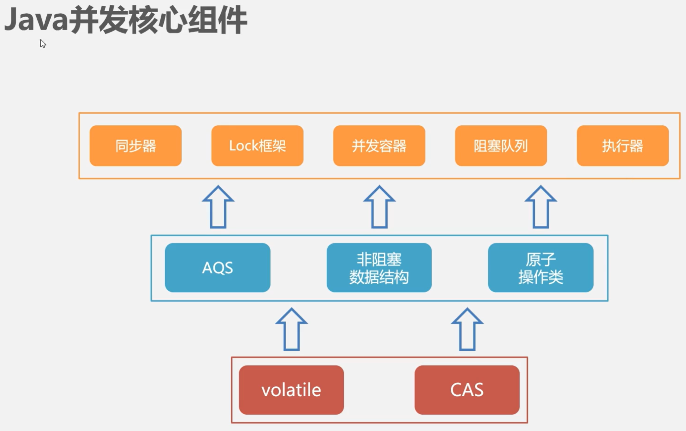


# 一、线程基础


## 1. 线程概述


## 2. 线程的启动

### start调用run的底层原理


在通过start方法调用的时候，操作系统进行了大量初始化的工作。

所谓的线程是操作系统的线程。


## 3. 线程的终止

线程的终止分为以下四种情况：

- 正常终止
  - run() 方法 执行完毕并退出

- 异常终止
  - 抛出未经处理的异常

- 被强制终止
  - 调用 ~~stop()~~ 方法强制终止

- 请求中断线程
  - interrupt() 与  isInterrupted() 方法
  - interrupted() 方法


### 3.1 被弃用的stop方法


#### stop() 方法源码

```java
	@Deprecated
    public final void stop() {
        SecurityManager security = System.getSecurityManager();
        if (security != null) {
            checkAccess();
            if (this != Thread.currentThread()) {
                security.checkPermission(SecurityConstants.STOP_THREAD_PERMISSION);
            }
        }
        // A zero status value corresponds to "NEW", it can't change to
        // not-NEW because we hold the lock.
        if (threadStatus != 0) {
            resume(); // Wake up thread if it was suspended; no-op otherwise
        }

        // The VM can handle all thread states
        stop0(new ThreadDeath());
    }
```


```java
public class ThreadDeath extends Error {
    private static final long serialVersionUID = -4417128565033088268L;
}
```


stop() 方法最后一行调用了 stop0() 方法 ，这是一个本地方法。

stop0() 方法 需要传入 ThreadDeath 对象 ，而 ThreadDeath 是一个错误。

当 Java虚拟机接收到  ThreadDeath 时，虚拟机就会终止当前线程所有正在运行的方法包括 run() 方法。

当线程被终止的时候，这个线程会释放它所有的监视器。这个时候就会导致一个非常直接的结果。由于线程是被强制终止的，那么它正在操作的一些对象可能就会被破坏掉，这些对象其中的数据，状态等等，可能得不到一致的处理。在多线程环境中，其他的线程可能就会看到这些对象，其他线程就会对这些对象进行一些操作。受损的对象被其他线程操作，导致的意外将是不可估量的。所以 stop() 方法结束线程是非常不安全的。


### 3.2 请求中断线程：interrupt方法

interrupt() 的作用：设置当前线程的中断状态为true


#### interrupt() 方法源码

```java
public void interrupt() {
        if (this != Thread.currentThread())
            checkAccess();

        synchronized (blockerLock) {
            Interruptible b = blocker;
            if (b != null) {
                interrupt0();           // Just to set the interrupt flag
                b.interrupt(this);
                return;
            }
        }
        interrupt0();
}
```


### 3.3 响应中断线程：isInterrupted 方法

isInterrupted() 的作用：判断当前线程的中断状态是true还是false。并返回true 或 false


#### 测试代码

```java
public class InterruptThread {
    public static void main(String[] args) {
        Thread thread = new Thread(()->{
            Thread currentThread = Thread.currentThread();
            while (!currentThread.isInterrupted()){
                System.out.println("Thread Start...");
            }
        });

        thread.start();

        try {
            Thread.sleep(20);
        } catch (InterruptedException e) {
            throw new RuntimeException(e);
        }

        thread.interrupt();
    }
}
```


### 3.4 清除中断状态：interrupted方法

在线程中断的时候有这样一种情况：

当我们的主线程请求中断子线程的时候，子线程检测到自己的中断标志被设置为true，但此刻它并不想响应主线程的中断请求，而是打算继续执行一些任务（比如说一些清理工作）。那么这个时候我们就不能使用 isInterrupted() 判断中断状态。

也就是说，我们第一次拿到中断请求之后，由于我们还要进行下一步的动作，那么我们就有必要把中断状态给清除掉（或者说重新设置为false），以便等我们做完清理工作，或者说其他的工作之后，下次响应中断。那么这个时候 isInterrupted() 就不再合适了。


**interrupted()** 的作用 ：清除当前的中断状态（置为false）。

而 isInterrupted() 是不会清除当前状态的。


### 3.5 被中断异常：InterruptedException

如果子线程正在处于阻塞状态时，当主线程去请求中断子线程，是无法检测子线程中断状态的。

 当我们调用 interrupt() 去中断一个处于阻塞状态的线程时，那么这个处于阻塞状态的线程会抛出 **InterruptedException**。在抛出异常的同时，会清除中断状态（置为false）。 

当线程调用 wait()、join()、sleep()以及它们的重载方法时，就会处于阻塞状态。


## 4. 线程的属性和常用API


### 4.1 守护线程

#### 基本特点

守护线程是用来给其他的线程提供服务的。被服务的线程称为用户线程。

当用户线程退出时，守护线程也随之退出。

通过 **setDaemon(boolean)**  设置该线程是否为守护线程。


**注意：** 守护线程中的 **finally** 代码块不一定执行。

守护线程永远不该去访问固有资源（文件、数据库等），因为它会在任何一个操作的中间发生中断。（可能会导致资源无法关闭）


##### 示例代码

**注意：** 子线程设置为主线程的守护线程，必须在子线程启动之前。

```java
@Slf4j
public class DaemonThread {
    public static void main(String[] args) {
        Thread subThread = new Thread(()->{
            for (int i = 0; i < 1000; i++) {
                log.debug(Integer.toString(i));
            }
        });

        subThread.setDaemon(true);  // 设置子线程为主线程的守护线程
        subThread.start();

        log.debug("主线程准备退出");
    }
}
```


 #### JVM中的守护线程

**Attach Listener**：获取当前运行程序的信息，线程栈、内存映像、系统属性

**Signal Dispatcher**：信号分发器，给虚拟机发送信号

**Reference Handler**：引用控制器，用于清除引用

**Finalizer**：在垃圾回收之前，调用对象的 **finalize()** 方法进行清理

**Monitor Ctrl-Break**：Ctrl + C


##### 示例代码

```java
public class DaemonThreadsInJVM {
    public static void main(String[] args) {
        Set<Thread> threadSet = Thread.getAllStackTraces().keySet();
        for (Thread thread : threadSet) {
            System.out.println(thread.getName() + ":" +
                                thread.getPriority() + "-" +
                                    thread.isDaemon());
        }
    }
}
```


运行结果：

```
Attach Listener:5-true
main:5-false
Signal Dispatcher:9-true
Reference Handler:10-true
Finalizer:8-true
Monitor Ctrl-Break:5-true
```


### 4.2 线程组

#### 基本使用

**线程组** 用于将线程分组，便于管理。


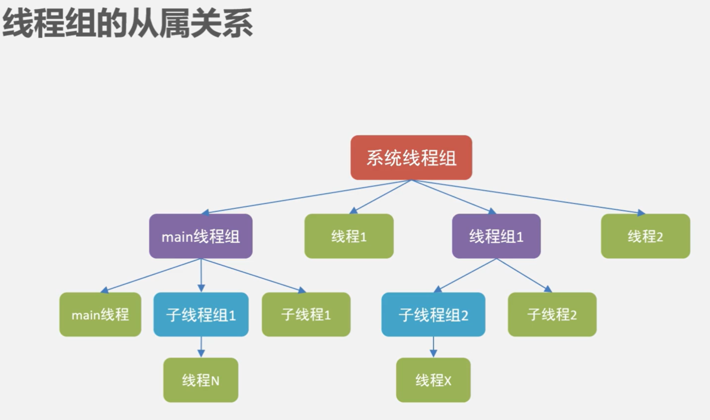


##### 示例代码

```java
public class GroupOfThread {
    public static void main(String[] args) {
        Thread thread = Thread.currentThread();
        ThreadGroup mainThreadGroup = thread.getThreadGroup();
        System.out.println("主线程的线程组：" + mainThreadGroup.getName());

        // 默认情况下，新建线程的线程组是当前线程
        // 必须先有线程组，然后才能有线程，不能将某个线程创建之后再添加到线程组
        ThreadGroup subThreadGroup = new ThreadGroup("subThreadGroup");
        Thread subThread = new Thread(subThreadGroup,"sub-Thread");
        System.out.println("子线程的线程组:" + subThread.getThreadGroup().getName());

        System.out.println("子线程的父线程组：" + subThreadGroup.getParent().getName());

        // 系统线程组，即main线程组的父线程组
        System.out.println(mainThreadGroup.getParent().getName());
    }
}
```


运行结果：

```
主线程的线程组：main
子线程的线程组:subThreadGroup
子线程的父线程组：main
system
```


#### 线程组的异常处理

在实际开发中，很多时候我们的业务非常复杂，我们每一个线程组中都有大量的业务线程，每一个线程执行的功能大体类似。为了方便对其进行统一处理就是线程组的主要作用。

线程组处理异常最常用在**记录日志**。一般情况下，当线程组中大量的线程出现了异常，我们是不希望把这些信息打印到控制台的，事实上我们会把信息记录到文件、设备或是数据库中。这个时候我们就可以通过在ThreadGroup中安装一个默认的异常处理器，将大量的信息记录到日志文件中。


**注：**

- 线程的异常处理器的处理顺序：
  - 线程、线程组、默认异常处理器、在控制台打印错误信息


##### 探究源码

ThreadGroup类实现了Thread类内部的函数式接口

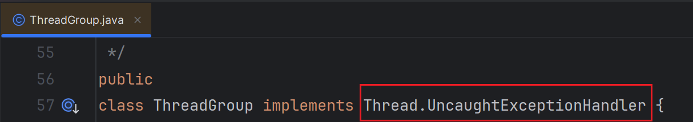


**Thread类内的UncaughtExceptionHandler接口**

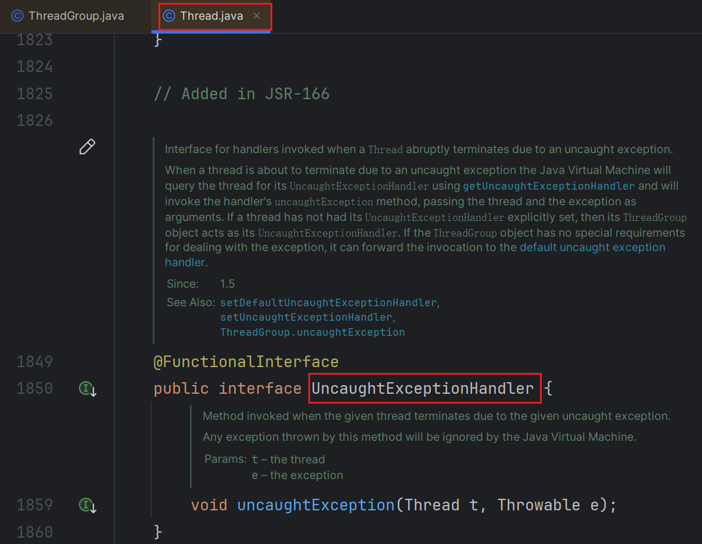


**ThreadGroup类实现UncaughtExceptionHandler接口后对uncaughtException方法的重写**

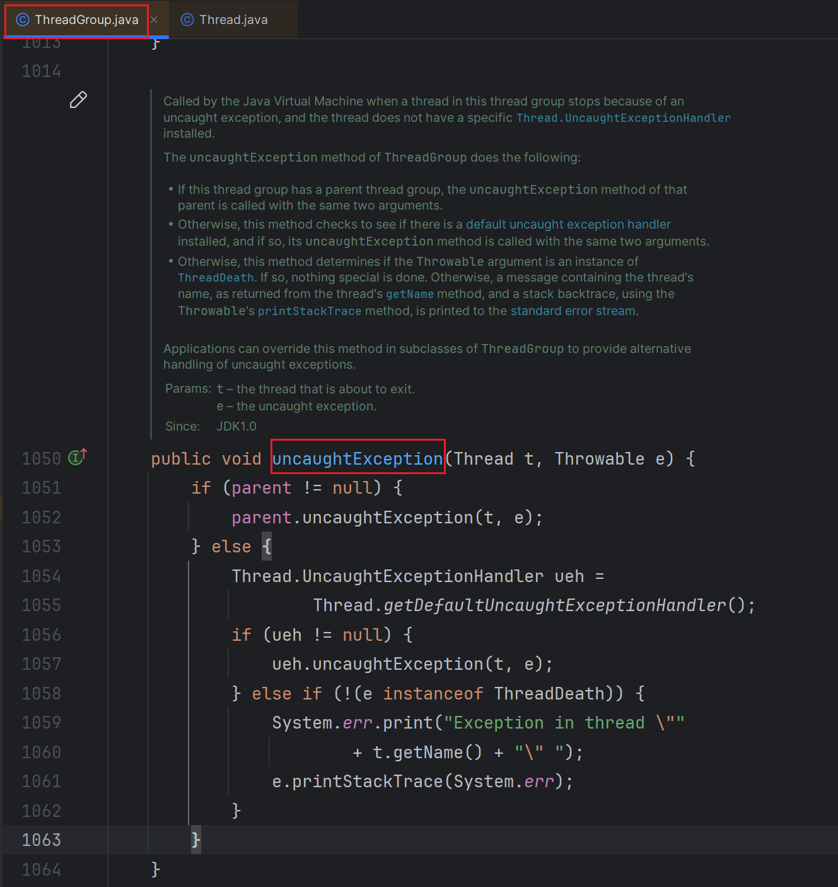


##### 示例代码（自定义异常处理器）

**注意：**自定义异常处理器时，不要遵循线程组的处理方式，否则容易造成无限递归。

```java
public class ThreadGroupDefaultExceptionHandler {

    public static void main(String[] args) {
        Runnable runnable = () -> {
            Thread currentThread = Thread.currentThread();
            throw new NullPointerException(currentThread.getName() + "无敌空指针");
        };
        Thread t1 = new Thread(runnable, "t1");
        Thread t2 = new Thread(runnable, "t2");

        // 给当前线程组安装异常处理器
        t1.setUncaughtExceptionHandler(new ThreadExceptionHandler());

        // 给当前线程组安装异常处理器
        // Thread.setDefaultUncaughtExceptionHandler(new ThreadExceptionHandler());

        t1.start();
        t2.start();
    }

    /**
     * 自定义异常处理器
     */
    public static class ThreadExceptionHandler implements Thread.UncaughtExceptionHandler{
        @Override
        public void uncaughtException(Thread t, Throwable e) {
            System.out.println(t.getName() + "throws exception:" + e.getMessage());
        }
    }
}

```


### 4.3 Thread类的常用方法API


**注：** alive() 应该是 isAlive()

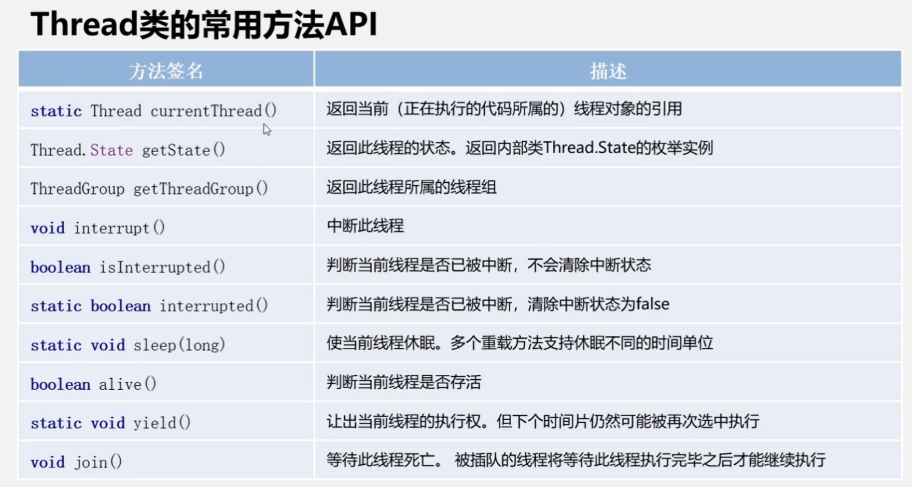


### 4.4 yield方法

yield方法的作用：让出CPU的执行权

**注：**

1. yield方法是一种尝试：改善线程之间的相对进展，防止单个线程过度利用CPU资源
2. yield方法可以实现非常短暂的 “等待” 效果
3. 在协作式调度器下，防止高优先级的线程独占CPU


##### 测试代码

```java
import lombok.extern.slf4j.Slf4j;

@Slf4j
public class YieldMethod {
    public static void main(String[] args) {
        Thread subThread = new Thread(()->{
            for (int i = 1; i <= 1000; i++) {
                log.info("子线程：" + Integer.toString(i));

                if (i % 50 == 0){
                    log.error("子线程让出CPU执行权");
                    Thread.yield();
                }
            }
        },"subThread");
        subThread.start();

        for (int i = 1; i <= 1000; i++) {
            log.info("主线程：" + Integer.toString(i));
        }

    }
}
```


### 4.5  join方法


##### 使用代码

```java
import lombok.extern.slf4j.Slf4j;

/**
 * 模拟开发场景：本应用对第三方开放公共接口，并且要求同步，实时返回
 * 1. 使用main线程模拟主业务执行
 * 2. 由于业务比较复杂，当第三方应用访问接口，启动子线程去执行
 * 3. 由于要求实时返回，将子线程插队到主线程中
 */
@Slf4j
public class JoinMethod {
    public static void main(String[] args) throws InterruptedException {
        Runnable runnable = () -> {
            log.debug("接口任务开始...");
            for (int i = 0; i < 1000; i++) {
                log.debug("子业务内容："+i);
            }
            log.debug("接口任务完成...");
        };
        Thread thread = new Thread(runnable);

        // 模拟主线程
        for (int i = 0; i < 1000; i++) {
            log.debug("主业务指令执行..." + i);
            if (i == 50) {
                thread.start();
                thread.join();
                log.debug("主线程继续执行...");
            }
        }
    }
}
```


##### join方法的Java源码

join() 调用了重载的 join(0)

join(0) 中 ，millis = 0，进入对应的 if 判断中。

进入 while 的条件是 线程存活。


以上节代码为例，主线程中启动子线程，并且调用子线程的join方法。

当子线程启动时，开始执行自己的业务，是一直存货的。那么join(0) 就进入while循环，执行wait(0)。

wait方法是本地方法，wait(0) 也就是让其这行代码 所在的线程进入等待（也就是主线程）。等待0秒，很快执行完毕，会立刻再次判断进入while循环的条件。如果子线程一直存活，那么主线程会一直陷入死循环等待。

这里需要思考两个问题：

1. 子线程结束之后做了什么事情？
2. 主线程又是如何被唤醒的？

```java
public final void join() throws InterruptedException {
        join(0);
}

public final synchronized void join(long millis) throws InterruptedException {
        long base = System.currentTimeMillis();
        long now = 0;

        if (millis < 0) {
            throw new IllegalArgumentException("timeout value is negative");
        }

        if (millis == 0) {
            while (isAlive()) {
                wait(0);
            }
        } else {
            while (isAlive()) {
                long delay = millis - now;
                if (delay <= 0) {
                    break;
                }
                wait(delay);
                now = System.currentTimeMillis() - base;
            }
        }
}
```


##### join方法的JVM源码

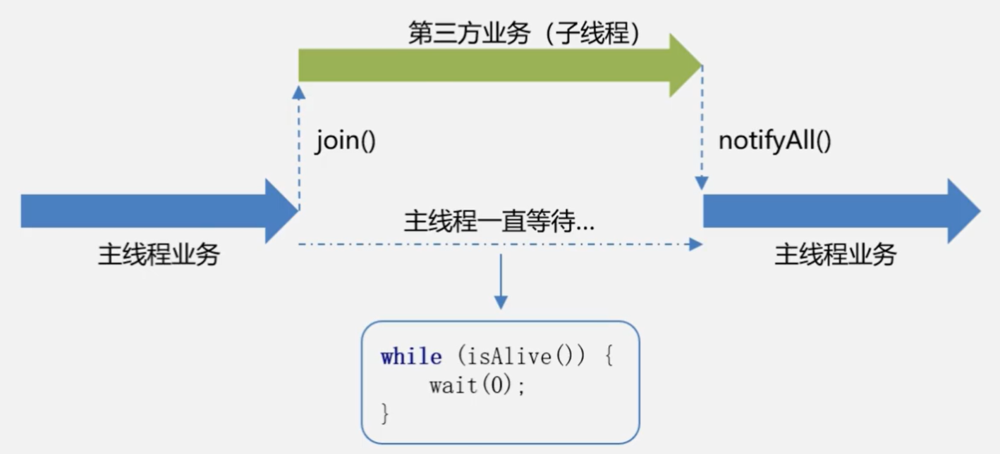


```cpp
static void ensure_join(JavaThread* thread) {
  // We do not need to grab the Threads_lock, since we are operating on ourself.
  Handle threadObj(thread, thread->threadObj());
  assert(threadObj.not_null(), "java thread object must exist");
  ObjectLocker lock(threadObj, thread);
  // Ignore pending exception (ThreadDeath), since we are exiting anyway
  thread->clear_pending_exception();
  // Thread is exiting. So set thread_status field in  java.lang.Thread class to TERMINATED.
  java_lang_Thread::set_thread_status(threadObj(), java_lang_Thread::TERMINATED);
  // Clear the native thread instance - this makes isAlive return false and allows the join()
  // to complete once we've done the notify_all below
  java_lang_Thread::set_thread(threadObj(), NULL);
  lock.notify_all(thread);
  // Ignore pending exception (ThreadDeath), since we are exiting anyway
  thread->clear_pending_exception();
}
```


## 5. 线程的状态

**线程的六种状态：**

- NEW（新创建）
  - 尚未启动的线程处于此状态

- RUNNABLE（可运行）
  - 在Java虚拟机中执行的线程处于此状态

- BLOCKED（被阻塞）
  - 等待监视器锁的线程处于此状态

- WAITING（等待）
  - 等待另一个线程执行特定操作的线程处于此状态

- TIMED_WAITING（计时等待）
  - 正在等待另一个线程执行最多最多指定等待时间的操作的线程处于此状态

- TERMINATED（被终止）
  - 已退出的线程处于此状态


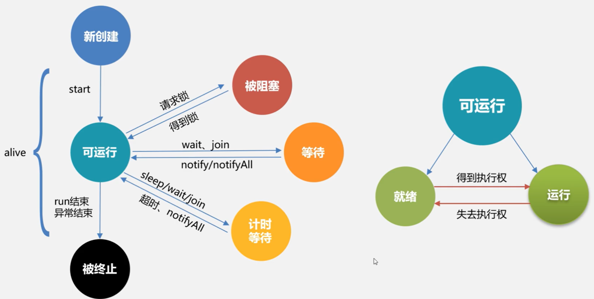


## 6. 线程同步

### 6.1 线程同步的概念

线程间的协作也叫线程同步。这里的“同”指的是协同、协作的意思。

- 竞争条件（race condition）
- 原子操作（atomic operation）
- 监视器（Monitor）
  - 互斥
  - 同步


### 6.2 多线程操作共享资源的安全性问题

一个线程在执行while循环中的代码中，随时都有可能被中断，切换到其他的线程。


#### 测试代码

```java
import lombok.extern.slf4j.Slf4j;

/**
 * 需求：铁路售票系统，一共100张票，通过四个窗口售卖
 */
@Slf4j
public class TicketSeller {
    private static int tickets = 100;

    public static void main(String[] args) {
        Runnable seller = () -> {
            while (true){
              	if (tickets <= 0)
                  break;

                log.debug(Thread.currentThread().getName() + "正在售卖第" + tickets-- + "张票");

                try {
                    Thread.sleep(10);
                } catch (InterruptedException e) {
                    throw new RuntimeException(e);
                }
            }
        };

        new Thread(seller,"窗口1").start();
        new Thread(seller,"窗口2").start();
        new Thread(seller,"窗口3").start();
        new Thread(seller,"窗口4").start();
    }
}
```


### 6.3 使用synchronized对象锁解决线程的安全问题

操作共享资源的代码如果具有**原子性**，那么别的线程也就无法对此线程的操作进行干扰。

那么如何防止被干扰呢？

在Java语言中使用**同步机制**可以防止代码受并发访问的干扰。

那么 Java 又是如何实现**线程同步**呢？

Java中实现线程同步的机制是 **监视器（Monitor）**

**监视器** 实现同步的方式有两种：**互斥** 和 **协作**


#### 测试代码

```java
import lombok.extern.slf4j.Slf4j;

/**
 * 需求：铁路售票系统，一共100张票，通过四个窗口售卖
 * 1. 监视器锁的核心操作：加锁、释放锁
 * 2. 操作流程：在操作共享数据的代码片段的开始，加锁，结束位置，释放锁
 * 3. 监视器锁确保在同一个时间点上，只有一个线程操作共享区域，即监视区域
 *
 *  synchronized 步骤：
 *  1. 创建任何类型的对象，做完监视器 Monitor
 *  2. 使用 synchronized 代码块（或方法） 将监视区域包起来
 */
@Slf4j
public class TicketSeller {
    private static int tickets = 100;

    public static void main(String[] args) {
        Object obj = new Object();
        Runnable seller = () -> {
          while (true){
              synchronized (obj){	// monitorenter：加锁
                  if (tickets <= 0)
                      break;

                  log.debug(Thread.currentThread().getName() + "正在售卖第" + tickets-- + "张票");

                  try {
                      Thread.sleep(10);
                  } catch (InterruptedException e) {
                      throw new RuntimeException(e);
                  }
              }	// monitorexit：释放锁
          }
        };

        new Thread(seller,"窗口1").start();
        new Thread(seller,"窗口2").start();
        new Thread(seller,"窗口3").start();
        new Thread(seller,"窗口4").start();
    }
}
```


### 6.4 互斥线程

**概念**：允许多个线程在同一个共享数据上独立而互不干扰的工作

- 对象锁
  - Java中通过对象锁来实现互斥线程

-  synchronized关键字
- ReentrantLock 类 


### 6.5 对象锁和类锁

- 对象锁：使用任意类型的对象作为同步块/方法的监视器
- 类锁：使用类的字节码对象作为同步块/方法的监视器

- 同步代码块：用**synchronized**关键字修饰的代码块，还需要对象锁来配合
- 同步方法：用**synchronized**关键字修饰的方法
  - 普通同步方法：使用**this**对象作为监视器
  - 静态同步方法：使用类的字节码对象作为监视器


### 6.6 Lock框架之ReentrantLock


 #### ReentrantLock 的使用

```java
import lombok.extern.slf4j.Slf4j;

import java.util.concurrent.locks.Lock;
import java.util.concurrent.locks.ReentrantLock;

@Slf4j
public class TicketSellerReentrantLock {
    private static int tickets = 100;

    public static void main(String[] args) {
        Lock lock = new ReentrantLock();    // 锁对象
        Runnable seller = () -> {
            while (true) {
                lock.lock();    // 加锁
                try {
                    if (tickets <= 0)
                        break;

                    log.debug(Thread.currentThread().getName() + "正在售卖第" + tickets-- + "张票");

                    Thread.sleep(10);
                } catch (InterruptedException e) {
                    throw new RuntimeException(e);
                }finally {
                    lock.unlock();  // 释放锁
                }
            }
        };

        new Thread(seller, "窗口1").start();
        new Thread(seller, "窗口2").start();
        new Thread(seller, "窗口3").start();
        new Thread(seller, "窗口4").start();
    }
}
```


#### 可重入锁ReentrantLock的锁定原理

锁是可重入的：一个线程可以多次对同一个对象上锁

- 可重入锁（Reentrant）
  - 计数器

线程每调用一次 lock.lock() ，都会进行计数器加1，每进行一次unlock() 的操作，计数器就会减1。

如果一个线程对一个锁对象进行多次加锁，那它必须多次释放锁，才能真正完全地释放锁。然后其他的线程才可以持有锁对象。


##### 探究源码


###### 加锁

在 ReentrantLock 的构造方法中，new一个非公平锁对象。

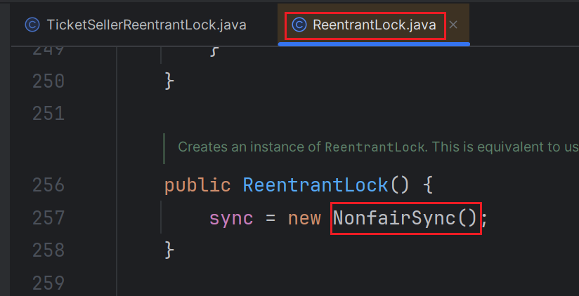


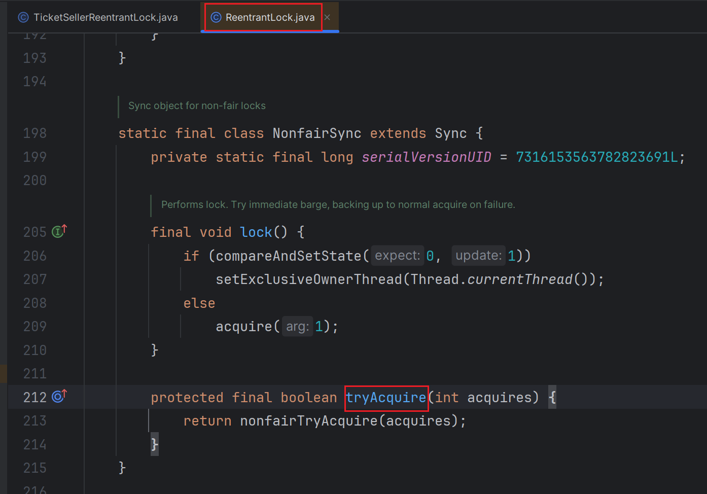


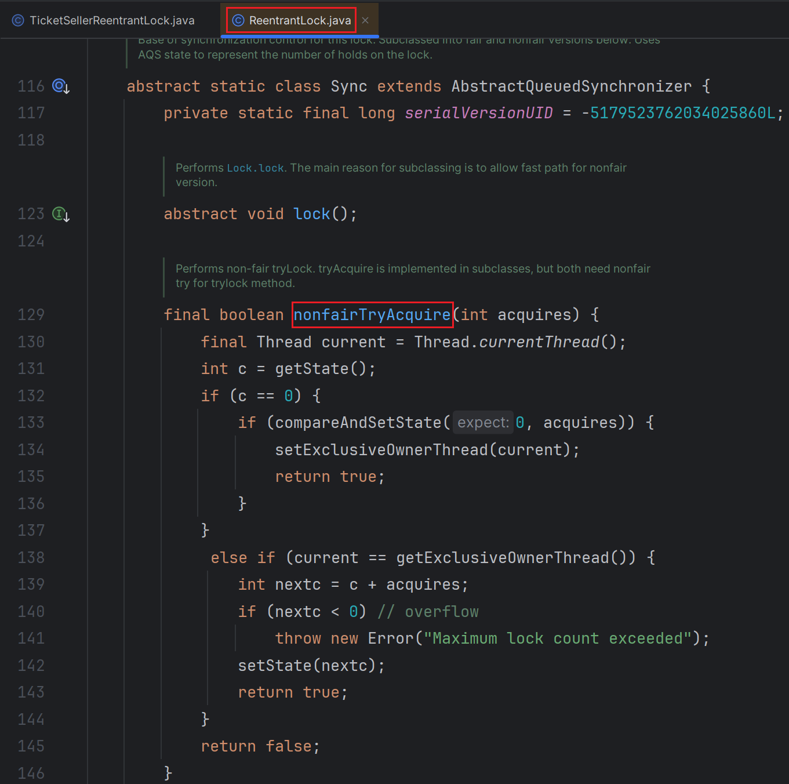


#### 可重入锁ReentrantLock之公平锁

- 公平锁
  - ReentrantLock (boolean fair)
  - FIFO（先进先出队列）


公平锁的特点在于保证请求获取锁的线程的次序。

**注：**

即使使用了公平锁，也无法完全保证线程调度器是公平的。因为线程调度器有时选择忽略线程（比如由于中断、超时导致的取消，随时有可能会发生）


### 6.7 协作线程

**概念：**允许多个线程为了同一目标而共同工作。协作线程不关注资源的竞争，而是强调线程之间通过协同、配合达到预期的功能。

- 条件对象（condition object）
  - 用于管理已获取锁却不能有效工作的线程。

- 等待唤醒机制（wait\notify）
- 死锁（dead lock）
  - 由于等待、计时等待、阻塞等原因导致线程长期处于非活动状态，就会造成**死锁**现象。


### 6.8 条件对象

一个锁可以有一个或多个条件对象，每一个条件都是用来管理那么已经进入保护区的代码，但是不能运行的线程。所以说条件对象是通过锁对象创建的。


**注意：**

1.  Condition对象一般需要与判断条件配合来使用。
2.  等待集（wait set）：await()方法 将线程放到此线程的等待集中，之后这个线程就会释放它所持有的锁。
3.  await() 方法执行之后，线程是不能激活自身的，可能导致死锁。
4. 条件对象的使用，必须在它所属的监视器控制的监视区域内
5. singleAll() 方法仅仅是通知正在等待的线程，现在条件可能已经满足，所以再次检测业务条件是必要的。不建议使用single()方法


#### 示例代码

```java
import lombok.extern.slf4j.Slf4j;

import java.util.concurrent.locks.Condition;
import java.util.concurrent.locks.Lock;
import java.util.concurrent.locks.ReentrantLock;

/**
 * 需求：铁路售票系统，一共100张票，通过四个窗口售卖
 * 每当车票售完，补充系统放票100张
 * 1. 首先，要为我们的锁对象创建一个条件对象
 * 2. 然后，让线程在不满足条件的地方，等待
 * 3. 当条件满足，则重新激活在当前条件对象上等待的线程
 * 新启动一个线程，用来补充车票
 */
@Slf4j
public class TicketSellerCondition {
    private static int tickets = 100;

    public static void main(String[] args) {
        Lock lock = new ReentrantLock();

        // 1. 首先，要为我们的锁对象创建一个条件对象，代表余票充足
        Condition ticketEnough = lock.newCondition();

        Thread[] threads = new Thread[4];

        Runnable seller = ()->{
            while (true){
                lock.lock();
                try {
                    String name = Thread.currentThread().getName();
                    if (tickets <= 0){
                        // 2. 然后，让线程在不满足条件的地方，等待
                        log.debug("线程"+name+"正在等待");
                        ticketEnough.await();
                        //break;
                        continue;   // 重新检测业务条件是否满足需求
                    }

                    Thread.sleep(10);
                    log.debug(name + "...这是第" + tickets-- + "号票");
                } catch (InterruptedException e) {
                    throw new RuntimeException(e);
                }finally {
                    lock.unlock();
                }
            }
        };

        // 启动四个线程模拟四个售票窗口
        for (int i = 0; i < threads.length; i++) {
            threads[i] = new Thread(seller,"窗口" + (i+1));
            threads[i].start();
        }

        //3. 当条件满足，则重新激活在当前条件对象上等待的线程
        //      新启动一个线程，用来补充车票
        Runnable publisher = ()->{
          lock.lock();
          try {
              if (tickets <= 0){
                  tickets = 100;
                  ticketEnough.signalAll(); // 给别的在此条件对象上等待的线程发信号
              }
          }finally {
              lock.unlock();
          }
        };

        try {
            Thread.sleep(5000);
            new Thread(publisher).start();
        } catch (InterruptedException e) {
            throw new RuntimeException(e);
        }

    }
}
```


### 6.9 等待/唤醒机制


#### 示例代码

```java
import lombok.extern.slf4j.Slf4j;

import java.util.concurrent.locks.Condition;
import java.util.concurrent.locks.Lock;
import java.util.concurrent.locks.ReentrantLock;

@Slf4j
public class TicketSellerWaitNotify {
    private static int tickets = 100;

    public static void main(String[] args) {
        Object obj = new Object();

        Thread[] threads = new Thread[4];

        Runnable seller = ()->{
            while (true){
                synchronized (obj){
                    try {
                        String name = Thread.currentThread().getName();
                        if (tickets <= 0){
                            log.debug("线程"+name+"正在等待");
                            obj.wait();
                            continue;   // 重新检测业务条件是否满足需求
                        }

                        Thread.sleep(10);
                        log.debug(name + "...这是第" + tickets-- + "号票");
                    } catch (InterruptedException e) {
                        throw new RuntimeException(e);
                    }
                }

            }
        };

        // 启动四个线程模拟四个售票窗口
        for (int i = 0; i < threads.length; i++) {
            threads[i] = new Thread(seller,"窗口" + (i+1));
            threads[i].start();
        }


        //      新启动一个线程，用来补充车票
        Runnable publisher = ()->{
            int republishCount = 0;
            while (true){
                synchronized (obj){
                    try {
                        obj.wait(5000);
                    } catch (InterruptedException e) {
                        throw new RuntimeException(e);
                    }

                    if (tickets <= 0){
                        tickets = 100;
                        log.debug("第" + ++republishCount + "次成功放出100张票");
                        obj.notifyAll();
                    }

                }
            }
        };

        new Thread(publisher).start();
    }
}
```


#### 标准格式

**等待方：**

	1. 持有锁（如果不持有锁，调用wait或await方法，会报监视器非法异常）
	1. 判断业务条件是否满足，若不满足则等待（wait、await）
	1. 若条件满足则继续执行业务逻辑代码，直到退出监视区域（释放锁）


**唤醒方：**

	1. 持有锁
	1. 根据业务需求尝试改变条件
	1. 执行唤醒命令（notifyAll、signalAll 等），唤醒在此监视器上等待的所有线程
	1. 运行，直到释放锁


### 6.10 死锁

**导致死锁的几种情况：**

1. 调用wait、await等可能导致线程等待的命令之后，没有其他线程重新唤醒该线程。
2. 通过调用signal、notify等方法只能唤醒一个线程，但是该线程被激活后发现仍然不能运行，并且没有再一次被唤醒。
3. 两个或多个线程，相互持有对方的锁，并同时尝试获取对方已经持有的锁。


### 6.11 锁与条件对象的核心

- 锁用来保护代码片段，任何时刻只能有一个线程执行被它保护的代码
- 锁可以管理试图进入被保护代码片段的线程
- 锁可以拥有一个或多个条件对象
- 条件对象管理那些已经进入被保护的代码但还不能运行的线程


### 6.12 ThreadLocal

#### 基本概念

java.lang.ThreadLocal，线程本地变量，也叫线程局部变量。

- 为什么需要ThreadLocal
  - 前面讲了使用线程同步机制解决多线程并发访问共享资源而产生的竞争问题，之所以产生竞争还是因为资源不够。在线程并发的情况下，与其产生竞争而去解决竞争带来的对应问题，倒不如直接避免竞争，这也不失为解决问题的一种思路。而ThreadLocal不是为了解决竞争问题，而是为了直接避免竞争。
  - ThreadLocal让变量在每一个线程中，都有一个副本。
- 如何使用ThreadLocal
  -  new ThreadLocal<T>() 
  - get()
  - set(T)

- ThreadLocal的工作原理


##### 示例代码

```java
import lombok.extern.slf4j.Slf4j;

@Slf4j
public class ThreadLocalDemo {
    public static void main(String[] args) {
        String[] strs = {"Violet","Robin","Kafka"};
        ThreadLocal<String> threadLocal = new ThreadLocal<String>(){
            @Override
            protected String initialValue() {
                return "喜欢";
            }
        };  // String str = "喜欢"

        Runnable runnable = () -> {
            String name = Thread.currentThread().getName();
            int index = Integer.parseInt(name.substring(7));
            String str = threadLocal.get();
            str += strs[index]; // 喜欢Violet
            threadLocal.set(str);
            log.debug(name + ":" + threadLocal.get());
        };

        for (int i = 0; i < 3; i++) {
            new Thread(runnable).start();
        }
    }
}
```


**运行结果：**

```java
2024-12-28 17:16:01.119 [Thread-2] DEBUG com.peng.sync.ThreadLocalDemo - Thread-2:喜欢Kafka
2024-12-28 17:16:01.119 [Thread-0] DEBUG com.peng.sync.ThreadLocalDemo - Thread-0:喜欢Violet
2024-12-28 17:16:01.119 [Thread-1] DEBUG com.peng.sync.ThreadLocalDemo - Thread-1:喜欢Robin
```


#### 工作原理

每一个Thread类中都有一个ThreadLocalMap，但每个ThreadLocalMap各不相同。

而ThreadLocalMap里面存储的键值对，键都是一样的，都是ThreadLocal。


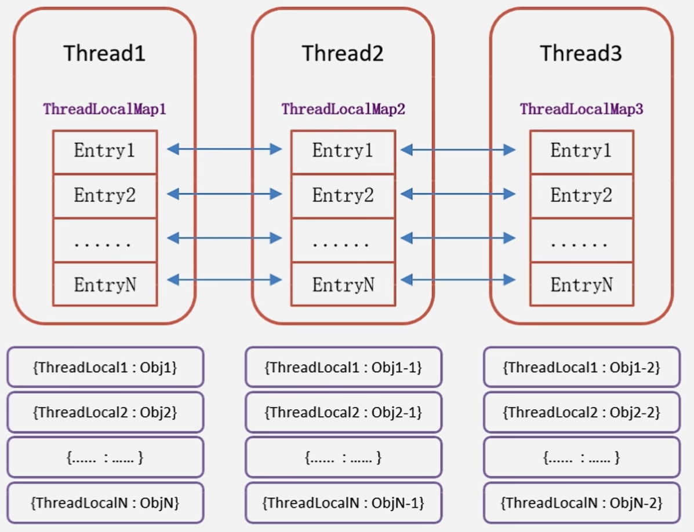


#### 注意事项

1. 线程中多个ThreadLocal问题（一个线程中可以有多个线程本地变量）
2. ThreadLocalMap的初始化问题：延迟初始化，hash表存储（也就是说并非一创建ThreadLocal实例就会去创建ThreadLocalMap，而是在 get/set的时候发现没有ThreadLocalMap才去创建）
3. ThreadLocalMap的销毁问题：可能导致内存泄漏
   - 内存泄漏的原因：ThreadLocal过大，Thread运行时间过长
   - 解决办法：WeakReference；手动删除ThreadLocal对象


# 二、原子操作（CAS）


## 1. 原子操作的基本概念

原子操作（atomic operation）是指不会被线程调度机制打断的操作。

- 一个整体，不会被切割
- 一旦开始，直到结束，不会被切换
- 顺序不会被打乱


为什么要学习原子操作？

- 实现轻量级同步
- CPU指令级别提供支持
- 场景：对少量资源进行数据更新操作


## 2. 原子操作的实现原理


### 2.1 如何理解操作的原子性


### 2.2 原子操作是如何实现的

- 处理器保证基本内存操作的原子性
  - **总线锁**：总线是CPU处理数据的一个通道，总线锁意思是CPU会在总线处理数据的时候加一个锁信号。加上锁信号后，别的处理器再去访问这个总线就必需要等待。 
  - **缓存锁**

- 循环CAS（compare and swap，比较并交换）
  - Java中的原子操作正是利用了处理器提供的**CMPXCHG指令**实现的：
    - **CMPXCHG指令 = 处理器锁 + 循环CAS**


### 2.3 CAS操作的实现思路

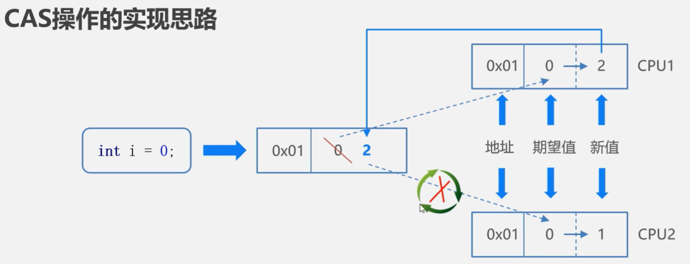


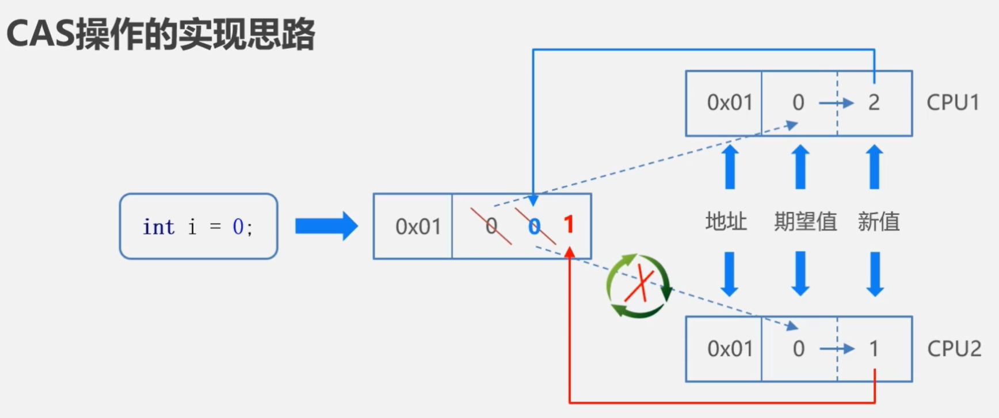


### 2.4 CAS操作的问题

- 只能保证一个共享变量的操作
- CAS操作长时间不成功
  - 造成CPU的开销

- ABA问题（A -> B -> A）：版本号
  - 如上图中，CPU1 和 CPU2 最初读到 0x01 地址的值为0，CPU1成功将其改为2。而CPU2看到期望值与原地址值不一样，会一直尝试，进入死循环。直到其他线程将 0x01 地址的值改为0，这时CPU2才成功进行修改操作。但是在此期间，CPU2并不知道0x01 地址的值有没有改变过（这就是ABA问题）。 
  - 解决办法就是版本号。每次 原地址的值 改变的时候，加一次版本号。CPU根据版本号再判断要不要进行修改。


### 2.5 常见原子更新类

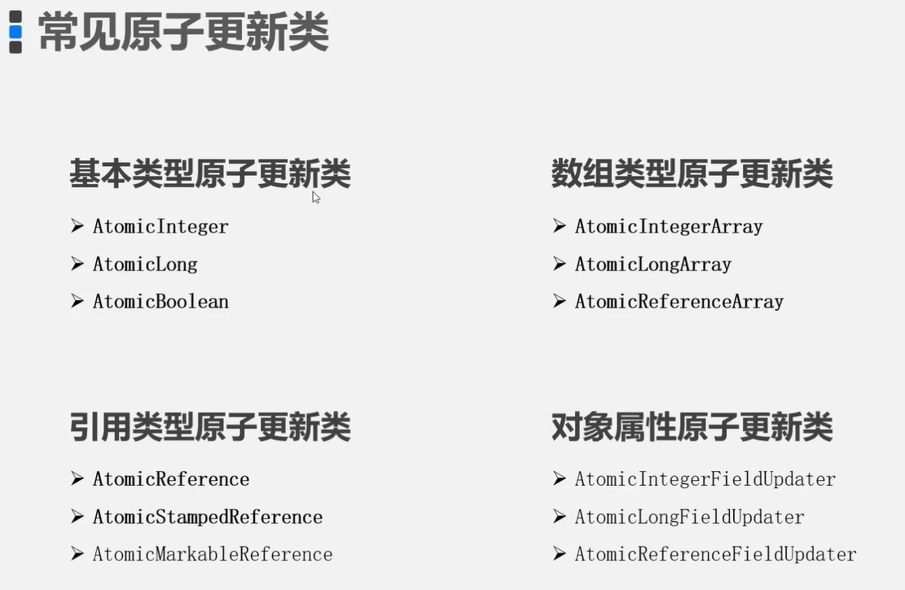


 ## 3. 演示非原子操作的效果及解决方案


### 3.1 非原子操作

```java
import lombok.extern.slf4j.Slf4j;

@Slf4j
public class PrimitiveTypeAtomic {
    private static int number = 0;  // 共享变量
    public static void main(String[] args) {
        Runnable runnable = ()->{
            for (int i = 0; i < 1000; i++) {
                number++;
            }
            log.debug("" + number);
        };

        for (int i = 0; i < 15; i++) {
            new Thread(runnable).start();
        }

        try {
            Thread.sleep(3000);
        } catch (InterruptedException e) {
            throw new RuntimeException(e);
        }

        log.debug("最终结果：" + number);
    }
}
```


**运行结果：**

```java
2024-12-30 15:06:11.513 [Thread-11] DEBUG com.atmoic.PrimitiveTypeAtomic - 9626
2024-12-30 15:06:11.513 [Thread-9] DEBUG com.atmoic.PrimitiveTypeAtomic - 8963
2024-12-30 15:06:11.513 [Thread-1] DEBUG com.atmoic.PrimitiveTypeAtomic - 6019
2024-12-30 15:06:11.513 [Thread-10] DEBUG com.atmoic.PrimitiveTypeAtomic - 7626
2024-12-30 15:06:11.513 [Thread-0] DEBUG com.atmoic.PrimitiveTypeAtomic - 1978
2024-12-30 15:06:11.513 [Thread-12] DEBUG com.atmoic.PrimitiveTypeAtomic - 8271
2024-12-30 15:06:11.513 [Thread-13] DEBUG com.atmoic.PrimitiveTypeAtomic - 9116
2024-12-30 15:06:11.513 [Thread-8] DEBUG com.atmoic.PrimitiveTypeAtomic - 7180
2024-12-30 15:06:11.513 [Thread-5] DEBUG com.atmoic.PrimitiveTypeAtomic - 1978
2024-12-30 15:06:11.513 [Thread-7] DEBUG com.atmoic.PrimitiveTypeAtomic - 6968
2024-12-30 15:06:11.513 [Thread-2] DEBUG com.atmoic.PrimitiveTypeAtomic - 3978
2024-12-30 15:06:11.513 [Thread-3] DEBUG com.atmoic.PrimitiveTypeAtomic - 2978
2024-12-30 15:06:11.513 [Thread-14] DEBUG com.atmoic.PrimitiveTypeAtomic - 9626
2024-12-30 15:06:11.513 [Thread-4] DEBUG com.atmoic.PrimitiveTypeAtomic - 4978
2024-12-30 15:06:11.513 [Thread-6] DEBUG com.atmoic.PrimitiveTypeAtomic - 6693
2024-12-30 15:06:14.519 [main] DEBUG com.atmoic.PrimitiveTypeAtomic - 最终结果：9626
```


### 3.2 synchronized解决

```java
import lombok.extern.slf4j.Slf4j;

@Slf4j
public class PrimitiveTypeAtomic {
    private static int number = 0;  // 共享变量
    public static void main(String[] args) {
        Runnable runnable = ()->{
            for (int i = 0; i < 1000; i++) {
                synchronized (PrimitiveTypeAtomic.class){
                    number++;
                }
            }
            log.debug("" + number);
        };

        for (int i = 0; i < 15; i++) {
            new Thread(runnable).start();
        }

        try {
            Thread.sleep(3000);
        } catch (InterruptedException e) {
            throw new RuntimeException(e);
        }

        log.debug("最终结果：" + number);
    }
}
```


**运行结果：**

```java
2024-12-30 15:08:56.876 [Thread-6] DEBUG com.atmoic.PrimitiveTypeAtomic - 12796
2024-12-30 15:08:56.877 [Thread-14] DEBUG com.atmoic.PrimitiveTypeAtomic - 13663
2024-12-30 15:08:56.876 [Thread-7] DEBUG com.atmoic.PrimitiveTypeAtomic - 10128
2024-12-30 15:08:56.876 [Thread-3] DEBUG com.atmoic.PrimitiveTypeAtomic - 10736
2024-12-30 15:08:56.877 [Thread-9] DEBUG com.atmoic.PrimitiveTypeAtomic - 14537
2024-12-30 15:08:56.877 [Thread-8] DEBUG com.atmoic.PrimitiveTypeAtomic - 14248
2024-12-30 15:08:56.877 [Thread-12] DEBUG com.atmoic.PrimitiveTypeAtomic - 14773
2024-12-30 15:08:56.875 [Thread-2] DEBUG com.atmoic.PrimitiveTypeAtomic - 4777
2024-12-30 15:08:56.875 [Thread-0] DEBUG com.atmoic.PrimitiveTypeAtomic - 7363
2024-12-30 15:08:56.877 [Thread-13] DEBUG com.atmoic.PrimitiveTypeAtomic - 13797
2024-12-30 15:08:56.877 [Thread-10] DEBUG com.atmoic.PrimitiveTypeAtomic - 15000
2024-12-30 15:08:56.877 [Thread-4] DEBUG com.atmoic.PrimitiveTypeAtomic - 14801
2024-12-30 15:08:56.877 [Thread-5] DEBUG com.atmoic.PrimitiveTypeAtomic - 14400
2024-12-30 15:08:56.875 [Thread-1] DEBUG com.atmoic.PrimitiveTypeAtomic - 9050
2024-12-30 15:08:56.877 [Thread-11] DEBUG com.atmoic.PrimitiveTypeAtomic - 13412
2024-12-30 15:08:59.874 [main] DEBUG com.atmoic.PrimitiveTypeAtomic - 最终结果：15000
```


## 4. 基本类型原子更新类


### 4.1  AtomicInteger的原子操作

#### 示例代码

```java
import lombok.extern.slf4j.Slf4j;

import java.util.concurrent.atomic.AtomicInteger;

@Slf4j
public class PrimitiveTypeAtomic {
    private static AtomicInteger number = new AtomicInteger(0);

    public static void main(String[] args) {
        Runnable runnable = ()->{
            for (int i = 0; i < 1000; i++) {
                number.incrementAndGet();
            }
            log.debug("" + number.get());
        };

        for (int i = 0; i < 15; i++) {
            new Thread(runnable).start();
        }

        try {
            Thread.sleep(3000);
        } catch (InterruptedException e) {
            throw new RuntimeException(e);
        }

        log.debug("最终结果：" + number.get());
    }
}
```


## 5. 数组类型原子更新类


### 5.1 AtomicIntegerArray的原子操作

**注：**

 在**AtomicIntegerArray**中，只是将原数组克隆了一份，并赋值给**AtomicIntegerArray**类中被final修饰的成员变量数组。

所以**AtomicIntegerArray**操作的是自己的成员变量数组，而并非原数组。


#### 示例代码

```java
import java.util.concurrent.atomic.AtomicIntegerArray;

public class ArrayTypeAtomic {
    public static void main(String[] args) {
        int[] intArr = {6,2,4,1,5,9};
        AtomicIntegerArray atomicArr = new AtomicIntegerArray(intArr);

        /*
         * 参数一：数组的索引值（想要修改哪个数）
         * 参数二：期望值（原值）
         * 参数三：要修改成哪个值
         */
        atomicArr.compareAndSet(3,1,7);
        System.out.println(atomicArr.get(3));
        System.out.println(intArr[3]);
    }
}
```


**运行结果：**

```java
7
1
```


### 5.2 AtomicReferenceArray的原子操作


#### 示例代码

```java
import java.util.concurrent.atomic.AtomicReferenceArray;

public class ReferenceTypeArray {
    public static void main(String[] args) {
        UserInfo user1 = new UserInfo(18,"Violet");
        UserInfo user2 = new UserInfo(20,"Robbin");
        UserInfo[] userArr = {user1,user2};

        AtomicReferenceArray<UserInfo> userAtomicArr = new AtomicReferenceArray<>(userArr);
        UserInfo user3 = new UserInfo(22,"Sunday");
        userAtomicArr.compareAndSet(1,user2,user3);
        System.out.println(userAtomicArr.get(1));
        System.out.println(userArr[1]);
    }
}
```


**运行结果：**

```java
UserInfo(age=22, name=Sunday)
UserInfo(age=20, name=Robbin)
```


## 6. 引用类型原子更新类


### 6.1 AtomicReference的原子操作


#### 示例代码

```java
import java.util.concurrent.atomic.AtomicReference;

/**
 *  介绍AtomicReference的使用
 */
public class ReferenceTypeAtomic {
    public static void main(String[] args) {
        UserInfo user = new UserInfo(20,"Robbin");
        AtomicReference<UserInfo> atomicUser = new AtomicReference<>(user);
        atomicUser.set(user);

        UserInfo newUser = new UserInfo(22,"Sunday");
        atomicUser.compareAndSet(user,newUser);

        System.out.println(atomicUser.get());
    }
}
```


**运行结果：**

```java
UserInfo(age=22, name=Sunday)
```


### 6.2 使用AtomicStampedReference演示ABA问题

**AtomicStampedReference** 关注的引用被修改了多少次。


#### 示例代码

```java
package com.atmoic;

import java.util.concurrent.atomic.AtomicStampedReference;

/**
 *  演示引用类型带版本戳的原子更新类的操作：AtomicStampedReference
 *  1. 演示基本操作
 *  2. 演示版本戳的效果
 *  3. 演示改回最初引用的效果
 *
 *  A - B - A
 */
public class ReferenceTypeStampedAtomic {
    public static void main(String[] args) throws InterruptedException {
        // 1. 演示基本操作
        UserInfo userA = new UserInfo(20,"Robbin");

        /*
            参数一：初始化值
            参数二：版本戳
         */
        AtomicStampedReference<UserInfo> stampedUser = new AtomicStampedReference<>(userA,0);
        System.out.println("初始版本号：" + stampedUser.getStamp());
        System.out.println("初始引用对象：" + stampedUser.getReference());

        // 2. 演示版本戳的效果
        Runnable exchangeUserRunner = () -> {
            UserInfo lastUser = userA;

            for (int i = 1; i <= 3; i++) {
                UserInfo userB = new UserInfo(22,"Sunday"+i);
                /*
                    参数一：原引用
                    参数二：修改后的引用
                    参数三：原版本戳
                    参数四：修改后的版本戳
                 */
                stampedUser.compareAndSet(lastUser,userB,
                        stampedUser.getStamp(), stampedUser.getStamp()+1);

                lastUser = userB;
            }
        };

        Thread changeStampedThread = new Thread(exchangeUserRunner);
        changeStampedThread.start();

        changeStampedThread.join();

        System.out.println("---------------------------");
        System.out.println("线程changeStampedThread修改后的版本号：" + stampedUser.getStamp());
        System.out.println("线程changeStampedThread修改后的引用对象：" + stampedUser.getReference());


        // 3. 演示改回最初引用的效果
        Runnable changeToARunner = () -> {
            stampedUser.compareAndSet(stampedUser.getReference(),userA,
                    stampedUser.getStamp(), stampedUser.getStamp()+1);
        };
        Thread changeToAThread = new Thread(changeToARunner);
        changeToAThread.start();
        changeToAThread.join();

        System.out.println("---------------------------");
        System.out.println("线程changeToAThread修改回最初引用后的版本号：" + stampedUser.getStamp());
        System.out.println("线程changeToAThread修改回最初引用后的引用对象：" + stampedUser.getReference());

        System.out.println(stampedUser.getReference() == userA);
    }
}

```


**运行结果：**

```java
初始版本号：0
初始引用对象：UserInfo(age=20, name=Robbin)
---------------------------
线程changeStampedThread修改后的版本号：3
线程changeStampedThread修改后的引用对象：UserInfo(age=22, name=Sunday3)
---------------------------
线程changeToAThread修改回最初引用后的版本号：4
线程changeToAThread修改回最初引用后的引用对象：UserInfo(age=20, name=Robbin)
true
```


### 6.3 AtomicMarkableReference的原子操作

**AtomicMarkableReference** 关注的是引用是否被修改过


#### 示例代码

```java
import java.util.concurrent.atomic.AtomicMarkableReference;

/**
 * 演示.AtomicMarkableReference
 */
public class ReferenceTypeMarkableAtomic {
    public static void main(String[] args) {
        UserInfo userOld = new UserInfo(18,"张三");
        UserInfo userNew = new UserInfo(20,"李四");

        /*
            参数一：初始化值
            参数二：初始化标记
         */
        AtomicMarkableReference<UserInfo> amrUser = new AtomicMarkableReference<>(userOld,false);

        amrUser.compareAndSet(userOld,userNew,false,true);
        System.out.println(amrUser.getReference());
        System.out.println(amrUser.isMarked());

    }
}

```


## 7. 对象属性原子更新类

### 7.1 对象属性原子更新器AtomicReferenceFieldUpdater的问题


#### 示例代码

```java
import lombok.AllArgsConstructor;
import lombok.Data;
import lombok.NoArgsConstructor;
import lombok.ToString;

@Data
@NoArgsConstructor
@AllArgsConstructor
@ToString
public class UserInfo {
    private int age;
    private String name;
    volatile String hobby;   // 用于支持对象属性原子更新操作

    public UserInfo(int age, String name) {
        this.age = age;
        this.name = name;
    }
}
```


```java
import java.util.concurrent.atomic.AtomicReferenceFieldUpdater;

/**
 *  AtomicReferenceFieldUpdater
 *  1. 通过反射机制找到对象的属性，然后进行操作
 *  2. 检查访问权限：对象更新器与要操作的属性的访问权限是否匹配
 *  3. 必须是volatile关键字修饰的属性：变量的读一致性（确保每个线程读取该变量时都是最新数据）
 *  4. 要操作的变量不能用static修饰
 *  5. 要操作的变量不能用final修饰
 */
public class ReferenceFieldUpdaterAtomic {
    public static void main(String[] args) {
        /*
            参数一：要更新的对象的class
            参数二：要更新对象的哪个引用属性的class
            参数三：要更新对象引用属性的名称
         */
        AtomicReferenceFieldUpdater<UserInfo, String> fieldUpdater = AtomicReferenceFieldUpdater.
                newUpdater(UserInfo.class,String.class,"hobby");
        UserInfo userInfo = new UserInfo(24,"张三","爱编程");
        System.out.println(fieldUpdater.get(userInfo)); // 获取指定对象的hobby属性值

        /*
            第二个参数是函数式接口
         */
        fieldUpdater.getAndUpdate(userInfo,s -> "爱Java");
        System.out.println(fieldUpdater.get(userInfo));
    }
}

```


## 8. volatile关键字

volatile 用于修饰变量，禁止编译器优化，让线程每次都从主内存读写数据。修改完成后，立即写回。

使用场景：一个线程写，多个线程读

**注：** 

​	volatile是非线程安全的，并不是用来实现同步的。

​	保证变量的可见性：线程每次读取是最新的值（因为每次是从主内存读取）。

​	不能保证原子性：多线程操作volatile修饰的变量，不能保证原子性。


### 8.1 工作原理


线程在读取主内存中的数据时，会首先把数据加载到线程本地存储中，每个线程都会有该数据。（这是编译器优化的结果）

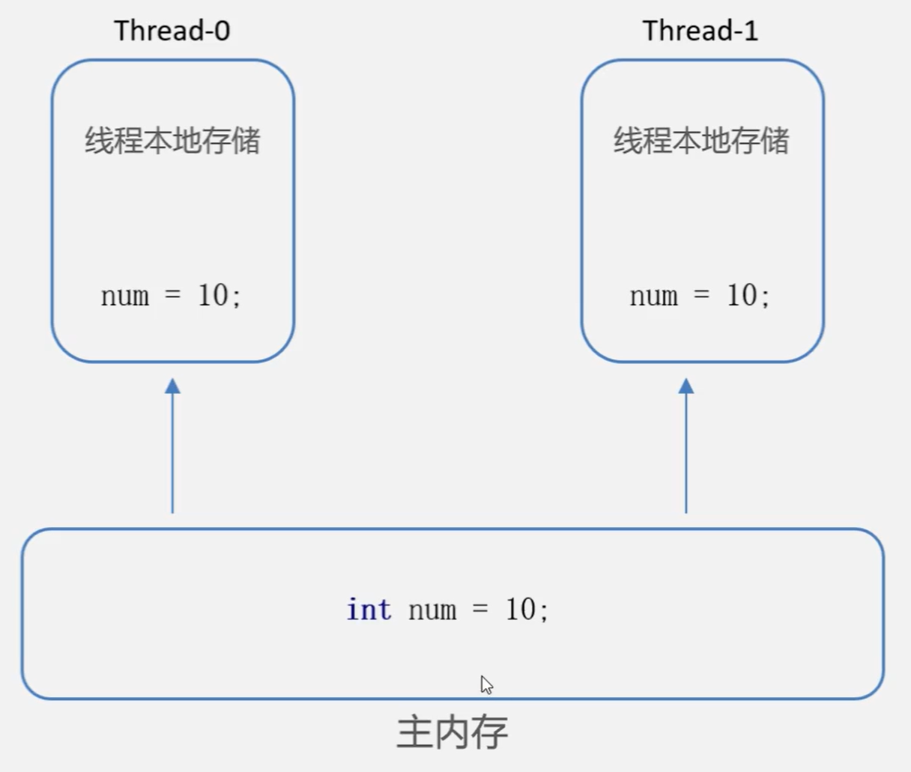


此时 Thread-1 将数据改成了15，Thread-0 和  Thread-1 里面的数据就不相等了。如果他们接下来继续操作，那么就有可能导致数据不一致的情况。

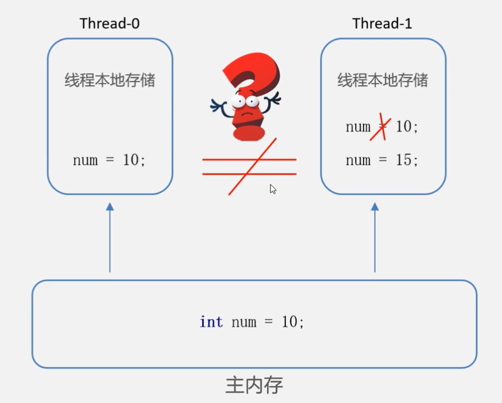


volatile修饰的变量禁止编译器对其进行优化，这就意味着每次使用num变量都从主存中读或者写。如果Thread-1修改num为15，那么就应该立即将该值写回主内存中。与此同时，如果别的线程再去使用num = 10 这个变量，由于num是由volatile修饰的，那么它在使用前，必须再去主内存中读取num的值。

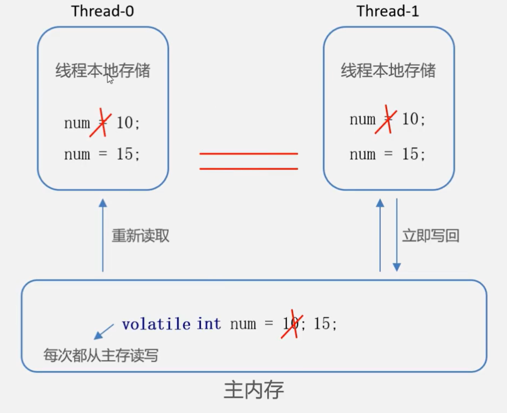


### 8.2 volatile关键字可以保证可见性

如果 num 没有被 volatile 修饰，那么程序会陷入死循环，无法停止。


#### 示例代码

```java
import lombok.extern.slf4j.Slf4j;

@Slf4j
public class VolatileTest {
    public static volatile int num = 10;

    public static void main(String[] args) {
        // 多个线程读
        Runnable runnable = () -> {
            while (num == 10){

            }
            String name = Thread.currentThread().getName();
            log.debug("线程 {} 读取到的是：{}",name,num);
        };

        for (int i = 0; i < 3; i++) {
            new Thread(runnable).start();
        }

        try {
            log.debug("休眠3秒");
            Thread.sleep(3000);
            log.debug("休眠结束");
        } catch (InterruptedException e) {
            throw new RuntimeException(e);
        }

        // 一个线程写
        new Thread(() -> {
            num = 15;
            log.debug("写线程完成写入...");
        }).start();
    }
}

```


### 8.3 volatile关键字不能保证原子性

#### 示例代码

```java
import lombok.extern.slf4j.Slf4j;

@Slf4j
public class VolatileNotAtomic {
    private static volatile int num = 0;

    public static void main(String[] args) {
        Runnable add = () -> {
            for (int i = 0; i < 1000; i++) {
                num++;  //非原子操作
            }
            log.debug("执行结果是：{}",num);
        };

        for (int i = 0; i < 3; i++) {
            new Thread(add).start();
        }

        try {
            Thread.sleep(1000);
        } catch (InterruptedException e) {
            throw new RuntimeException(e);
        }

        log.debug("最终运算结果：{}",num);
    }
}

```


**运行结果：**

```java
2025-01-10 16:22:24.498 [Thread-0] DEBUG com.atomic.VolatileNotAtomic - 执行结果是：596
2025-01-10 16:22:24.498 [Thread-2] DEBUG com.atomic.VolatileNotAtomic - 执行结果是：2142
2025-01-10 16:22:24.498 [Thread-1] DEBUG com.atomic.VolatileNotAtomic - 执行结果是：1142
2025-01-10 16:22:25.499 [main] DEBUG com.atomic.VolatileNotAtomic - 最终运算结果：2142
```


## 9. JDK8新特性LongAdder


### 9.1 AtomicLong 与 LongAdder 的区别

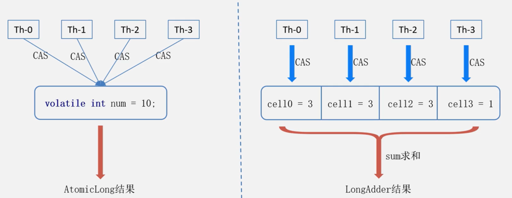


### 9.2 示例代码


#### AtomicLong

```java
import lombok.extern.slf4j.Slf4j;

import java.util.concurrent.atomic.AtomicLong;
import java.util.concurrent.atomic.LongAdder;

@Slf4j
public class LongAddrDemo {
    public static void main(String[] args) {
        AtomicLong atomicLong = new AtomicLong();
        LongAdder longAdder = new LongAdder();

        long start = System.currentTimeMillis();
        Runnable adder = () -> {
            for (int i = 0; i < 1000000; i++) {
                // TODO 分别执行 AtomicLong 和 LongAdder 的自增方法
                atomicLong.incrementAndGet();
            }
        };

        for (int i = 0; i < 50; i++) {
            new Thread(adder).start();
        }

        while (Thread.activeCount() > 2) {  // ctrl-break; main;

        }

        log.debug("运算结果是：{}",atomicLong.get());

        log.debug("耗时：{}",(System.currentTimeMillis() - start));
    }
}

```


**运行结果：**

```java
2025-01-10 17:16:01.642 [main] DEBUG com.atomic.LongAddrDemo - 运算结果是：50000000
2025-01-10 17:16:01.644 [main] DEBUG com.atomic.LongAddrDemo - 耗时：1068
```


#### LongAdder

```java
import lombok.extern.slf4j.Slf4j;

import java.util.concurrent.atomic.AtomicLong;
import java.util.concurrent.atomic.LongAdder;

@Slf4j
public class LongAddrDemo {
    public static void main(String[] args) {
        AtomicLong atomicLong = new AtomicLong();
        LongAdder longAdder = new LongAdder();

        long start = System.currentTimeMillis();
        Runnable adder = () -> {
            for (int i = 0; i < 1000000; i++) {
                // TODO 分别执行 AtomicLong 和 LongAdder 的自增方法
                // atomicLong.incrementAndGet();
                longAdder.increment();
            }
        };

        for (int i = 0; i < 50; i++) {
            new Thread(adder).start();
        }

        while (Thread.activeCount() > 2) {  // ctrl-break; main;

        }

        // log.debug("运算结果是：{}",atomicLong.get());
        log.debug("运算结果是：{}",longAdder.sum());

        log.debug("耗时：{}",(System.currentTimeMillis() - start));
    }
}
```


**运行结果：**

```java
2025-01-10 17:18:05.926 [main] DEBUG com.atomic.LongAddrDemo - 运算结果是：50000000
2025-01-10 17:18:05.928 [main] DEBUG com.atomic.LongAddrDemo - 耗时：147
```


# 三、并发工具类


## 1. CountDownLatch

### 1.1 CountDownLatch的概念和工作原理

倒计时门闩；倒计时计数器；发令枪；

一个同步辅助类，它允许一个或多个线程等待，直到在其他线程中执行的一组操作完成为止。

- 特点
  - 无法重置计数

- 使用场景
  - 等待/通知
  - 倒计时计数

- 基本操作
  - await()
  - countDown()


**工作原理：**


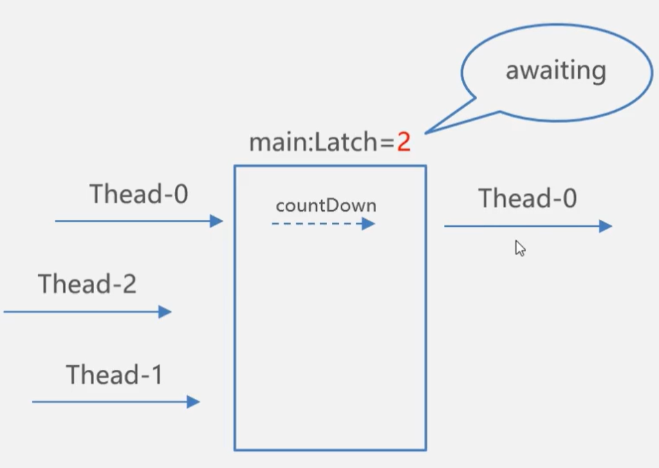


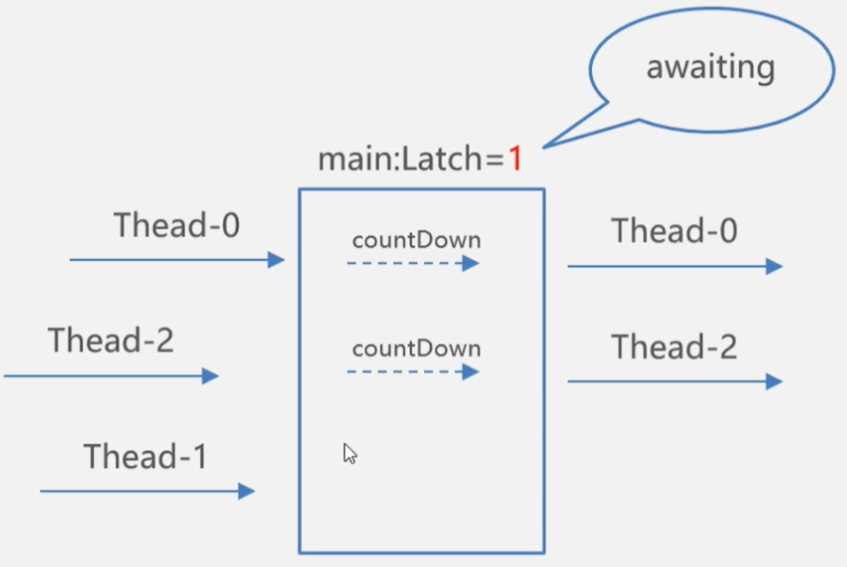


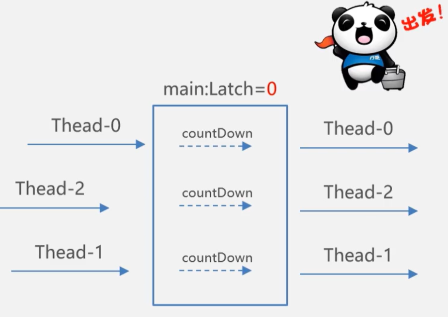


### 1.2 CountDownLatch的基本使用

每一次调用 countDown() ，会让计数器减 1 。当 计数器减为 0 时，就会唤醒主线程。

#### 示例代码

```java
import lombok.extern.slf4j.Slf4j;

import java.util.concurrent.CountDownLatch;
import java.util.concurrent.atomic.AtomicInteger;

/**
 *  并发工具类：CountDownLatch使用
 *  业务需求：
 *      15个线程并发进行共享变量的自增运算，每个线程自增1000次
 *      在主线程中打印运算的最终结果
 *  思路分析：
 *      1. 定义计数器CountDownLatch对象
 *      2. 所有子线程启动之后，主线程应该立即进入等待
 *      3. 子线程完成任务之后，计数器对象减 1
 */
@Slf4j
public class WaitNotifyLatch {
    private static AtomicInteger number = new AtomicInteger(0);

    public static void main(String[] args) {
        // 1. 定义计数器CountDownLatch对象 
        CountDownLatch count = new CountDownLatch(15);

        Runnable runnable = () -> {
            for (int i = 0; i < 1000; i++) {
                number.incrementAndGet();
            }
            log.debug("number : {}" , number.get());

            // 3. 子线程完成任务之后，计数器对象减 1
            count.countDown();
        };

        for (int i = 0; i < 15; i++) {
            new Thread(runnable).start();
        }

        try {
            // 2. 所有子线程启动之后，主线程应该立即进入等待
            count.await();
        } catch (InterruptedException e) {
            throw new RuntimeException(e);
        }

        log.debug("最终结果：{}",number.get());
    }
}
```


**运行结果：**

```java
2025-01-10 18:10:58.830 [Thread-4] DEBUG com.utils.WaitNotifyLatch - number : 6715
2025-01-10 18:10:58.830 [Thread-8] DEBUG com.utils.WaitNotifyLatch - number : 9000
2025-01-10 18:10:58.830 [Thread-5] DEBUG com.utils.WaitNotifyLatch - number : 8000
2025-01-10 18:10:58.830 [Thread-14] DEBUG com.utils.WaitNotifyLatch - number : 15000
2025-01-10 18:10:58.830 [Thread-7] DEBUG com.utils.WaitNotifyLatch - number : 7424
2025-01-10 18:10:58.830 [Thread-10] DEBUG com.utils.WaitNotifyLatch - number : 11000
2025-01-10 18:10:58.830 [Thread-2] DEBUG com.utils.WaitNotifyLatch - number : 6505
2025-01-10 18:10:58.830 [Thread-3] DEBUG com.utils.WaitNotifyLatch - number : 10000
2025-01-10 18:10:58.830 [Thread-9] DEBUG com.utils.WaitNotifyLatch - number : 6550
2025-01-10 18:10:58.830 [Thread-11] DEBUG com.utils.WaitNotifyLatch - number : 12000
2025-01-10 18:10:58.830 [Thread-13] DEBUG com.utils.WaitNotifyLatch - number : 14000
2025-01-10 18:10:58.830 [Thread-6] DEBUG com.utils.WaitNotifyLatch - number : 7869
2025-01-10 18:10:58.830 [Thread-0] DEBUG com.utils.WaitNotifyLatch - number : 4226
2025-01-10 18:10:58.830 [Thread-12] DEBUG com.utils.WaitNotifyLatch - number : 13000
2025-01-10 18:10:58.830 [Thread-1] DEBUG com.utils.WaitNotifyLatch - number : 6385
2025-01-10 18:10:58.833 [main] DEBUG com.utils.WaitNotifyLatch - 最终结果：15000
```


### 1.3 CountDownLatch的注意事项

1. countDown之后，子线程仍然在执行，并未被阻塞。
2. 若计数器未能完全释放，则main线程一直等待。可以尝试使用await带超时参数的重载方法。
3. 计数器 >= 线程数，一个线程可以倒计时多次。


### 1.4 CountDownLatch的底层原理


## 2. CyclicBarrier


### 2.1 CyclicBarrier的基本概念和工作原理


#### **概念和作用**

循环屏障；

一个同步辅助类，它允许一组线程全部互相等待以到达一个公共的障碍点。

- 特点
  - 释放等待线程后可以重新使用

- 使用场景
  - 执行一组固定大小、且彼此偶尔需要相互等待的线程

- 基本操作
  - await()


#### **工作原理**

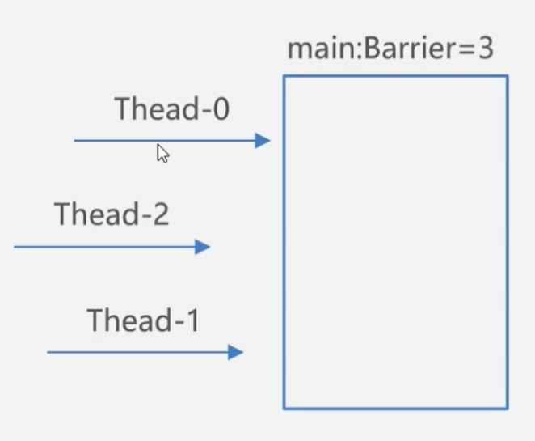


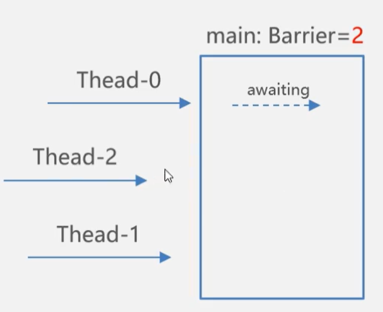


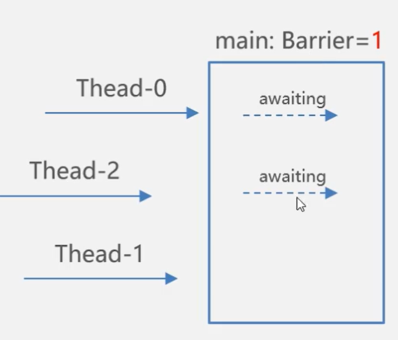


### 2.2 CyclicBarrier的基本使用

#### 示例代码

```java
import lombok.extern.slf4j.Slf4j;

import java.util.Arrays;
import java.util.Random;
import java.util.concurrent.CyclicBarrier;

/**
 * 并发工具类：CyclicBarrier使用
 *
 * 需求：
 *      3个小伙伴一起出游。路线：故宫——奥林匹克公园——香山公园
 *      于某日某时某刻在第一站“故宫”集合，然后自由玩耍
 *      出发去下一站之前再次集合，直到游玩结束
 *
 * 思路分析：
 *      1. 分别用三个线程模拟三个小伙伴：
 *      2. 定义集合点，先到达的小伙伴等待；
 *      3. 所有小伙伴集合完毕，之后再出发去下一站；
 *
 * 步骤分析：
 *      1. 定义CyclicBarrier对象：代表集合点
 *          约定集合的小伙伴的个数：3
 *      2. 在需要的集合的地方，调用await方法进行等待
 *          await() 方法会自动计数
 *          计数扣减为0时，会自动唤醒所有线程
 */
@Slf4j
public class TourBuddiesBarrier {
    public static void main(String[] args) {
        // 三个旅游站点
        String[] imperiaPalace = {"天安门","延禧宫","慈宁宫"};
        String[] olympic = {"鸟巢","水立方","森林公园"};
        String[] fragrantHills = {"香山东门","香山寺","见心斋","碧云寺"};
        String[][] places = {imperiaPalace,olympic,fragrantHills};

        // 1. 定义CyclicBarrier对象：代表集合点
        CyclicBarrier cyclicBarrier = new CyclicBarrier(3);
        Runnable play = () -> {
            String name = Thread.currentThread().getName();
            try {
                for (int placeNumber = 0; placeNumber < places.length; placeNumber++) {
                    // 出发
                    log.debug("小伙伴们已出发...正在前往第{}个站点：{}",(placeNumber+1), Arrays.toString(places[placeNumber]));

                    // 游玩
                    String[] place = places[placeNumber];
                    Random random = new Random();
                    for (int i = 0; i < place.length; i++) {
                        int index = random.nextInt(place.length);   // 随机游玩景点的索引
                        Thread.sleep((index + 1) * 1000);
                        log.debug("小伙伴{}在{}玩了{}秒",name,place[index],index);
                    }
                    log.debug("小伙伴{}正在前往第{}个集合点",name,(placeNumber + 1));
                    // 集合
                    cyclicBarrier.await();  // 所有线程在此处阻塞
                }
            }catch (Exception e){
                e.printStackTrace();
            }

            // 结束
            log.debug("小伙伴{}游玩结束",name);
        };

        // 三个小伙伴
        for (int i = 0; i < 3; i++) {
            new Thread(play).start();
        }
    }
}

```


**运行结果:**

```java
2025-01-12 20:17:29.361 [Thread-2] DEBUG com.utils.TourBuddiesBarrier - 小伙伴们已出发...正在前往第1个站点：[天安门, 延禧宫, 慈宁宫]
2025-01-12 20:17:29.361 [Thread-0] DEBUG com.utils.TourBuddiesBarrier - 小伙伴们已出发...正在前往第1个站点：[天安门, 延禧宫, 慈宁宫]
2025-01-12 20:17:29.361 [Thread-1] DEBUG com.utils.TourBuddiesBarrier - 小伙伴们已出发...正在前往第1个站点：[天安门, 延禧宫, 慈宁宫]
2025-01-12 20:17:31.373 [Thread-2] DEBUG com.utils.TourBuddiesBarrier - 小伙伴Thread-2在延禧宫玩了1秒
2025-01-12 20:17:31.373 [Thread-1] DEBUG com.utils.TourBuddiesBarrier - 小伙伴Thread-1在延禧宫玩了1秒
2025-01-12 20:17:32.370 [Thread-0] DEBUG com.utils.TourBuddiesBarrier - 小伙伴Thread-0在慈宁宫玩了2秒
2025-01-12 20:17:33.373 [Thread-0] DEBUG com.utils.TourBuddiesBarrier - 小伙伴Thread-0在天安门玩了0秒
2025-01-12 20:17:34.377 [Thread-1] DEBUG com.utils.TourBuddiesBarrier - 小伙伴Thread-1在慈宁宫玩了2秒
2025-01-12 20:17:34.378 [Thread-2] DEBUG com.utils.TourBuddiesBarrier - 小伙伴Thread-2在慈宁宫玩了2秒
2025-01-12 20:17:35.388 [Thread-2] DEBUG com.utils.TourBuddiesBarrier - 小伙伴Thread-2在天安门玩了0秒
2025-01-12 20:17:35.389 [Thread-2] DEBUG com.utils.TourBuddiesBarrier - 小伙伴Thread-2正在前往第1个集合点
2025-01-12 20:17:35.389 [Thread-0] DEBUG com.utils.TourBuddiesBarrier - 小伙伴Thread-0在延禧宫玩了1秒
2025-01-12 20:17:35.389 [Thread-0] DEBUG com.utils.TourBuddiesBarrier - 小伙伴Thread-0正在前往第1个集合点
2025-01-12 20:17:36.385 [Thread-1] DEBUG com.utils.TourBuddiesBarrier - 小伙伴Thread-1在延禧宫玩了1秒
2025-01-12 20:17:36.386 [Thread-1] DEBUG com.utils.TourBuddiesBarrier - 小伙伴Thread-1正在前往第1个集合点
2025-01-12 20:17:36.387 [Thread-2] DEBUG com.utils.TourBuddiesBarrier - 小伙伴们已出发...正在前往第2个站点：[鸟巢, 水立方, 森林公园]
2025-01-12 20:17:36.387 [Thread-0] DEBUG com.utils.TourBuddiesBarrier - 小伙伴们已出发...正在前往第2个站点：[鸟巢, 水立方, 森林公园]
2025-01-12 20:17:36.388 [Thread-1] DEBUG com.utils.TourBuddiesBarrier - 小伙伴们已出发...正在前往第2个站点：[鸟巢, 水立方, 森林公园]
2025-01-12 20:17:37.402 [Thread-0] DEBUG com.utils.TourBuddiesBarrier - 小伙伴Thread-0在鸟巢玩了0秒
2025-01-12 20:17:37.402 [Thread-1] DEBUG com.utils.TourBuddiesBarrier - 小伙伴Thread-1在鸟巢玩了0秒
2025-01-12 20:17:38.399 [Thread-2] DEBUG com.utils.TourBuddiesBarrier - 小伙伴Thread-2在水立方玩了1秒
2025-01-12 20:17:38.415 [Thread-0] DEBUG com.utils.TourBuddiesBarrier - 小伙伴Thread-0在鸟巢玩了0秒
2025-01-12 20:17:39.417 [Thread-1] DEBUG com.utils.TourBuddiesBarrier - 小伙伴Thread-1在水立方玩了1秒
2025-01-12 20:17:40.414 [Thread-2] DEBUG com.utils.TourBuddiesBarrier - 小伙伴Thread-2在水立方玩了1秒
2025-01-12 20:17:40.430 [Thread-1] DEBUG com.utils.TourBuddiesBarrier - 小伙伴Thread-1在鸟巢玩了0秒
2025-01-12 20:17:40.430 [Thread-1] DEBUG com.utils.TourBuddiesBarrier - 小伙伴Thread-1正在前往第2个集合点
2025-01-12 20:17:41.428 [Thread-2] DEBUG com.utils.TourBuddiesBarrier - 小伙伴Thread-2在鸟巢玩了0秒
2025-01-12 20:17:41.428 [Thread-2] DEBUG com.utils.TourBuddiesBarrier - 小伙伴Thread-2正在前往第2个集合点
2025-01-12 20:17:41.428 [Thread-0] DEBUG com.utils.TourBuddiesBarrier - 小伙伴Thread-0在森林公园玩了2秒
2025-01-12 20:17:41.429 [Thread-0] DEBUG com.utils.TourBuddiesBarrier - 小伙伴Thread-0正在前往第2个集合点
2025-01-12 20:17:41.429 [Thread-0] DEBUG com.utils.TourBuddiesBarrier - 小伙伴们已出发...正在前往第3个站点：[香山东门, 香山寺, 见心斋, 碧云寺]
2025-01-12 20:17:41.430 [Thread-2] DEBUG com.utils.TourBuddiesBarrier - 小伙伴们已出发...正在前往第3个站点：[香山东门, 香山寺, 见心斋, 碧云寺]
2025-01-12 20:17:41.429 [Thread-1] DEBUG com.utils.TourBuddiesBarrier - 小伙伴们已出发...正在前往第3个站点：[香山东门, 香山寺, 见心斋, 碧云寺]
2025-01-12 20:17:43.438 [Thread-1] DEBUG com.utils.TourBuddiesBarrier - 小伙伴Thread-1在香山寺玩了1秒
2025-01-12 20:17:43.438 [Thread-2] DEBUG com.utils.TourBuddiesBarrier - 小伙伴Thread-2在香山寺玩了1秒
2025-01-12 20:17:44.453 [Thread-2] DEBUG com.utils.TourBuddiesBarrier - 小伙伴Thread-2在香山东门玩了0秒
2025-01-12 20:17:45.435 [Thread-0] DEBUG com.utils.TourBuddiesBarrier - 小伙伴Thread-0在碧云寺玩了3秒
2025-01-12 20:17:47.447 [Thread-0] DEBUG com.utils.TourBuddiesBarrier - 小伙伴Thread-0在香山寺玩了1秒
2025-01-12 20:17:47.447 [Thread-1] DEBUG com.utils.TourBuddiesBarrier - 小伙伴Thread-1在碧云寺玩了3秒
2025-01-12 20:17:47.463 [Thread-2] DEBUG com.utils.TourBuddiesBarrier - 小伙伴Thread-2在见心斋玩了2秒
2025-01-12 20:17:48.462 [Thread-1] DEBUG com.utils.TourBuddiesBarrier - 小伙伴Thread-1在香山东门玩了0秒
2025-01-12 20:17:48.477 [Thread-2] DEBUG com.utils.TourBuddiesBarrier - 小伙伴Thread-2在香山东门玩了0秒
2025-01-12 20:17:48.477 [Thread-2] DEBUG com.utils.TourBuddiesBarrier - 小伙伴Thread-2正在前往第3个集合点
2025-01-12 20:17:50.471 [Thread-1] DEBUG com.utils.TourBuddiesBarrier - 小伙伴Thread-1在香山寺玩了1秒
2025-01-12 20:17:50.476 [Thread-1] DEBUG com.utils.TourBuddiesBarrier - 小伙伴Thread-1正在前往第3个集合点
2025-01-12 20:17:51.455 [Thread-0] DEBUG com.utils.TourBuddiesBarrier - 小伙伴Thread-0在碧云寺玩了3秒
2025-01-12 20:17:52.469 [Thread-0] DEBUG com.utils.TourBuddiesBarrier - 小伙伴Thread-0在香山东门玩了0秒
2025-01-12 20:17:52.472 [Thread-0] DEBUG com.utils.TourBuddiesBarrier - 小伙伴Thread-0正在前往第3个集合点
2025-01-12 20:17:52.473 [Thread-1] DEBUG com.utils.TourBuddiesBarrier - 小伙伴Thread-1游玩结束
2025-01-12 20:17:52.473 [Thread-2] DEBUG com.utils.TourBuddiesBarrier - 小伙伴Thread-2游玩结束
2025-01-12 20:17:52.473 [Thread-0] DEBUG com.utils.TourBuddiesBarrier - 小伙伴Thread-0游玩结束
```


### 2.3 CyclicBarrier的底层实现原理

**扩展：** 底层实现原理

1. 使用可重入锁ReentrantLock + Condition 对象实现同步：

   ​	让线程在同一个条件对象上等待：因为没有扣减到0

2. 定义计数器count，每当线程执行await方法，计数器减1
3. 当计数器减为0时，唤醒所有在此条件对象上等待的线程

​			唤醒之后，重置屏障，以便下次使用

4. 关于超时和异常：

​			若线程超时，未能到达屏障，则重置/销毁屏障

​		    程序发生异常，则重置/销毁屏障

​			唤醒所有线程


### 2.4 CountDownLatch和CyclicBarrier的区别

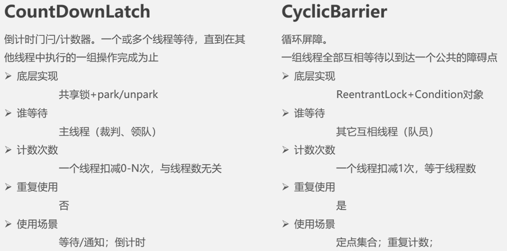


## 3. Semaphore


### 3.1 Semaphore的概念和工作流程

#### 概念和作用

信号量；信号灯

它允许线程集等待，直到被允许继续运行为止。一个信号量管理多个许可(permit)，线程必须请求许可，否则等待。

- 特点
  - 控制访问多个共享资源的计数器

- 使用场景
  - 通常用于限制访问资源的线程总数
  - 流量控制

- 基本操作
  - acquire()
  - release()


#### 工作流程

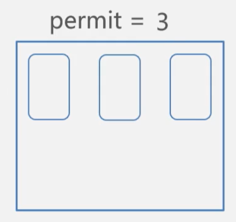


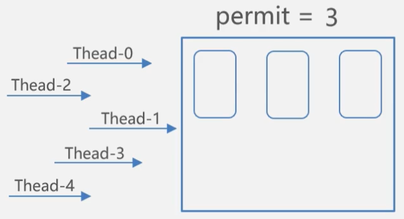


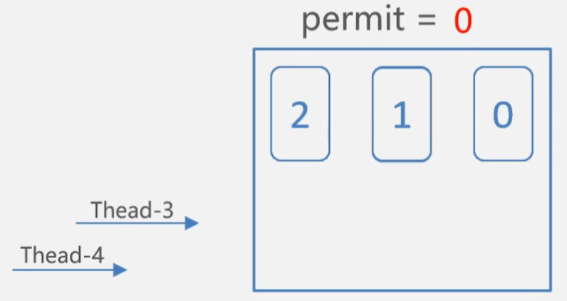


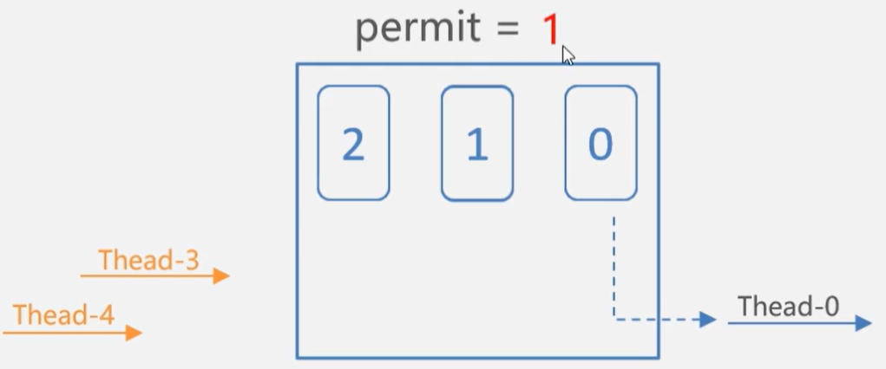


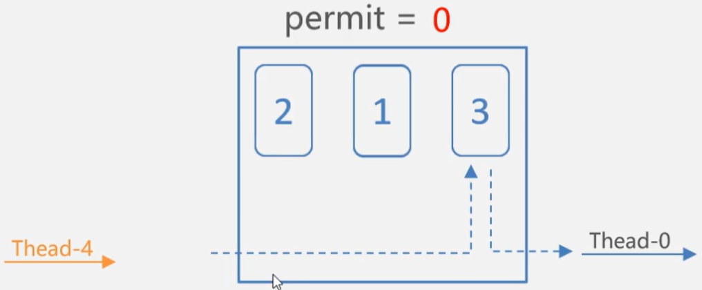


### 3.2 Semaphore的基本使用

#### 示例代码

```java
package com.utils;

import lombok.extern.slf4j.Slf4j;

import java.util.Random;
import java.util.concurrent.Semaphore;

/**
 *  并发工具类：Semaphore使用
 *
 *  需求：
 *      假设停车场有3个车位，且都没有停车。先后到来5辆车，
 *      管理员只能允许3辆车停入车位。直到车辆陆陆续续从车场离开，
 *      有了空余车位，后来的车才能停入车位。
 *
 * 思路分析：
 *      1. 车场管理员就是一个Semaphore，控制车辆访问车位
 *      2. 车辆入场，必须向管理员申请许可（permit）
 *      3. 车辆出场，需要向管理员释放许可（permit）
 *
 * 实现步骤：
 *      1. 定义车场管理员对象Semaphore，管理3个车位
 *          Semaphore semaphore = new Semaphore(3);
 *      2. 车辆入场，申请许可
 *          acquire()
 *      3. 车辆出场，释放许可
 *          release()
 */
@Slf4j
public class ParkingSpaceSemaphore {
    public static void main(String[] args) {
        // 1. 定义车场管理员对象Semaphore，管理3个车位
        Semaphore parkingAdmin = new Semaphore(3);

        Runnable carPark = () -> {
            try {
                String name = Thread.currentThread().getName();

                // 2. 车辆入场，申请许可
                parkingAdmin.acquire();

                // 停车入位
                Random random = new Random();
                int seconds = random.nextInt(3) + 1;
                Thread.sleep(seconds * 1000);
                log.debug("{}停车入位，耗时{}秒",name,seconds);

                // 3. 车辆出场，释放许可
                seconds = random.nextInt(15) + 1;
                Thread.sleep(seconds * 1000);
                parkingAdmin.release();
                log.info("{}车辆离场，停车{}秒",name,seconds);


            } catch (InterruptedException e) {
                throw new RuntimeException(e);
            }

        };

        for (int i = 0; i < 5; i++) {
            new Thread(carPark).start();
        }
    }
}
```


**运行结果：**

```java
2025-01-13 12:10:04.112 [Thread-2] DEBUG com.utils.ParkingSpaceSemaphore - Thread-2停车入位，耗时1秒
2025-01-13 12:10:05.110 [Thread-0] DEBUG com.utils.ParkingSpaceSemaphore - Thread-0停车入位，耗时2秒
2025-01-13 12:10:06.108 [Thread-3] DEBUG com.utils.ParkingSpaceSemaphore - Thread-3停车入位，耗时3秒
2025-01-13 12:10:11.131 [Thread-2] INFO  com.utils.ParkingSpaceSemaphore - Thread-2车辆离场，停车7秒
2025-01-13 12:10:12.146 [Thread-4] DEBUG com.utils.ParkingSpaceSemaphore - Thread-4停车入位，耗时1秒
2025-01-13 12:10:14.151 [Thread-4] INFO  com.utils.ParkingSpaceSemaphore - Thread-4车辆离场，停车2秒
2025-01-13 12:10:15.123 [Thread-0] INFO  com.utils.ParkingSpaceSemaphore - Thread-0车辆离场，停车10秒
2025-01-13 12:10:15.153 [Thread-1] DEBUG com.utils.ParkingSpaceSemaphore - Thread-1停车入位，耗时1秒
2025-01-13 12:10:16.118 [Thread-3] INFO  com.utils.ParkingSpaceSemaphore - Thread-3车辆离场，停车10秒
2025-01-13 12:10:23.156 [Thread-1] INFO  com.utils.ParkingSpaceSemaphore - Thread-1车辆离场，停车8秒
```


### 3.3 Semaphore的注意事项

1. 锁是由其它线程释放的，而不是主线程（车场管理员）
2. 获取许可和释放许可的不一定是同一个线程
3. 线程可以申请多个许可，也可以释放多个许可
4. 许可初始化数量为1时，可以当作普通的互斥锁来使用


## 4. Exchanger

### 4.1 Exchanger的概念和工作原理


#### 概念和作用

交换器；

允许两个线程在要交换的对象准备好时交换对象

- **特点**
  - 在成对出现的线程间交换数据

- 使用场景
  - 一个线程向实例添加数据，另一个线程从实例清除数据

- 基本操作
  - exchange(V)


#### 工作原理

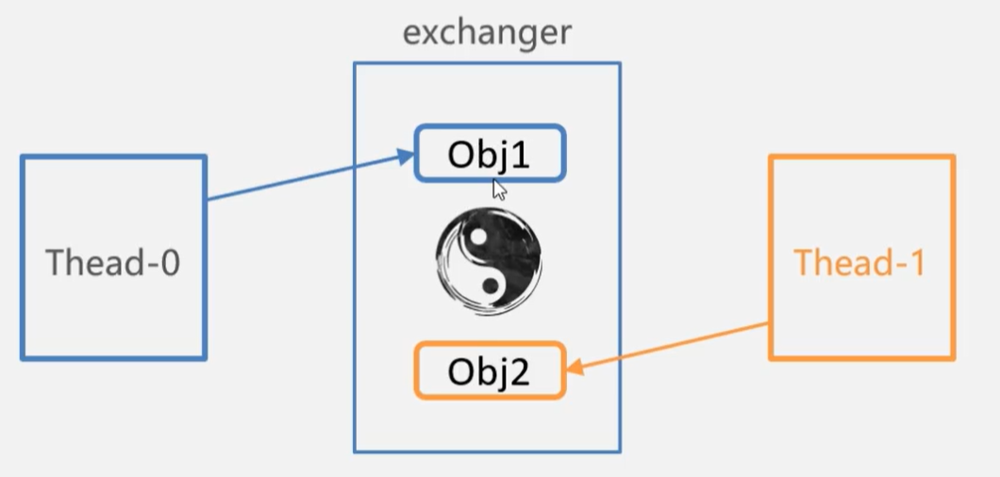


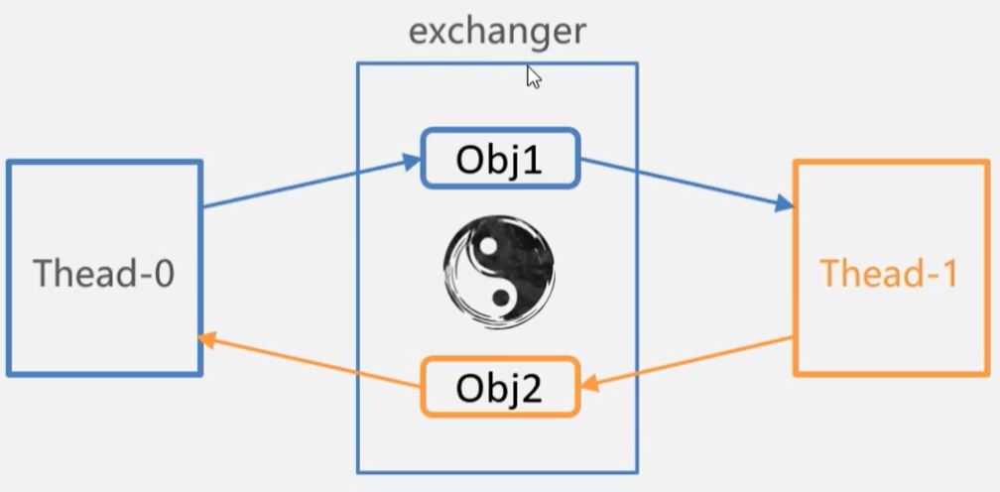


### 4.2 Exchanger的基本使用

#### 示例代码

```java
import com.atomic.UserInfo;
import lombok.extern.slf4j.Slf4j;

import java.util.concurrent.Exchanger;

/**
 * 并发工具类：Exchanger使用
 *
 * 需求：两个特务头子约定在某时某地交换身份
 *
 * 思路分析：
 *      1. 使用两个线程来分别模拟两个特务
 *      2. 定义交换点（同步点），先到达的特务等待
 *      3. 后来的特务与先到的特务交换身份
 *
 *  实现步骤：
 *      1. 创建交换器对象
 *      2. 在指定位置交换身份
 */
@Slf4j
public class SpyConnectExchanger {
    public static void main(String[] args) {
        // 1. 创建交换器对象
        Exchanger<UserInfo> exchanger = new Exchanger<>();


        Runnable runnable = () -> {
            try {
                // 前往交换地点
                String name = Thread.currentThread().getName();
                log.debug("{}正在前往交换地点...",name);

                // 到达交换点，等待
                UserInfo user = new UserInfo(18,name);
                log.debug("{}已到达交换点",name);

                // 进行交换
                user = exchanger.exchange(user);    // 在第二个线程到达此处之前，第一个线程一直等待
                log.debug("交易完成，交易前我是{}，交换后的信息是：{}",name,user);

            }catch (InterruptedException e){
                e.printStackTrace();
            }

        };

        new Thread(runnable,"特务头子1").start();
        new Thread(runnable,"特务头子2").start();
    }
}
```


**运行结果：**

```java
2025-01-13 19:30:17.766 [特务头子2] DEBUG com.utils.SpyConnectExchanger - 特务头子2正在前往交换地点...
2025-01-13 19:30:17.766 [特务头子1] DEBUG com.utils.SpyConnectExchanger - 特务头子1正在前往交换地点...
2025-01-13 19:30:17.769 [特务头子2] DEBUG com.utils.SpyConnectExchanger - 特务头子2已到达交换点
2025-01-13 19:30:17.769 [特务头子1] DEBUG com.utils.SpyConnectExchanger - 特务头子1已到达交换点
2025-01-13 19:30:17.770 [特务头子1] DEBUG com.utils.SpyConnectExchanger - 交易完成，交易前我是特务头子1，交换后的信息是：UserInfo(age=18, name=特务头子2, hobby=null)
2025-01-13 19:30:17.770 [特务头子2] DEBUG com.utils.SpyConnectExchanger - 交易完成，交易前我是特务头子2，交换后的信息是：UserInfo(age=18, name=特务头子1, hobby=null)
```


# 四、同步器AQS

## 1. AQS的概念和原理


### 1.1 AQS的概念

**AQS**（AbstractQueuedSynchronizer）。是Java并发包中的一个框架，用于实现**阻塞锁**和与之相关的依赖于先进先出（FIFO）等待队列的同步器。

- Abstract
  - 抽象的，要使用这个类，需要创建它的子类对象

- Queued
  - 队列，说明该类是基于队列这样的数据结构来实现的

- Synchronizer
  - 同步器，即用于实现线程同步的对象


### 1.2 AQS的工作模式

- 排他模式（Exclusive mode）
  - 也叫独占模式，相当于互斥锁。当一个线程以独占模式成功获取锁，其他线程获取锁的尝试都将失败，就像synchronized那样

- 共享模式（Shared mode）
  - 多个线程可同时获取锁，用于控制一定量的线程并发执行。设计者建议共享模式下的同步状态支持三种情况：**0，小于0和大于0，** 以便在某种情况下和独占模式兼容。在此模式下，同步状态大于、等于0都代表获取锁成功。


### 1.3 AQS的核心组件

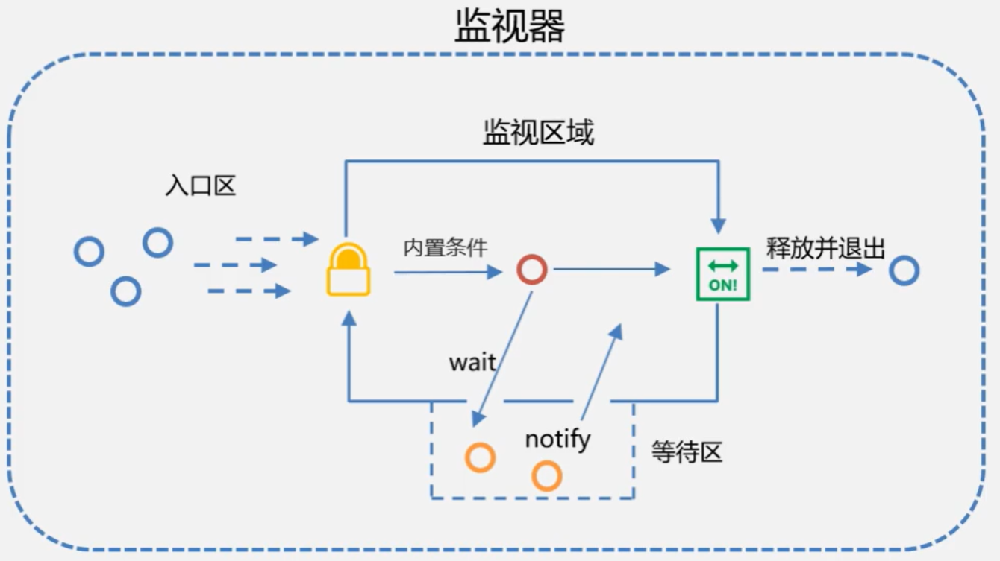

- 同步状态的原子性管理
- 锁的获取与释放（线程的阻塞与激活）
- 入口区和等待区线程的管理
  - 队列数据结构


### 1.4 AQS的工作流程

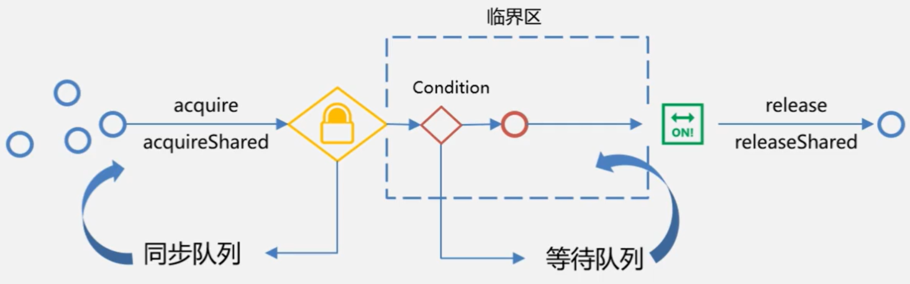


### 1.5 AQS源码解析

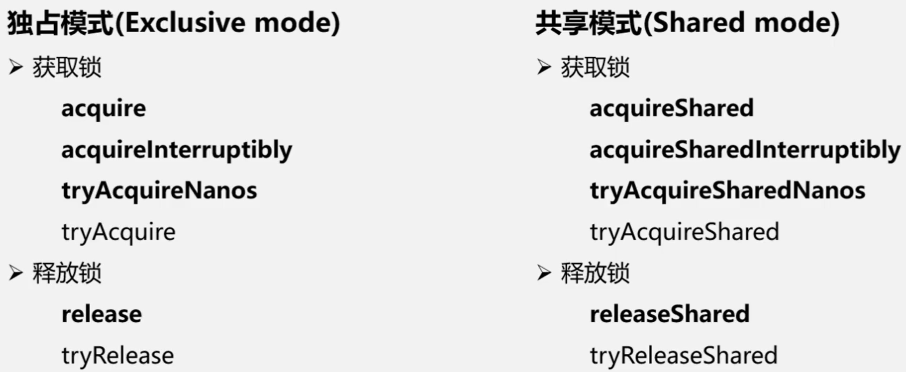


#### 同步状态的原子性管理

所有同步机制的实现均依赖于对state变量的原子操作，通过volatile关键字和CAS操作保证同步状态的原子性管理。

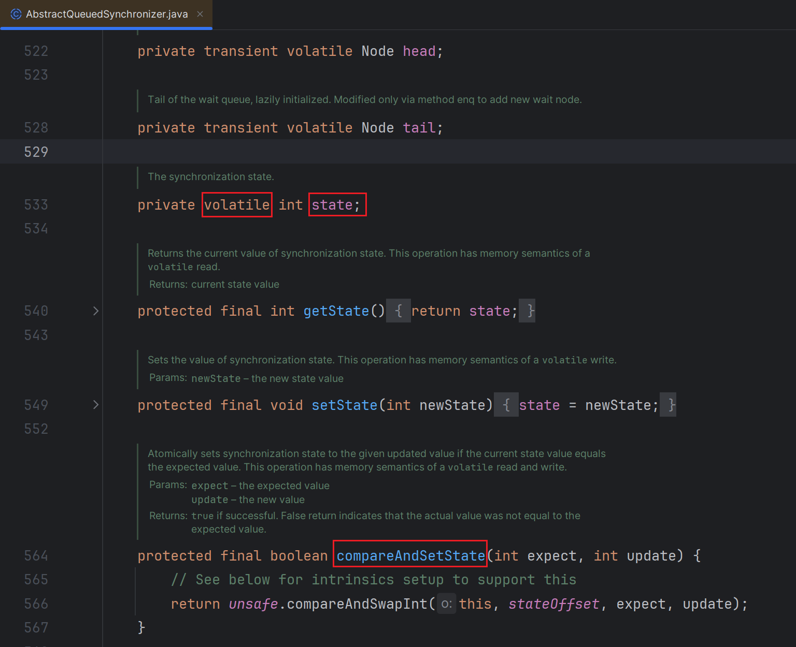


## 2. AQS的数据结构


### 2.1 AQS队列数据结构的基本介绍

在同步队列会有大量线程竞争的情况，在队列中的每一个节点它的prev或next随时都有可能断裂。如果我们从前往后遍历发现不到对应的节点，那么这个时候就可以从 **tail** 尾部往前遍历。

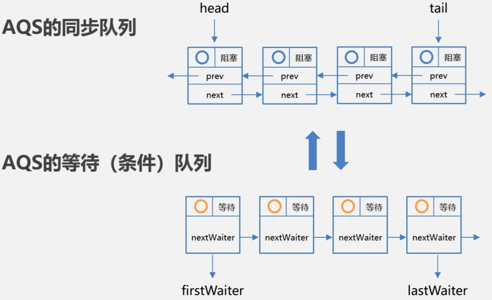


### 2.2 Node节点内部类源码解析

**SHARED** 是  共享模式，**EXCLUSIVE** 是 独占模式。

**CANCELLED**、**SIGNAL**   、**CONDITION**、**PROPAGATE** 是 **waitStatus** 的四个状态。

**waitStatus** 是 当前节点的等待状态，而不是线程的等待状态


**SIGNAL**   ： 需要等待被唤醒。如果我们当前节点处于**SIGNAL**状态，说明它现在正在阻塞状态。它尝试获取锁失败了，然后把它放到节点里。

**CONDITION**： 如果我们的线程获取锁成功，然后进入监视区域发现条件不满足，只能在条件上进行等待。

**CANCELLED** ： 该线程既不获取锁，也不入队。

**PROPAGATE**：共享模式时处于该状态。

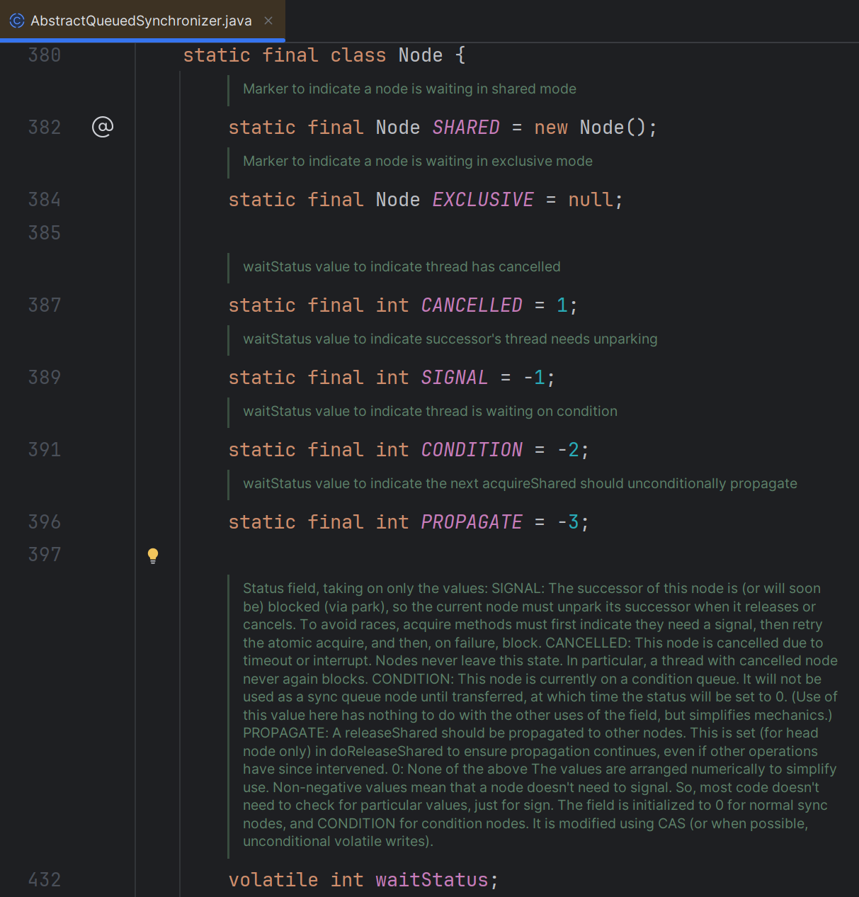


- volatile Thread thread
  - 线程对象

- volatile Node next
  - 下一个节点

- volatile Node prev
  - 前一个节点

- Node nextWaiter
  - 等待队列中的下一个节点

- volatile int waitStatus ： 节点等待状态，默认0
  - CANCELLED = 1
  - SIGNAL    = -1
  - CONDITION = -2
  - PROPAGATE = -3   


```java
	static final class Node {
        /** Marker to indicate a node is waiting in shared mode */
        static final Node SHARED = new Node();
        /** Marker to indicate a node is waiting in exclusive mode */
        static final Node EXCLUSIVE = null;

        /** waitStatus value to indicate thread has cancelled */
        static final int CANCELLED =  1;
        /** waitStatus value to indicate successor's thread needs unparking */
        static final int SIGNAL    = -1;
        /** waitStatus value to indicate thread is waiting on condition */
        static final int CONDITION = -2;
        /**
         * waitStatus value to indicate the next acquireShared should
         * unconditionally propagate
         */
        static final int PROPAGATE = -3;

        /**
         * Status field, taking on only the values:
         *   SIGNAL:     The successor of this node is (or will soon be)
         *               blocked (via park), so the current node must
         *               unpark its successor when it releases or
         *               cancels. To avoid races, acquire methods must
         *               first indicate they need a signal,
         *               then retry the atomic acquire, and then,
         *               on failure, block.
         *   CANCELLED:  This node is cancelled due to timeout or interrupt.
         *               Nodes never leave this state. In particular,
         *               a thread with cancelled node never again blocks.
         *   CONDITION:  This node is currently on a condition queue.
         *               It will not be used as a sync queue node
         *               until transferred, at which time the status
         *               will be set to 0. (Use of this value here has
         *               nothing to do with the other uses of the
         *               field, but simplifies mechanics.)
         *   PROPAGATE:  A releaseShared should be propagated to other
         *               nodes. This is set (for head node only) in
         *               doReleaseShared to ensure propagation
         *               continues, even if other operations have
         *               since intervened.
         *   0:          None of the above
         *
         * The values are arranged numerically to simplify use.
         * Non-negative values mean that a node doesn't need to
         * signal. So, most code doesn't need to check for particular
         * values, just for sign.
         *
         * The field is initialized to 0 for normal sync nodes, and
         * CONDITION for condition nodes.  It is modified using CAS
         * (or when possible, unconditional volatile writes).
         */
        volatile int waitStatus;

        /**
         * Link to predecessor node that current node/thread relies on
         * for checking waitStatus. Assigned during enqueuing, and nulled
         * out (for sake of GC) only upon dequeuing.  Also, upon
         * cancellation of a predecessor, we short-circuit while
         * finding a non-cancelled one, which will always exist
         * because the head node is never cancelled: A node becomes
         * head only as a result of successful acquire. A
         * cancelled thread never succeeds in acquiring, and a thread only
         * cancels itself, not any other node.
         */
        volatile Node prev;

        /**
         * Link to the successor node that the current node/thread
         * unparks upon release. Assigned during enqueuing, adjusted
         * when bypassing cancelled predecessors, and nulled out (for
         * sake of GC) when dequeued.  The enq operation does not
         * assign next field of a predecessor until after attachment,
         * so seeing a null next field does not necessarily mean that
         * node is at end of queue. However, if a next field appears
         * to be null, we can scan prev's from the tail to
         * double-check.  The next field of cancelled nodes is set to
         * point to the node itself instead of null, to make life
         * easier for isOnSyncQueue.
         */
        volatile Node next;

        /**
         * The thread that enqueued this node.  Initialized on
         * construction and nulled out after use.
         */
        volatile Thread thread;

        /**
         * Link to next node waiting on condition, or the special
         * value SHARED.  Because condition queues are accessed only
         * when holding in exclusive mode, we just need a simple
         * linked queue to hold nodes while they are waiting on
         * conditions. They are then transferred to the queue to
         * re-acquire. And because conditions can only be exclusive,
         * we save a field by using special value to indicate shared
         * mode.
         */
        Node nextWaiter;

        /**
         * Returns true if node is waiting in shared mode.
         */
        final boolean isShared() {
            return nextWaiter == SHARED;
        }

        /**
         * Returns previous node, or throws NullPointerException if null.
         * Use when predecessor cannot be null.  The null check could
         * be elided, but is present to help the VM.
         *
         * @return the predecessor of this node
         */
        final Node predecessor() throws NullPointerException {
            Node p = prev;
            if (p == null)
                throw new NullPointerException();
            else
                return p;
        }

        Node() {    // Used to establish initial head or SHARED marker
        }

        Node(Thread thread, Node mode) {     // Used by addWaiter
            this.nextWaiter = mode;
            this.thread = thread;
        }

        Node(Thread thread, int waitStatus) { // Used by Condition
            this.waitStatus = waitStatus;
            this.thread = thread;
        }
    }
```


### 2.3 同步队列节点的入队操作


#### 探究源码

线程获取锁的时候，会调用 **tryAcquire()** 去尝试获取锁，尝试获取锁失败后，会调用 **acquireQueued（final Node node, int arg）** 方法。

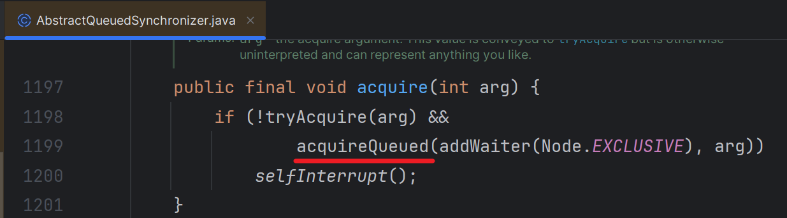


在 **acquireQueued** 方法中，Node参数传入的是 **addWaiter** 执行后的结果。

**addWaiter** 方法中我们传入的参数mode是 **Node.EXCLUSIVE**，其值为null。

 在 **addWaiter** 中，将当前线程封装成节点。由于mode = null，在**Node**构造方法中 this.nextWaiter = null。

然后 **Node pred = tail;** 而 **tail** 初始值为 null，所以 并不会进入 if 代码块中。所以会进入 **enq(final Node node)** 方法中。


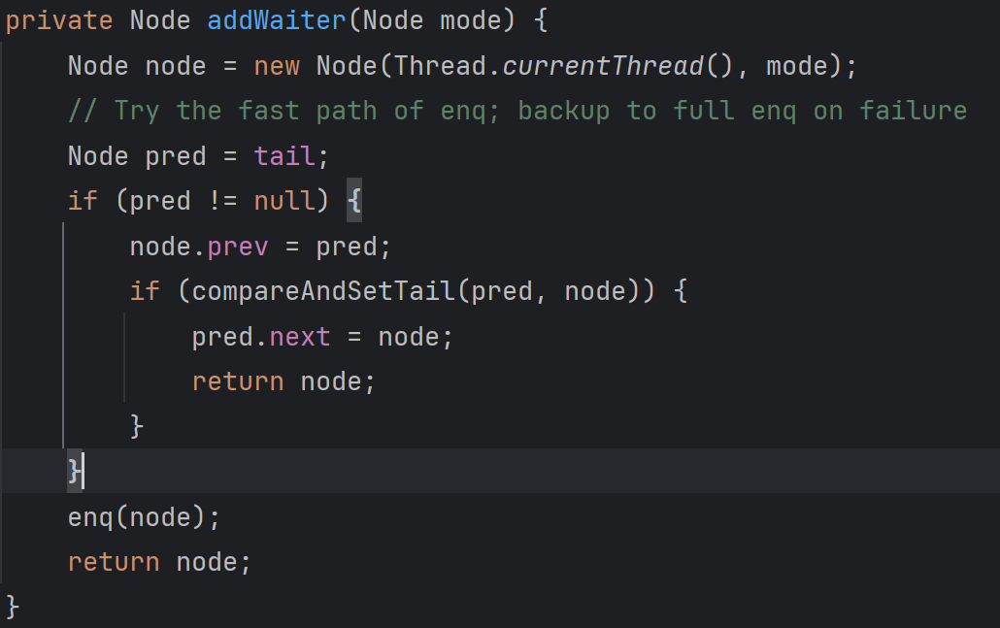


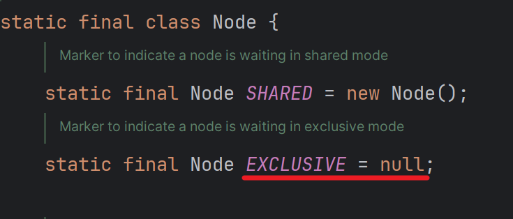


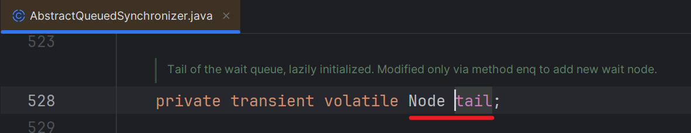


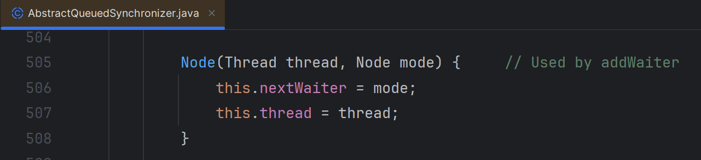


在 **enq** 方法中，Node t = tail ，也就是 t = null。

初始化同步队列时我们让 head 和 tail 同时指向默认的一个空结点对象。

我们通过初始化操作让一个节点入队。

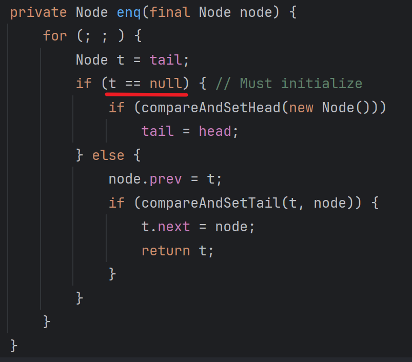


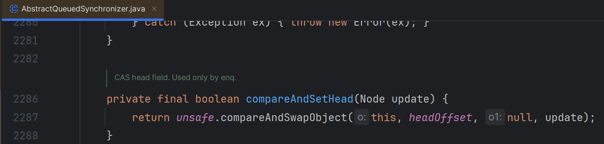


我们让第二个节点入队，获取tail的时候，tail就不是null了。这个时候就开始执行 **if**  代码块里面的代码。

node 是 我们当前线程封装的节点，它是有线程对象的。

**node.prev = pred;** 要设置当前节点的前一个节点 。这里需要注意，如果多个线程没有获取到锁，那么多个线程封装成节点，然后多个节点指向之前的 **tail** 是没问题的。

**compareAndSetTail(pred, node)** 就是要把当前的节点追加到原来的节点的后面。**pred** 是原值，**node** 是期望值。如果第一个线程执行这个方法成功，那么其他的线程就不能通过 **compareAndSetTail** 方法。

那么第一个线程可以继续执行 **pred.next = node;** 让原来尾节点的 next 指针指向当前节点 **node**。


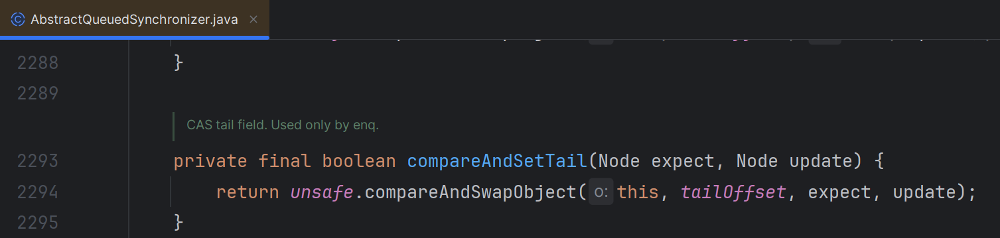


**addWaiter** 方法执行完毕后，返回入队后的节点，此时该节点并不是阻塞状态，我们需要**acquireQueued(final Node node, int arg)** 进行处理。

在 **acquireQueued**方法中，**Node p = node.predecessor();** 获取当前节点的前驱节点。此刻的p就是 **head**(当前队列中只有两个节点)。

如果当前节点的头节点是 **head** （head 只是一个头，里面并没有封装线程），那么会继续执行 **tryAcquire(arg)**，尝试再获取锁。如果一旦成功，那么当前节点就不需要进入阻塞状态。如果获取锁失败，再进行阻塞的操作。

倘若成功，**setHead(node);** 把当前节点设置为head，剩下的就是出队的操作。

倘若失败，执行 **shouldParkAfterFailedAcquire(p, node)** ，p 就是 pred（head），它的**waitStatus**默认为0，那么**ws**值为0。执行**compareAndSetWaitStatus(pred, ws, Node.SIGNAL);** 将当前节点的状态设置到前一个节点中。

设置成功后，让我们的线程进入阻塞状态。


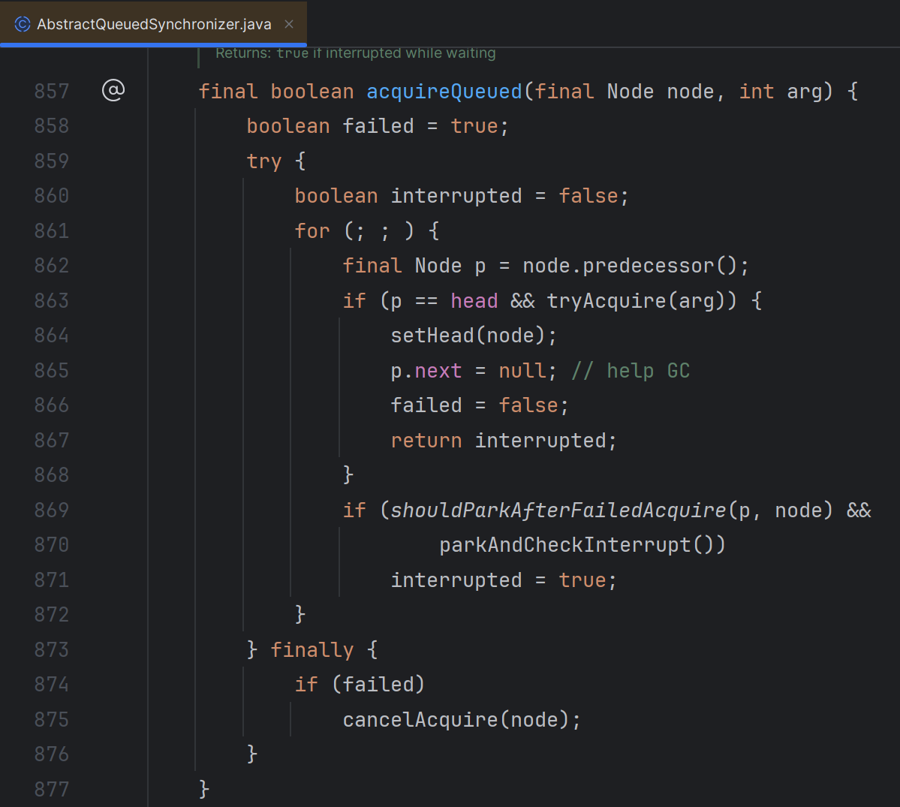

 

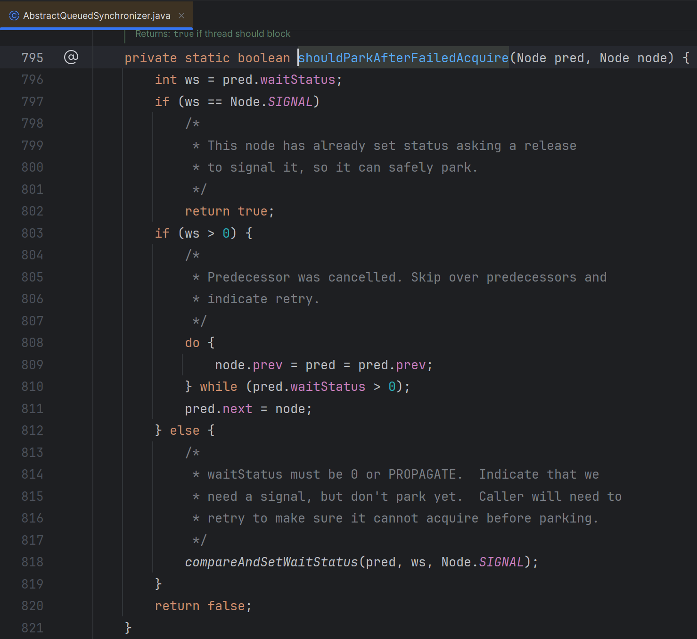


#### 整体流程

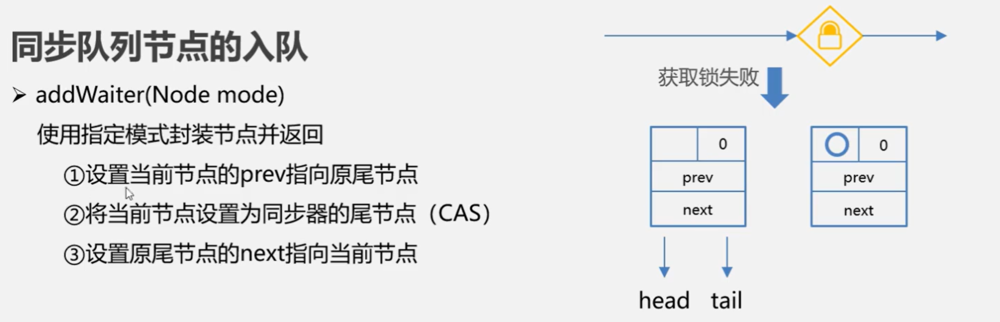


### 2.4 同步队列节点的出队操作

#### 探究源码


**release** 方法中调用 **tryRelease(arg)** 尝试释放锁，释放锁成功的话，会去看 **head** 是否 null 并且 head 的 **waitStatus** 是否不为0.两者都不满足时会调用**unparkSuccessor(h)** 方法;


**unparkSuccessor(Node node)** 中 参数node 即是 **head** 。获取 **head** 的 **waitStatus** ，如果小于0，则将其设置为0，因为要出队。（head 的  **waitStatus** 是 其下一个节点的 等待状态 ）

接着获取 **head** 的下一个节点 s。 如果 s == null （即head的下一个节点为空） 或者 s != null 且 s的waitStatus 大于 0 （说明同步队列中有多个节点 且 s 的 下一个节点等待状态为 **CANCELLED**），则执行第一个 if 代码块。即 s 作为一个非法数据应移出同步队列。

具体操作是 for 循环。指针**t**先指向**tail**，当 t 不等于 null 并且 t 不等于头节点 ， 进入 for 循环体 ，判断 t 的 等待状态是否 小于等于 0，如果小于等于0成立，则使 **s = t ;** 然后 t 不断向前移动，重复上述步骤。这样是为了找到队列最前面要出队的节点（**waitStatus <= 0**）

for 循环结束后，进入第二个 if 判断，直接**LockSupport.unpark(s.thread);** 释放线程。


之前我们进行线程阻塞的时候，是在**acquireQueued** 方法中，下面红色的代码处阻塞。阻塞也就意味着线程停在这里。

现在我们通过 **release** 方法把线程唤醒，那么线程就继续从红色处运行，重新进入自旋（for循环）。当前 node 就是 head 的 下一个节点。

**final Node p = node.predecessor();** 获取的前驱节点 p 就是 head，然后再尝试获取锁（**tryAcquire**）。如果获取锁成功，执行第一个代码块。把当前的节点**node**设置成头节点（**setHead(node)**）。

**setHead(node)** 方法中，把 当前节点 node 设置成 head。然后 **node.thread = null;** **node.prev = null;** 也就是说我们第二个节点和之前的head节点就断开了。

而 p 指向的是之前的 **head** 节点，它现在还指向 **node** 节点。那我们就让 **p.next = null;**  断开连接。


#### 整体流程


### 2.5 等待（条件）队列节点的入队操作

#### 探究源码

**await()** 里面调用 **addConditionWaiter()** ，将线程封装成节点添加到队列中再进行返回。

**addConditionWaiter()** 中，我们在等待队列添加第一个节点之前，**lastWaiter** 为 null。所以我们让 **firstWaiter **指向当前节点**node**，**lastWaiter** 也指向 **node**。 **firstWaiter ** 和 **lastWaiter** 指向的是有内容的节点，而不是像同步队列中没有线程对象的空节点。

如果原来的**lastWaiter** 为 null，执行上面操作。

如果原来的**lastWaiter** 不为 null，则让**lastWaiter** 的 **nextWaiter** 指向node。


**addConditionWaiter()** 执行完成后，需要释放锁。

调用 **fullyRelease(node)**  方法，通过 **getState()** 获取状态，再调用 **release(int arg)** 将状态全部释放。

**release(int arg)** 会唤醒同步队列的首节点。


#### 整体流程


### 2.6 等待（条件）队列节点的出队操作

#### 探究源码

**signal()** 里 主要判断 **firstWaiter** 是否为null，不为null的话，调用**doSignal(Node first)**。

**doSignal(Node first)** 中，有 do ... while。先执行do代码块，首先是一个if判断， **firstWaiter = first.nextWaiter** ，这时 **firstWaiter** 就为 等待队列中的第二个节点，如果该节点为null，说明就没有第二个节点，这样的话让 **lastWaiter = null** 。

if 判断执行完之后，**first.nextWaiter = null;** 让我们的首节点与队列进行脱钩。


#### 整体流程


### 2.7 共享模式下节点的入队与出队操作

#### 整体流程

##### 入队


##### 出队


## 3. AQS的使用方式

### 3.1 AQS的设计模式——模板方法

-  概述
  - 定义一个算法的骨架，而将一些步骤延迟到子类中实现

- 好处
  - 子类可以不改变一个算法的结构即可重定义该算法的某些特定步骤

- 适用性

  - 一次性实现算法不变的部分，将可变的部分交给子类实现

  - 将子类公共的部分提出出来，避免代码重复，将代码不同之处分离成新的操作。最后，用一个调用这些新操作的模板方法来替换这些不同的代码
  - 控制子类扩展


#### 示例代码

```java
/**
 * 抽象父类：模板类
 * 实现一个模板方法，定义算法的骨架
 *
 * 好处：
 *  1. 一次性实现算法不变的部分，将可变的部分交给子类实现
 *  2. 将子类公共的部分提出出来，避免代码重复，将代码不同之处分离成新的操作
 *          最后，用一个调用这些新操作的模板方法来替换这些不同的代码
 *  3. 控制子类扩展
 */
public abstract class Template {
    /**
     * 模板方法，执行数据更新操作，并打印相关信息
     */
    public void update(){
        System.out.println("开始打印");
        for (int i = 0; i < 10; i++) {
            print();
        }
        System.out.println("打印结束");
    }

    /**
     * 钩子方法
     */
    public abstract void print();
}
```


```java
/**
 * 具体子类，实现算法的一部分
 */
public class TemplateConcrete extends Template{

    @Override
    public void print() {
        System.out.println("在控制台打印信息");
    }
}
```


```java
public class Test {
    public static void main(String[] args) {
        Template temp = new TemplateConcrete();
        temp.update();
    }
}
```


**运行结果：**

```java
开始打印
在控制台打印信息
在控制台打印信息
在控制台打印信息
在控制台打印信息
在控制台打印信息
在控制台打印信息
在控制台打印信息
在控制台打印信息
在控制台打印信息
在控制台打印信息
打印结束
```


### 3.2 自定义一个简单的互斥锁

**实现步骤：**

- 继承AQS
- 重写钩子方法
- 独占锁实现
- 共享锁实现


#### 示例代码

```java
import java.util.concurrent.locks.AbstractQueuedSynchronizer;

/**
 * 自定义一个互斥锁
 *
 * 1. 继承AQS
 * 2. 重写钩子方法
 *      获取锁
 *      释放锁
 *
 *      设置状态1为获取锁：
 *          线程尝试获取锁时，如果state的值为0，则可以获取锁，并设置为1
 *      设置状态0为释放锁：
 *          把同步状态设置为0
 */
public class Mutex {
    class Sync extends AbstractQueuedSynchronizer {

        /**
         * 重写钩子方法，尝试获取锁
         * @param arg
         * @return
         */
        @Override
        public boolean tryAcquire(int arg) {
            return compareAndSetState(0,1);
        }

        /**
         * 重写钩子方法，尝试释放锁
         * @param arg
         * @return
         */
        @Override
        public boolean tryRelease(int arg) {
            setState(0);
            return true;
        }
    }

    private final Sync sync = new Sync();

    public void lock(){
        sync.acquire(0);
    }

    public void unlock(){
        sync.release(0);
    }

}
```


```java
import lombok.extern.slf4j.Slf4j;

import java.util.concurrent.locks.Lock;
import java.util.concurrent.locks.ReentrantLock;

@Slf4j
public class TicketSeller {
    private static int tickets = 100;
    // static Lock lock = new ReentrantLock();    // 锁对象
    static Mutex lock = new Mutex();

    public static void main(String[] args) {
        Runnable seller = () -> {
            while (true) {
                lock.lock();    // 加锁
                try {

                    if (tickets <= 0)
                        break;

                    log.debug(Thread.currentThread().getName() + "正在售卖第" + tickets-- + "张票");

                    Thread.sleep(10);
                } catch (InterruptedException e) {
                    throw new RuntimeException(e);
                }finally {
                    lock.unlock();  // 释放锁
                }
            }
        };

        new Thread(seller, "窗口1").start();
        new Thread(seller, "窗口2").start();
        new Thread(seller, "窗口3").start();
        new Thread(seller, "窗口4").start();
    }

}
```


### 3.3 自定义一个可重入的互斥锁

#### 示例代码

```java
import java.util.concurrent.locks.AbstractQueuedSynchronizer;

/**
 *  支持可重入的自定义同步器
 *  1. 获取锁
 *      判断当前线程是否为锁的持有者
 *          是：允许进入监视区域
 *          否：返回；或者判断是否为第一次进入锁，若是，则设置当前线程为锁的持有者
 *  2. 释放锁
 *      设置新的同步状态
 *      当前锁的持有者置空
 */
public class ReentrantMutex {
    class Sync extends AbstractQueuedSynchronizer {

        /**
         * 重写钩子方法，尝试获取锁
         * @param arg
         * @return
         */
        @Override
        public boolean tryAcquire(int arg) {
            if (getState() == 0) {  // 当前锁没有被任何线程持有
                if (compareAndSetState(0,1)){
                    setExclusiveOwnerThread(Thread.currentThread());    // 设置锁的持有者为当前线程
                    return true;
                }
            } else if (Thread.currentThread() == getExclusiveOwnerThread()){ //
                return true;
            }
            return false;
        }

        /**
         * 重写钩子方法，尝试释放锁
         * @param arg
         * @return
         */
        @Override
        public boolean tryRelease(int arg) {
            setState(0);
            setExclusiveOwnerThread(null);
            return true;
        }
    }

    private final Sync sync = new Sync();

    public void lock(){
        sync.acquire(0);
    }

    public void unlock(){
        sync.release(0);
    }
}
```


### 3.4 共享锁的实现思路及注意事项

**注意事项：**

1. CountDownLatch 和 Semaphore 这两个类
2. 获取锁，支持多个线程同时获取锁（state >= 0）
3. 操作state时，要考虑线程的竞争问题，建议使用CAS操作
4. 共享锁一般都会伴随对state变量的操作，注意何时加减（多少）


#### 示例代码

```java
import java.util.concurrent.locks.AbstractQueuedSynchronizer;

public class SharedLock {
    private static final class Sync extends AbstractQueuedSynchronizer{

        // 允许的最大线程数
        private final int maxConcurrentThreads;

        public Sync(int maxConcurrentThreads) {
            this.maxConcurrentThreads = maxConcurrentThreads;
        }

        @Override
        protected int tryAcquireShared(int arg) {
            int currentCount = getState();

            if (currentCount < maxConcurrentThreads){
                if (compareAndSetState(currentCount,currentCount+1)){
                    return 1;
                }
            }

            return  -1;

        }

        @Override
        protected boolean tryReleaseShared(int arg) {
            int currentCount = getState();
            if (currentCount > 0){
                return compareAndSetState(currentCount,currentCount-1);
            }
            return false;
        }
    }

    private final Sync sync;

    public SharedLock(int maxConcurrentThreads) {
        this.sync = new Sync(maxConcurrentThreads);
    }

    public void lock() {
        sync.acquireShared(1);
    }

    public void unlock() {
        sync.releaseShared(1);
    }
}
```


```java
public class SharedLockTest {
    public static void main(String[] args) {
        SharedLock sharedLock = new SharedLock(3);

        // 启动多个线程进行操作
        for (int i = 0; i < 10; i++) {
            new Thread(() -> {
                sharedLock.lock(); // 获取锁
                try {
                    System.out.println(Thread.currentThread().getName() + " acquired the lock.");
                    Thread.sleep(1000); // 模拟操作
                } catch (InterruptedException e) {
                    Thread.currentThread().interrupt();
                } finally {
                    sharedLock.unlock(); // 释放锁
                    System.out.println(Thread.currentThread().getName() + " released the lock.");
                }
            }).start();
        }
    }
}
```


## 4. Lock框架的再认识

- Lock框架核心方法介绍

- 读写锁

  - ReadWriteLock

  - RenntrantReadWriteLock


- Callable、Future和FutureTask回顾


### 4.1 Lock和synchronized的区别

1. 优先选择synchronized关键字，因为效率已经与Lock相当
2. Lock支持获取锁被中断、超时等情况
3. Lock支持尝试获取锁（tryLock），支持闯入策略
4. Lock支持公平和非公平策略，synchronized支持非公平策略


### 4.2 公平与非公平的底层支持：闯入策略

**闯入策略：** 闯入策略是AQS框架为了提升性能而设计的一个策略，具体是指一个新线程到达共享资源边界时不管等待队列中是否存在其它等待节点，新线程都将优先尝试去获取锁，这看起来就像是闯入行为。闯入策略破坏了公平性，AQS框架对外体现的公平性主要也由此体现。


**如何让队列支持严格的公平策略？**

在获取锁的时候，检测一下当前要获取锁的线程它是不是同步队列中的第一个应该被唤醒的线程。


### 4.3 使用synchronized关键字实现读多写少的测试

#### 示例代码

```java
import lombok.AllArgsConstructor;
import lombok.Data;
/**
 * 商品实体类
 */
@Data
@AllArgsConstructor
public class Goods {
    private int storeNumber;
}

```


```java
/**
 * 商品服务接口
 */
public interface GoodsService {
    int getNum();

    void setNum(int number);
}
```


```java
/**
 * 用内置锁来实现商品服务接口
 */
public class SyncLock implements GoodsService{

    private Goods goods;

    public SyncLock(Goods goods) {
        this.goods = goods;
    }

    @Override
    public synchronized int getNum() {
        try {
            Thread.sleep(5);
        } catch (InterruptedException e) {
            throw new RuntimeException(e);
        }
        return 10;
    }

    @Override
    public synchronized void setNum(int number) {
        try {
            Thread.sleep(5);
        } catch (InterruptedException e) {
            throw new RuntimeException(e);
        }
        goods.setStoreNumber(number);
    }
}
```


```java
import lombok.extern.slf4j.Slf4j;

import java.util.Random;

/**
 *  读写锁：ReadWriteLock
 *  实现类：ReentrantReadWriteLock
 *  同一时刻，支持任意数量的线程读数据
 *  但是，如果写线程访问，有且只有一个写线程可以执行（也没有读线程）
 *      ReadLock ——> Lock，用于读操作
 *          lock(); 共享模式
 *      WriteLock ——> Lock，用于写操作
 *           lock(); 独占模式
 *   适用性：读多写少
 */
@Slf4j
public class TestRW {
    private static class ReadThread implements Runnable{
        private GoodsService goodsService;

        public ReadThread(GoodsService goodsService) {
            this.goodsService = goodsService;
        }

        @Override
        public void run() {
            long start = System.currentTimeMillis();
            for (int i = 0; i < 100; i++) {
                goodsService.getNum();
            }
            log.debug("{}读取商品数据耗时：{}ms",Thread.currentThread().getName(),System.currentTimeMillis()-start);
        }
    }

    private static class WriteThread implements Runnable{
        private GoodsService goodsService;

        public WriteThread(GoodsService goodsService) {
            this.goodsService = goodsService;
        }

        @Override
        public void run() {
            long start = System.currentTimeMillis();
            Random r = new Random();
            for (int i = 0; i < 10; i++) {
                goodsService.setNum(r.nextInt(10));
                try {
                    Thread.sleep(50);
                } catch (InterruptedException e) {
                    throw new RuntimeException(e);
                }
                log.debug("{}写商品数据耗时：{}ms",Thread.currentThread().getName(),System.currentTimeMillis()-start);
            }
        }
    }

    public static void main(String[] args) {
        Goods goods = new Goods(10);
        GoodsService goodsService = new SyncLock(goods);
        for (int i = 0; i < 3; i++) {   // 写线程数量
            Thread setT = new Thread(new WriteThread(goodsService));
            for (int j = 0; j < 10; j++) {
                Thread getT = new Thread(new ReadThread(goodsService));
                getT.start();
            }

            try {
                Thread.sleep(100);
            } catch (InterruptedException e) {
                throw new RuntimeException(e);
            }

            setT.start();
        }
    }
}
```


### 4.4 读写锁ReentrantReadWriteLock的基本使用

读写锁的效率比synchronized实现读多写少的效率高

#### 示例代码

```java
import java.util.concurrent.locks.Lock;
import java.util.concurrent.locks.ReadWriteLock;
import java.util.concurrent.locks.ReentrantReadWriteLock;

/**
 * 读写锁实现读多写少的效果
 */
public class RWLock implements GoodsService{
    private Goods goods;

    public RWLock(Goods goods) {
        this.goods = goods;
    }

    private final ReadWriteLock lock = new ReentrantReadWriteLock();
    private final Lock getLock = lock.readLock();   // 读锁
    private final Lock setLock = lock.writeLock();  // 写锁

    @Override
    public int getNum() {
        getLock.lock();
        try {
            Thread.sleep(5);
            return this.goods.getStoreNumber();
        } catch (InterruptedException e) {
            throw new RuntimeException(e);
        } finally {
            getLock.unlock();
        }
    }

    @Override
    public void setNum(int number) {
        setLock.lock();
        try {
            Thread.sleep(5);
            goods.setStoreNumber(number);
        } catch (InterruptedException e) {
            throw new RuntimeException(e);
        } finally {
            setLock.unlock();
        }
    }
}
```


### 4.5 读写锁的适用性与关注点

**注意事项：**

1. 与互斥锁相比，读写锁效率提升在于：
   1. 读与写的相对频率，读越多，写越少，效率越高，反之越低（生产者-消费者模式）
   2. 读与写的持续时间
   3. 数据的争用
   4. 同时尝试读、写的线程数量

2. 阅读源码要注意的点：
   1. 写入器释放锁之后，此时，写线程和读线程都在等待获取锁，把锁给谁？
   2. 锁的重入性：读锁本身是否可重入；写锁本身是否可重入；持有写锁的线程能够再持有写锁？
   3. 写锁是否可以降级为读锁，反之如何？如何实现？


### 4.6 Fork/Join框架

#### ForkJoin框架与工作秘取的基本概念


