# 五、并发容器

## 1. ConcurrentHashMap

### 1.1 ConcurrentHashMap预备知识hash算法和位运算

- Hash算法

​				把任意长度的输入通过算法（散列）变成固定长度的输出，即散列值。

​				是一种压缩映射，直接取余操作

​				哈希冲突的解决：开放寻址；再散列；链地址法；

- 位运算

​				计算机中所有数据的**存储** 和 **运算** 都是以 **二进制** 形式进行的

​				&	|	~	^	<<	>>	>>>

​				取模操作：a % (Math.pow(2,n))	33 % 16 = 1

​				等价于：a & ( Math.pow(2,n) - 1) 	33 & 15 = 1


### 1.2 ConcurrentHashMap数据结构预览

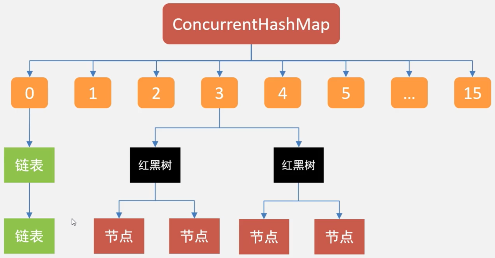


### 1.3 ConcurrentHashMap 1.7

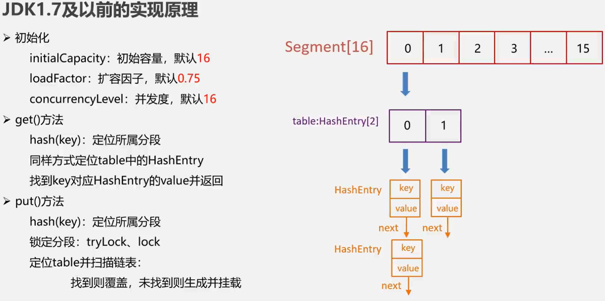


### 1.4 ConcurrentHashMap 1.8 

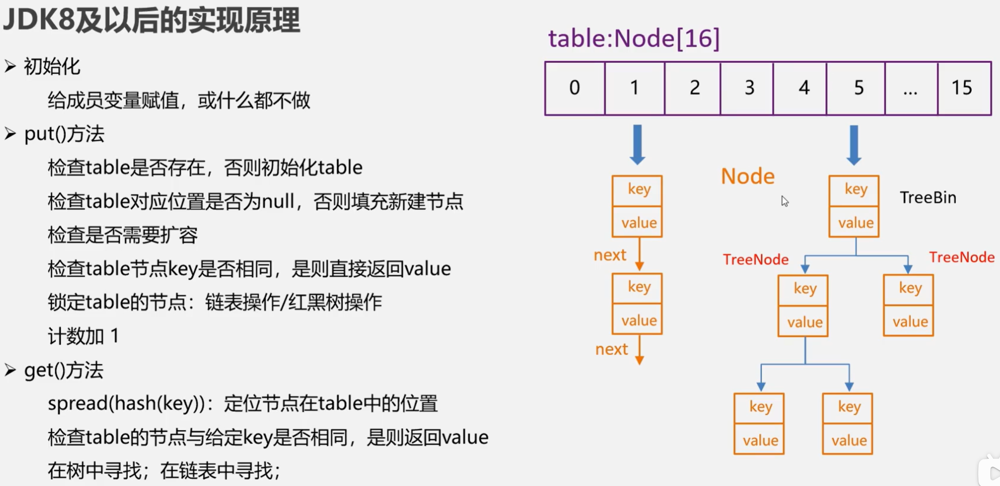


## 2. 其他并发容器

### 2.1 SkipList 和 ConcurrentLinkedQueue

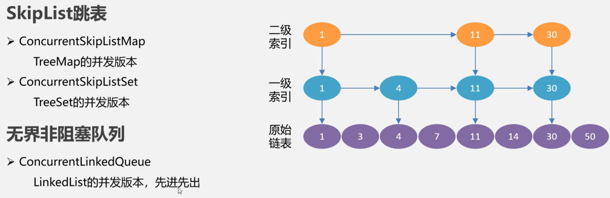


### 2.2 写时复制容器

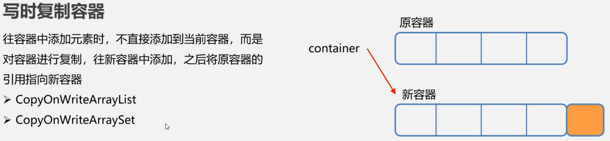


## 3. 阻塞队列

### 3.1 阻塞队列的概念及由来

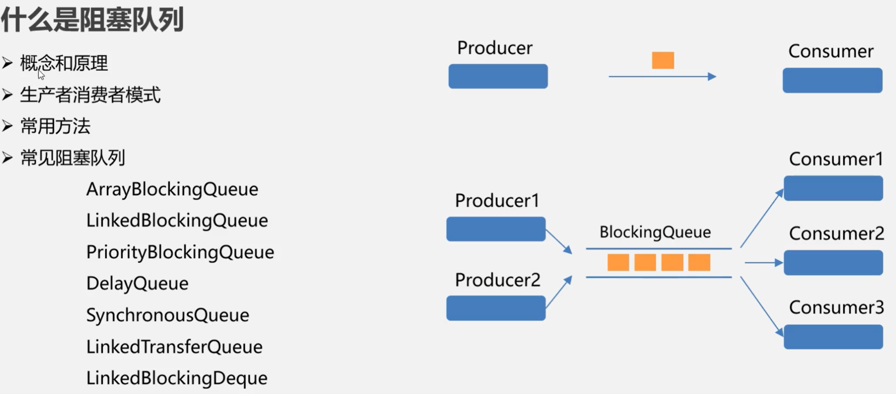


### 3.2 阻塞队列的常用方法辨析

1. 抛出异常的方法：add,	remove,	element(父接口Queue)
2. 有返回值的方法：offer,   poll,   peek(父接口Queue))
3. 一直阻塞的方法：put,   take
4. 超时退出的方法： poll(long timeout, TimeUnit unit),   offer(E e, long timeout, TimeUnit unit)


### 3.3 常见阻塞队列及各自特点辨析

1. **ArrayBlockingQueue**：一个由数组结构组成的有界阻塞队列

   ​		按照先进先出的原则，使用时设置初始大小

2. **LinkedBlockingQueue**：一个由链表构成的有界阻塞队列

​				按照先进先出的原则，使用时，可以不设置初始大小，默认Interger.MAX_VALUE

​				ArrayBlockingQueue 与 LinkedBlockingQueue 的不同：

​				锁：ArrayBlockingQueue 生产者和消费者之间只有一个锁；LinkedBlockingQueue用了两个锁

3. **PriorityBlockingQueue**：一个支持优先级排序的有界阻塞队列

​				默认，按自然顺序；实现Comparable接口或者使用Comparator创建比较器

4. **DelayQueue**：一个使用优先级队列实现的无界阻塞队列，支持延时获取的阻塞队列

   ​		 底层实现依赖于PriorityBlockingQueue

​				使用场景：缓存系统、订单到期、限时订单

5.  **SynchronousQueue**：一个不存储元素的队列

   ​		 每有一个put操作，就会对应一个take操作；如果生产者生产数据之后，消费者没有消费，则生产者阻塞

6. **LinkedTransferQueue：** 一个由链表构成的无界阻塞队列

   ​          有两个方法用于插入数据：transfer，tryTransfer

   ​          transfer：生产者往队列插入数据时，查看有没有消费者等待获取数据，如有，则直接给消费者。否则，存放队列；

   ​          tryTransfer：生产者的数据尝试给消费者，如果没有消费者，直接返回false

   ​          最大区别：在于何时返回；transfer 等待消费者接受数据后返回， tryTransfer 会立即返回

7. **LinkedBlockingDque**：一个有链表构成的双向阻塞队列；fork-join的工作秘取

   ​           头部和尾部，都可以插入和移除数据

   ​           多了一个操作入口，所以在并发时，减少一半竞争

   ​           凡是方法名带了First的，都是对头部进行操作；凡是方法名带了Last，都是对尾部进行操作；

   ​           add = addLast，take = takeFirst，remove = removeFirst

   ​           可以设置容量，防止高并发时容器过渡膨胀

**总结：** 

​	作为一个合格的开发人员，尽量使用有界的阻塞队列


### 3.4 使用DelayQueue实现延时订单

#### 延时队列元素工具类定义

```java
import java.util.concurrent.Delayed;
import java.util.concurrent.TimeUnit;

/**
 * 存放到延时队列中元素的类型
 */
public class DelayItem<T> implements Delayed {

    private final long activeTime;    // 到期时间，纳秒
    private final T item; // 包装实际的实体类型

    public DelayItem(long activeTime, T item) {
        // 到期时间 = 系统时间 + activeTime
        this.activeTime = TimeUnit.NANOSECONDS.convert(activeTime,TimeUnit.MILLISECONDS)
                + System.nanoTime();
        this.item = item;
    }

    public T getItem() {
        return item;
    }

    /**
     * 返回剩余时长
     * @param unit the time unit
     * @return
     */
    @Override
    public long getDelay(TimeUnit unit) {
        // 剩余时长 = 超时时长 - 当前系统时间,转纳秒
        return unit.convert(this.activeTime - System.nanoTime(),TimeUnit.NANOSECONDS);
    }

    /**
     * 按剩余时长进行排序
     * @param o the object to be compared.
     * @return
     */
    @Override
    public int compareTo(Delayed o) {
        long time = getDelay(TimeUnit.NANOSECONDS) - o.getDelay(TimeUnit.NANOSECONDS);
        return time == 0 ? 0 : (time > 0 ? 1 : -1);
    }
}
```


#### 生产者和消费者线程定义及测试

```java
/**
 * 订单实体类
 */
public class Order {
    private final String orderNo;
    private final int orderMoney;

    public Order(String orderNo, int orderMoney) {
        this.orderNo = orderNo;
        this.orderMoney = orderMoney;
    }

    public String getOrderNo() {
        return orderNo;
    }

    public int getOrderMoney() {
        return orderMoney;
    }
}
```


```java
import java.util.concurrent.DelayQueue;

/**
 * 定义生产者线程，将订单放入队列
 */
public class Producer implements Runnable{

    private DelayQueue<DelayItem<Order>> queue;

    public Producer(DelayQueue<DelayItem<Order>> queue) {
        this.queue = queue;
    }

    @Override
    public void run() {
        Order order = new Order("o_12345",200);
        DelayItem<Order> item1 = new DelayItem<>(5000,order);
        queue.add(item1);
        System.out.println("订单将在5秒后到期" + order.getOrderNo());

        Order order2 = new Order("o_12346",200);
        DelayItem<Order> item2 = new DelayItem<>(10000,order2);
        queue.add(item2);
        System.out.println("订单将在10秒后到期" + order2.getOrderNo());
    }
}
```


```java
import java.util.concurrent.DelayQueue;

/**
 *  消费者线程
 *      取出到期的订单
 */
public class Consumer implements Runnable{

    private DelayQueue<DelayItem<Order>> queue;

    public Consumer(DelayQueue<DelayItem<Order>> queue) {
        this.queue = queue;
    }

    @Override
    public void run() {
        while (true) {
            try {
                DelayItem<Order> item = queue.take();
                Order order = item.getItem();
                System.out.println("已经从队列中获取到订单："+order.getOrderNo());
            } catch (InterruptedException e) {
                throw new RuntimeException(e);
            }
        }
    }
}
```


```java
import java.util.concurrent.DelayQueue;

public class TestDelayQueue {
    public static void main(String[] args) throws InterruptedException {
        DelayQueue<DelayItem<Order>> queue = new DelayQueue<>();

        new Thread(new Producer(queue)).start();
        new Thread(new Consumer(queue)).start();

        for (int i = 0; i < 15; i++) {
            Thread.sleep(1000);
            System.out.println("main:" + i * 1000);
        }
    }
}
```


**运行结果**

```java
订单将在5秒后到期o_12345
订单将在10秒后到期o_12346
main:0
main:1000
main:2000
main:3000
已经从队列中获取到订单：o_12345
main:4000
main:5000
main:6000
main:7000
main:8000
已经从队列中获取到订单：o_12346
main:9000
main:10000
main:11000
main:12000
main:13000
main:14000
```


### 3.5 阻塞队列的底层实现

显示锁+等待通知机制

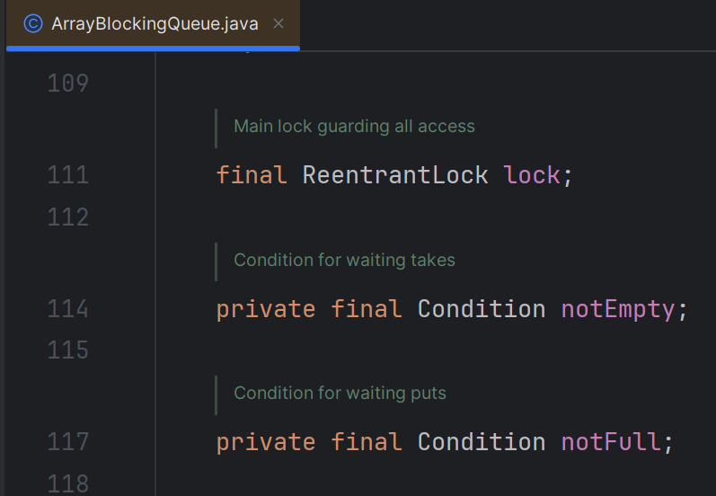


# 六、线程池


## 1. 线程池概述

### 1.1 线程池的概念和好处

**概念**

thread pool，线程池是一种多线程处理形式，处理过程中将任务添加到队列，然后再创建线程后自动启动这些任务。

**好处**

- 降低线程创建和销毁过程的资源销毁
- 提高响应速度
- 提高线程的可管理性


### 1.2 自定义线程池

#### 思路分析

- 启动线程池的时候，需要启动若干线程，并保存在线程池中
  - new WorkThread[ NUMBER ]

- 需要一个容器接收并存储多个任务，线程池中的线程从此容器中获取任务并执行
  - ArrayBlockingQueue<Runnable>

- 提供一个方法，供线程池的使用者执行任务
  - execute(Runnable task)

- 提供一个方法，用于销毁线程池
  - destory()


#### 实现代码

```java
import lombok.extern.slf4j.Slf4j;

import java.util.concurrent.ArrayBlockingQueue;
import java.util.concurrent.BlockingQueue;

@Slf4j
public class MyThreadPool {

    // 线程池中核心任务数：线程池中默认启动的线程个数
    private static int corePoolSize = 5;

    // 线程池中最大任务数：队列中支持的最大并发的线程个数
    private static int maxPoolSize = 100;


    // 1. 启动线程池的时候，需要启动若干线程，并保存在线程池中
    private WorkThread[] workThreads;

    // 用户在构造这个线程池时，希望启动的线程数，以及线程池运行过程中执行的工作线程数
    private int work_num;

    // 2. 需要一个容器接收并存储多个任务，线程池中的线程从此容器中获取任务并执行
    private BlockingQueue<Runnable> taskQueue;

    public MyThreadPool() {
        this(corePoolSize,maxPoolSize);
    }

    public MyThreadPool(int corePoolSize, int maxPoolSize ) {
        if (corePoolSize <= 0 || maxPoolSize <= 0 || maxPoolSize < corePoolSize){
            throw new IllegalArgumentException("非法参数");
        }

        this.corePoolSize = corePoolSize;
        this.maxPoolSize = maxPoolSize;
        this.work_num = corePoolSize;

        // 创建线程池的时候，初始化任务队列
        taskQueue = new ArrayBlockingQueue<>(maxPoolSize);

        // 创建线程池的时候，就启动线程，避免掉重复创建和销毁线程的时间
        workThreads = new WorkThread[corePoolSize];
        for (int i = 0; i < corePoolSize; i++) {
            workThreads[i] = new WorkThread();
            workThreads[i].start();
        }

    }

    /**
     * 3. 提供一个方法，供线程池的使用者执行任务
     * 执行任务就是把任务，其实就是把任务加入任务队列，什么时候执行由线程池管理器决定
     * @param task
     */
    public void execute(Runnable task){
        try {
            taskQueue.put(task);
        } catch (InterruptedException e) {
            throw new RuntimeException(e);
        }
    }

    /**
     *  4. 提供一个方法，用于销毁线程池
     *  销毁线程池，该方法要保证所有任务都执行完成的情况，才能销毁所有线程
     *  清空工作线程数组中的元素
     *  清空任务队列
     */
    public void destroy(){
        log.debug("正在准备销毁线程池");

        // 等待任务队列为空
        while (!taskQueue.isEmpty()) {
            try {
                Thread.sleep(100); // 等待一段时间再检查
            } catch (InterruptedException e) {
                Thread.currentThread().interrupt();
            }
        }

        // 清空工作线程数组中的元素
        for (int i = 0; i < work_num; i++) {
            workThreads[i].stopWork();
            workThreads[i] = null;  // help GC
        }

        taskQueue.clear();
    }


    /**
     *  线程池中的工作，用于从任务队列中获取任务并执行
     */
    private class WorkThread extends Thread{
        @Override
        public void run() {
            Runnable r = null;

            try {
                while (!isInterrupted()){
                    r = taskQueue.take();
                    if (r != null){ // 防止take抛出中断异常
                        log.debug("{}准备执行:{}",getId(),r);
                        r.run();
                    }
                    r = null; // help GC
                }
            }catch (InterruptedException e){
                
            }

        }

        public void stopWork(){
            interrupt();
        }
    }
}
```


```java
package com.peng.pool;

import lombok.extern.slf4j.Slf4j;

import java.util.Random;

@Slf4j
public class TestMyThreadPool {
    public static void main(String[] args) throws InterruptedException {
        MyThreadPool mtp = new MyThreadPool(3,10);
        mtp.execute(new MyTask("test01"));
        mtp.execute(new MyTask("test02"));
        mtp.execute(new MyTask("test03"));
        mtp.execute(new MyTask("test04"));
        mtp.execute(new MyTask("test05"));
        mtp.execute(new MyTask("test06"));
        mtp.execute(new MyTask("test07"));
        Thread.sleep(10000);
        mtp.destroy();
        log.debug("所有任务完成，主线程结束...");
    }

    static class MyTask implements Runnable{
        private String name;

        public MyTask(String name) {
            this.name = name;
        }

        public String getName() {
            return name;
        }

        @Override
        public String toString() {
            return "MyTask{" +
                    "name='" + name + '\'' +
                    "id='" + Thread.currentThread().getId() + '\'' +
                    '}';
        }

        @Override
        public void run() {
            Random r = new Random();

            try {
                Thread.sleep(r.nextInt(1000) + 2000);
            } catch (InterruptedException e) {
                e.printStackTrace();
                log.debug("{}sleep被打断",Thread.currentThread().getId());
            }

            log.debug("任务{}执行完成",name);
        }
    }
}
```


**运行结果**

```java
2025-02-18 11:17:42.805 [Thread-1] DEBUG com.peng.pool.MyThreadPool - 21准备执行:MyTask{name='test02'id='21'}
2025-02-18 11:17:42.805 [Thread-2] DEBUG com.peng.pool.MyThreadPool - 22准备执行:MyTask{name='test03'id='22'}
2025-02-18 11:17:42.805 [Thread-0] DEBUG com.peng.pool.MyThreadPool - 20准备执行:MyTask{name='test01'id='20'}
2025-02-18 11:17:45.147 [Thread-0] DEBUG com.peng.pool.TestMyThreadPool - 任务test01执行完成
2025-02-18 11:17:45.148 [Thread-0] DEBUG com.peng.pool.MyThreadPool - 20准备执行:MyTask{name='test04'id='20'}
2025-02-18 11:17:45.640 [Thread-2] DEBUG com.peng.pool.TestMyThreadPool - 任务test03执行完成
2025-02-18 11:17:45.640 [Thread-2] DEBUG com.peng.pool.MyThreadPool - 22准备执行:MyTask{name='test05'id='22'}
2025-02-18 11:17:45.781 [Thread-1] DEBUG com.peng.pool.TestMyThreadPool - 任务test02执行完成
2025-02-18 11:17:45.781 [Thread-1] DEBUG com.peng.pool.MyThreadPool - 21准备执行:MyTask{name='test06'id='21'}
2025-02-18 11:17:47.541 [Thread-0] DEBUG com.peng.pool.TestMyThreadPool - 任务test04执行完成
2025-02-18 11:17:47.541 [Thread-0] DEBUG com.peng.pool.MyThreadPool - 20准备执行:MyTask{name='test07'id='20'}
2025-02-18 11:17:47.831 [Thread-2] DEBUG com.peng.pool.TestMyThreadPool - 任务test05执行完成
2025-02-18 11:17:48.571 [Thread-1] DEBUG com.peng.pool.TestMyThreadPool - 任务test06执行完成
2025-02-18 11:17:49.542 [Thread-0] DEBUG com.peng.pool.TestMyThreadPool - 任务test07执行完成
2025-02-18 11:17:52.814 [main] DEBUG com.peng.pool.MyThreadPool - 正在准备销毁线程池
2025-02-18 11:17:52.815 [main] DEBUG com.peng.pool.TestMyThreadPool - 所有任务完成，主线程结束...

Process finished with exit code 0
```


#### 线程池的工作流程

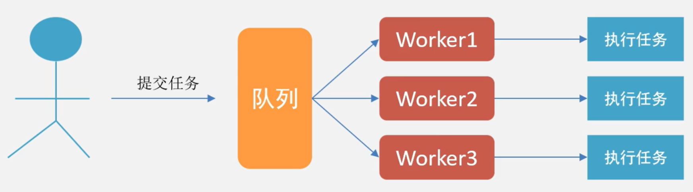


## 2. 线程池工作机制

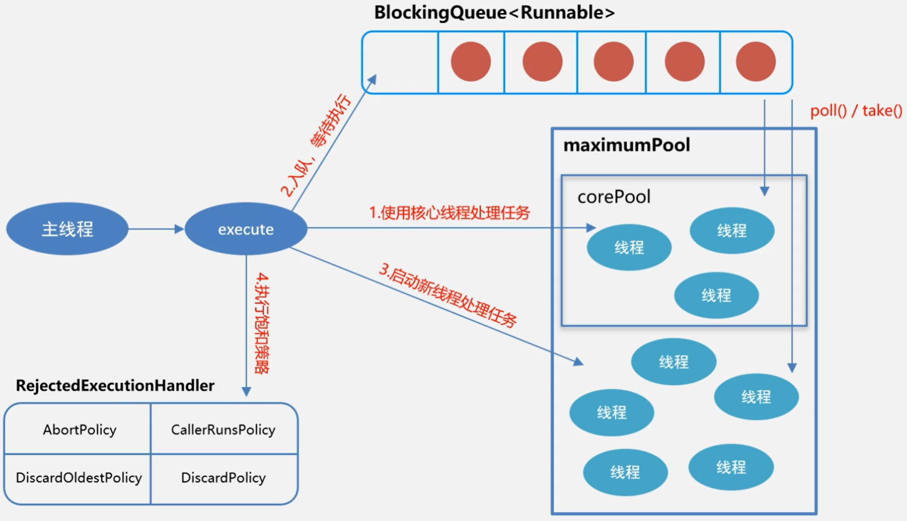


### 2.1 ThreadPoolExecutor源码分析

#### 初始化线程池参数

-  int **corePoolSize**：核心线程数
  - 当执行任务个数 < corePoolSize，就会去启动对应的线程个数去执行任务；
  - 如果来了一个新任务，发现已经启动的线程数达到了 corePoolSize，则会把新任务加入到**BlockingQueue**中。直到队列满了之后才有可能重新启动超过 corePoolSize 数量的线程。
- int **maximumPoolSize**：线程池中允许的最大线程数
  - 如果 **BlockingQueue** 满了，执行的任务数 <  **maximumPoolSize** ，才会会再次创建新的线程。
- long **keepAliveTime** ： 线程空闲下来之后，存活的时间
  - 只在活动线程数量 > corePoolSize 的时候才有用
- TimeUnit **unit** ： 空闲线程存活的时间单位
- BlockingQueue<Runnable> **workQueue** ： 要保存任务的阻塞队列
- ThreadFactory **threadFactory** ： 创建线程的工厂
- RejectedExecutionHandler **handler** ： 饱和策略/拒绝策略/丢弃策略
  - **AbortPolicy**：直接抛出异常，默认情况
  - **CallerRunsPolicy**：让调用者所在的线程去执行任务
  - **DiscardOldestPolicy**：丢弃阻塞队列中最靠前的任务
  - **DiscardPolicy** ：直接丢弃当前任务
  - 其他：实现RejectedExecutionHandler 接口，自定义饱和策略


#### 提交任务

**execute**

```java
public void execute(Runnable command) {
    if (command == null)
        throw new NullPointerException();
    
    int c = ctl.get();
    if (workerCountOf(c) < corePoolSize) {	// 如果当前工作的线程数 < corePoolSize
        if (addWorker(command, true))	// 创建新线程，添加到Worker
            return;
        c = ctl.get();
    }
    
    /**
    	 如果当前工作的线程数 >= corePoolSize
    	 会优先把线程推入到工作队列中 
    	 如果推入成功，会等待线程池从队列中获取任务执行
    	 如果没有推入成功，意味着当前的队列已满，也就是maximumPoolSize
    	 之后会再尝试 addWorker ，添加失败会执行拒绝策略
    **/
    if (isRunning(c) && workQueue.offer(command)) {
        int recheck = ctl.get();
        if (! isRunning(recheck) && remove(command))
            reject(command);
        else if (workerCountOf(recheck) == 0)
            addWorker(null, false);
    }
    else if (!addWorker(command, false))
        reject(command);
}
```


**submit**

submit 是 ThreadPoolExecutor父类 AbstractExecutorService 中定义的方法

其底层调用了execute

```java
 	public Future<?> submit(Runnable task) {
        if (task == null) throw new NullPointerException();
        RunnableFuture<Void> ftask = newTaskFor(task, null);
        execute(ftask);
        return ftask;
    }

    /**
     * @throws RejectedExecutionException {@inheritDoc}
     * @throws NullPointerException       {@inheritDoc}
     */
    public <T> Future<T> submit(Runnable task, T result) {
        if (task == null) throw new NullPointerException();
        RunnableFuture<T> ftask = newTaskFor(task, result);
        execute(ftask);
        return ftask;
    }

    /**
     * @throws RejectedExecutionException {@inheritDoc}
     * @throws NullPointerException       {@inheritDoc}
     */
    public <T> Future<T> submit(Callable<T> task) {
        if (task == null) throw new NullPointerException();
        RunnableFuture<T> ftask = newTaskFor(task);
        execute(ftask);
        return ftask;
    }
```


#### 关闭线程池

**shutdown**

只会中断没有执行任务的线程

```java
public void shutdown() {
    final ReentrantLock mainLock = this.mainLock;
    mainLock.lock();
    try {
        checkShutdownAccess();
        advanceRunState(SHUTDOWN);	// 将状态设置为SHUTDOWN
        interruptIdleWorkers();
        onShutdown(); // hook for ScheduledThreadPoolExecutor
    } finally {
        mainLock.unlock();
    }
    tryTerminate();
}
```


**shutdownNow** 

```java
public List<Runnable> shutdownNow() {
    List<Runnable> tasks;
    final ReentrantLock mainLock = this.mainLock;
    mainLock.lock();
    try {
        checkShutdownAccess();	// 检查权限
        advanceRunState(STOP);	// 将状态设置为STOP
        interruptWorkers();
        tasks = drainQueue();	// 中断正在执行的线程
    } finally {
        mainLock.unlock();
    }
    tryTerminate();
    return tasks;
}
```


### 2.2 使用ThreadPoolExecutor创建线程池并使用

```java
import lombok.extern.slf4j.Slf4j;

import java.util.Random;
import java.util.concurrent.ArrayBlockingQueue;
import java.util.concurrent.ThreadPoolExecutor;
import java.util.concurrent.TimeUnit;

@Slf4j
public class ThreadPoolExecutorNote {
    public static void main(String[] args) {
        // 1. 创建线程池
        ThreadPoolExecutor pool = new ThreadPoolExecutor(2,4,
                3, TimeUnit.SECONDS,new ArrayBlockingQueue<>(10),
                new ThreadPoolExecutor.DiscardOldestPolicy());

        // 2. 提交任务到线程池
        for (int i = 0; i < 6; i++) {
            MyTask task = new MyTask("worker_" + i);
            pool.execute(task);
        }

        // 3. 关闭线程池
        pool.shutdown();
    }

    static class MyTask implements Runnable{
        private String name;

        public MyTask(String name) {
            this.name = name;
        }

        public String getName() {
            return name;
        }

        @Override
        public String toString() {
            return "MyTask{" +
                    "name='" + name + '\'' +
                    "id='" + Thread.currentThread().getId() + '\'' +
                    '}';
        }

        @Override
        public void run() {
            Random r = new Random();

            try {
                log.debug("{}任务即将开始",name);
                Thread.sleep(r.nextInt(1000) + 2000);
            } catch (InterruptedException e) {
                e.printStackTrace();
                log.debug("{}sleep被打断",Thread.currentThread().getId());
            }

            log.debug("任务{}执行完成",name);
        }
    }
}
```


**运行结果：**

```java
2025-02-18 14:45:23.402 [pool-1-thread-2] DEBUG com.peng.pool.ThreadPoolExecutorNote - worker_1任务即将开始
2025-02-18 14:45:23.402 [pool-1-thread-1] DEBUG com.peng.pool.ThreadPoolExecutorNote - worker_0任务即将开始
2025-02-18 14:45:25.586 [pool-1-thread-1] DEBUG com.peng.pool.ThreadPoolExecutorNote - 任务worker_0执行完成
2025-02-18 14:45:25.586 [pool-1-thread-1] DEBUG com.peng.pool.ThreadPoolExecutorNote - worker_2任务即将开始
2025-02-18 14:45:26.040 [pool-1-thread-2] DEBUG com.peng.pool.ThreadPoolExecutorNote - 任务worker_1执行完成
2025-02-18 14:45:26.041 [pool-1-thread-2] DEBUG com.peng.pool.ThreadPoolExecutorNote - worker_3任务即将开始
2025-02-18 14:45:27.909 [pool-1-thread-1] DEBUG com.peng.pool.ThreadPoolExecutorNote - 任务worker_2执行完成
2025-02-18 14:45:27.909 [pool-1-thread-1] DEBUG com.peng.pool.ThreadPoolExecutorNote - worker_4任务即将开始
2025-02-18 14:45:28.950 [pool-1-thread-2] DEBUG com.peng.pool.ThreadPoolExecutorNote - 任务worker_3执行完成
2025-02-18 14:45:28.950 [pool-1-thread-2] DEBUG com.peng.pool.ThreadPoolExecutorNote - worker_5任务即将开始
2025-02-18 14:45:30.580 [pool-1-thread-1] DEBUG com.peng.pool.ThreadPoolExecutorNote - 任务worker_4执行完成
2025-02-18 14:45:31.538 [pool-1-thread-2] DEBUG com.peng.pool.ThreadPoolExecutorNote - 任务worker_5执行完成
```


### 2.3 提交带返回值的任务到ThreadPoolExecutor线程池

```java
import lombok.extern.slf4j.Slf4j;

import java.util.ArrayList;
import java.util.List;
import java.util.Random;
import java.util.concurrent.*;

@Slf4j
public class ThreadPoolExecutorNote {
    public static void main(String[] args) throws ExecutionException, InterruptedException {
        // 1. 创建线程池
        ThreadPoolExecutor pool = new ThreadPoolExecutor(2,4,
                3, TimeUnit.SECONDS,new ArrayBlockingQueue<>(10),
                new ThreadPoolExecutor.DiscardOldestPolicy());

        // 2. 提交任务到线程池
        List<Future<String>> list = new ArrayList<>();
        for (int i = 0; i < 6; i++) {
            CallWorker callWorker = new CallWorker("callWork_" + i);
            Future<String> result = pool.submit(callWorker);
            list.add(result);
        }

        while (pool.getCompletedTaskCount() != 6){  // 如果任务没有全部完成
            Thread.sleep(30);
        }

        for (Future<String> result : list) {
            log.debug(result.get());
        }


        // 3. 关闭线程池
        pool.shutdown();
    }

    static class CallWorker implements Callable<String> {
        private String taskName;

        public CallWorker(String taskName) {
            this.taskName = taskName;
        }

        public String getTaskName() {
            return taskName;
        }

        @Override
        public String call() throws Exception {
            Random r = new Random();
            log.debug("{} process the task : {}",Thread.currentThread().getName(),taskName);
            return Thread.currentThread().getName() + ":" + r.nextInt(1000) * 2;
        }
    }
}
```


**运行结果**

```java
2025-02-18 15:07:57.815 [pool-1-thread-1] DEBUG com.peng.pool.ThreadPoolExecutorNote - pool-1-thread-1 process the task : callWork_0
2025-02-18 15:07:57.815 [pool-1-thread-2] DEBUG com.peng.pool.ThreadPoolExecutorNote - pool-1-thread-2 process the task : callWork_1
2025-02-18 15:07:57.818 [pool-1-thread-1] DEBUG com.peng.pool.ThreadPoolExecutorNote - pool-1-thread-1 process the task : callWork_3
2025-02-18 15:07:57.818 [pool-1-thread-2] DEBUG com.peng.pool.ThreadPoolExecutorNote - pool-1-thread-2 process the task : callWork_2
2025-02-18 15:07:57.818 [pool-1-thread-1] DEBUG com.peng.pool.ThreadPoolExecutorNote - pool-1-thread-1 process the task : callWork_4
2025-02-18 15:07:57.818 [pool-1-thread-2] DEBUG com.peng.pool.ThreadPoolExecutorNote - pool-1-thread-2 process the task : callWork_5
2025-02-18 15:07:57.848 [main] DEBUG com.peng.pool.ThreadPoolExecutorNote - pool-1-thread-1:1440
2025-02-18 15:07:57.848 [main] DEBUG com.peng.pool.ThreadPoolExecutorNote - pool-1-thread-2:614
2025-02-18 15:07:57.848 [main] DEBUG com.peng.pool.ThreadPoolExecutorNote - pool-1-thread-2:1736
2025-02-18 15:07:57.848 [main] DEBUG com.peng.pool.ThreadPoolExecutorNote - pool-1-thread-1:1620
2025-02-18 15:07:57.848 [main] DEBUG com.peng.pool.ThreadPoolExecutorNote - pool-1-thread-1:1020
2025-02-18 15:07:57.848 [main] DEBUG com.peng.pool.ThreadPoolExecutorNote - pool-1-thread-2:1494
```


### 2.4 线程池的关闭

**shutdown** ：只会关掉空闲的线程

**shutdownNow**：除了关闭空闲线程，也会去关闭正在执行任务的线程


### 2.5 合理配置线程池

- 计算密集型
  - 加密、大数分解、正则
  - 线程数小，推荐：CPU核心数 + 1

- IO密集型
  - 读取文件、数据库连接、网络通讯
  - 线程数大，推荐：CPU核心数 * 2

- 混合型
  - 尽量拆分
  - IO密集型 >> 计算密集型：拆分意义不大
  - IO密集型 ≈ 计算密集型，建议使用有界队列


## 3. 常见系统线程池

### 3.1 系统预定义线程池简介

- FixedThreadPool
  - 固定线程数量，适用负载较重的服务器，使用了无界队列

- SingleThreadExecutor
  - 创建单个线程，需要保证顺序执行任务，不会有多个线程活动，使用了无界队列

- CachedThreadPool
  - 根据需要创建新线程，执行很多短期异步任务的程序

- WorkStealingPool（JDK 1.7 以后）
  - 基于ForkJoinPool实现

- ScheduledThreadPoolExector
  - 需要定期、周期地执行任务（不建议使用Timer）
  - newSingleThreadScheduledExecutor、newScheduledThreadPool


### 3.2 定时任务ScheduledThreadPoolExecutor用法

####  **Executors类** 

以下这些线程池都调用了**new ScheduledThreadPoolExecutor( )**

```java
public static ScheduledExecutorService newSingleThreadScheduledExecutor() {
    return new DelegatedScheduledExecutorService
        (new ScheduledThreadPoolExecutor(1));
}

public static ScheduledExecutorService newSingleThreadScheduledExecutor(ThreadFactory threadFactory) {
    return new DelegatedScheduledExecutorService
        (new ScheduledThreadPoolExecutor(1, threadFactory));
}

public static ScheduledExecutorService newScheduledThreadPool(int corePoolSize) {
    return new ScheduledThreadPoolExecutor(corePoolSize);
}

public static ScheduledExecutorService newScheduledThreadPool(
        int corePoolSize, ThreadFactory threadFactory) {
    return new ScheduledThreadPoolExecutor(corePoolSize, threadFactory);
}
```


#### **ScheduledThreadPoolExecutor类**

该类中有 schedule 方法，重载，支持 Runnable 或者 Callable。该方法只执行一次

```java
public ScheduledFuture<?> schedule(Runnable command,
                                   long delay,
                                   TimeUnit unit) {
    if (command == null || unit == null)
        throw new NullPointerException();
    RunnableScheduledFuture<?> t = decorateTask(command,
        new ScheduledFutureTask<Void>(command, null,
                                      triggerTime(delay, unit)));
    delayedExecute(t);
    return t;
}


public <V> ScheduledFuture<V> schedule(Callable<V> callable,
                                       long delay,
                                       TimeUnit unit) {
    if (callable == null || unit == null)
        throw new NullPointerException();
    RunnableScheduledFuture<V> t = decorateTask(callable,
        new ScheduledFutureTask<V>(callable,
                                   triggerTime(delay, unit)));
    delayedExecute(t);
    return t;
}
```


提交固定时间间隔的任务

每个任务开始的时间间隔相同

```java
public ScheduledFuture<?> scheduleAtFixedRate(Runnable command,
                                              long initialDelay,
                                              long period,
                                              TimeUnit unit) {
    if (command == null || unit == null)
        throw new NullPointerException();
    if (period <= 0)
        throw new IllegalArgumentException();
    ScheduledFutureTask<Void> sft =
        new ScheduledFutureTask<Void>(command,
                                      null,
                                      triggerTime(initialDelay, unit),
                                      unit.toNanos(period));
    RunnableScheduledFuture<Void> t = decorateTask(command, sft);
    sft.outerTask = t;
    delayedExecute(t);
    return t;
}
```


上个任务结束到下个任务开始的中间的延时的时间相同

```java
public ScheduledFuture<?> scheduleWithFixedDelay(Runnable command,
                                                 long initialDelay,
                                                 long delay,
                                                 TimeUnit unit) {
    if (command == null || unit == null)
        throw new NullPointerException();
    if (delay <= 0)
        throw new IllegalArgumentException();
    ScheduledFutureTask<Void> sft =
        new ScheduledFutureTask<Void>(command,
                                      null,
                                      triggerTime(initialDelay, unit),
                                      unit.toNanos(-delay));
    RunnableScheduledFuture<Void> t = decorateTask(command, sft);
    sft.outerTask = t;
    delayedExecute(t);
    return t;
}
```


#### 测试代码

```java
import java.text.SimpleDateFormat;
import java.util.Date;
import java.util.concurrent.ScheduledThreadPoolExecutor;
import java.util.concurrent.TimeUnit;
import java.util.concurrent.atomic.AtomicInteger;

public class ScheduleTaskTimer implements Runnable{

    public final static int sec_8 = 8;
    public final static int sec_2 = 2;
    public final static int sec_5 = 5;
    public static SimpleDateFormat format = new SimpleDateFormat("HH:mm:ss");
    public static AtomicInteger count = new AtomicInteger(0);

    @Override
    public void run() {
        try {
            if (count.get() == 0){
                System.out.println("sec_8...begin:" + format.format(new Date()));
                Thread.sleep(sec_8 * 1000);
                System.err.println("sec_8...end:" + format.format(new Date()));
                count.incrementAndGet();
            }else if (count.get() == 1){
                System.out.println("sec_2...begin:" + format.format(new Date()));
                Thread.sleep(sec_2 * 1000);
                System.err.println("sec_2...end:" + format.format(new Date()));
                count.incrementAndGet();
            }else {
                System.out.println("sec_5...begin:" + format.format(new Date()));
                Thread.sleep(sec_5 * 1000);
                System.err.println("sec_5...end:" + format.format(new Date()));
                count.incrementAndGet();
            }

        }catch (InterruptedException e){
            e.printStackTrace();
        }
    }

    public static void main(String[] args) {
        ScheduledThreadPoolExecutor schedule = new ScheduledThreadPoolExecutor(1);
        // 固定时间间隔的任务,每个任务开始的时间间隔相同，不会受任务的执行时长所影响
        //schedule.scheduleAtFixedRate(new ScheduleTaskTimer(),0,6, TimeUnit.SECONDS);

        
        schedule.scheduleWithFixedDelay(new ScheduleTaskTimer(),0,6, TimeUnit.SECONDS);
    }
}
```


## 4. Executor框架

### 4.1 类图

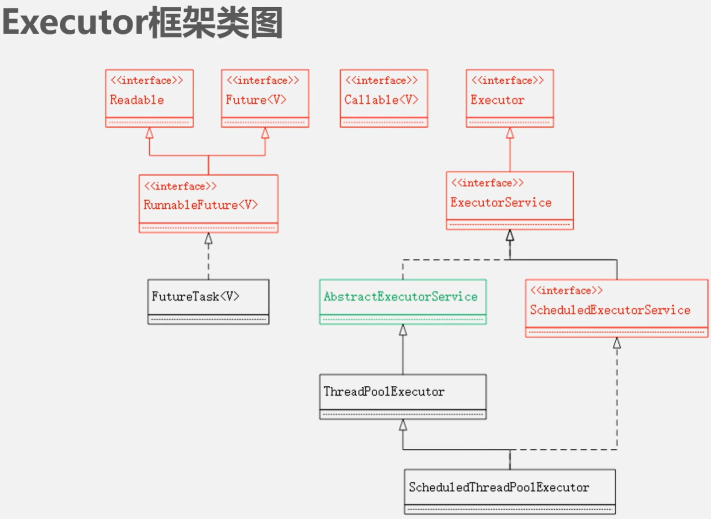


### 4.2  Executor框架使用流程

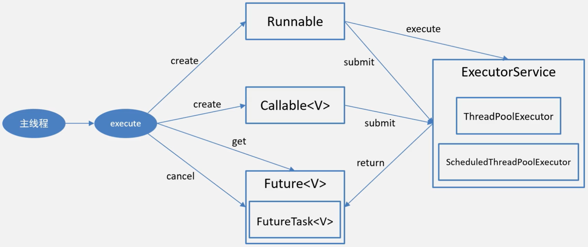


# 七、线程安全

## 1. 类的线程安全定义

在多线程环境下，不管怎么使用和调度这个类，这个类总是表现出正确的行为，这个类就是线程安全的。

- 操作的原子性
- 内存的可见性


**怎样做到类的线程安全？**

- 产生原因
  - 类的状态被多个线程共享，则有可能导致不安全的情况

- 关联因素
  - 无状态
    - 没有任何属性（成员变量）的类
  - 加锁和CAS操作
  - 让类不可变
    - 让类的状态不可变，即不能修改类的状态
    - 类中的成员变量，都应该是私有的。同时，只要有可能，所有成员变量都应该加上final关键字 
    - 根本就不提供任何可供修改成员变量的地方，同时成员变量也不能作为方法的返回值
    - 注意事项：如果成员变量又是一个对象时，这个对象所对应的类也要是不可变的类，才能保证整个类是不可变的
  - 栈封闭
    - 所有方法内部声明的变量，都处于栈封闭状态。方法内部的变量，都是线程安全的，可以放心使用
    - 根本原因：线程在每次调用方法时，都会把方法加载到当前线程的本地内存（栈区）。这块内存，相对于别的线程而言，是不可见的，所以不会有线程安全问题
  - volatile
  - 安全的发布
  - ThreadLocal


## 2. 死锁的产生与避免

### 2.1 死锁的产生

**死锁** 是指由两个或以上的线程由于竞争资源或彼此通信而造成的一种阻塞现象。

- 资源数量多余1个
- 资源数小于竞争的线程数
- 获取锁的顺序不一致


### 2.2 常见的死锁发生的场景

- 执行了等待命令而没有得到唤醒命令
  - 执行了wait() 却始终没有受到 notify() / notifyAll() 命令

- 两个或多个线程相互持有对方的锁
- 动态顺序死锁
  - 无法保证加锁的顺序


# 八、JMM

## 1. 现代计算机物理内存模型

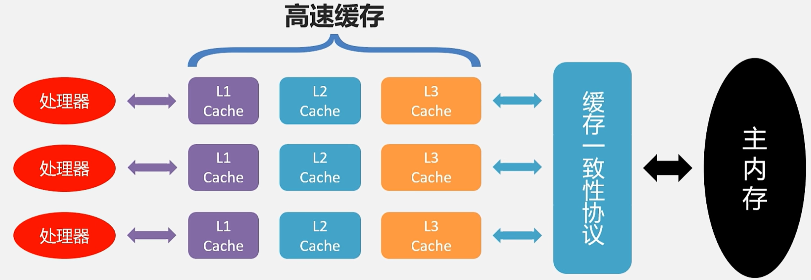


### 1.1 物理内存模型带来的问题


