# 一、Spring快速入门


## 1. BeanFactory版本的快速入门

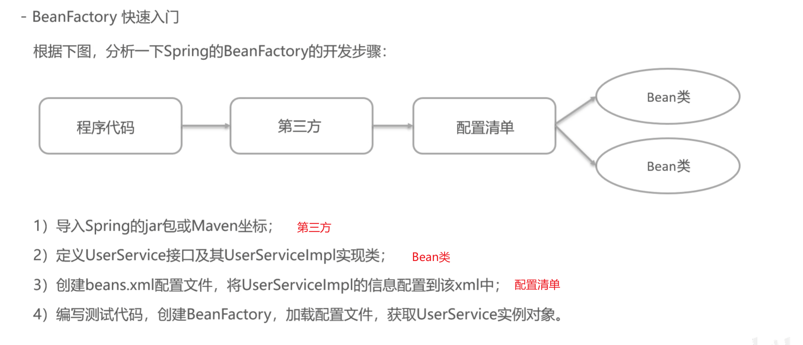

### 1.1 BeanFactory完成IoC思想的实现


#### 1）导入Spring的jar包或Maven坐标

```xml
<dependency>
    <groupId>org.springframework</groupId>
    <artifactId>spring-context</artifactId>
    <version>5.3.7</version>
</dependency>
```


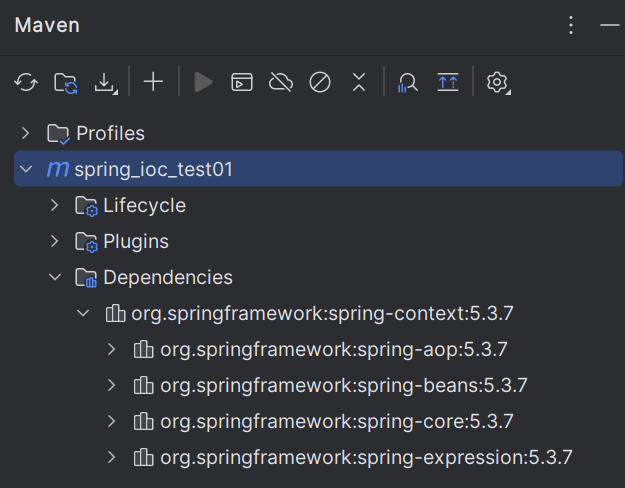


#### 2）定义UserService接口及其UserServiceImpl实现类

```java
public interface UserService {
}
```


```java
public class UserServiceImpl implements UserService {
}
```


#### 3）创建beans.xml配置文件，将UserServiceImpl的信息配置到该xml中

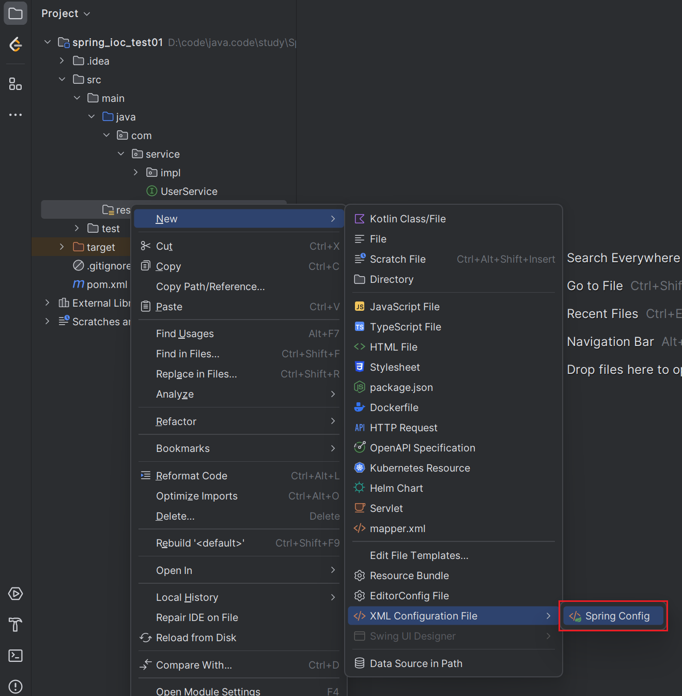

<br>


<br>

**id** 为Bean的唯一标识，**class** 为Bean的全限定名，Spring框架根据全限定名找到类，然后通过反射制造Bean。

```xml
<?xml version="1.0" encoding="UTF-8"?>
<beans xmlns="http://www.springframework.org/schema/beans"
       xmlns:xsi="http://www.w3.org/2001/XMLSchema-instance"
       xsi:schemaLocation="http://www.springframework.org/schema/beans
                           http://www.springframework.org/schema/beans/spring-beans.xsd">

    <bean id="userService" class="com.service.impl.UserServiceImpl"></bean>
</beans>
```


#### 4）编写测试代码，创建BeanFactory，加载配置文件，获取UserService实例对象

```java
public class BeanFactoryTest {
    public static void main(String[] args) {
        //创建BeanFactory
        DefaultListableBeanFactory beanFactory = new DefaultListableBeanFactory();
        //创建读取器
        XmlBeanDefinitionReader reader = new XmlBeanDefinitionReader(beanFactory);
        //加载配置文件
        reader.loadBeanDefinitions("beans.xml");
        //获取Bean实例对象
        UserService userService = (UserService) beanFactory.getBean("userService");

        System.out.println(userService);
    }
}
```


### 1.2 BeanFactory实现DI依赖注入

#### 1）定义UserDao接口及其UserDaoImpl实现类

```java
public interface UserDao {
}
```


```java
public class UserDaoImpl implements UserDao {
}
```


#### 2）修改UserServiceImpl代码，添加一个setUserDao(UserDao userDao)用于接收注入的对象

```java
public class UserServiceImpl implements UserService {
    private UserDao userDao;
    
    public void setUserDao(UserDao userDao) {
        System.out.println("BeanFactory调用setUserDao方法：" + userDao);
        this.userDao = userDao;
    }
}
```


#### 3）定义UserDao接口及其UserDaoImpl实现类


```xml
<?xml version="1.0" encoding="UTF-8"?>
<beans xmlns="http://www.springframework.org/schema/beans"
       xmlns:xsi="http://www.w3.org/2001/XMLSchema-instance"
       xsi:schemaLocation="http://www.springframework.org/schema/beans
                           http://www.springframework.org/schema/beans/spring-beans.xsd">

    <bean id="userService" class="com.wood.service.impl.UserServiceImpl">
        <property name="userDao" ref="userDao"></property>
    </bean>

    <bean id="userDao" class="com.wood.dao.impl.UserDaoImpl"/>
</beans>
```


#### 4）编写测试代码，创建BeanFactory，加载配置文件，获取UserService实例对象

```java
public class BeanFactoryTest {
    public static void main(String[] args) {
        //创建BeanFactory
        DefaultListableBeanFactory beanFactory = new DefaultListableBeanFactory();
        //创建读取器
        XmlBeanDefinitionReader reader = new XmlBeanDefinitionReader(beanFactory);
        //加载配置文件
        reader.loadBeanDefinitions("beans.xml");
        //获取Bean实例对象
        UserService userService = (UserService) beanFactory.getBean("userService");

        System.out.println(userService);
    }
}
```


##### 运行结果


## 2. ApplicationContext快速入门

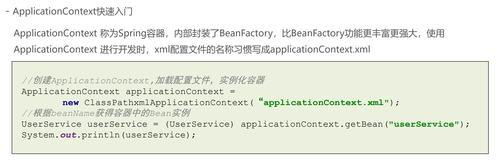


### 2.1 ApplicationContext继承关系

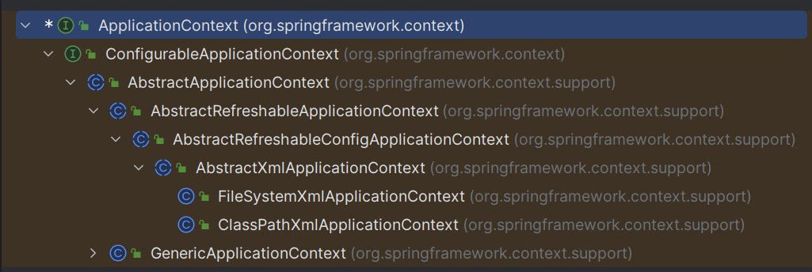

**ApplicationContext** 本身是一个接口，所以我们不能直接new它，只能new它的实现类。


### 2.2 代码

applicationContext.xml 内容与 beans.xml 一样，是直接copy得到的。

```java
public class ApplicationContextTest {
    public static void main(String[] args) {
        ApplicationContext applicationContext = new ClassPathXmlApplicationContext("applicationContext.xml");
        UserService userService = (UserService) applicationContext.getBean("userService");
        System.out.println(userService);
    }
}
```


#### 运行结果

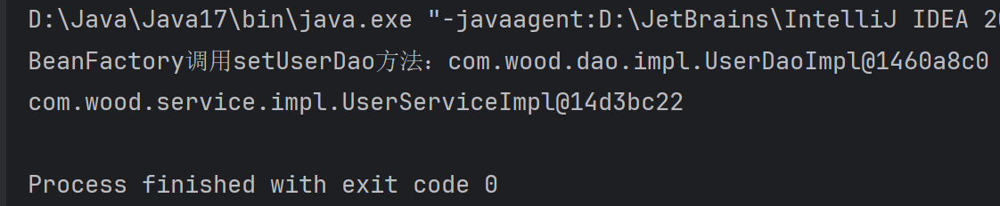


## 3. BeanFactory与ApplicationContext的关系


### 3.1 概述

1. BeanFactory是Spring的早期接口，称为Spring的Bean工厂，ApplicationContext是后期更高级接口，称之为 Spring 容器。
2. ApplicationContext在BeanFactory基础上对功能进行了扩展，例如：监听功能、国际化功能等。BeanFactory的 API更偏向底层，ApplicationContext的API大多数是对这些底层API的封装；
3. Bean创建的主要逻辑和功能都被封装在BeanFactory中，ApplicationContext不仅继承了BeanFactory，而且 ApplicationContext内部还维护着BeanFactory的引用，所以，ApplicationContext与BeanFactory既有继承关系，又 有融合关系。 
4. Bean的初始化时机不同，原始BeanFactory是在首次调用getBean时才进行Bean的创建，而ApplicationContext则 是配置文件加载，容器一创建就将Bean都实例化并初始化好。


### 3.2 继承体系图

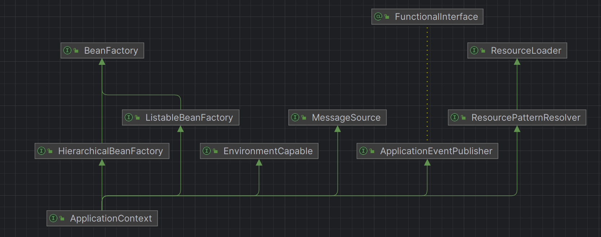


### 3.3 Debug测试

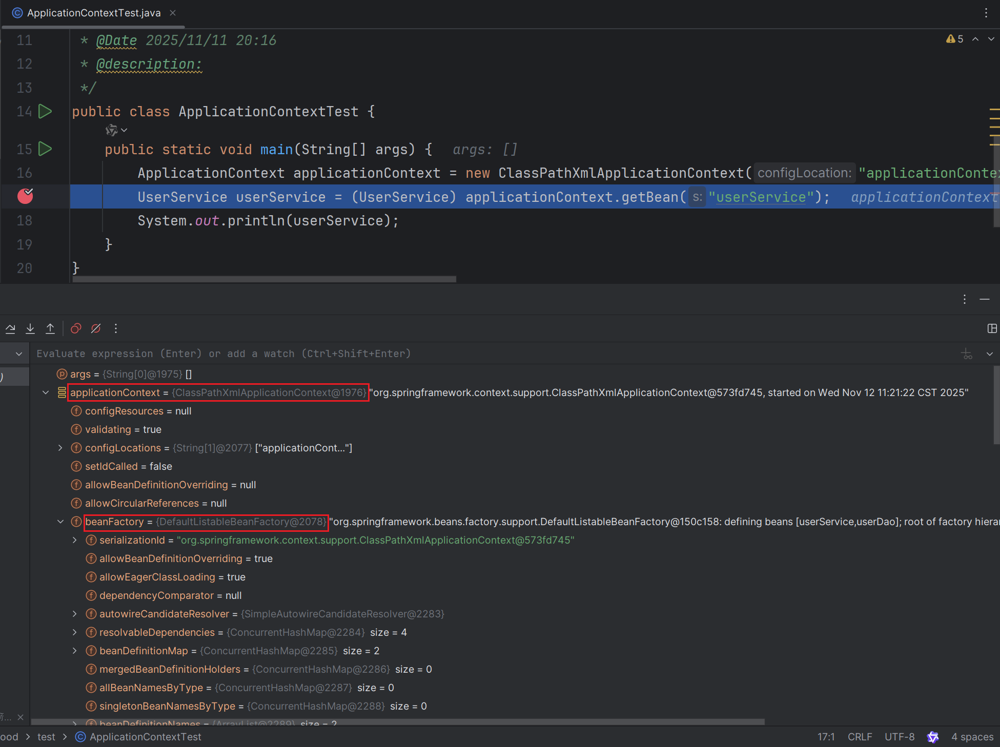

ApplicationContext继承BeanFactory的同时，还包含BeanFactory。每次ApplicationContext调用getBean方法时，其实是调用BeanFactory的getBean方法。


## 4. BeanFactory的继承体系

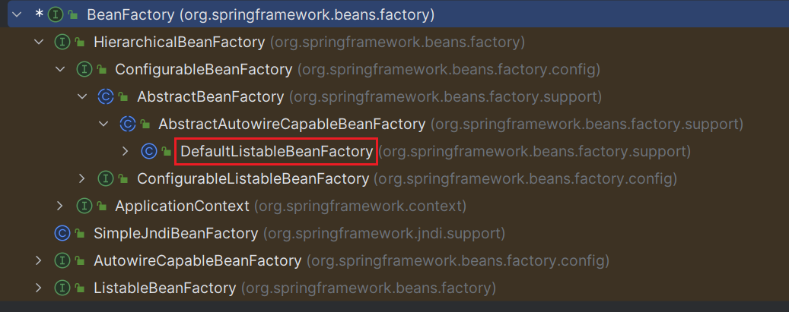

BeanFactory是一个接口，之前我们都是new DefaultListableBeanFactory。


## 5. ApplicationContext的继承体系

只在Spring基础环境下，即只导入spring-context坐标时，此时ApplicationContext的继承体系：

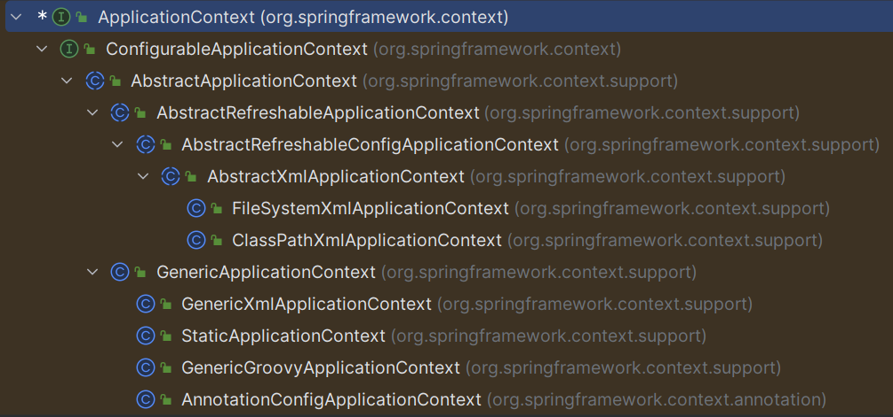


只在Spring基础环境下，常用的三个ApplicationContext作用如下：

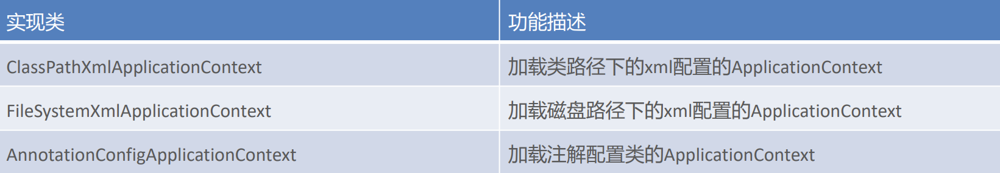


如果Spring基础环境中加入了其他组件解决方案，如web层解决方案，即导入spring-web坐标，此时 ApplicationContext的继承体系：

```xml
<dependency>
    <groupId>org.springframework</groupId>
    <artifactId>spring-web</artifactId>
    <version>5.3.7</version>
</dependency>
```

<br>

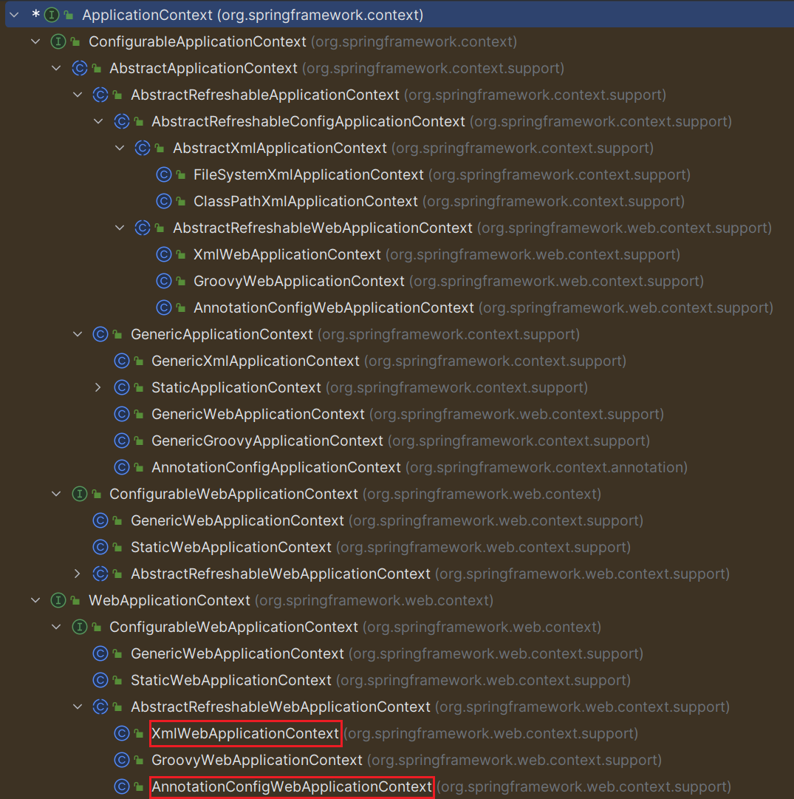

<br>

在Spring的web环境下，常用的两个ApplicationContext作用如下：

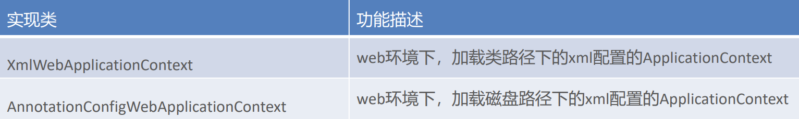


# 二、 基于xml的Spring应用


## 1. SpringBean 的配置详解


### 1.1 Bean的常用配置概览

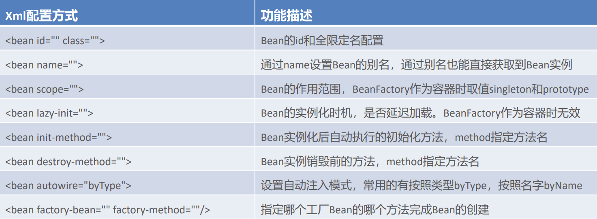


### 1.2 beanName和别名配置


#### 关于id

**applicationContext.xml**

```xml
<?xml version="1.0" encoding="UTF-8"?>
<beans xmlns="http://www.springframework.org/schema/beans"
       xmlns:xsi="http://www.w3.org/2001/XMLSchema-instance"
       xsi:schemaLocation="http://www.springframework.org/schema/beans
                           http://www.springframework.org/schema/beans/spring-beans.xsd">

    <bean id="userService" class="com.wood.service.impl.UserServiceImpl">
        <property name="userDao" ref="userDao"></property>
    </bean>

    <bean id="userDao" class="com.wood.dao.impl.UserDaoImpl"/>
</beans>
```

在 applicationContext.xml 文件中，bean标签的 id 是 bean的唯一标识，它后期会转为beanName。而我们通过 **ApplicationContext**

的 getBean 方法获取的时候，方法里的参数其实是beanName。

<br>

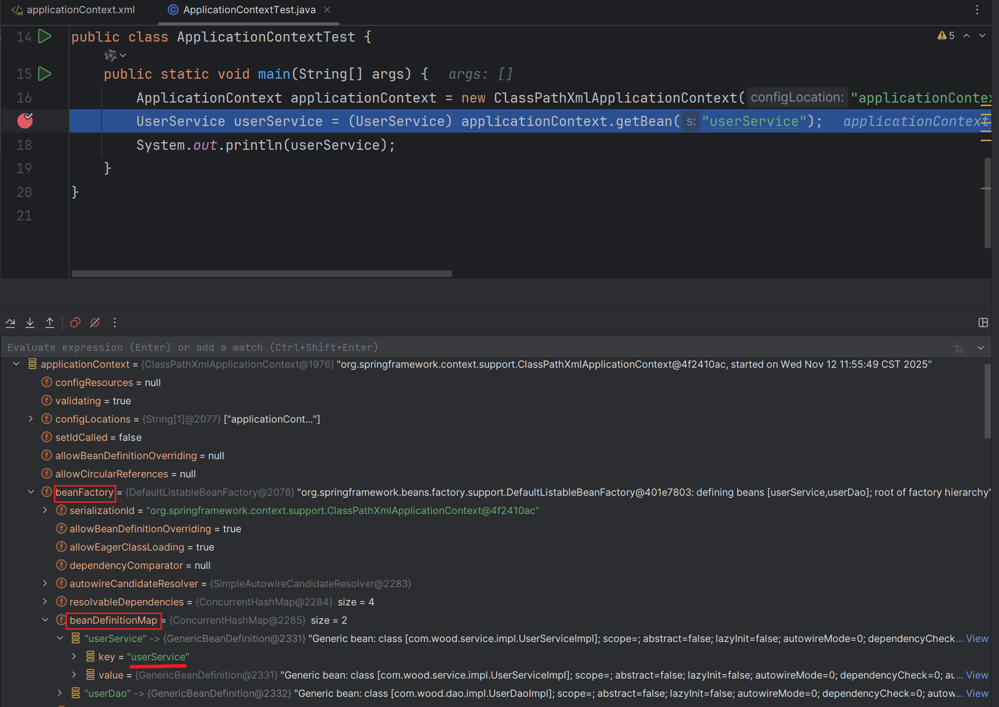

applicationContext 里包含 beanFactory，而beanFactory里又有一个beanDefinitionMap，我们可以看到 key 为 userService。

<br>

```xml
<?xml version="1.0" encoding="UTF-8"?>
<beans xmlns="http://www.springframework.org/schema/beans"
       xmlns:xsi="http://www.w3.org/2001/XMLSchema-instance"
       xsi:schemaLocation="http://www.springframework.org/schema/beans
                           http://www.springframework.org/schema/beans/spring-beans.xsd">

    <bean class="com.wood.service.impl.UserServiceImpl">
        <property name="userDao" ref="userDao"></property>
    </bean>

    <bean id="userDao" class="com.wood.dao.impl.UserDaoImpl"/>
</beans>
```

我们将 applicationContext.xml 中 `id="userService"` 去掉。

<br>

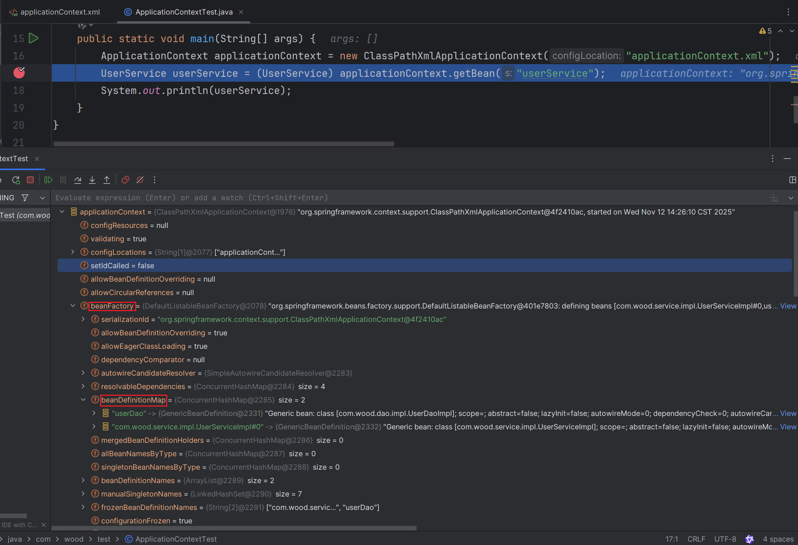

可以发现beanDefinitionMap中并没有key为 userService 的元素，取而代之的是key 为 `com.wood.service.impl.UserServiceImpl`。

因为代码中我们尝试获取beanName为 userService 的bean，而beanDefinitionMap中没有，取不到想要的bean程序会报错。

<br>

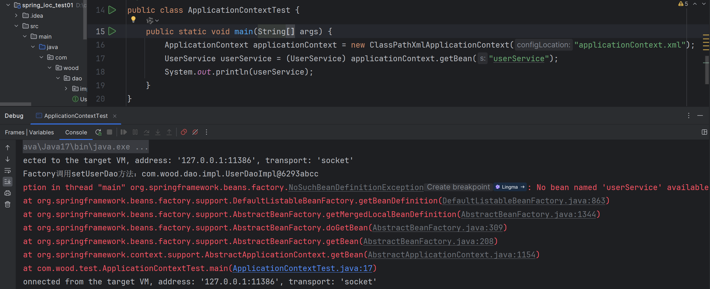

<br>

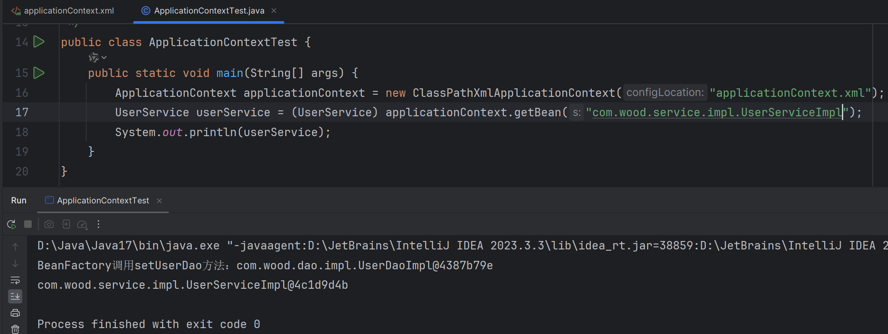

如果我们genBean的时候，方法参数写全限定类名，那么自然可以获取UserServiceImpl。

<br>


#### 关于name

name是用来给当前Bean指定多个别名，根据别名也可以获得Bean对象。

<br>

**applicationContext.xml**

```xml
<?xml version="1.0" encoding="UTF-8"?>
<beans xmlns="http://www.springframework.org/schema/beans"
       xmlns:xsi="http://www.w3.org/2001/XMLSchema-instance"
       xsi:schemaLocation="http://www.springframework.org/schema/beans
                           http://www.springframework.org/schema/beans/spring-beans.xsd">

    <bean id="userService" name="aaa,bbb,ccc" class="com.wood.service.impl.UserServiceImpl">
        <property name="userDao" ref="userDao"></property>
    </bean>

    <bean id="userDao" class="com.wood.dao.impl.UserDaoImpl"/>
</beans>
```

现在我们给id为 userService 的 bean 取了三个别名，分别为aaa、bbb、ccc。

<br>

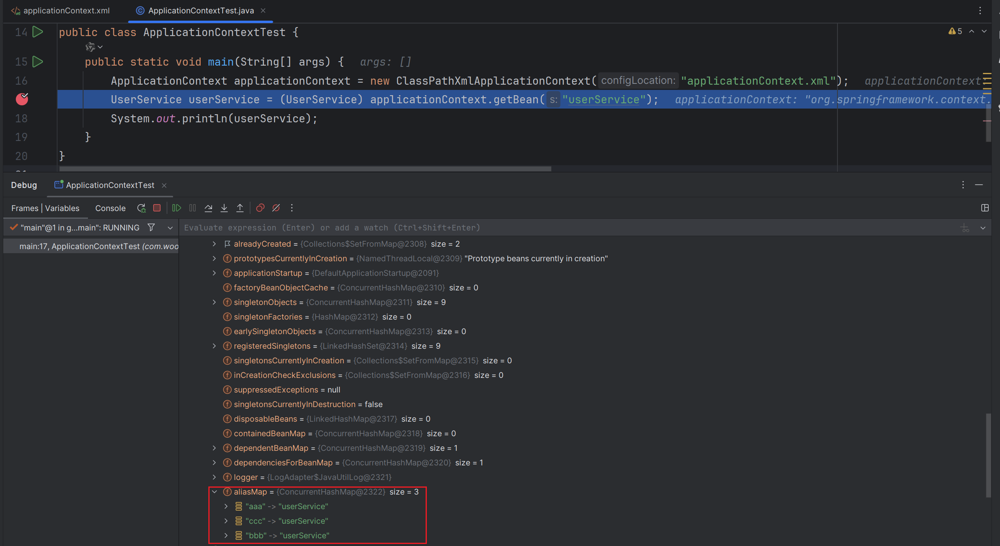

在application的beanFactory中，有个属性aliasMap，这个mao里面有三个元素，key分别为我们之前去的别名aaa，bbb，ccc。它们的value都是userService。

<br>

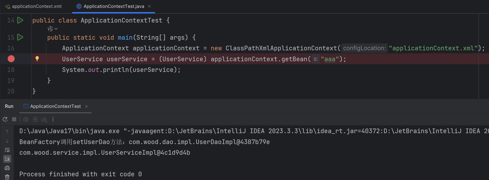

我们也可以通过name获取bean。

<br>

**applicationContext.xml**

```xml
<?xml version="1.0" encoding="UTF-8"?>
<beans xmlns="http://www.springframework.org/schema/beans"
       xmlns:xsi="http://www.w3.org/2001/XMLSchema-instance"
       xsi:schemaLocation="http://www.springframework.org/schema/beans http://www.springframework.org/schema/beans/spring-beans.xsd">

    <bean name="aaa,bbb,ccc" class="com.wood.service.impl.UserServiceImpl">
        <property name="userDao" ref="userDao"></property>
    </bean>

    <bean id="userDao" class="com.wood.dao.impl.UserDaoImpl"/>
</beans>
```

上面的xml文件中，我们没有为UserServiceImpl设置id，只设置了name。

<br>

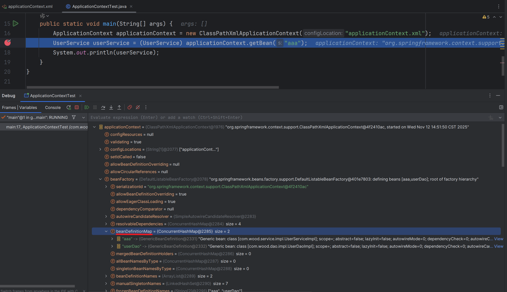

我们可以从 beanDefinitionMap 中看到，UserServiceImpl这个bean的beanName为aaa。

<br>

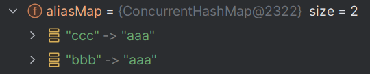

aliasMap中只有bbb和ccc，它们的value都为aaa。

<br>

#### 总结

如果你在配置文件中，配了id，那么id就是beanName。

如果你没有配id，配了name，那么默认情况下，别名的第一个就是beanName。

如果id和name都没有配，那么全限定名就是beanName。

一般我们都是配id，不用那么。


### 1.3 Bean的作用范围Scope配置

默认情况下，单纯的Spring环境Bean的作用范围有两个：Singleton和Prototype 

- singleton：单例，默认值，Spring容器创建的时候，就会进行Bean的实例化，并存储到容器内部的单例池BeanFactory中的singletonObjects）中 ，每次getBean时都是从单例池中获取相同的Bean实例。
-  prototype：原型，Spring容器初始化时不会创建Bean实例，当调用getBean时才会实例化Bean，每次 getBean都会创建一个新的Bean实例。

如果你引入了spring-webmvc依赖，scope的取值还有session，request。

<br>

### 1.4 Bean的延迟加载

当lazy-init设置为true时为延迟加载，也就是当Spring容器创建的时候，不会立即创建Bean实例，等待用到时在创 建Bean实例并存储到单例池中去，后续在使用该Bean直接从单例池获取即可，本质上该Bean还是单例的。

```xml
<bean id="userDao" class="com.itheima.dao.impl.UserDaoImpl" lazy-init="true"/>
```

注意：lazy-init 对BeanFactory无效。

<br>

### 1.5 Bean的初始化和销毁方法配置

Bean在被实例化后，可以执行指定的初始化方法完成一些初始化的操作，Bean在销毁之前也可以执行指定的销毁 方法完成一些操作。

<br>

修改UserServiceImpl，添加构造方法，以及init方法和destroy方法。

```java
public class UserServiceImpl implements UserService {
    public UserDao userDao;

    public void setUserDao(UserDao userDao) {
        System.out.println("BeanFactory调用setUserDao方法：" + userDao);
        this.userDao = userDao;
    }

    public UserServiceImpl() {
        System.out.println("实例化UserServiceImpl");
    }

    public void init() {
        System.out.println("初始化方法");
    }

    public void destroy() {
        System.out.println("销毁方法");
    }
}
```

<br>

**applicationContext.xml**

```xml
<?xml version="1.0" encoding="UTF-8"?>
<beans xmlns="http://www.springframework.org/schema/beans"
       xmlns:xsi="http://www.w3.org/2001/XMLSchema-instance"
       xsi:schemaLocation="http://www.springframework.org/schema/beans http://www.springframework.org/schema/beans/spring-beans.xsd">

    <bean id="userService"  class="com.wood.service.impl.UserServiceImpl" init-method="init" destroy-method="destroy">
        <property name="userDao" ref="userDao"></property>
    </bean>

    <bean id="userDao" class="com.wood.dao.impl.UserDaoImpl"/>
</beans>
```

<br>

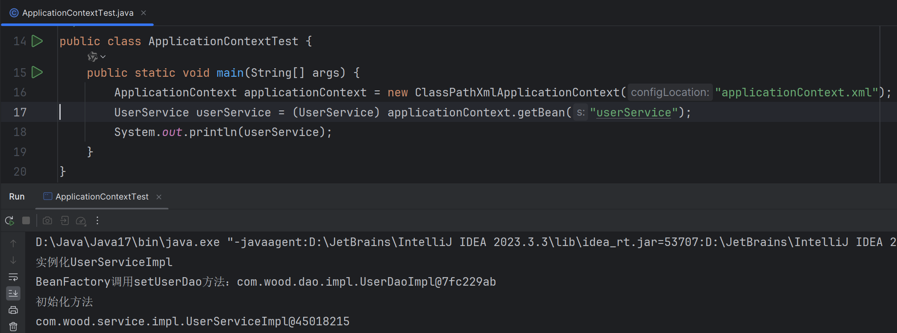

我们可以看到，init方法成功执行，但是destroy方法却没有执行。这是因为Spring框架没有显式的关闭，也就是说Spring不知道自己要关了，自然不会调用对应Bean的销毁方法。

<br>

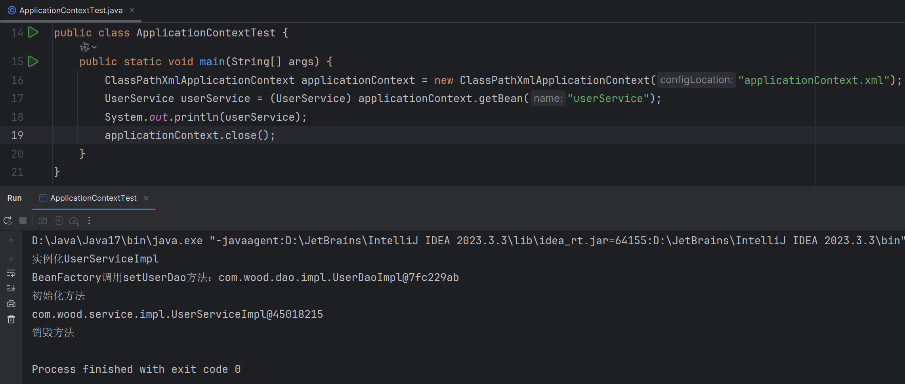

注意：之前我们都是ApplicationContext引用指向自己的子类实现。现在直接声明ClassPathXmlApplicationContext，因为它有close方法，ApplicationContext没有。

从上图的运行结果可以看出，destroy方法成功执行。

**注意：** Bean的销毁和Bean的销毁方法的调用是两回事。有时候我们程序运行结束或者强制停止程序，ApplicationContext这个容器没有了，那么它内部维护的Bean也就没有了。为什么销毁方法没被调用呢？是因为Spring没有执行到调用销毁方法的步骤，容器就挂掉了。所以我们需要显示的关闭容器，让Spring知道自己马上要挂掉了，挂掉之前还需要调用一些销毁方法。 

<br>

### 1.6 InitializingBean方式

我们还可以通过实现 InitializingBean 接口，完成一些Bean的初始化操作。

<br>

```java
public class UserServiceImpl implements UserService, InitializingBean {
    public UserDao userDao;

    public void setUserDao(UserDao userDao) {
        System.out.println("BeanFactory调用setUserDao方法：" + userDao);
        this.userDao = userDao;
    }

    public UserServiceImpl() {
        System.out.println("实例化UserServiceImpl");
    }

    public void init() {
        System.out.println("初始化方法");
    }

    public void destroy() {
        System.out.println("销毁方法");
    }

    @Override
    public void afterPropertiesSet() throws Exception {
        System.out.println("InitializingBean...");
    }
}
```

实现InitializingBean接口后，需要重写afterPropertiesSet()方法，在里面写好初始化的逻辑。

<br>

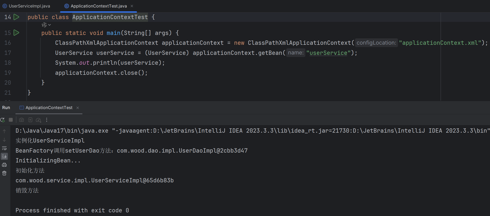


### 1.7 Bean的实例化配置

Spring的实例化方式主要如下两种： 

- 构造方式实例化：底层通过构造方法对Bean进行实例化 
-  工厂方式实例化：底层通过调用自定义的工厂方法对Bean进行实例化


#### 1.7.1 构造方式实例化

```java
public class UserServiceImpl implements UserService{
    public UserDao userDao;

    public void setUserDao(UserDao userDao) {
        this.userDao = userDao;
    }

   /* public UserServiceImpl() {
        System.out.println("UserServiceImpl无参构造方法执行");
    }*/

    public UserServiceImpl(String name) {
        System.out.println("UserServiceImpl有参构造方法执行：" + name);
    }
}
```

我们注释掉 **UserServiceImpl** 的无参构造方法。

<br>

**applicationContext.xml**

```xml
<?xml version="1.0" encoding="UTF-8"?>
<beans xmlns="http://www.springframework.org/schema/beans"
       xmlns:xsi="http://www.w3.org/2001/XMLSchema-instance"
       xsi:schemaLocation="http://www.springframework.org/schema/beans
                           http://www.springframework.org/schema/beans/spring-beans.xsd">

    <bean id="userService"  class="com.wood.service.impl.UserServiceImpl">
        <constructor-arg name="name" value="wood"/>
        <property name="userDao" ref="userDao"></property>
    </bean>

    <bean id="userDao" class="com.wood.dao.impl.UserDaoImpl"/>
</beans>
```

使用 constructor-arg 标签，name 为参数名， value为参数值。

<br>

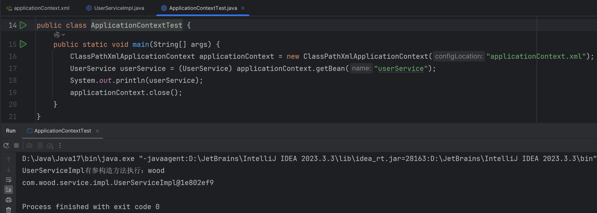

<br>

#### 1.7.2 工厂方式实例化

工厂方式实例化Bean，又分为如下三种： 

- 静态工厂方法实例化Bean 
- 实例工厂方法实例化Bean 
-  实现FactoryBean规范延迟实例化Bean


##### 静态工厂方法方式

**applicationContext.xml**

```xml
<?xml version="1.0" encoding="UTF-8"?>
<beans xmlns="http://www.springframework.org/schema/beans"
       xmlns:xsi="http://www.w3.org/2001/XMLSchema-instance"
       xsi:schemaLocation="http://www.springframework.org/schema/beans
                           http://www.springframework.org/schema/beans/spring-beans.xsd">

    <bean id="userDao1" class="com.wood.factory.MyBeanFactory1" factory-method="userDao"/>
</beans>
```

这个bean标签的意思不是将MyBeanFactory1这个类作为Bean，Spring看到factory-method后，就知道是将MyBeanFactory1中的方法

userDao的返回值作Bean，id="userDao1" 作为beanName，放到Spring容器中。

<br>

```java
public class MyBeanFactory1 {
    public static UserDao userDao() {
        return new UserDaoImpl();
    }
}
```

<br>

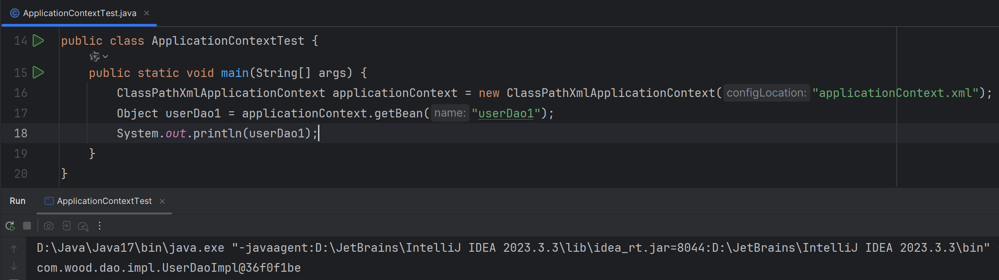

这种方式相比于构造方法方式的好处是：

- 可以在创建对象前后进行一些其他业务逻辑的操作。
- 当要在Spring中管理一个**第三方库**的对象，而这个库**没有提供公共的构造方法**，只提供了静态方法来获取实例时，静态工厂方法是唯一的选择。
- 它将创建Bean的复杂逻辑封装（隐藏）起来，调用者（Spring）无需知道Bean是如何被创建的，只需要调用一个静态方法即可。

<br>

此外，如果工厂方法有参数，可以这样配置：

```xml
<bean id="userDao1" class="com.wood.factory.MyBeanFactory1" factorymethod="UserDao">
	<constructor-arg name="name" value="haohao"/>
</bean>
```

<br>

```java
public class MyBeanFactory1 {
    public static UserDao userDao(String name) {
        return new UserDaoImpl();
    }
}
```


##### 实例工厂方法方式

对于静态工厂方法方式，不需要创建工厂对象，直接调用工厂方法就行。

对于实例工厂方法方式，需要先创建实例工厂对象，然后再让工厂对象调用工厂方法。

<br>

实例工厂

```java
public class MyBeanFactory2 {
    public UserDao userDao() {
        return new UserDaoImpl();
    }
}
```

<br>

**applicationContext.xml**

```xml
<?xml version="1.0" encoding="UTF-8"?>
<beans xmlns="http://www.springframework.org/schema/beans"
       xmlns:xsi="http://www.w3.org/2001/XMLSchema-instance"
       xsi:schemaLocation="http://www.springframework.org/schema/beans
                           http://www.springframework.org/schema/beans/spring-beans.xsd">

    <bean id="myBeanFactory2" class="com.wood.factory.MyBeanFactory2"/>
    <bean id="userDao2" factory-bean="myBeanFactory2" factory-method="userDao"/>
</beans>
```

<br>


静态工厂是一个“工具类”，而实例工厂是一个“对象”。作为一个对象，这个工厂本身可以拥有**状态（State）和依赖（Dependencies）**。

相比静态工厂方法方式的好处是：

- 静态方法只能访问静态成员，这在Spring的DI世界中是非常受限的。而实例工厂是一个Spring Bean，Spring可以像对待其他Bean一样，对它进行依赖注入。
- 因为工厂是一个实例（对象），所以它可以有成员变量。这意味着你可以通过改变工厂的状态来改变它生产的Bean。

<br>

此外，如果工厂方法有参数，可以这样配置：

```xml
<!-- 配置实例工厂Bean -->
<bean id="myBeanFactory2" class="com.wood.factory.MyBeanFactory2"/>
<!-- 配置实例工厂Bean的哪个方法作为工厂方法 -->
<bean id="userDao2" factory-bean="myBeanFactory2" factory-method="userDao">
	<constructor-arg name="name" value="haohao"/>
</bean>
```

<br>

```java
public class MyBeanFactory2 {
    public UserDao userDao(String name) {
        return new UserDaoImpl();
    }
}
```


#####  实现FactoryBean规范延迟实例化Bean

`FactoryBean` 是 Spring 框架中一个非常特殊且功能强大的接口。**`FactoryBean` 本身是一个 Bean，但它的作用不是为自己服务，而是作为“工厂”来生产（或创建）另一个 Bean。**

当你向 Spring 容器请求（`getBean`）一个 `FactoryBean` 类型的 Bean 时，Spring **默认不会返回这个工厂 Bean 本身**，而是会调用这个工厂的 `getObject()` 方法，**返回该方法创建的对象**。

<br>

```xml
<?xml version="1.0" encoding="UTF-8"?>
<beans xmlns="http://www.springframework.org/schema/beans"
       xmlns:xsi="http://www.w3.org/2001/XMLSchema-instance"
       xsi:schemaLocation="http://www.springframework.org/schema/beans http://www.springframework.org/schema/beans/spring-beans.xsd">

    <bean id="userDao3" class="com.wood.factory.MyBeanFactory3"/>

    <bean id="myBeanFactory2" class="com.wood.factory.MyBeanFactory2"/>
    <bean id="userDao2" factory-bean="myBeanFactory2" factory-method="userDao"/>

    <bean id="userDao1" class="com.wood.factory.MyBeanFactory1" factory-method="userDao"/>
</beans>
```

<br>

```java
public class MyBeanFactory3 implements FactoryBean<UserDao> {
    @Override
    public UserDao getObject() throws Exception {
        return new UserDaoImpl();
    }

    @Override
    public Class<?> getObjectType() {
        return UserDao.class;
    }
}
```

<br>

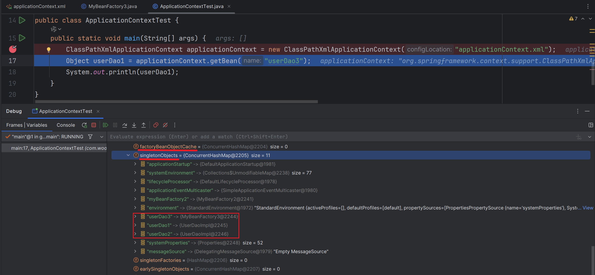

在singletonObjects中，有key为userDao1、userDao2、userDao3的元素。其中userDao1 和 userDao2是分别通过静态工厂方法和实例工厂方法创建的，在singletonObjects中，它们的value都是UserDaoImpl。而userDao3 的 value 却是 MyBeanFactory3。

注意此刻 factoryBeanObjectCache 的size为0。

<br>

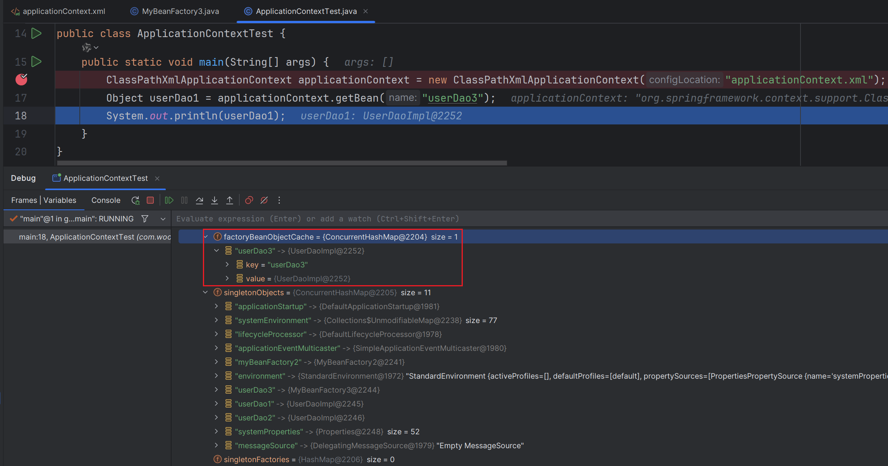

当执行完getBean方法后，factoryBeanObjectCache 的 size 为 1。其中元素key为userDao3，value为UserDaoImpl。

通过实现 `FactoryBean` 接口这种方式，对于Bean的创建是有延迟的。

当容器真正调用getBean方法时，此时getBean的参数是userDao3，而我们在xml文件配置中，id="userDao3"的bean，它的class="com.wood.factory.MyBeanFactory3"。

而MyBeanFactory3又实现了FactoryBean接口，Spring 容器请求（`getBean`）一个 `FactoryBean` 类型的 Bean 时，Spring **默认不会返回这个工厂 Bean 本身**，而是会调用这个工厂的 `getObject()` 方法，**返回该方法创建的对象**。也就是UserDaoImpl。并将这个返回对象存到 `factoryBeanObjectCache` 中。


### 1.8 Bean的依赖注入配置


#### 1.8.1 注入方式

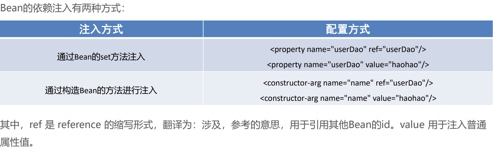


#### 1.8.2 注入数据类型

依赖注入的数据类型有如下三种： 

- 普通数据类型，例如：String、int、boolean等，通过value属性指定。
- 引用数据类型，例如：UserDaoImpl、DataSource等，通过ref属性指定。
-  集合数据类型，例如：List、Map、Properties等


##### List注入配置

**UserServiceImpl**

```java
public class UserServiceImpl implements UserService{

    private List<String> stringList;

    public void setStringList(List<String> stringList) {
        this.stringList = stringList;
    }

    private List<UserDao> userDaoList;
    public void setUserDaoList(List<UserDao> userDaoList) {
        this.userDaoList = userDaoList;
    }

    public void show() {
        System.out.println(stringList);
        System.out.println(userDaoList);
    }


    public UserDao userDao;

    public void setUserDao(UserDao userDao) {
        this.userDao = userDao;
    }
}
```

<br>

**applicationContext.xml**

```xml
<?xml version="1.0" encoding="UTF-8"?>
<beans xmlns="http://www.springframework.org/schema/beans"
       xmlns:xsi="http://www.w3.org/2001/XMLSchema-instance"
       xsi:schemaLocation="http://www.springframework.org/schema/beans
                           http://www.springframework.org/schema/beans/spring-beans.xsd">

    <bean id="userService" class="com.wood.service.impl.UserServiceImpl">
        <property name="stringList">
            <list>
                <value>aaa</value>
                <value>bbb</value>
                <value>ccc</value>
            </list>
        </property>
        <property name="userDaoList">
            <list>
                <ref bean="userDao1"/>
                <ref bean="userDao2"/>
                <ref bean="userDao3"/>
            </list>
        </property>
    </bean>

    <bean id="userDao1" class="com.wood.dao.impl.UserDaoImpl"/>
    <bean id="userDao2" class="com.wood.dao.impl.UserDaoImpl"/>
    <bean id="userDao3" class="com.wood.dao.impl.UserDaoImpl"/>
</beans>
```

<br>

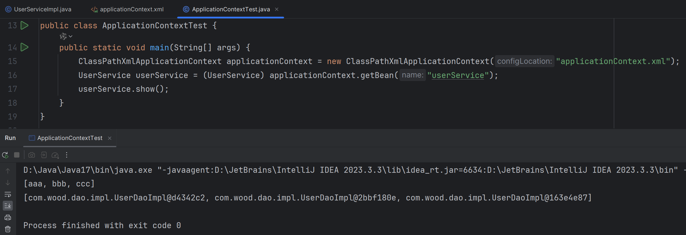


##### Set注入配置

UserServiceImpl

```java
public class UserServiceImpl implements UserService{
    private Set<String> stringSet;
    public void setStringSet(Set<String> stringSet) {
        this.stringSet = stringSet;
    }

    private Set<UserDao> userDaoSet;
    public void setUserDaoSet(Set<UserDao> userDaoSet) {
        this.userDaoSet = userDaoSet;
    }

    public void show() {
        System.out.println(stringSet);
        System.out.println(userDaoSet);
    }


    public UserDao userDao;

    public void setUserDao(UserDao userDao) {
        this.userDao = userDao;
    }
}
```

<br>

```xml
<?xml version="1.0" encoding="UTF-8"?>
<beans xmlns="http://www.springframework.org/schema/beans"
       xmlns:xsi="http://www.w3.org/2001/XMLSchema-instance"
       xsi:schemaLocation="http://www.springframework.org/schema/beans
                           http://www.springframework.org/schema/beans/spring-beans.xsd">

    <bean id="userService" class="com.wood.service.impl.UserServiceImpl">
        <property name="stringSet">
            <set>
                <value>1</value>
                <value>2</value>
                <value>3</value>
            </set>
        </property>
        <property name="userDaoSet">
            <set>
                <ref bean="userDao1"/>
                <ref bean="userDao2"/>
                <ref bean="userDao3"/>
            </set>
        </property>
    </bean>

    <bean id="userDao1" class="com.wood.dao.impl.UserDaoImpl"/>
    <bean id="userDao2" class="com.wood.dao.impl.UserDaoImpl"/>
    <bean id="userDao3" class="com.wood.dao.impl.UserDaoImpl"/>
</beans>
```

<br>

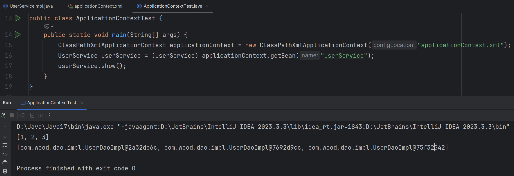


##### Map和Properties注入配置

```java
public class UserServiceImpl implements UserService{
    private Map<String, UserDao> map;
    public void setMap(Map<String, UserDao> map) {
        this.map = map;
    }

    private Properties properties;
    public void setProperties(Properties properties) {
        this.properties = properties;
    }


    public void show() {
        System.out.println(map);
        System.out.println(properties);
    }


    public UserDao userDao;

    public void setUserDao(UserDao userDao) {
        this.userDao = userDao;
    }
}
```

<br>

```xml
<?xml version="1.0" encoding="UTF-8"?>
<beans xmlns="http://www.springframework.org/schema/beans"
       xmlns:xsi="http://www.w3.org/2001/XMLSchema-instance"
       xsi:schemaLocation="http://www.springframework.org/schema/beans
                           http://www.springframework.org/schema/beans/spring-beans.xsd">

    <bean id="userService" class="com.wood.service.impl.UserServiceImpl">
       <property name="map">
           <map>
               <entry key="d1" value-ref="userDao1"/>
               <entry key="d2" value-ref="userDao2"/>
               <entry key="d3" value-ref="userDao3"/>
           </map>
       </property>
        <property name="properties">
            <props>
                <prop key="p1">v1</prop>
                <prop key="p2">v2</prop>
            </props>
        </property>
    </bean>

    <bean id="userDao1" class="com.wood.dao.impl.UserDaoImpl"/>
    <bean id="userDao2" class="com.wood.dao.impl.UserDaoImpl"/>
    <bean id="userDao3" class="com.wood.dao.impl.UserDaoImpl"/>
</beans>
```

<br>


### 1.9 自动装配

如果被注入的属性类型是Bean引用的话，那么可以在 标签中使用 autowire 属性去配置自动注入方式，属 性值有两个：

- byName：通过属性名自动装配，即去匹配 setXxx 与 id="xxx"（name="xxx"）是否一致。
- byType：通过Bean的类型从容器中匹配，匹配出多个相同Bean类型时，报错。


#### byName

UserServiceImpl

```java
public class UserServiceImpl implements UserService{

    public void show() {
        System.out.println(userDao);
    }


    public UserDao userDao;

    public void setUserDao(UserDao userDao) {
        this.userDao = userDao;
    }
}
```

<br>

**applicationContext.xml**

```xml
<?xml version="1.0" encoding="UTF-8"?>
<beans xmlns="http://www.springframework.org/schema/beans"
       xmlns:xsi="http://www.w3.org/2001/XMLSchema-instance"
       xsi:schemaLocation="http://www.springframework.org/schema/beans
                           http://www.springframework.org/schema/beans/spring-beans.xsd">


    <bean id="userService" class="com.wood.service.impl.UserServiceImpl" autowire="byName"/>

    <bean id="userDao" class="com.wood.dao.impl.UserDaoImpl"/>
</beans>
```

在 UserServiceImpl 中有个UserDao需要注入，之前我们的做法是在bean标签中加` <property>` 标签。

现在我们加上 autowire="byName"，Spring会通过属性名自动装配。

Spring看到UserServiceImpl中有个setUserDao方法，它就会去找容器中有没有beanName 为 userDao的 bean。找到了就自动注入进去。


#### byType

byType 是通过类型匹配。如果UserDao有多个实现类，它们都在Spring容器中。

那么Springf不知道给UserServiceImpl注入哪个UserDao，就会报错。


### 1.10 Spring的其他配置标签

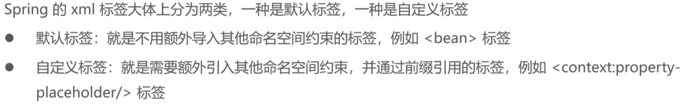


#### 1.10.1 默认标签

Spring的默认标签用到的是Spring的默认命名空间

```xml
<?xml version="1.0" encoding="UTF-8"?>
<beans xmlns="http://www.springframework.org/schema/beans"
       xmlns:xsi="http://www.w3.org/2001/XMLSchema-instance"
       xsi:schemaLocation="http://www.springframework.org/schema/beans
                           http://www.springframework.org/schema/beans/spring-beans.xsd">
</beans>
```

该命名空间约束下的默认标签如下：

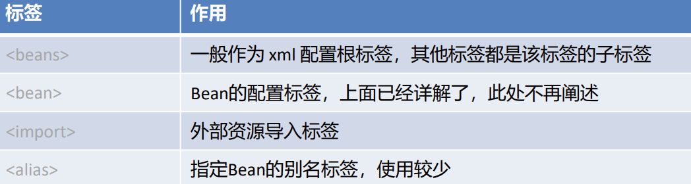


##### `<beans>` 标签

标签，除了经常用的做为根标签外，还可以嵌套在根标签内，使用profile属性切换开发环境。

可以使用以下两种方式指定被激活的环境：

- 使用命令行动态参数，虚拟机参数位置加载 -Dspring.profiles.active=test 
- 使用代码的方式设置环境变量 System.setProperty("spring.profiles.active","test")

<br>

**applicationContext.xml**

```xml
<?xml version="1.0" encoding="UTF-8"?>
<beans xmlns="http://www.springframework.org/schema/beans"
       xmlns:xsi="http://www.w3.org/2001/XMLSchema-instance"
       xsi:schemaLocation="http://www.springframework.org/schema/beans
                           http://www.springframework.org/schema/beans/spring-beans.xsd">

    <!--默认环境-->
    <bean id="userService" class="com.wood.service.impl.UserServiceImpl"/>

    <bean id="userDao" class="com.wood.dao.impl.UserDaoImpl"/>

    <!--开发环境-->
    <beans profile="dev">
        <bean id="userService1" class="com.wood.service.impl.UserServiceImpl"/>
    </beans>

     <!--测试环境-->
    <beans profile="test">
        <bean id="userDao1" class="com.wood.dao.impl.UserDaoImpl"/>
    </beans>
</beans>
```

<br>

开发环境

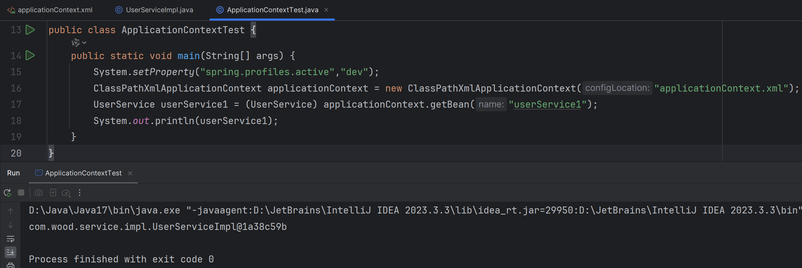

<br>

测试环境

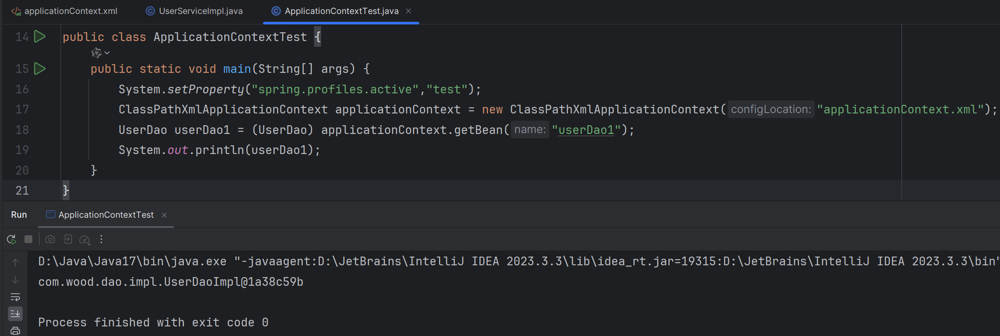

注意：我们这里指定test环境生效，那么dev环境不生效，但是默认环境依然生效。


##### `<import>` 标签

`<import>`标签，用于导入其他配置文件，项目变大后，就会导致一个配置文件内容过多，可以将一个配置文件根据业务某块进行拆分。拆分后，最终通过标签导入到一个主配置文件中，项目加载主配置文件就连同 导入的文件一并加载了。

<br>

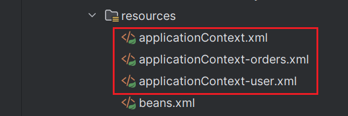

<br>

applicationContext.xml

```xml
<?xml version="1.0" encoding="UTF-8"?>
<beans xmlns="http://www.springframework.org/schema/beans"
       xmlns:xsi="http://www.w3.org/2001/XMLSchema-instance"
       xsi:schemaLocation="http://www.springframework.org/schema/beans
                           http://www.springframework.org/schema/beans/spring-beans.xsd">

    <import resource="applicationContext-user.xml"/>
    <import resource="applicationContext-orders.xml"/>
</beans>
```

<br>

applicationContext-orders.xml

```xml
<?xml version="1.0" encoding="UTF-8"?>
<beans xmlns="http://www.springframework.org/schema/beans"
       xmlns:xsi="http://www.w3.org/2001/XMLSchema-instance"
       xsi:schemaLocation="http://www.springframework.org/schema/beans
                           http://www.springframework.org/schema/beans/spring-beans.xsd">

    <bean id="userDao" class="com.wood.dao.impl.UserDaoImpl"/>
</beans>
```

<br>

applicationContext-orders.xml

```xml
<?xml version="1.0" encoding="UTF-8"?>
<beans xmlns="http://www.springframework.org/schema/beans"
       xmlns:xsi="http://www.w3.org/2001/XMLSchema-instance"
       xsi:schemaLocation="http://www.springframework.org/schema/beans
                           http://www.springframework.org/schema/beans/spring-beans.xsd">

    <bean id="userService" class="com.wood.service.impl.UserServiceImpl"/>
</beans>
```

<br>

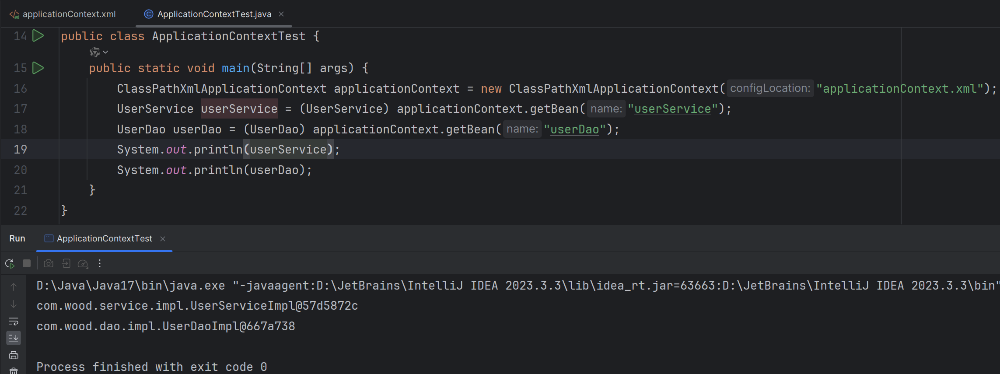


##### `<alias>` 标签

`<alias>` 标签是为某个Bean添加别名，与在 标签上使用name属性添加别名的方式一样。

<br>

```xml
<?xml version="1.0" encoding="UTF-8"?>
<beans xmlns="http://www.springframework.org/schema/beans"
       xmlns:xsi="http://www.w3.org/2001/XMLSchema-instance"
       xsi:schemaLocation="http://www.springframework.org/schema/beans
                           http://www.springframework.org/schema/beans/spring-beans.xsd">

    <bean id="userService" class="com.wood.service.impl.UserServiceImpl"/>

    <bean id="userDao" class="com.wood.dao.impl.UserDaoImpl"/>

    <alias name="userDao" alias="xxx"/>
</beans>
```

 <br>

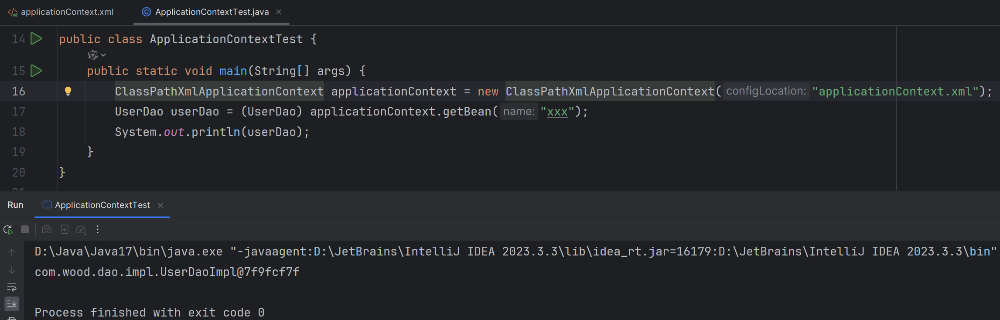


#### 1.10.2 自定义标签

Spring的自定义标签需要引入外部的命名空间，并为外部的命名空间指定前缀，使用 <前缀:标签> 形式的标签，称 之为自定义标签，自定义标签的解析流程也是 Spring xml扩展点方式之一。

```xml
<?xml version="1.0" encoding="UTF-8"?>
<beans xmlns="http://www.springframework.org/schema/beans"
       xmlns:xsi="http://www.w3.org/2001/XMLSchema-instance"
       xmlns:context="http://www.springframework.org/schema/context"
       xmlns:mvc="http://www.springframework.org/schema/mvc"
       xsi:schemaLocation="
       http://www.springframework.org/schema/beans
       http://www.springframework.org/schema/beans/spring-beans.xsd
       http://www.springframework.org/schema/context
       http://www.springframework.org/schema/context/spring-context.xsd
       http://www.springframework.org/schema/mvc
       http://www.springframework.org/schema/mvc/spring-mvc.xsd">

    <context:property-placeholder></context:property-placeholder>

    <mvc:annotation-driven></mvc:annotation-driven>
</beans>
```


## 2. Spring 的get方法

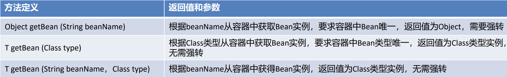

注意：使用第二种方法，如果容器中存在多个相同类型的对象，就会报错。


## 3.  Spring 配置非自定义Bean

以上在 xml 中配置的Bean都是自己定义的，例如：UserDaoImpl，UserServiceImpl。

但是，在实际开发中有些 功能类并不是我们自己定义的，而是使用的第三方jar包中的，那么，这些Bean要想让Spring进行管理，也需要对其进行配置。

配置非自定义的Bean需要考虑如下两个问题： 

- 被配置的Bean的实例化方式是什么？无参构造、有参构造、静态工厂方式还是实例工厂方式。
-  被配置的Bean是否需要注入必要属性。


### 3.1 配置 Druid 数据源


#### 导入Druid坐标

```xml
<!-- mysql驱动 -->
<dependency>
    <groupId>mysql</groupId>
    <artifactId>mysql-connector-java</artifactId>
    <version>5.1.49</version>
</dependency>
<!-- druid数据源 -->
<dependency>
    <groupId>com.alibaba</groupId>
    <artifactId>druid</artifactId>
    <version>1.1.23</version>
</dependency>
```


#### 配置 DruidDataSource

```java
DruidDataSource dataSource = new DruidDataSource();
dataSource.setDriverClassName("com.mysql.jdbc.Driver");
dataSource.setUrl("jdbc:mysql://localhost:3306/test");
dataSource.setUsername("root");
dataSource.setPassword("1234");
```

以上是我们之前创建DruidDataSource的代码。

可以看到，DruidDataSource 有无参构造，然后通过set方法注入属性。

<br>

applicationContext.xml

```xml
<?xml version="1.0" encoding="UTF-8"?>
<beans xmlns="http://www.springframework.org/schema/beans"
       xmlns:xsi="http://www.w3.org/2001/XMLSchema-instance"
       xmlns:context="http://www.springframework.org/schema/context"
       xmlns:mvc="http://www.springframework.org/schema/mvc"
       xsi:schemaLocation="
       http://www.springframework.org/schema/beans
       http://www.springframework.org/schema/beans/spring-beans.xsd
       http://www.springframework.org/schema/context
       http://www.springframework.org/schema/context/spring-context.xsd
       http://www.springframework.org/schema/mvc
       http://www.springframework.org/schema/mvc/spring-mvc.xsd">

    <bean id="druidDataSource" class="com.alibaba.druid.pool.DruidDataSource">
        <property name="driverClassName" value="com.mysql.jdbc.Driver"/>
        <property name="url" value="jdbc:mysql://localhost:3306/test"/>
        <property name="username" value="root"/>
        <property name="password" value="1234"/>
    </bean>
</beans>
```

<br>

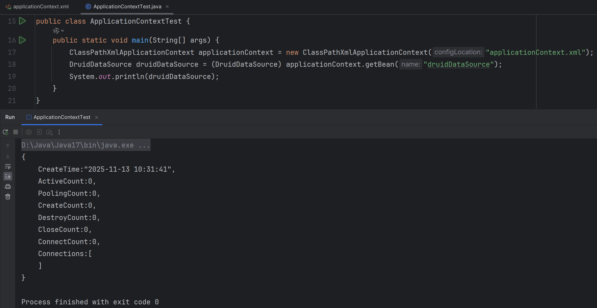


### 3.2 配置Connection

```java
Class.forName("com.mysql.jdbc.Driver");
Connection connection = DriverManager.getConnection("jdbc:mysql://localhost:3306/test?useUnicode=true&characterEncoding=utf8&useSSL=false&allowPublicKeyRetrieval=true",
                "root",
                "1234");
```

 Connection 是一个接口，它不能直接new。而是通过DriverManager的getConnection方法获得。

Class是静态工厂，forName是工厂方法。

DriverManager是静态工厂，getConnection是工厂方法。

<br>

applicationContext.xml

```xml
<?xml version="1.0" encoding="UTF-8"?>
<beans xmlns="http://www.springframework.org/schema/beans"
       xmlns:xsi="http://www.w3.org/2001/XMLSchema-instance"
       xmlns:context="http://www.springframework.org/schema/context"
       xmlns:mvc="http://www.springframework.org/schema/mvc"
       xsi:schemaLocation="
       http://www.springframework.org/schema/beans
       http://www.springframework.org/schema/beans/spring-beans.xsd
       http://www.springframework.org/schema/context
       http://www.springframework.org/schema/context/spring-context.xsd
       http://www.springframework.org/schema/mvc
       http://www.springframework.org/schema/mvc/spring-mvc.xsd">

    <bean id="clazz" class="java.lang.Class" factory-method="forName">
        <constructor-arg name="className" value="com.mysql.jdbc.Driver"/>
    </bean>

    <bean id="connection" class="java.sql.DriverManager" factory-method="getConnection">
        <constructor-arg name="url" value="jdbc:mysql://localhost:3306/test"/>
        <constructor-arg name="user" value="root"/>
        <constructor-arg name="password" value="1234"/>
    </bean>
</beans>
```

<br>

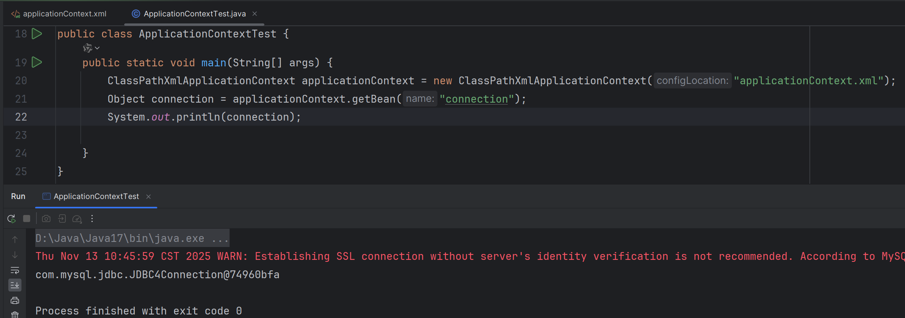

<br>

### 3.3 配置日期对象

```java
SimpleDateFormat simpleDateFormat = new SimpleDateFormat("yyyy-MM-dd HH:mm:ss");
Date date = simpleDateFormat.parse("2025-11-11 20:16:00");
```

Date对象并不是靠new得到的，而是通过SimpleDateFormat对象的parse方法得到。

SimpleDateFormat是实例工厂，parse是工厂方法。

<br>

applicationContext.xml

```xml
<?xml version="1.0" encoding="UTF-8"?>
<beans xmlns="http://www.springframework.org/schema/beans"
       xmlns:xsi="http://www.w3.org/2001/XMLSchema-instance"
       xmlns:context="http://www.springframework.org/schema/context"
       xmlns:mvc="http://www.springframework.org/schema/mvc"
       xsi:schemaLocation="
       http://www.springframework.org/schema/beans
       http://www.springframework.org/schema/beans/spring-beans.xsd
       http://www.springframework.org/schema/context
       http://www.springframework.org/schema/context/spring-context.xsd
       http://www.springframework.org/schema/mvc
       http://www.springframework.org/schema/mvc/spring-mvc.xsd">

    <bean id="simpleDateFormat" class="java.text.SimpleDateFormat">
        <constructor-arg name="pattern" value="yyyy-MM-dd HH:mm:ss"/>
    </bean>

    <bean id="date" factory-bean="simpleDateFormat" factory-method="parse">
        <constructor-arg name="source" value="2025-11-11 20:16:00"/>
    </bean>
</beans>
```

<br>

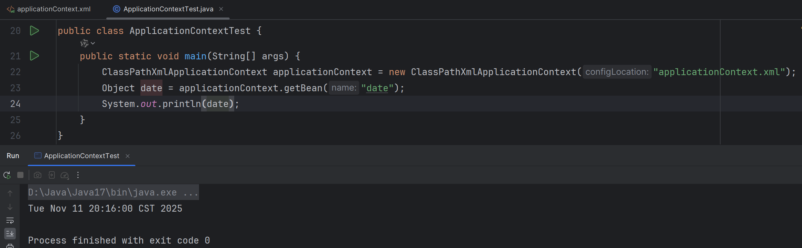


### 3.4 配置MyBatis的SqlSessionFactory


#### 导入依赖

```xml
<!--mybatis框架-->
<dependency>
    <groupId>org.mybatis</groupId>
    <artifactId>mybatis</artifactId>
    <version>3.5.5</version>
</dependency>
<!-- mysql驱动 -->
<dependency>
    <groupId>mysql</groupId>
    <artifactId>mysql-connector-java</artifactId>
    <version>5.1.49</version>
</dependency>
```


#### mybatis-config.xml

```xml
<?xml version="1.0" encoding="UTF-8" ?>
<!DOCTYPE configuration
        PUBLIC "-//mybatis.org//DTD Config 3.0//EN"
        "https://mybatis.org/dtd/mybatis-3-config.dtd">
<configuration>
    <environments default="development">
        <environment id="development">
            <transactionManager type="JDBC"/>
            <dataSource type="POOLED">
                <property name="driver" value="com.mysql.jdbc.Driver"/>
                <property name="url" value="jdbc:mysql://localhost:3306/test"/>
                <property name="username" value="root"/>
                <property name="password" value="1234"/>
            </dataSource>
        </environment>
    </environments>
</configuration>
```


#### 以前的代码

```java
// 静态工厂方法方式
InputStream in = Resources.getResourceAsStream("mybatis-config.xml");
// 无参构造实例化
SqlSessionFactoryBuilder builder = new SqlSessionFactoryBuilder();
// 实例工厂方法方式
SqlSessionFactory sessionFactory = builder.build(in);
```


#### applicationContext.xml

```xml
<?xml version="1.0" encoding="UTF-8"?>
<beans xmlns="http://www.springframework.org/schema/beans"
       xmlns:xsi="http://www.w3.org/2001/XMLSchema-instance"
       xmlns:context="http://www.springframework.org/schema/context"
       xmlns:mvc="http://www.springframework.org/schema/mvc"
       xsi:schemaLocation="
       http://www.springframework.org/schema/beans
       http://www.springframework.org/schema/beans/spring-beans.xsd
       http://www.springframework.org/schema/context
       http://www.springframework.org/schema/context/spring-context.xsd
       http://www.springframework.org/schema/mvc
       http://www.springframework.org/schema/mvc/spring-mvc.xsd">

    <!-- 静态工厂方法方式 -->
    <bean id="in" class="org.apache.ibatis.io.Resources" factory-method="getResourceAsStream">
        <constructor-arg name="resource" value="mybatis-config.xml"/>
    </bean>

    <!--无参构造实例化-->
    <bean id="builder" class="org.apache.ibatis.session.SqlSessionFactoryBuilder"/>

    <!--实例工厂方法方式-->
    <bean id="sqlSessionFactory" factory-bean="builder" factory-method="build">
        <constructor-arg name="inputStream" ref="in"/>
    </bean>

</beans>
```

<br>

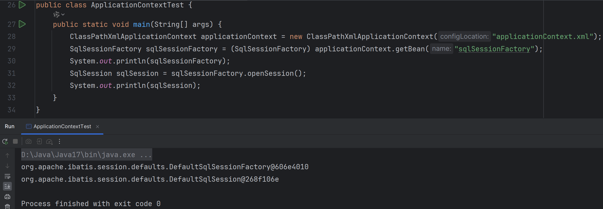


## 4. Bean 实例化的基本流程

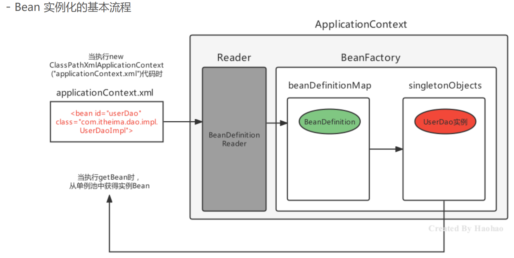


### 4.1 BeanDefinition

Spring容器在进行初始化时，会将xml配置的的信息封装成一个BeanDefinition对象，所有的 BeanDefinition存储到一个名为`beanDefinitionMap` 的Map集合中去，Spring框架在对该Map进行遍历，使用反射创建Bean实例对象，创建好的Bean对象存储在一个名为`singletonObjects`的Map集合中，当调用getBean方法 时则最终从该Map集合中取出Bean实例对象返回。

<br>

applicationContext.xml

```xml
<?xml version="1.0" encoding="UTF-8"?>
<beans xmlns="http://www.springframework.org/schema/beans"
       xmlns:xsi="http://www.w3.org/2001/XMLSchema-instance"
       xsi:schemaLocation="
       http://www.springframework.org/schema/beans
       http://www.springframework.org/schema/beans/spring-beans.xsd">

    <bean id="userService" class="com.wood.service.impl.UserServiceImpl"/>

    <bean id="userDao" class="com.wood.dao.impl.UserDaoImpl"/>
</beans>
```

<br>

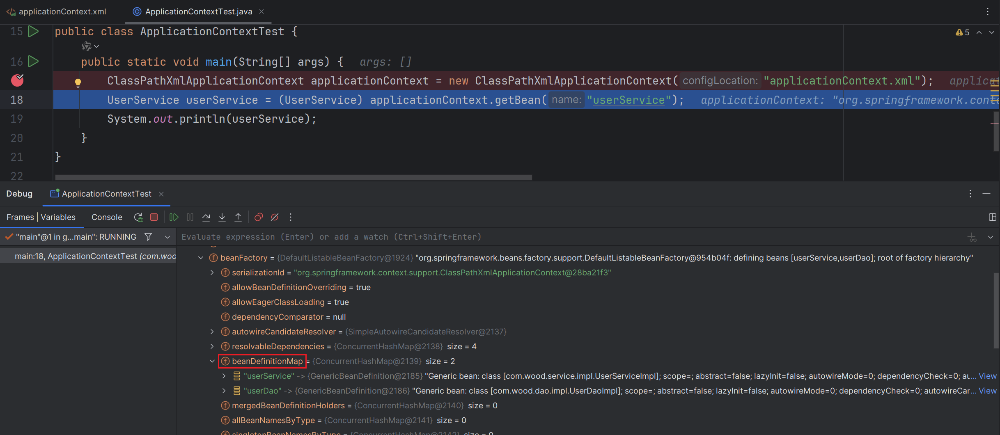

可以看到 beanDefinitionMap中有key为userService、userDao的元素。但它们的value是BeanDefinition。

<br>

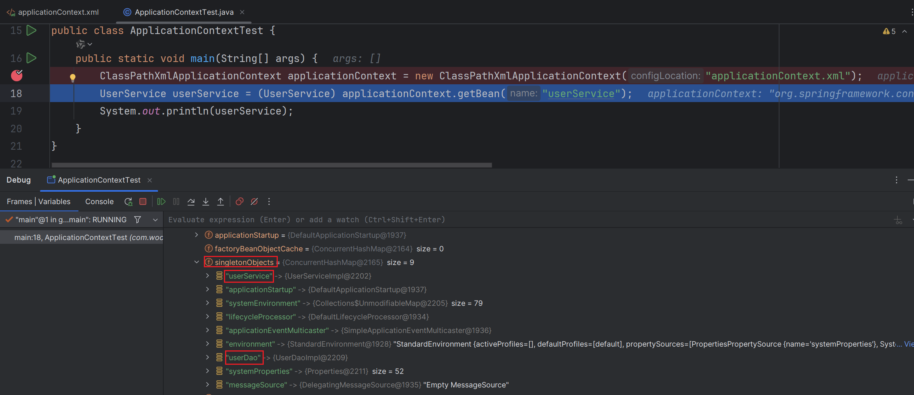

与此同时，singletonObjects中有userService、userDao对象。

<br>

Bean 实例化的基本流程

- 加载xml配置文件，解析获取配置中的每个的信息，封装成一个个的BeanDefinition对象;
- 将BeanDefinition存储在一个名为beanDefinitionMap的Map中;
- ApplicationContext底层遍历beanDefinitionMap，创建Bean实例对象; 
- 创建好的Bean实例对象，被存储到一个名为singletonObjects的Map中; 
- 当执行applicationContext.getBean(beanName)时，从singletonObjects去匹配Bean实例返回。


### 4.2 其他

`DefaultListableBeanFactory`对象内部维护着一个Map用于存储封装好的BeanDefinitionMap

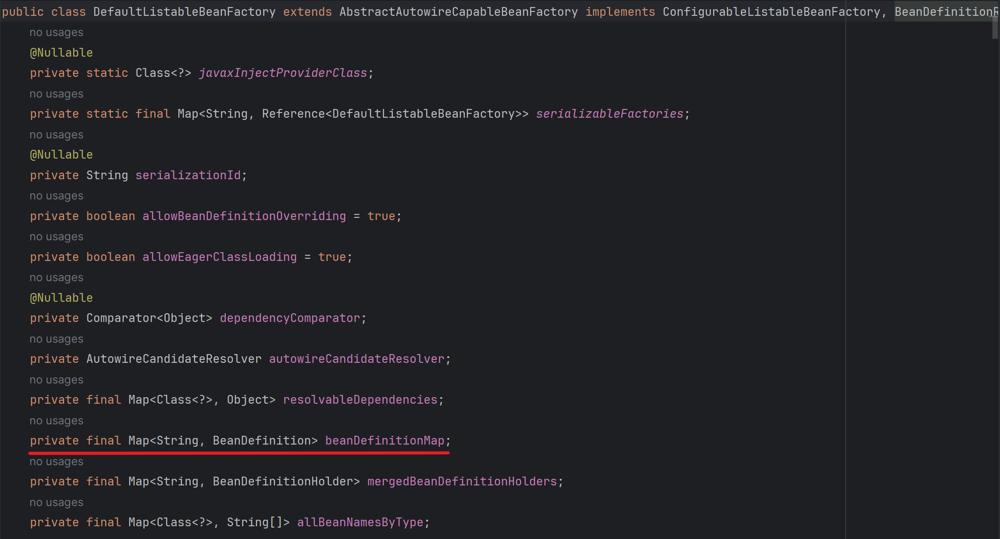

Spring框架会取出beanDefinitionMap中的每个BeanDefinition信息，反射构造方法或调用指定的工厂方法 生成Bean实例对象，所以只要将BeanDefinition注册到beanDefinitionMap这个Map中，Spring就会进行对应的Bean的实例化操作。

<br>

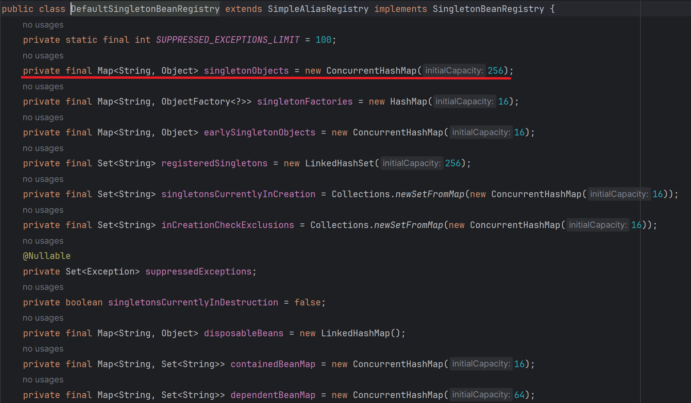

Bean实例及单例池singletonObjects， beanDefinitionMap中的BeanDefinition会被转化成对应的Bean实例对象 ，存储到单例池singletonObjects中去，在DefaultListableBeanFactory的上四级父类 DefaultSingletonBeanRegistry中，维护着singletonObjects。


##  5.  Spring的后处理器

Spring的后处理器是Spring对外开发的重要扩展点，允许我们介入到Bean的整个实例化流程中来，以达到动态注册 BeanDefinition，动态修改BeanDefinition，以及动态修改Bean的作用。

Spring主要有两种后处理器： 

- BeanFactoryPostProcessor：Bean工厂后处理器，在BeanDefinitionMap填充完毕，Bean实例化之前执行。
- BeanPostProcessor：Bean后处理器，一般在Bean实例化之后，填充到单例池singletonObjects之前执行。


### 5.1 Bean工厂后处理器 – BeanFactoryPostProcessor

 BeanFactoryPostProcessor是一个接口规范，实现了该接口的类只要交由Spring容器管理的话，那么Spring就会回 调该接口的方法，用于对BeanDefinition注册和修改的功能。

BeanFactoryPostProcessor 定义如下：

```java
@FunctionalInterface
public interface BeanFactoryPostProcessor {
    void postProcessBeanFactory(ConfigurableListableBeanFactory var1) throws BeansException;
}
```


#### 5.1.1 快速入门

```java
public class MyBeanFactoryPostProcessor implements BeanFactoryPostProcessor {
    @Override
    public void postProcessBeanFactory(ConfigurableListableBeanFactory configurableListableBeanFactory) throws BeansException {
        System.out.println("MyBeanFactoryPostProcessor执行了...");
    }
}
```

<br>

```xml
<?xml version="1.0" encoding="UTF-8"?>
<beans xmlns="http://www.springframework.org/schema/beans"
       xmlns:xsi="http://www.w3.org/2001/XMLSchema-instance"
       xsi:schemaLocation="
       http://www.springframework.org/schema/beans
       http://www.springframework.org/schema/beans/spring-beans.xsd">

    <bean id="userService" class="com.wood.service.impl.UserServiceImpl"/>

    <bean id="userDao" class="com.wood.dao.impl.UserDaoImpl"/>

    <bean class="com.wood.processor.MyBeanFactoryPostProcessor"/>
</beans>
```

<br>

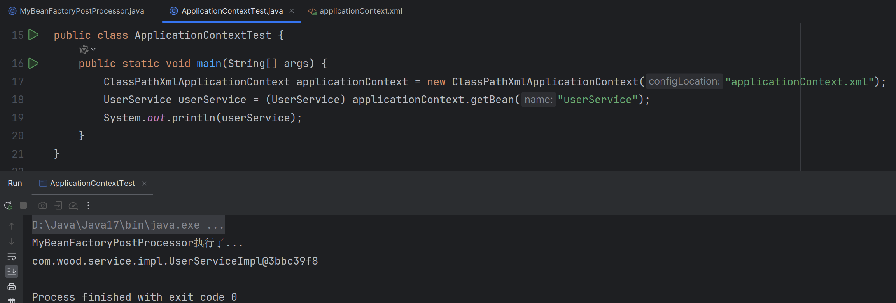

<br>

```java
public class MyBeanFactoryPostProcessor implements BeanFactoryPostProcessor {
    @Override
    public void postProcessBeanFactory(ConfigurableListableBeanFactory beanFactory) throws BeansException {
        System.out.println("MyBeanFactoryPostProcessor执行了...");
        BeanDefinition beanDefinition = beanFactory.getBeanDefinition("userService");
        beanDefinition.setBeanClassName("com.wood.dao.impl.UserDaoImpl");
    }
}
```

我们在此做些手脚，将key为userService的BeanDefinition，它的beanClassName改为com.wood.dao.impl.UserDaoImpl。

<br>

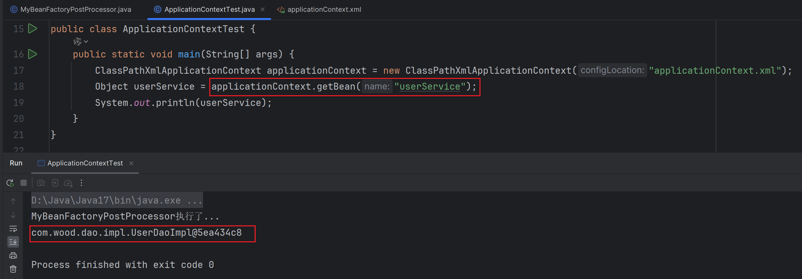

可以看到，我们getBean时方法参数虽然写的是"userService"，可最后获取的是UserDaoImpl对象。


#### 5.1.2 工厂后处理器注册BeanDefinition

```java
public interface PersonDao {
}

public class PersonDaoImpl implements PersonDao {
}
```

现在我们写了两个新类，但我们并没有在xml文件配置，此时Spring容器显然拿不到beanName为PersonDao的bean。

<br>

```java
public class MyBeanFactoryPostProcessor implements BeanFactoryPostProcessor {
    @Override
    public void postProcessBeanFactory(ConfigurableListableBeanFactory beanFactory) throws BeansException {
        System.out.println("MyBeanFactoryPostProcessor执行了...");
        DefaultListableBeanFactory defaultListableBeanFactory = (DefaultListableBeanFactory) beanFactory;

        BeanDefinition beanDefinition = new RootBeanDefinition();
        beanDefinition.setBeanClassName("com.wood.dao.impl.PersonDaoImpl");
        defaultListableBeanFactory.registerBeanDefinition("personDao", beanDefinition);
    }
}
```

因为ConfigurableListableBeanFactory没有注册BeanDefinition的方法，所以我们需要强转成子类DefaultListableBeanFactory。

<br>

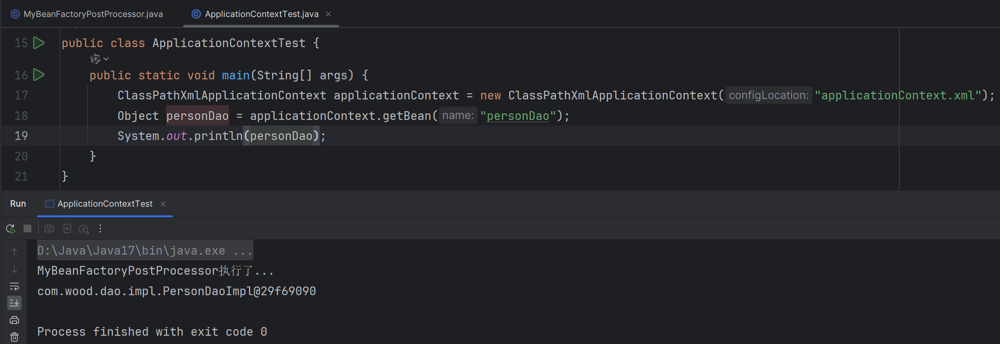


#### 5.1.3 BeanDefinitionRegistryPostProcessor

Spring 提供了一个BeanFactoryPostProcessor的子接口BeanDefinitionRegistryPostProcessor专门用于注册 BeanDefinition操作。

```java
public interface BeanDefinitionRegistryPostProcessor extends BeanFactoryPostProcessor {
    void postProcessBeanDefinitionRegistry(BeanDefinitionRegistry var1) throws BeansException;
}
```

<br>


```java
public class MyBeanDefinitionRegistryPostProcessor implements BeanDefinitionRegistryPostProcessor {
    @Override
    public void postProcessBeanDefinitionRegistry(BeanDefinitionRegistry beanDefinitionRegistry) throws BeansException {
        BeanDefinition beanDefinition = new RootBeanDefinition();
        beanDefinition.setBeanClassName("com.wood.dao.impl.PersonDaoImpl");
        beanDefinitionRegistry.registerBeanDefinition("personDao", beanDefinition);
    }

    @Override
    public void postProcessBeanFactory(ConfigurableListableBeanFactory configurableListableBeanFactory) throws BeansException {

    }
}
```

<br>

```xml
<?xml version="1.0" encoding="UTF-8"?>
<beans xmlns="http://www.springframework.org/schema/beans"
       xmlns:xsi="http://www.w3.org/2001/XMLSchema-instance"
       xsi:schemaLocation="
       http://www.springframework.org/schema/beans
       http://www.springframework.org/schema/beans/spring-beans.xsd">

    <bean id="userService" class="com.wood.service.impl.UserServiceImpl"/>

    <bean id="userDao" class="com.wood.dao.impl.UserDaoImpl"/>

    <bean class="com.wood.processor.MyBeanFactoryPostProcessor"/>

    <bean class="com.wood.processor.MyBeanDefinitionRegistryPostProcessor"/>
    
</beans>
```

在Spring容器中注入MyBeanDefinitionRegistryPostProcessor。

<br>

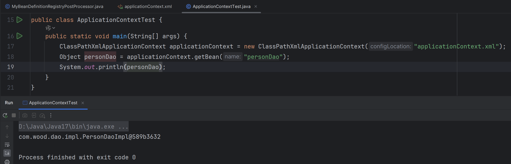


#### 5.1.4 完善实例化基本流程图


#### 5.1.5 扩展

使用Spring的BeanFactoryPostProcessor扩展点完成自定义注解扫描。

要求如下：

- 自定义@MyComponent注解，使用在类上。
- 使用资料中提供好的包扫描器工具BaseClassScanUtils 完成指定包的类扫描。
- 自定义BeanFactoryPostProcessor完成注解@MyComponent的解析，解析后最终被Spring管理。

<br>

##### 自定义@MyComponent注解

```java
@Target(ElementType.TYPE)
@Retention(RetentionPolicy.RUNTIME)
public @interface MyComponent {
    String value() default "";
}
```


##### 在类上使用@MyComponent

```java
@MyComponent("otherBean")
public class OtherBean {
}
```


##### 自定义BeanFactoryPostProcessor完成注解解析

```java
public class MyComponentBeanFactoryPostProcessor implements BeanDefinitionRegistryPostProcessor {
    @Override
    public void postProcessBeanDefinitionRegistry(BeanDefinitionRegistry beanDefinitionRegistry) throws BeansException {
        Map<String, Class> myComponentClassMap = BaseClassScanUtils.scanMyComponentAnnotation("com.wood");

        myComponentClassMap.forEach((beanName, clazz) -> {
            BeanDefinition beanDefinition = new RootBeanDefinition();
            beanDefinition.setBeanClassName(clazz.getName());
            beanDefinitionRegistry.registerBeanDefinition(beanName, beanDefinition);
        });
    }

    @Override
    public void postProcessBeanFactory(ConfigurableListableBeanFactory configurableListableBeanFactory) throws BeansException {

    }
}
```


##### BaseClassScanUtils

```java
public class BaseClassScanUtils {

    //设置资源规则
    private static final String RESOURCE_PATTERN = "/**/*.class";

    public static Map<String, Class> scanMyComponentAnnotation(String basePackage) {

        //创建容器存储使用了指定注解的Bean字节码对象
        Map<String, Class> annotationClassMap = new HashMap<String, Class>();

        //spring工具类，可以获取指定路径下的全部类
        ResourcePatternResolver resourcePatternResolver = new PathMatchingResourcePatternResolver();
        try {
            String pattern = ResourcePatternResolver.CLASSPATH_ALL_URL_PREFIX +
                    ClassUtils.convertClassNameToResourcePath(basePackage) + RESOURCE_PATTERN;
            Resource[] resources = resourcePatternResolver.getResources(pattern);
            //MetadataReader 的工厂类
            MetadataReaderFactory refractory = new CachingMetadataReaderFactory(resourcePatternResolver);
            for (Resource resource : resources) {
                //用于读取类信息
                MetadataReader reader = refractory.getMetadataReader(resource);
                //扫描到的class
                String classname = reader.getClassMetadata().getClassName();
                Class<?> clazz = Class.forName(classname);
                //判断是否属于指定的注解类型
                if(clazz.isAnnotationPresent(MyComponent.class)){
                    //获得注解对象
                    MyComponent annotation = clazz.getAnnotation(MyComponent.class);
                    //获得属value属性值
                    String beanName = annotation.value();
                    //判断是否为""
                    if(beanName!=null&&!beanName.equals("")){
                        //存储到Map中去
                        annotationClassMap.put(beanName,clazz);
                        continue;
                    }

                    //如果没有为"",那就把当前类的类名作为beanName
                    annotationClassMap.put(clazz.getSimpleName(),clazz);

                }
            }
        } catch (Exception exception) {
        }

        return annotationClassMap;
    }

    public static void main(String[] args) {
        Map<String, Class> stringClassMap = scanMyComponentAnnotation("com.wood");
        System.out.println(stringClassMap);
    }
}
```


##### applicationContext.xml

```xml
<?xml version="1.0" encoding="UTF-8"?>
<beans xmlns="http://www.springframework.org/schema/beans"
       xmlns:xsi="http://www.w3.org/2001/XMLSchema-instance"
       xsi:schemaLocation="
       http://www.springframework.org/schema/beans
       http://www.springframework.org/schema/beans/spring-beans.xsd">

    <bean id="userService" class="com.wood.service.impl.UserServiceImpl"/>

    <bean id="userDao" class="com.wood.dao.impl.UserDaoImpl"/>

    <bean class="com.wood.processor.MyComponentBeanFactoryPostProcessor"/>
</beans>
```

<br>

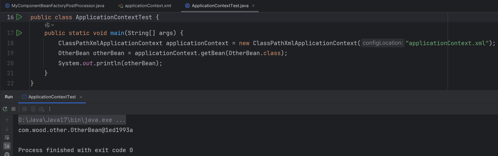


### 5.2 Bean后处理器 – BeanPostProcessor

Bean被实例化后，到最终缓存到名为singletonObjects单例池之前，中间会经过Bean的初始化过程，例如：属性的填充、初始方法init的执行等，其中有一个对外进行扩展的点BeanPostProcessor，我们称为Bean后处理。跟上面的 Bean工厂后处理器相似，它也是一个接口，实现了该接口并被容器管理的BeanPostProcessor，会在流程节点上被 Spring自动调用。

BeanPostProcessor的接口定义如下：

```java
public interface BeanPostProcessor {
    @Nullable
    default Object postProcessBeforeInitialization(Object bean, String beanName) throws BeansException {
        return bean;
    }

    @Nullable
    default Object postProcessAfterInitialization(Object bean, String beanName) throws BeansException {
        return bean;
    }
}
```


#### 5.2.1 快速入门

```java
public class UserDaoImpl implements UserDao {
    private String username;

    public void setUsername(String username) {
        this.username = username;
    }

    public UserDaoImpl() {
        System.out.println("UserDaoImpl实例化");
    }
}

public class UserServiceImpl implements UserService{

    public UserServiceImpl() {
        System.out.println("UserServiceImpl实例化");
    }

    public void show() {
        System.out.println(userDao);
    }


    public UserDao userDao;

    public void setUserDao(UserDao userDao) {
        this.userDao = userDao;
    }
}
```

<br>

```java
public class MyBeanPostProcessor implements BeanPostProcessor {

    @Override
    public Object postProcessBeforeInitialization(Object bean, String beanName) throws BeansException {
        System.out.println(bean + ":postProcessBeforeInitialization");

        if (bean instanceof UserDaoImpl) {
            UserDaoImpl userDao = (UserDaoImpl) bean;
            userDao.setUsername("Wood");

        }
        return bean;
    }

    @Override
    public Object postProcessAfterInitialization(Object bean, String beanName) throws BeansException {
        System.out.println(bean + ":postProcessAfterInitialization");
        return bean;
    }
}
```

<br>

```xml
<?xml version="1.0" encoding="UTF-8"?>
<beans xmlns="http://www.springframework.org/schema/beans"
       xmlns:xsi="http://www.w3.org/2001/XMLSchema-instance"
       xsi:schemaLocation="
       http://www.springframework.org/schema/beans
       http://www.springframework.org/schema/beans/spring-beans.xsd">

    <bean id="userService" class="com.wood.service.impl.UserServiceImpl"/>

    <bean id="userDao" class="com.wood.dao.impl.UserDaoImpl"/>

    <bean class="com.wood.processor.MyBeanPostProcessor"/>
</beans>
```

<br>

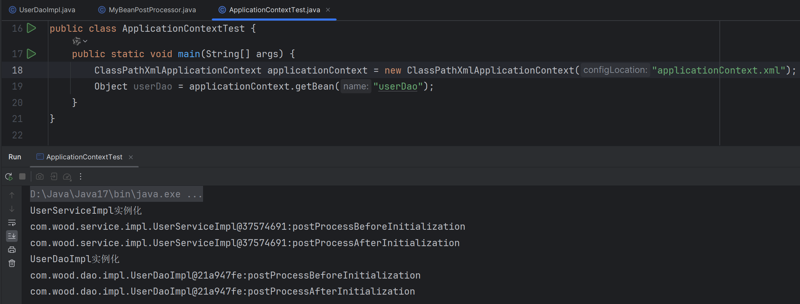

<br>

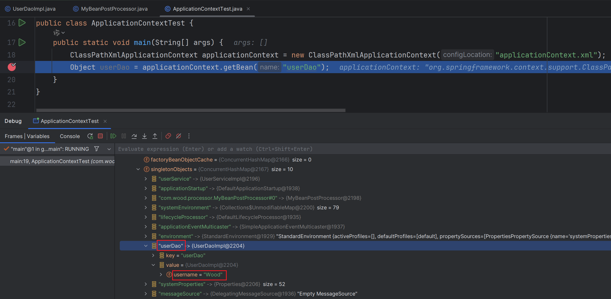

可以看到，在singletonObjects中存在userDao，它里面有个属性username，成功注入值"Wood"。

而这个值我们并没有在xml文件中配置，是在MyBeanPostProcessor中配置的。


#### 5.2.2 before和after方法的执行时机

```java
public class UserDaoImpl implements UserDao, InitializingBean {
    private String username;

    public void setUsername(String username) {
        this.username = username;
    }

    public UserDaoImpl() {
        System.out.println("UserDaoImpl实例化");
    }

    @Override
    public void afterPropertiesSet() throws Exception {
        System.out.println("InitializingBean 的 afterPropertiesSet方法" );
    }

    public void init(){
        System.out.println("UserDaoImpl的init方法");
    }
}
```

<br>

```xml
<?xml version="1.0" encoding="UTF-8"?>
<beans xmlns="http://www.springframework.org/schema/beans"
       xmlns:xsi="http://www.w3.org/2001/XMLSchema-instance"
       xsi:schemaLocation="
       http://www.springframework.org/schema/beans
       http://www.springframework.org/schema/beans/spring-beans.xsd">
    
    <bean id="userDao" class="com.wood.dao.impl.UserDaoImpl" init-method="init"/>

    <bean class="com.wood.processor.MyBeanPostProcessor"/>

</beans>
```

<br>

```java
public class MyBeanPostProcessor implements BeanPostProcessor {

    @Override
    public Object postProcessBeforeInitialization(Object bean, String beanName) throws BeansException {
        System.out.println(bean + ":postProcessBeforeInitialization");

        if (bean instanceof UserDaoImpl) {
            UserDaoImpl userDao = (UserDaoImpl) bean;
            userDao.setUsername("Wood");

        }
        return bean;
    }

    @Override
    public Object postProcessAfterInitialization(Object bean, String beanName) throws BeansException {
        System.out.println(bean + ":postProcessAfterInitialization");
        return bean;
    }
}
```

<br>

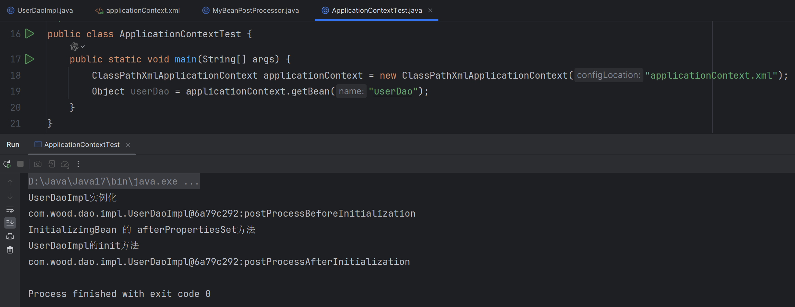


#### 5.2.3 再次完善实例化基本流程图

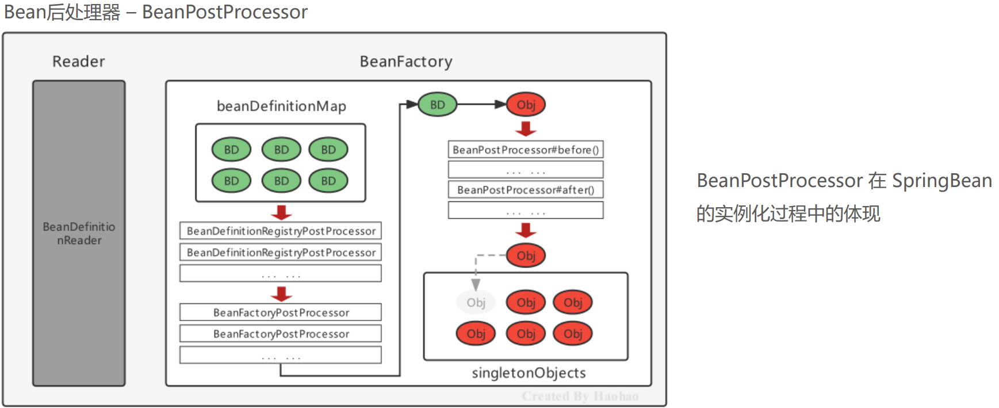


## 6. Spring Bean的生命周期

Spring Bean的生命周期是从 Bean 实例化之后，即通过反射创建出对象之后，到Bean成为一个完整对象，最终存储 到单例池中，这个过程被称为Spring Bean的生命周期。

Spring Bean的生命周期大体上分为三个阶段：

- Bean的实例化阶段：Spring框架会取出 `BeanDefinition` 的信息进行判断当前Bean的范围是否是singleton的， 是否不是延迟加载的，是否不是FactoryBean等，最终将一个普通的 singleton 的 Bean 通过反射进行实例化； 
- Bean的初始化阶段：Bean创建之后还仅仅是个"半成品"，还需要对Bean实例的属性进行填充、执行一些Aware 接口方法、执行`BeanPostProcessor` 方法、执行 `InitializingBean` 接口的初始化方法、执行自定义初始化init方法 等。该阶段是Spring最具技术含量和复杂度的阶段，Aop增强功能，后面要学习的Spring的注解功能等、 spring高频面试题Bean的循环引用问题都是在这个阶段体现的；
- Bean的完成阶段：经过初始化阶段，Bean就成为了一个完整的Spring Bean，被存储到单例池 `singletonObjects` 中去了，即完成了Spring Bean的整个生命周期。


### 6.1 Bean的初始化阶段

Spring Bean的初始化过程涉及如下几个过程：

- Bean实例的属性填充 
- Aware接口属性注入 
- BeanPostProcessor的before()方法回调
-  InitializingBean接口的初始化方法回调
-  自定义初始化方法init回调 
- BeanPostProcessor的after()方法回调

后面四条我们之前已经验证过了。


#### 6.1.1 Bean实例属性填充

```java
public class UserServiceImpl implements UserService{

    private UserDao userDao;
    private String username;

    public void setUsername(String username) {
        this.username = username;
    }

    public void setUserDao(UserDao userDao) {
        this.userDao = userDao;
    }
}
```

<br>

```xml
<?xml version="1.0" encoding="UTF-8"?>
<beans xmlns="http://www.springframework.org/schema/beans"
       xmlns:xsi="http://www.w3.org/2001/XMLSchema-instance"
       xsi:schemaLocation="
       http://www.springframework.org/schema/beans
       http://www.springframework.org/schema/beans/spring-beans.xsd">

    <bean id="userService" class="com.wood.service.impl.UserServiceImpl">
        <property name="userDao" ref="userDao"/>
        <property name="username" value="Wood"/>
    </bean>

    <bean id="userDao" class="com.wood.dao.impl.UserDaoImpl"/>
    
</beans>
```

<br>

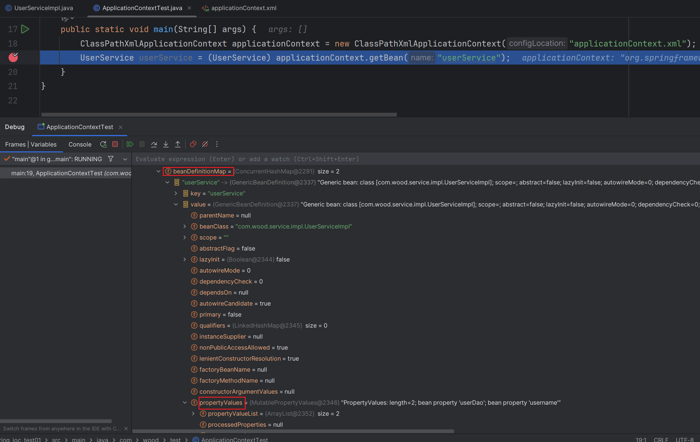

<br>

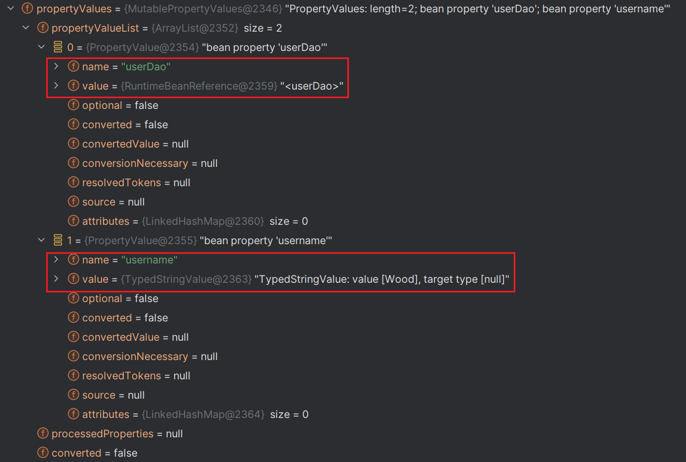

在UserServiceImpl中，有两个属性需要填充，分别是userDao和username。

BeanDefinition 中有对当前Bean实体的注入信息通过属性propertyValues进行了存储。

当你在配置文件中，配置Bean需要的注入信息时，这些注入信息也会被封装到 BeanDefinition 当中。当Spring 创建完对象之后，它会从

BeanDefinition 中取出到底有没有需要注入的信息。有注入的信息，才会执行注入操作。

 后期Spring 会从BeanDefinition 中取出propertyValues，需要userDao，因为是引用类型，会从容器中找userDao类型注入，反射调set方法。需要普通字符串，直接解析出字符串的值，通过反射set进去。


#### 6.1.2 属性注入的三种情况

Bean实例属性填充 Spring在进行属性注入时，会分为如下几种情况：  

- 注入普通属性，String、int或存储基本类型的集合时，直接通过set方法的反射设置进去； 
- 注入单向对象引用属性时，从容器中getBean获取后通过set方法反射设置进去，如果容器中没有，则先创建被 注入对象Bean实例（完成整个生命周期）后，在进行注入操作；
-  注入双向对象引用属性时，就比较复杂了，涉及了循环引用（循环依赖）问题，下面会详细阐述解决方案。


 #### 6.1.3 循环依赖

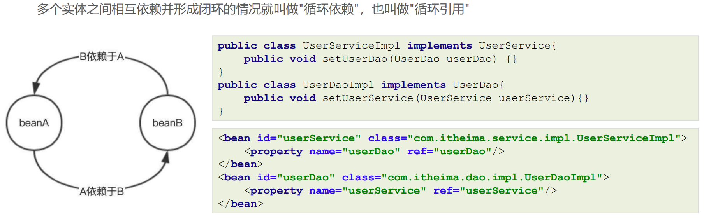

<br>

Spring提供了三级缓存存储 完整Bean实例 和 半成品Bean实例 ，用于解决循环引用问题。

在DefaultListableBeanFactory的上四级父类DefaultSingletonBeanRegistry中提供如下三个Map：


<br>

UserService和UserDao循环依赖的过程结合上述三级缓存描述一下

- UserService 实例化对象，但尚未初始化，将UserService存储到三级缓存
-  UserService 属性注入，需要UserDao，从缓存中获取，没有UserDao
-  UserDao实例化对象，但尚未初始化，将UserDao存储到到三级缓存
-  UserDao属性注入，需要UserService，从三级缓存获取UserService，UserService从三级缓存移入二级缓存
-  UserDao执行其他生命周期过程，最终成为一个完成Bean，存储到一级缓存，删除二三级缓存
- UserService 注入UserDao
- UserService执行其他生命周期过程，最终成为一个完成Bean，存储到一级缓存，删除二三级缓存。


#### 6.1.4 Aware接口

Aware接口是一种框架辅助属性注入的一种思想，其他框架中也可以看到类似的接口。框架具备高度封装性，我们接 触到的一般都是业务代码，一个底层功能API不能轻易的获取到，但是这不意味着永远用不到这些对象，如果用到了 ，就可以使用框架提供的类似Aware的接口，让框架给我们注入该对象。

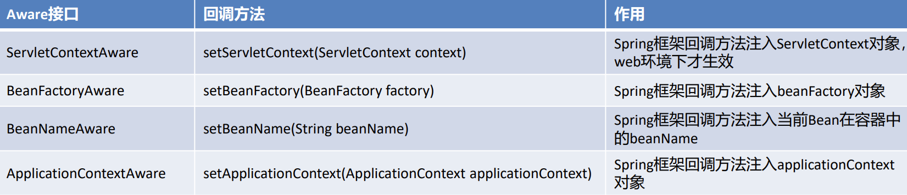


### 6.2 Spring IoC 整体流程总结

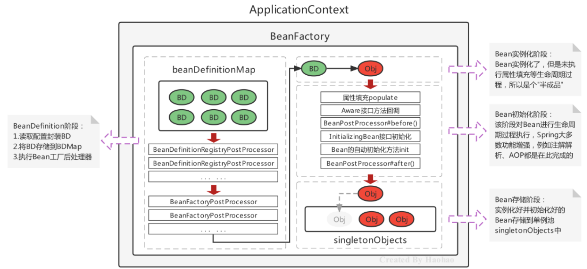


## 7. Spring xml方式整合第三方框架

xml整合第三方框架有两种整合方案：

- 不需要自定义名空间，不需要使用Spring的配置文件配置第三方框架本身内容，例如：MyBatis；
- 需要引入第三方框架命名空间，需要使用Spring的配置文件配置第三方框架本身内容，例如：Dubbo。


### 7.1 Spring整合MyBatis

Spring整合MyBatis，之前已经在Spring中简单的配置了SqlSessionFactory，但是这不是正规的整合方式， MyBatis提供了mybatis-spring.jar专门用于两大框架的整合。 

Spring整合MyBatis的步骤如下：

- 导入MyBatis整合Spring的相关坐标
- 编写Mapper和Mapper.xml
- 配置SqlSessionFactoryBean和MapperScannerConfigurer
- 编写测试代码


#### MyBatis原始操作代码

```java
@Data
@NoArgsConstructor
@AllArgsConstructor
public class User {
    private Integer id;
    private String username;
    private String password;
}
```

<br>

mybatis-config.xml

```xml
<?xml version="1.0" encoding="UTF-8" ?>
<!DOCTYPE configuration
        PUBLIC "-//mybatis.org//DTD Config 3.0//EN"
        "https://mybatis.org/dtd/mybatis-3-config.dtd">
<configuration>
    <environments default="development">
        <environment id="development">
            <transactionManager type="JDBC"/>
            <dataSource type="POOLED">
                <property name="driver" value="com.mysql.jdbc.Driver"/>
                <property name="url" value="jdbc:mysql://localhost:3306/test"/>
                <property name="username" value="root"/>
                <property name="password" value="1234"/>
            </dataSource>
        </environment>
    </environments>
    
    <mappers>
        <mapper resource="com/wood/mapper/UserMapper.xml"/>
    </mappers>
</configuration>
```

<br>

UserMapper.xml

```xml
<?xml version="1.0" encoding="UTF-8" ?>
<!DOCTYPE mapper PUBLIC "-//mybatis.org//DTD Mapper 3.0//EN" "http://mybatis.org/dtd/mybatis-3-mapper.dtd">
<mapper namespace="com.wood.mapper.UserMapper">
    <select id="findAll" resultType="com.wood.pojo.User">
        select * from user
    </select>
</mapper>
```

<br>

```java
public class MyBatisTest {
    public static void main(String[] args) throws IOException {
        InputStream in = Resources.getResourceAsStream("mybatis-config.xml");
        SqlSessionFactoryBuilder builder = new SqlSessionFactoryBuilder();
        SqlSessionFactory sqlSessionFactory = builder.build(in);
        SqlSession sqlSession = sqlSessionFactory.openSession();
        UserMapper mapper = sqlSession.getMapper(UserMapper.class);
        List<User> all = mapper.findAll();
        for (User user : all) {
            System.out.println(user);
        }
    }
}
```

<br>

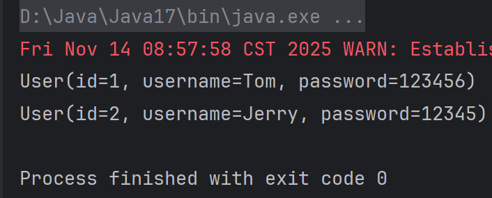


#### 开始整合


##### 导入MyBatis整合Spring的相关坐标

```xml
<!-- mysql驱动 -->
<dependency>
    <groupId>mysql</groupId>
    <artifactId>mysql-connector-java</artifactId>
    <version>5.1.49</version>
</dependency>
<!-- druid数据源 -->
<dependency>
    <groupId>com.alibaba</groupId>
    <artifactId>druid</artifactId>
    <version>1.1.23</version>
</dependency>
<!--mybatis框架-->
<dependency>
    <groupId>org.mybatis</groupId>
    <artifactId>mybatis</artifactId>
    <version>3.5.5</version>
</dependency>
<!-- mysql驱动 -->
<dependency>
    <groupId>mysql</groupId>
    <artifactId>mysql-connector-java</artifactId>
    <version>5.1.49</version>
</dependency>
<dependency>
    <groupId>org.mybatis</groupId>
    <artifactId>mybatis-spring</artifactId>
    <version>2.0.4</version>
</dependency>
<dependency>
    <groupId>org.springframework</groupId>
    <artifactId>spring-jdbc</artifactId>
    <version>5.2.15.RELEASE</version>
</dependency>
```


##### 编写Mapper和Mapper.xml

上面已经做过了


##### 配置SqlSessionFactoryBean和MapperScannerConfigurer

```xml
<?xml version="1.0" encoding="UTF-8"?>
<beans xmlns="http://www.springframework.org/schema/beans"
       xmlns:xsi="http://www.w3.org/2001/XMLSchema-instance"
       xsi:schemaLocation="
       http://www.springframework.org/schema/beans
       http://www.springframework.org/schema/beans/spring-beans.xsd">

    <bean id="dataSource" class="com.alibaba.druid.pool.DruidDataSource">
        <property name="url" value="jdbc:mysql://localhost:3306/test"/>
        <property name="username" value="root"/>
        <property name="password" value="1234"/>
        <property name="driverClassName" value="com.mysql.jdbc.Driver"/>
    </bean>

    <!-- 配置SqlSessionFactoryBean,作用将SqlSessionFactory存储到spring容器 -->
    <bean class="org.mybatis.spring.SqlSessionFactoryBean">
        <property name="dataSource" ref="dataSource"/>
    </bean>

    <!-- MapperScannerConfigurer,作用扫描指定的包，产生Mapper.对象存储到Spring容器 -->
    <bean class="org.mybatis.spring.mapper.MapperScannerConfigurer">
        <property name="basePackage" value="com.wood.mapper"/>
    </bean>


    <bean id="userService" class="com.wood.service.impl.UserServiceImpl">
        <property name="userMapper" ref="userMapper"/>
    </bean>
</beans>
```

<br>

```java
public interface UserService {
    void show();
}

public class UserServiceImpl implements UserService{
    private UserMapper userMapper;

    public void setUserMapper(UserMapper userMapper) {
        this.userMapper = userMapper;
    }

    @Override
    public void show() {
        List<User> all = userMapper.findAll();
        for (User user : all) {
            System.out.println(user);
        }
    }
}
```

<br>

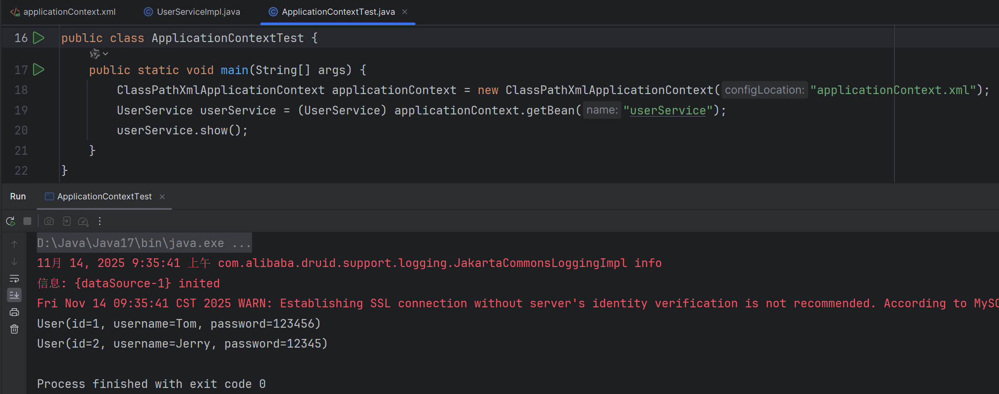


#### Spring整合MyBatis的原理剖析

整合包里提供了一个SqlSessionFactoryBean和一个扫描Mapper的配置对象，SqlSessionFactoryBean一旦被实例 化，就开始扫描Mapper并通过动态代理产生Mapper的实现类存储到Spring容器中。

相关的有如下四个类：

- SqlSessionFactoryBean：需要进行配置，用于提供SqlSessionFactory。
-  MapperScannerConfigurer：需要进行配置，用于扫描指定mapper注册BeanDefinition。
- MapperFactoryBean：Mapper的FactoryBean，获得指定Mapper时调用getObject方法。
-  ClassPathMapperScanner：definition.setAutowireMode(2) 修改了自动注入状态，所以 MapperFactoryBean中的setSqlSessionFactory会自动注入进去。


##### SqlSessionFactoryBean

配置SqlSessionFactoryBean作用是向容器中提供SqlSessionFactory。

SqlSessionFactoryBean实现了 `FactoryBean` 和 `InitializingBean` 两个接口，所以会自动执行 getObject() 和 afterPropertiesSet() 方法。

```java
public class SqlSessionFactoryBean implements FactoryBean<SqlSessionFactory>, InitializingBean{
    public void afterPropertiesSet() throws Exception {
        //创建SqlSessionFactory对象
        this.sqlSessionFactory = this.buildSqlSessionFactory();
    }
    
    public SqlSessionFactory getObject() throws Exception {
        return this.sqlSessionFactory;
    }
}
```


##### MapperScannerConfigurer

配置MapperScannerConfigurer作用是扫描Mapper，向容器中注册Mapper对应的MapperFactoryBean。

MapperScannerConfigurer实现了BeanDefinitionRegistryPostProcessor和InitializingBean两个接口，会在 postProcessBeanDefinitionRegistry 方法中向容器中注册 MapperFactoryBean。

```java
public class MapperScannerConfigurer implements BeanDefinitionRegistryPostProcessor, InitializingBean{
    public void postProcessBeanDefinitionRegistry(BeanDefinitionRegistry registry) {
    	ClassPathMapperScanner scanner = new ClassPathMapperScanner(registry);
    	scanner.scan(StringUtils.tokenizeToStringArray(this.basePackage, ",; \t\n"));
    }
}
```


### 7.2 加载外部properties文件


# 三、基于注解的Spring应用


## 1. Bean基本注解开发

基本Bean注解，主要是使用注解的方式替代原有xml的标签及其标签属性的配置。

```xml
<bean id="" name="" class="" scope="" lazy-init="" init-method="" destroy-method=""
abstract="" autowire="" factory-bean="" factory-method=""></bean>
```

<br>

使用@Component 注解替代标签

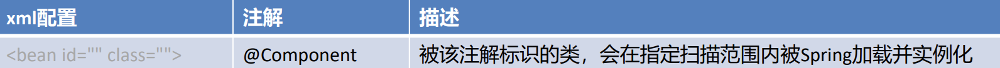


### 1.1 @Component 基本使用

```java
public interface UserDao {
}

@Component("userDao")
public class UserDaoImpl implements UserDao {
}
```

<br>

```java
public interface UserService {
}

@Component("userService")
public class UserServiceImpl implements UserService {
}
```

<br>

applicationContext.xml

```xml
<?xml version="1.0" encoding="UTF-8"?>
<beans xmlns="http://www.springframework.org/schema/beans"
       xmlns:xsi="http://www.w3.org/2001/XMLSchema-instance"
       xmlns:context="http://www.springframework.org/schema/context"
       xsi:schemaLocation="
       http://www.springframework.org/schema/beans
       http://www.springframework.org/schema/beans/spring-beans.xsd
       http://www.springframework.org/schema/context
       http://www.springframework.org/schema/context/spring-context.xsd">

    <context:component-scan base-package="com.wood"/>
</beans>
```

<br>

```java
public class ApplicationContextTest {
    public static void main(String[] args) {
        ApplicationContext applicationContext = new ClassPathXmlApplicationContext("applicationContext.xml");
        Object userService = applicationContext.getBean("userService");
        Object userDao = applicationContext.getBean("userDao");
        System.out.println(userService);
        System.out.println(userDao);
    }
}
```

<br>

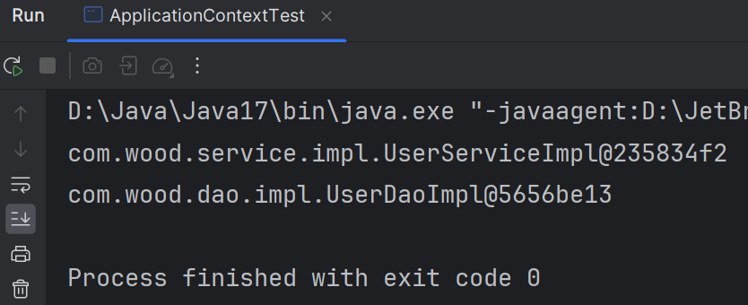

注意：如果没有在@Component指定beanName，那么默认是类名首字母小写。


### 1.2 注解指定Bean属性

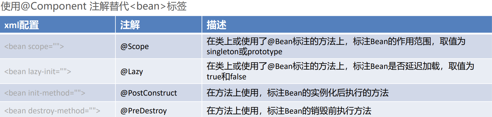

<br>

pom.xml

```xml
<dependency>
    <groupId>org.springframework</groupId>
    <artifactId>spring-context</artifactId>
    <version>5.3.9</version>
</dependency>

<dependency>
    <groupId>javax.annotation</groupId>
    <artifactId>javax.annotation-api</artifactId>
    <version>1.3.2</version>
</dependency>
```

<br>

```java
@Component("userDao")
@Scope("singleton")
@Lazy(true)
public class UserDaoImpl implements UserDao {

    public UserDaoImpl() {
        System.out.println("UserDaoImpl实例化");
    }

    @PostConstruct
    public void init(){
        System.out.println("UserDaoImpl init方法");
    }

    @PreDestroy
    public void destroy(){
        System.out.println("UserDaoImpl destroy方法");
    }
}
```

<br>

```java
public class ApplicationContextTest {
    public static void main(String[] args) {
        ClassPathXmlApplicationContext applicationContext = new ClassPathXmlApplicationContext("applicationContext.xml");
        Object userService = applicationContext.getBean("userService");
        Object userDao = applicationContext.getBean("userDao");
        System.out.println(userService);
        System.out.println(userDao);
        applicationContext.close();
    }
}
```

<br>

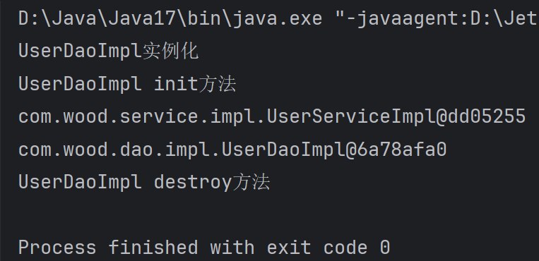


### 1.3 @Component衍生注解

由于JavaEE开发是分层的，为了每层Bean标识的注解语义化更加明确，@Component又衍生出如下三个注解：

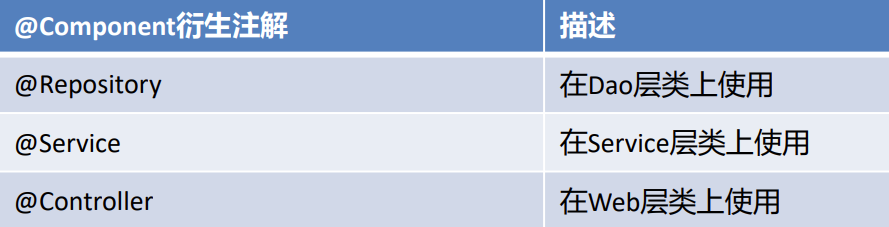


## 2. Bean依赖注入注解开发


