# 一、Spring快速入门


## 1. BeanFactory版本的快速入门


### 1.1 BeanFactory完成IoC思想的实现


#### 1）导入Spring的jar包或Maven坐标

```xml
<dependency>
    <groupId>org.springframework</groupId>
    <artifactId>spring-context</artifactId>
    <version>5.3.7</version>
</dependency>
```


#### 2）定义UserService接口及其UserServiceImpl实现类

```java
public interface UserService {
}
```


```java
public class UserServiceImpl implements UserService {
}
```


#### 3）创建beans.xml配置文件，将UserServiceImpl的信息配置到该xml中


<br>


<br>

**id** 为Bean的唯一标识，**class** 为Bean的全限定名，Spring框架根据全限定名找到类，然后通过反射制造Bean。

```xml
<?xml version="1.0" encoding="UTF-8"?>
<beans xmlns="http://www.springframework.org/schema/beans"
       xmlns:xsi="http://www.w3.org/2001/XMLSchema-instance"
       xsi:schemaLocation="http://www.springframework.org/schema/beans
                           http://www.springframework.org/schema/beans/spring-beans.xsd">

    <bean id="userService" class="com.service.impl.UserServiceImpl"></bean>
</beans>
```


#### 4）编写测试代码，创建BeanFactory，加载配置文件，获取UserService实例对象

```java
public class BeanFactoryTest {
    public static void main(String[] args) {
        //创建BeanFactory
        DefaultListableBeanFactory beanFactory = new DefaultListableBeanFactory();
        //创建读取器
        XmlBeanDefinitionReader reader = new XmlBeanDefinitionReader(beanFactory);
        //加载配置文件
        reader.loadBeanDefinitions("beans.xml");
        //获取Bean实例对象
        UserService userService = (UserService) beanFactory.getBean("userService");

        System.out.println(userService);
    }
}
```


### 1.2 BeanFactory实现DI依赖注入

#### 1）定义UserDao接口及其UserDaoImpl实现类

```java
public interface UserDao {
}
```


```java
public class UserDaoImpl implements UserDao {
}
```


#### 2）修改UserServiceImpl代码，添加一个setUserDao(UserDao userDao)用于接收注入的对象

```java
public class UserServiceImpl implements UserService {
    private UserDao userDao;
    
    public void setUserDao(UserDao userDao) {
        System.out.println("BeanFactory调用setUserDao方法：" + userDao);
        this.userDao = userDao;
    }
}
```


#### 3）定义UserDao接口及其UserDaoImpl实现类


```xml
<?xml version="1.0" encoding="UTF-8"?>
<beans xmlns="http://www.springframework.org/schema/beans"
       xmlns:xsi="http://www.w3.org/2001/XMLSchema-instance"
       xsi:schemaLocation="http://www.springframework.org/schema/beans
                           http://www.springframework.org/schema/beans/spring-beans.xsd">

    <bean id="userService" class="com.wood.service.impl.UserServiceImpl">
        <property name="userDao" ref="userDao"></property>
    </bean>

    <bean id="userDao" class="com.wood.dao.impl.UserDaoImpl"/>
</beans>
```


#### 4）编写测试代码，创建BeanFactory，加载配置文件，获取UserService实例对象

```java
public class BeanFactoryTest {
    public static void main(String[] args) {
        //创建BeanFactory
        DefaultListableBeanFactory beanFactory = new DefaultListableBeanFactory();
        //创建读取器
        XmlBeanDefinitionReader reader = new XmlBeanDefinitionReader(beanFactory);
        //加载配置文件
        reader.loadBeanDefinitions("beans.xml");
        //获取Bean实例对象
        UserService userService = (UserService) beanFactory.getBean("userService");

        System.out.println(userService);
    }
}
```


##### 运行结果


## 2. ApplicationContext快速入门


### 2.1 ApplicationContext继承关系


**ApplicationContext** 本身是一个接口，所以我们不能直接new它，只能new它的实现类。


### 2.2 代码

applicationContext.xml 内容与 beans.xml 一样，是直接copy得到的。

```java
public class ApplicationContextTest {
    public static void main(String[] args) {
        ApplicationContext applicationContext = new ClassPathXmlApplicationContext("applicationContext.xml");
        UserService userService = (UserService) applicationContext.getBean("userService");
        System.out.println(userService);
    }
}
```


#### 运行结果


## 3. BeanFactory与ApplicationContext的关系


### 3.1 概述

1. BeanFactory是Spring的早期接口，称为Spring的Bean工厂，ApplicationContext是后期更高级接口，称之为 Spring 容器。
2. ApplicationContext在BeanFactory基础上对功能进行了扩展，例如：监听功能、国际化功能等。BeanFactory的 API更偏向底层，ApplicationContext的API大多数是对这些底层API的封装；
3. Bean创建的主要逻辑和功能都被封装在BeanFactory中，ApplicationContext不仅继承了BeanFactory，而且 ApplicationContext内部还维护着BeanFactory的引用，所以，ApplicationContext与BeanFactory既有继承关系，又 有融合关系。 
4. Bean的初始化时机不同，原始BeanFactory是在首次调用getBean时才进行Bean的创建，而ApplicationContext则 是配置文件加载，容器一创建就将Bean都实例化并初始化好。


### 3.2 继承体系图


### 3.3 Debug测试


ApplicationContext继承BeanFactory的同时，还包含BeanFactory。每次ApplicationContext调用getBean方法时，其实是调用BeanFactory的getBean方法。


## 4. BeanFactory的继承体系


BeanFactory是一个接口，之前我们都是new DefaultListableBeanFactory。


## 5. ApplicationContext的继承体系

只在Spring基础环境下，即只导入spring-context坐标时，此时ApplicationContext的继承体系：


只在Spring基础环境下，常用的三个ApplicationContext作用如下：


如果Spring基础环境中加入了其他组件解决方案，如web层解决方案，即导入spring-web坐标，此时 ApplicationContext的继承体系：

```xml
<dependency>
    <groupId>org.springframework</groupId>
    <artifactId>spring-web</artifactId>
    <version>5.3.7</version>
</dependency>
```

<br>


<br>

在Spring的web环境下，常用的两个ApplicationContext作用如下：


# 二、 基于xml的Spring应用


## 1. SpringBean 的配置详解


### 1.1 Bean的常用配置概览


### 1.2 beanName和别名配置


#### 关于id

**applicationContext.xml**

```xml
<?xml version="1.0" encoding="UTF-8"?>
<beans xmlns="http://www.springframework.org/schema/beans"
       xmlns:xsi="http://www.w3.org/2001/XMLSchema-instance"
       xsi:schemaLocation="http://www.springframework.org/schema/beans
                           http://www.springframework.org/schema/beans/spring-beans.xsd">

    <bean id="userService" class="com.wood.service.impl.UserServiceImpl">
        <property name="userDao" ref="userDao"></property>
    </bean>

    <bean id="userDao" class="com.wood.dao.impl.UserDaoImpl"/>
</beans>
```

在 applicationContext.xml 文件中，bean标签的 id 是 bean的唯一标识，它后期会转为beanName。而我们通过 **ApplicationContext**

的 getBean 方法获取的时候，方法里的参数其实是beanName。

<br>


applicationContext 里包含 beanFactory，而beanFactory里又有一个beanDefinitionMap，我们可以看到 key 为 userService。

<br>

```xml
<?xml version="1.0" encoding="UTF-8"?>
<beans xmlns="http://www.springframework.org/schema/beans"
       xmlns:xsi="http://www.w3.org/2001/XMLSchema-instance"
       xsi:schemaLocation="http://www.springframework.org/schema/beans
                           http://www.springframework.org/schema/beans/spring-beans.xsd">

    <bean class="com.wood.service.impl.UserServiceImpl">
        <property name="userDao" ref="userDao"></property>
    </bean>

    <bean id="userDao" class="com.wood.dao.impl.UserDaoImpl"/>
</beans>
```

我们将 applicationContext.xml 中 `id="userService"` 去掉。

<br>


可以发现beanDefinitionMap中并没有key为 userService 的元素，取而代之的是key 为 `com.wood.service.impl.UserServiceImpl`。

因为代码中我们尝试获取beanName为 userService 的bean，而beanDefinitionMap中没有，取不到想要的bean程序会报错。

<br>


<br>


如果我们genBean的时候，方法参数写全限定类名，那么自然可以获取UserServiceImpl。

<br>


#### 关于name

name是用来给当前Bean指定多个别名，根据别名也可以获得Bean对象。

<br>

**applicationContext.xml**

```xml
<?xml version="1.0" encoding="UTF-8"?>
<beans xmlns="http://www.springframework.org/schema/beans"
       xmlns:xsi="http://www.w3.org/2001/XMLSchema-instance"
       xsi:schemaLocation="http://www.springframework.org/schema/beans
                           http://www.springframework.org/schema/beans/spring-beans.xsd">

    <bean id="userService" name="aaa,bbb,ccc" class="com.wood.service.impl.UserServiceImpl">
        <property name="userDao" ref="userDao"></property>
    </bean>

    <bean id="userDao" class="com.wood.dao.impl.UserDaoImpl"/>
</beans>
```

现在我们给id为 userService 的 bean 取了三个别名，分别为aaa、bbb、ccc。

<br>


在application的beanFactory中，有个属性aliasMap，这个mao里面有三个元素，key分别为我们之前去的别名aaa，bbb，ccc。它们的value都是userService。

<br>


我们也可以通过name获取bean。

<br>

**applicationContext.xml**

```xml
<?xml version="1.0" encoding="UTF-8"?>
<beans xmlns="http://www.springframework.org/schema/beans"
       xmlns:xsi="http://www.w3.org/2001/XMLSchema-instance"
       xsi:schemaLocation="http://www.springframework.org/schema/beans http://www.springframework.org/schema/beans/spring-beans.xsd">

    <bean name="aaa,bbb,ccc" class="com.wood.service.impl.UserServiceImpl">
        <property name="userDao" ref="userDao"></property>
    </bean>

    <bean id="userDao" class="com.wood.dao.impl.UserDaoImpl"/>
</beans>
```

上面的xml文件中，我们没有为UserServiceImpl设置id，只设置了name。

<br>


我们可以从 beanDefinitionMap 中看到，UserServiceImpl这个bean的beanName为aaa。

<br>


aliasMap中只有bbb和ccc，它们的value都为aaa。

<br>

#### 总结

如果你在配置文件中，配了id，那么id就是beanName。

如果你没有配id，配了name，那么默认情况下，别名的第一个就是beanName。

如果id和name都没有配，那么全限定名就是beanName。

一般我们都是配id，不用那么。


### 1.3 Bean的作用范围Scope配置

默认情况下，单纯的Spring环境Bean的作用范围有两个：Singleton和Prototype 

- singleton：单例，默认值，Spring容器创建的时候，就会进行Bean的实例化，并存储到容器内部的单例池BeanFactory中的singletonObjects）中 ，每次getBean时都是从单例池中获取相同的Bean实例。
-  prototype：原型，Spring容器初始化时不会创建Bean实例，当调用getBean时才会实例化Bean，每次 getBean都会创建一个新的Bean实例。

如果你引入了spring-webmvc依赖，scope的取值还有session，request。

<br>

### 1.4 Bean的延迟加载

当lazy-init设置为true时为延迟加载，也就是当Spring容器创建的时候，不会立即创建Bean实例，等待用到时在创 建Bean实例并存储到单例池中去，后续在使用该Bean直接从单例池获取即可，本质上该Bean还是单例的。

```xml
<bean id="userDao" class="com.itheima.dao.impl.UserDaoImpl" lazy-init="true"/>
```

注意：lazy-init 对BeanFactory无效。

<br>

### 1.5 Bean的初始化和销毁方法配置

Bean在被实例化后，可以执行指定的初始化方法完成一些初始化的操作，Bean在销毁之前也可以执行指定的销毁 方法完成一些操作。

<br>

修改UserServiceImpl，添加构造方法，以及init方法和destroy方法。

```java
public class UserServiceImpl implements UserService {
    public UserDao userDao;

    public void setUserDao(UserDao userDao) {
        System.out.println("BeanFactory调用setUserDao方法：" + userDao);
        this.userDao = userDao;
    }

    public UserServiceImpl() {
        System.out.println("实例化UserServiceImpl");
    }

    public void init() {
        System.out.println("初始化方法");
    }

    public void destroy() {
        System.out.println("销毁方法");
    }
}
```

<br>

**applicationContext.xml**

```xml
<?xml version="1.0" encoding="UTF-8"?>
<beans xmlns="http://www.springframework.org/schema/beans"
       xmlns:xsi="http://www.w3.org/2001/XMLSchema-instance"
       xsi:schemaLocation="http://www.springframework.org/schema/beans http://www.springframework.org/schema/beans/spring-beans.xsd">

    <bean id="userService"  class="com.wood.service.impl.UserServiceImpl" init-method="init" destroy-method="destroy">
        <property name="userDao" ref="userDao"></property>
    </bean>

    <bean id="userDao" class="com.wood.dao.impl.UserDaoImpl"/>
</beans>
```

<br>


我们可以看到，init方法成功执行，但是destroy方法却没有执行。这是因为Spring框架没有显式的关闭，也就是说Spring不知道自己要关了，自然不会调用对应Bean的销毁方法。

<br>


注意：之前我们都是ApplicationContext引用指向自己的子类实现。现在直接声明ClassPathXmlApplicationContext，因为它有close方法，ApplicationContext没有。

从上图的运行结果可以看出，destroy方法成功执行。

**注意：** Bean的销毁和Bean的销毁方法的调用是两回事。有时候我们程序运行结束或者强制停止程序，ApplicationContext这个容器没有了，那么它内部维护的Bean也就没有了。为什么销毁方法没被调用呢？是因为Spring没有执行到调用销毁方法的步骤，容器就挂掉了。所以我们需要显示的关闭容器，让Spring知道自己马上要挂掉了，挂掉之前还需要调用一些销毁方法。 

<br>

### 1.6 InitializingBean方式

我们还可以通过实现 InitializingBean 接口，完成一些Bean的初始化操作。

<br>

```java
public class UserServiceImpl implements UserService, InitializingBean {
    public UserDao userDao;

    public void setUserDao(UserDao userDao) {
        System.out.println("BeanFactory调用setUserDao方法：" + userDao);
        this.userDao = userDao;
    }

    public UserServiceImpl() {
        System.out.println("实例化UserServiceImpl");
    }

    public void init() {
        System.out.println("初始化方法");
    }

    public void destroy() {
        System.out.println("销毁方法");
    }

    @Override
    public void afterPropertiesSet() throws Exception {
        System.out.println("InitializingBean...");
    }
}
```

实现InitializingBean接口后，需要重写afterPropertiesSet()方法，在里面写好初始化的逻辑。

<br>


### 1.7 Bean的实例化配置

Spring的实例化方式主要如下两种： 

- 构造方式实例化：底层通过构造方法对Bean进行实例化 
-  工厂方式实例化：底层通过调用自定义的工厂方法对Bean进行实例化


#### 1.7.1 构造方式实例化

```java
public class UserServiceImpl implements UserService{
    public UserDao userDao;

    public void setUserDao(UserDao userDao) {
        this.userDao = userDao;
    }

   /* public UserServiceImpl() {
        System.out.println("UserServiceImpl无参构造方法执行");
    }*/

    public UserServiceImpl(String name) {
        System.out.println("UserServiceImpl有参构造方法执行：" + name);
    }
}
```

我们注释掉 **UserServiceImpl** 的无参构造方法。

<br>

**applicationContext.xml**

```xml
<?xml version="1.0" encoding="UTF-8"?>
<beans xmlns="http://www.springframework.org/schema/beans"
       xmlns:xsi="http://www.w3.org/2001/XMLSchema-instance"
       xsi:schemaLocation="http://www.springframework.org/schema/beans
                           http://www.springframework.org/schema/beans/spring-beans.xsd">

    <bean id="userService"  class="com.wood.service.impl.UserServiceImpl">
        <constructor-arg name="name" value="wood"/>
        <property name="userDao" ref="userDao"></property>
    </bean>

    <bean id="userDao" class="com.wood.dao.impl.UserDaoImpl"/>
</beans>
```

使用 constructor-arg 标签，name 为参数名， value为参数值。

<br>


<br>

#### 1.7.2 工厂方式实例化

工厂方式实例化Bean，又分为如下三种： 

- 静态工厂方法实例化Bean 
- 实例工厂方法实例化Bean 
-  实现FactoryBean规范延迟实例化Bean


##### 静态工厂方法方式

**applicationContext.xml**

```xml
<?xml version="1.0" encoding="UTF-8"?>
<beans xmlns="http://www.springframework.org/schema/beans"
       xmlns:xsi="http://www.w3.org/2001/XMLSchema-instance"
       xsi:schemaLocation="http://www.springframework.org/schema/beans
                           http://www.springframework.org/schema/beans/spring-beans.xsd">

    <bean id="userDao1" class="com.wood.factory.MyBeanFactory1" factory-method="userDao"/>
</beans>
```

这个bean标签的意思不是将MyBeanFactory1这个类作为Bean，Spring看到factory-method后，就知道是将MyBeanFactory1中的方法

userDao的返回值作Bean，id="userDao1" 作为beanName，放到Spring容器中。

<br>

```java
public class MyBeanFactory1 {
    public static UserDao userDao() {
        return new UserDaoImpl();
    }
}
```

<br>


这种方式相比于构造方法方式的好处是：

- 可以在创建对象前后进行一些其他业务逻辑的操作。
- 当要在Spring中管理一个**第三方库**的对象，而这个库**没有提供公共的构造方法**，只提供了静态方法来获取实例时，静态工厂方法是唯一的选择。
- 它将创建Bean的复杂逻辑封装（隐藏）起来，调用者（Spring）无需知道Bean是如何被创建的，只需要调用一个静态方法即可。

<br>

此外，如果工厂方法有参数，可以这样配置：

```xml
<bean id="userDao1" class="com.wood.factory.MyBeanFactory1" factorymethod="UserDao">
	<constructor-arg name="name" value="haohao"/>
</bean>
```

<br>

```java
public class MyBeanFactory1 {
    public static UserDao userDao(String name) {
        return new UserDaoImpl();
    }
}
```


##### 实例工厂方法方式

对于静态工厂方法方式，不需要创建工厂对象，直接调用工厂方法就行。

对于实例工厂方法方式，需要先创建实例工厂对象，然后再让工厂对象调用工厂方法。

<br>

实例工厂

```java
public class MyBeanFactory2 {
    public UserDao userDao() {
        return new UserDaoImpl();
    }
}
```

<br>

**applicationContext.xml**

```xml
<?xml version="1.0" encoding="UTF-8"?>
<beans xmlns="http://www.springframework.org/schema/beans"
       xmlns:xsi="http://www.w3.org/2001/XMLSchema-instance"
       xsi:schemaLocation="http://www.springframework.org/schema/beans
                           http://www.springframework.org/schema/beans/spring-beans.xsd">

    <bean id="myBeanFactory2" class="com.wood.factory.MyBeanFactory2"/>
    <bean id="userDao2" factory-bean="myBeanFactory2" factory-method="userDao"/>
</beans>
```

<br>


静态工厂是一个“工具类”，而实例工厂是一个“对象”。作为一个对象，这个工厂本身可以拥有**状态（State）和依赖（Dependencies）**。

相比静态工厂方法方式的好处是：

- 静态方法只能访问静态成员，这在Spring的DI世界中是非常受限的。而实例工厂是一个Spring Bean，Spring可以像对待其他Bean一样，对它进行依赖注入。
- 因为工厂是一个实例（对象），所以它可以有成员变量。这意味着你可以通过改变工厂的状态来改变它生产的Bean。

<br>

此外，如果工厂方法有参数，可以这样配置：

```xml
<!-- 配置实例工厂Bean -->
<bean id="myBeanFactory2" class="com.wood.factory.MyBeanFactory2"/>
<!-- 配置实例工厂Bean的哪个方法作为工厂方法 -->
<bean id="userDao2" factory-bean="myBeanFactory2" factory-method="userDao">
	<constructor-arg name="name" value="haohao"/>
</bean>
```

<br>

```java
public class MyBeanFactory2 {
    public UserDao userDao(String name) {
        return new UserDaoImpl();
    }
}
```


#####  实现FactoryBean规范延迟实例化Bean

`FactoryBean` 是 Spring 框架中一个非常特殊且功能强大的接口。**`FactoryBean` 本身是一个 Bean，但它的作用不是为自己服务，而是作为“工厂”来生产（或创建）另一个 Bean。**

当你向 Spring 容器请求（`getBean`）一个 `FactoryBean` 类型的 Bean 时，Spring **默认不会返回这个工厂 Bean 本身**，而是会调用这个工厂的 `getObject()` 方法，**返回该方法创建的对象**。

<br>

```xml
<?xml version="1.0" encoding="UTF-8"?>
<beans xmlns="http://www.springframework.org/schema/beans"
       xmlns:xsi="http://www.w3.org/2001/XMLSchema-instance"
       xsi:schemaLocation="http://www.springframework.org/schema/beans http://www.springframework.org/schema/beans/spring-beans.xsd">

    <bean id="userDao3" class="com.wood.factory.MyBeanFactory3"/>

    <bean id="myBeanFactory2" class="com.wood.factory.MyBeanFactory2"/>
    <bean id="userDao2" factory-bean="myBeanFactory2" factory-method="userDao"/>

    <bean id="userDao1" class="com.wood.factory.MyBeanFactory1" factory-method="userDao"/>
</beans>
```

<br>

```java
public class MyBeanFactory3 implements FactoryBean<UserDao> {
    @Override
    public UserDao getObject() throws Exception {
        return new UserDaoImpl();
    }

    @Override
    public Class<?> getObjectType() {
        return UserDao.class;
    }
}
```

<br>


在singletonObjects中，有key为userDao1、userDao2、userDao3的元素。其中userDao1 和 userDao2是分别通过静态工厂方法和实例工厂方法创建的，在singletonObjects中，它们的value都是UserDaoImpl。而userDao3 的 value 却是 MyBeanFactory3。

注意此刻 factoryBeanObjectCache 的size为0。

<br>


当执行完getBean方法后，factoryBeanObjectCache 的 size 为 1。其中元素key为userDao3，value为UserDaoImpl。

通过实现 `FactoryBean` 接口这种方式，对于Bean的创建是有延迟的。

当容器真正调用getBean方法时，此时getBean的参数是userDao3，而我们在xml文件配置中，id="userDao3"的bean，它的class="com.wood.factory.MyBeanFactory3"。

而MyBeanFactory3又实现了FactoryBean接口，Spring 容器请求（`getBean`）一个 `FactoryBean` 类型的 Bean 时，Spring **默认不会返回这个工厂 Bean 本身**，而是会调用这个工厂的 `getObject()` 方法，**返回该方法创建的对象**。也就是UserDaoImpl。并将这个返回对象存到 `factoryBeanObjectCache` 中。


### 1.8 Bean的依赖注入配置


#### 1.8.1 注入方式


#### 1.8.2 注入数据类型

依赖注入的数据类型有如下三种： 

- 普通数据类型，例如：String、int、boolean等，通过value属性指定。
- 引用数据类型，例如：UserDaoImpl、DataSource等，通过ref属性指定。
-  集合数据类型，例如：List、Map、Properties等


##### List注入配置

**UserServiceImpl**

```java
public class UserServiceImpl implements UserService{

    private List<String> stringList;

    public void setStringList(List<String> stringList) {
        this.stringList = stringList;
    }

    private List<UserDao> userDaoList;
    public void setUserDaoList(List<UserDao> userDaoList) {
        this.userDaoList = userDaoList;
    }

    public void show() {
        System.out.println(stringList);
        System.out.println(userDaoList);
    }


    public UserDao userDao;

    public void setUserDao(UserDao userDao) {
        this.userDao = userDao;
    }
}
```

<br>

**applicationContext.xml**

```xml
<?xml version="1.0" encoding="UTF-8"?>
<beans xmlns="http://www.springframework.org/schema/beans"
       xmlns:xsi="http://www.w3.org/2001/XMLSchema-instance"
       xsi:schemaLocation="http://www.springframework.org/schema/beans
                           http://www.springframework.org/schema/beans/spring-beans.xsd">

    <bean id="userService" class="com.wood.service.impl.UserServiceImpl">
        <property name="stringList">
            <list>
                <value>aaa</value>
                <value>bbb</value>
                <value>ccc</value>
            </list>
        </property>
        <property name="userDaoList">
            <list>
                <ref bean="userDao1"/>
                <ref bean="userDao2"/>
                <ref bean="userDao3"/>
            </list>
        </property>
    </bean>

    <bean id="userDao1" class="com.wood.dao.impl.UserDaoImpl"/>
    <bean id="userDao2" class="com.wood.dao.impl.UserDaoImpl"/>
    <bean id="userDao3" class="com.wood.dao.impl.UserDaoImpl"/>
</beans>
```

<br>


##### Set注入配置

UserServiceImpl

```java
public class UserServiceImpl implements UserService{
    private Set<String> stringSet;
    public void setStringSet(Set<String> stringSet) {
        this.stringSet = stringSet;
    }

    private Set<UserDao> userDaoSet;
    public void setUserDaoSet(Set<UserDao> userDaoSet) {
        this.userDaoSet = userDaoSet;
    }

    public void show() {
        System.out.println(stringSet);
        System.out.println(userDaoSet);
    }


    public UserDao userDao;

    public void setUserDao(UserDao userDao) {
        this.userDao = userDao;
    }
}
```

<br>

```xml
<?xml version="1.0" encoding="UTF-8"?>
<beans xmlns="http://www.springframework.org/schema/beans"
       xmlns:xsi="http://www.w3.org/2001/XMLSchema-instance"
       xsi:schemaLocation="http://www.springframework.org/schema/beans
                           http://www.springframework.org/schema/beans/spring-beans.xsd">

    <bean id="userService" class="com.wood.service.impl.UserServiceImpl">
        <property name="stringSet">
            <set>
                <value>1</value>
                <value>2</value>
                <value>3</value>
            </set>
        </property>
        <property name="userDaoSet">
            <set>
                <ref bean="userDao1"/>
                <ref bean="userDao2"/>
                <ref bean="userDao3"/>
            </set>
        </property>
    </bean>

    <bean id="userDao1" class="com.wood.dao.impl.UserDaoImpl"/>
    <bean id="userDao2" class="com.wood.dao.impl.UserDaoImpl"/>
    <bean id="userDao3" class="com.wood.dao.impl.UserDaoImpl"/>
</beans>
```

<br>


##### Map和Properties注入配置

```java
public class UserServiceImpl implements UserService{
    private Map<String, UserDao> map;
    public void setMap(Map<String, UserDao> map) {
        this.map = map;
    }

    private Properties properties;
    public void setProperties(Properties properties) {
        this.properties = properties;
    }


    public void show() {
        System.out.println(map);
        System.out.println(properties);
    }


    public UserDao userDao;

    public void setUserDao(UserDao userDao) {
        this.userDao = userDao;
    }
}
```

<br>

```xml
<?xml version="1.0" encoding="UTF-8"?>
<beans xmlns="http://www.springframework.org/schema/beans"
       xmlns:xsi="http://www.w3.org/2001/XMLSchema-instance"
       xsi:schemaLocation="http://www.springframework.org/schema/beans
                           http://www.springframework.org/schema/beans/spring-beans.xsd">

    <bean id="userService" class="com.wood.service.impl.UserServiceImpl">
       <property name="map">
           <map>
               <entry key="d1" value-ref="userDao1"/>
               <entry key="d2" value-ref="userDao2"/>
               <entry key="d3" value-ref="userDao3"/>
           </map>
       </property>
        <property name="properties">
            <props>
                <prop key="p1">v1</prop>
                <prop key="p2">v2</prop>
            </props>
        </property>
    </bean>

    <bean id="userDao1" class="com.wood.dao.impl.UserDaoImpl"/>
    <bean id="userDao2" class="com.wood.dao.impl.UserDaoImpl"/>
    <bean id="userDao3" class="com.wood.dao.impl.UserDaoImpl"/>
</beans>
```

<br>


### 1.9 自动装配

如果被注入的属性类型是Bean引用的话，那么可以在 标签中使用 autowire 属性去配置自动注入方式，属 性值有两个：

- byName：通过属性名自动装配，即去匹配 setXxx 与 id="xxx"（name="xxx"）是否一致。
- byType：通过Bean的类型从容器中匹配，匹配出多个相同Bean类型时，报错。


#### byName

UserServiceImpl

```java
public class UserServiceImpl implements UserService{

    public void show() {
        System.out.println(userDao);
    }


    public UserDao userDao;

    public void setUserDao(UserDao userDao) {
        this.userDao = userDao;
    }
}
```

<br>

**applicationContext.xml**

```xml
<?xml version="1.0" encoding="UTF-8"?>
<beans xmlns="http://www.springframework.org/schema/beans"
       xmlns:xsi="http://www.w3.org/2001/XMLSchema-instance"
       xsi:schemaLocation="http://www.springframework.org/schema/beans
                           http://www.springframework.org/schema/beans/spring-beans.xsd">


    <bean id="userService" class="com.wood.service.impl.UserServiceImpl" autowire="byName"/>

    <bean id="userDao" class="com.wood.dao.impl.UserDaoImpl"/>
</beans>
```

在 UserServiceImpl 中有个UserDao需要注入，之前我们的做法是在bean标签中加` <property>` 标签。

现在我们加上 autowire="byName"，Spring会通过属性名自动装配。

Spring看到UserServiceImpl中有个setUserDao方法，它就会去找容器中有没有beanName 为 userDao的 bean。找到了就自动注入进去。


#### byType

byType 是通过类型匹配。如果UserDao有多个实现类，它们都在Spring容器中。

那么Springf不知道给UserServiceImpl注入哪个UserDao，就会报错。


### 1.10 Spring的其他配置标签


#### 1.10.1 默认标签

Spring的默认标签用到的是Spring的默认命名空间

```xml
<?xml version="1.0" encoding="UTF-8"?>
<beans xmlns="http://www.springframework.org/schema/beans"
       xmlns:xsi="http://www.w3.org/2001/XMLSchema-instance"
       xsi:schemaLocation="http://www.springframework.org/schema/beans
                           http://www.springframework.org/schema/beans/spring-beans.xsd">
</beans>
```

该命名空间约束下的默认标签如下：


##### `<beans>` 标签

标签，除了经常用的做为根标签外，还可以嵌套在根标签内，使用profile属性切换开发环境。

可以使用以下两种方式指定被激活的环境：

- 使用命令行动态参数，虚拟机参数位置加载 -Dspring.profiles.active=test 
- 使用代码的方式设置环境变量 System.setProperty("spring.profiles.active","test")

<br>

**applicationContext.xml**

```xml
<?xml version="1.0" encoding="UTF-8"?>
<beans xmlns="http://www.springframework.org/schema/beans"
       xmlns:xsi="http://www.w3.org/2001/XMLSchema-instance"
       xsi:schemaLocation="http://www.springframework.org/schema/beans
                           http://www.springframework.org/schema/beans/spring-beans.xsd">

    <!--默认环境-->
    <bean id="userService" class="com.wood.service.impl.UserServiceImpl"/>

    <bean id="userDao" class="com.wood.dao.impl.UserDaoImpl"/>

    <!--开发环境-->
    <beans profile="dev">
        <bean id="userService1" class="com.wood.service.impl.UserServiceImpl"/>
    </beans>

     <!--测试环境-->
    <beans profile="test">
        <bean id="userDao1" class="com.wood.dao.impl.UserDaoImpl"/>
    </beans>
</beans>
```

<br>

开发环境


<br>

测试环境


注意：我们这里指定test环境生效，那么dev环境不生效，但是默认环境依然生效。


##### `<import>` 标签

`<import>`标签，用于导入其他配置文件，项目变大后，就会导致一个配置文件内容过多，可以将一个配置文件根据业务某块进行拆分。拆分后，最终通过标签导入到一个主配置文件中，项目加载主配置文件就连同 导入的文件一并加载了。

<br>


<br>

applicationContext.xml

```xml
<?xml version="1.0" encoding="UTF-8"?>
<beans xmlns="http://www.springframework.org/schema/beans"
       xmlns:xsi="http://www.w3.org/2001/XMLSchema-instance"
       xsi:schemaLocation="http://www.springframework.org/schema/beans
                           http://www.springframework.org/schema/beans/spring-beans.xsd">

    <import resource="applicationContext-user.xml"/>
    <import resource="applicationContext-orders.xml"/>
</beans>
```

<br>

applicationContext-orders.xml

```xml
<?xml version="1.0" encoding="UTF-8"?>
<beans xmlns="http://www.springframework.org/schema/beans"
       xmlns:xsi="http://www.w3.org/2001/XMLSchema-instance"
       xsi:schemaLocation="http://www.springframework.org/schema/beans
                           http://www.springframework.org/schema/beans/spring-beans.xsd">

    <bean id="userDao" class="com.wood.dao.impl.UserDaoImpl"/>
</beans>
```

<br>

applicationContext-orders.xml

```xml
<?xml version="1.0" encoding="UTF-8"?>
<beans xmlns="http://www.springframework.org/schema/beans"
       xmlns:xsi="http://www.w3.org/2001/XMLSchema-instance"
       xsi:schemaLocation="http://www.springframework.org/schema/beans
                           http://www.springframework.org/schema/beans/spring-beans.xsd">

    <bean id="userService" class="com.wood.service.impl.UserServiceImpl"/>
</beans>
```

<br>


##### `<alias>` 标签

`<alias>` 标签是为某个Bean添加别名，与在 标签上使用name属性添加别名的方式一样。

<br>

```xml
<?xml version="1.0" encoding="UTF-8"?>
<beans xmlns="http://www.springframework.org/schema/beans"
       xmlns:xsi="http://www.w3.org/2001/XMLSchema-instance"
       xsi:schemaLocation="http://www.springframework.org/schema/beans
                           http://www.springframework.org/schema/beans/spring-beans.xsd">

    <bean id="userService" class="com.wood.service.impl.UserServiceImpl"/>

    <bean id="userDao" class="com.wood.dao.impl.UserDaoImpl"/>

    <alias name="userDao" alias="xxx"/>
</beans>
```

 <br>


#### 1.10.2 自定义标签

Spring的自定义标签需要引入外部的命名空间，并为外部的命名空间指定前缀，使用 <前缀:标签> 形式的标签，称 之为自定义标签，自定义标签的解析流程也是 Spring xml扩展点方式之一。

```xml
<?xml version="1.0" encoding="UTF-8"?>
<beans xmlns="http://www.springframework.org/schema/beans"
       xmlns:xsi="http://www.w3.org/2001/XMLSchema-instance"
       xmlns:context="http://www.springframework.org/schema/context"
       xmlns:mvc="http://www.springframework.org/schema/mvc"
       xsi:schemaLocation="
       http://www.springframework.org/schema/beans
       http://www.springframework.org/schema/beans/spring-beans.xsd
       http://www.springframework.org/schema/context
       http://www.springframework.org/schema/context/spring-context.xsd
       http://www.springframework.org/schema/mvc
       http://www.springframework.org/schema/mvc/spring-mvc.xsd">

    <context:property-placeholder></context:property-placeholder>

    <mvc:annotation-driven></mvc:annotation-driven>
</beans>
```


## 2. Spring 的get方法


注意：使用第二种方法，如果容器中存在多个相同类型的对象，就会报错。


## 3.  Spring 配置非自定义Bean

以上在 xml 中配置的Bean都是自己定义的，例如：UserDaoImpl，UserServiceImpl。

但是，在实际开发中有些 功能类并不是我们自己定义的，而是使用的第三方jar包中的，那么，这些Bean要想让Spring进行管理，也需要对其进行配置。

配置非自定义的Bean需要考虑如下两个问题： 

- 被配置的Bean的实例化方式是什么？无参构造、有参构造、静态工厂方式还是实例工厂方式。
-  被配置的Bean是否需要注入必要属性。


### 3.1 配置 Druid 数据源


#### 导入Druid坐标

```xml
<!-- mysql驱动 -->
<dependency>
    <groupId>mysql</groupId>
    <artifactId>mysql-connector-java</artifactId>
    <version>5.1.49</version>
</dependency>
<!-- druid数据源 -->
<dependency>
    <groupId>com.alibaba</groupId>
    <artifactId>druid</artifactId>
    <version>1.1.23</version>
</dependency>
```


#### 配置 DruidDataSource

```java
DruidDataSource dataSource = new DruidDataSource();
dataSource.setDriverClassName("com.mysql.jdbc.Driver");
dataSource.setUrl("jdbc:mysql://localhost:3306/test");
dataSource.setUsername("root");
dataSource.setPassword("1234");
```

以上是我们之前创建DruidDataSource的代码。

可以看到，DruidDataSource 有无参构造，然后通过set方法注入属性。

<br>

applicationContext.xml

```xml
<?xml version="1.0" encoding="UTF-8"?>
<beans xmlns="http://www.springframework.org/schema/beans"
       xmlns:xsi="http://www.w3.org/2001/XMLSchema-instance"
       xmlns:context="http://www.springframework.org/schema/context"
       xmlns:mvc="http://www.springframework.org/schema/mvc"
       xsi:schemaLocation="
       http://www.springframework.org/schema/beans
       http://www.springframework.org/schema/beans/spring-beans.xsd
       http://www.springframework.org/schema/context
       http://www.springframework.org/schema/context/spring-context.xsd
       http://www.springframework.org/schema/mvc
       http://www.springframework.org/schema/mvc/spring-mvc.xsd">

    <bean id="druidDataSource" class="com.alibaba.druid.pool.DruidDataSource">
        <property name="driverClassName" value="com.mysql.jdbc.Driver"/>
        <property name="url" value="jdbc:mysql://localhost:3306/test"/>
        <property name="username" value="root"/>
        <property name="password" value="1234"/>
    </bean>
</beans>
```

<br>


### 3.2 配置Connection

```java
Class.forName("com.mysql.jdbc.Driver");
Connection connection = DriverManager.getConnection("jdbc:mysql://localhost:3306/test?useUnicode=true&characterEncoding=utf8&useSSL=false&allowPublicKeyRetrieval=true",
                "root",
                "1234");
```

 Connection 是一个接口，它不能直接new。而是通过DriverManager的getConnection方法获得。

Class是静态工厂，forName是工厂方法。

DriverManager是静态工厂，getConnection是工厂方法。

<br>

applicationContext.xml

```xml
<?xml version="1.0" encoding="UTF-8"?>
<beans xmlns="http://www.springframework.org/schema/beans"
       xmlns:xsi="http://www.w3.org/2001/XMLSchema-instance"
       xmlns:context="http://www.springframework.org/schema/context"
       xmlns:mvc="http://www.springframework.org/schema/mvc"
       xsi:schemaLocation="
       http://www.springframework.org/schema/beans
       http://www.springframework.org/schema/beans/spring-beans.xsd
       http://www.springframework.org/schema/context
       http://www.springframework.org/schema/context/spring-context.xsd
       http://www.springframework.org/schema/mvc
       http://www.springframework.org/schema/mvc/spring-mvc.xsd">

    <bean id="clazz" class="java.lang.Class" factory-method="forName">
        <constructor-arg name="className" value="com.mysql.jdbc.Driver"/>
    </bean>

    <bean id="connection" class="java.sql.DriverManager" factory-method="getConnection">
        <constructor-arg name="url" value="jdbc:mysql://localhost:3306/test"/>
        <constructor-arg name="user" value="root"/>
        <constructor-arg name="password" value="1234"/>
    </bean>
</beans>
```

<br>


<br>

### 3.3 配置日期对象

```java
SimpleDateFormat simpleDateFormat = new SimpleDateFormat("yyyy-MM-dd HH:mm:ss");
Date date = simpleDateFormat.parse("2025-11-11 20:16:00");
```

Date对象并不是靠new得到的，而是通过SimpleDateFormat对象的parse方法得到。

SimpleDateFormat是实例工厂，parse是工厂方法。

<br>

applicationContext.xml

```xml
<?xml version="1.0" encoding="UTF-8"?>
<beans xmlns="http://www.springframework.org/schema/beans"
       xmlns:xsi="http://www.w3.org/2001/XMLSchema-instance"
       xmlns:context="http://www.springframework.org/schema/context"
       xmlns:mvc="http://www.springframework.org/schema/mvc"
       xsi:schemaLocation="
       http://www.springframework.org/schema/beans
       http://www.springframework.org/schema/beans/spring-beans.xsd
       http://www.springframework.org/schema/context
       http://www.springframework.org/schema/context/spring-context.xsd
       http://www.springframework.org/schema/mvc
       http://www.springframework.org/schema/mvc/spring-mvc.xsd">

    <bean id="simpleDateFormat" class="java.text.SimpleDateFormat">
        <constructor-arg name="pattern" value="yyyy-MM-dd HH:mm:ss"/>
    </bean>

    <bean id="date" factory-bean="simpleDateFormat" factory-method="parse">
        <constructor-arg name="source" value="2025-11-11 20:16:00"/>
    </bean>
</beans>
```

<br>


### 3.4 配置MyBatis的SqlSessionFactory


#### 导入依赖

```xml
<!--mybatis框架-->
<dependency>
    <groupId>org.mybatis</groupId>
    <artifactId>mybatis</artifactId>
    <version>3.5.5</version>
</dependency>
<!-- mysql驱动 -->
<dependency>
    <groupId>mysql</groupId>
    <artifactId>mysql-connector-java</artifactId>
    <version>5.1.49</version>
</dependency>
```


#### mybatis-config.xml

```xml
<?xml version="1.0" encoding="UTF-8" ?>
<!DOCTYPE configuration
        PUBLIC "-//mybatis.org//DTD Config 3.0//EN"
        "https://mybatis.org/dtd/mybatis-3-config.dtd">
<configuration>
    <environments default="development">
        <environment id="development">
            <transactionManager type="JDBC"/>
            <dataSource type="POOLED">
                <property name="driver" value="com.mysql.jdbc.Driver"/>
                <property name="url" value="jdbc:mysql://localhost:3306/test"/>
                <property name="username" value="root"/>
                <property name="password" value="1234"/>
            </dataSource>
        </environment>
    </environments>
</configuration>
```


#### 以前的代码

```java
// 静态工厂方法方式
InputStream in = Resources.getResourceAsStream("mybatis-config.xml");
// 无参构造实例化
SqlSessionFactoryBuilder builder = new SqlSessionFactoryBuilder();
// 实例工厂方法方式
SqlSessionFactory sessionFactory = builder.build(in);
```


#### applicationContext.xml

```xml
<?xml version="1.0" encoding="UTF-8"?>
<beans xmlns="http://www.springframework.org/schema/beans"
       xmlns:xsi="http://www.w3.org/2001/XMLSchema-instance"
       xmlns:context="http://www.springframework.org/schema/context"
       xmlns:mvc="http://www.springframework.org/schema/mvc"
       xsi:schemaLocation="
       http://www.springframework.org/schema/beans
       http://www.springframework.org/schema/beans/spring-beans.xsd
       http://www.springframework.org/schema/context
       http://www.springframework.org/schema/context/spring-context.xsd
       http://www.springframework.org/schema/mvc
       http://www.springframework.org/schema/mvc/spring-mvc.xsd">

    <!-- 静态工厂方法方式 -->
    <bean id="in" class="org.apache.ibatis.io.Resources" factory-method="getResourceAsStream">
        <constructor-arg name="resource" value="mybatis-config.xml"/>
    </bean>

    <!--无参构造实例化-->
    <bean id="builder" class="org.apache.ibatis.session.SqlSessionFactoryBuilder"/>

    <!--实例工厂方法方式-->
    <bean id="sqlSessionFactory" factory-bean="builder" factory-method="build">
        <constructor-arg name="inputStream" ref="in"/>
    </bean>

</beans>
```

<br>


## 4. Bean 实例化的基本流程


### 4.1 BeanDefinition

Spring容器在进行初始化时，会将xml配置的的信息封装成一个BeanDefinition对象，所有的 BeanDefinition存储到一个名为`beanDefinitionMap` 的Map集合中去，Spring框架在对该Map进行遍历，使用反射创建Bean实例对象，创建好的Bean对象存储在一个名为`singletonObjects`的Map集合中，当调用getBean方法 时则最终从该Map集合中取出Bean实例对象返回。

<br>

applicationContext.xml

```xml
<?xml version="1.0" encoding="UTF-8"?>
<beans xmlns="http://www.springframework.org/schema/beans"
       xmlns:xsi="http://www.w3.org/2001/XMLSchema-instance"
       xsi:schemaLocation="
       http://www.springframework.org/schema/beans
       http://www.springframework.org/schema/beans/spring-beans.xsd">

    <bean id="userService" class="com.wood.service.impl.UserServiceImpl"/>

    <bean id="userDao" class="com.wood.dao.impl.UserDaoImpl"/>
</beans>
```

<br>


可以看到 beanDefinitionMap中有key为userService、userDao的元素。但它们的value是BeanDefinition。

<br>


与此同时，singletonObjects中有userService、userDao对象。

<br>

Bean 实例化的基本流程

- 加载xml配置文件，解析获取配置中的每个的信息，封装成一个个的BeanDefinition对象;
- 将BeanDefinition存储在一个名为beanDefinitionMap的Map中;
- ApplicationContext底层遍历beanDefinitionMap，创建Bean实例对象; 
- 创建好的Bean实例对象，被存储到一个名为singletonObjects的Map中; 
- 当执行applicationContext.getBean(beanName)时，从singletonObjects去匹配Bean实例返回。


### 4.2 其他

`DefaultListableBeanFactory`对象内部维护着一个Map用于存储封装好的BeanDefinitionMap


Spring框架会取出beanDefinitionMap中的每个BeanDefinition信息，反射构造方法或调用指定的工厂方法 生成Bean实例对象，所以只要将BeanDefinition注册到beanDefinitionMap这个Map中，Spring就会进行对应的Bean的实例化操作。

<br>


Bean实例及单例池singletonObjects， beanDefinitionMap中的BeanDefinition会被转化成对应的Bean实例对象 ，存储到单例池singletonObjects中去，在DefaultListableBeanFactory的上四级父类 DefaultSingletonBeanRegistry中，维护着singletonObjects。


##  5.  Spring的后处理器

Spring的后处理器是Spring对外开发的重要扩展点，允许我们介入到Bean的整个实例化流程中来，以达到动态注册 BeanDefinition，动态修改BeanDefinition，以及动态修改Bean的作用。

Spring主要有两种后处理器： 

- BeanFactoryPostProcessor：Bean工厂后处理器，在BeanDefinitionMap填充完毕，Bean实例化之前执行。
- BeanPostProcessor：Bean后处理器，一般在Bean实例化之后，填充到单例池singletonObjects之前执行。


### 5.1 Bean工厂后处理器 – BeanFactoryPostProcessor

 BeanFactoryPostProcessor是一个接口规范，实现了该接口的类只要交由Spring容器管理的话，那么Spring就会回 调该接口的方法，用于对BeanDefinition注册和修改的功能。

BeanFactoryPostProcessor 定义如下：

```java
@FunctionalInterface
public interface BeanFactoryPostProcessor {
    void postProcessBeanFactory(ConfigurableListableBeanFactory var1) throws BeansException;
}
```


#### 5.1.1 快速入门

```java
public class MyBeanFactoryPostProcessor implements BeanFactoryPostProcessor {
    @Override
    public void postProcessBeanFactory(ConfigurableListableBeanFactory configurableListableBeanFactory) throws BeansException {
        System.out.println("MyBeanFactoryPostProcessor执行了...");
    }
}
```

<br>

```xml
<?xml version="1.0" encoding="UTF-8"?>
<beans xmlns="http://www.springframework.org/schema/beans"
       xmlns:xsi="http://www.w3.org/2001/XMLSchema-instance"
       xsi:schemaLocation="
       http://www.springframework.org/schema/beans
       http://www.springframework.org/schema/beans/spring-beans.xsd">

    <bean id="userService" class="com.wood.service.impl.UserServiceImpl"/>

    <bean id="userDao" class="com.wood.dao.impl.UserDaoImpl"/>

    <bean class="com.wood.processor.MyBeanFactoryPostProcessor"/>
</beans>
```

<br>


<br>

```java
public class MyBeanFactoryPostProcessor implements BeanFactoryPostProcessor {
    @Override
    public void postProcessBeanFactory(ConfigurableListableBeanFactory beanFactory) throws BeansException {
        System.out.println("MyBeanFactoryPostProcessor执行了...");
        BeanDefinition beanDefinition = beanFactory.getBeanDefinition("userService");
        beanDefinition.setBeanClassName("com.wood.dao.impl.UserDaoImpl");
    }
}
```

我们在此做些手脚，将key为userService的BeanDefinition，它的beanClassName改为com.wood.dao.impl.UserDaoImpl。

<br>


可以看到，我们getBean时方法参数虽然写的是"userService"，可最后获取的是UserDaoImpl对象。


#### 5.1.2 工厂后处理器注册BeanDefinition

```java
public interface PersonDao {
}

public class PersonDaoImpl implements PersonDao {
}
```

现在我们写了两个新类，但我们并没有在xml文件配置，此时Spring容器显然拿不到beanName为PersonDao的bean。

<br>

```java
public class MyBeanFactoryPostProcessor implements BeanFactoryPostProcessor {
    @Override
    public void postProcessBeanFactory(ConfigurableListableBeanFactory beanFactory) throws BeansException {
        System.out.println("MyBeanFactoryPostProcessor执行了...");
        DefaultListableBeanFactory defaultListableBeanFactory = (DefaultListableBeanFactory) beanFactory;

        BeanDefinition beanDefinition = new RootBeanDefinition();
        beanDefinition.setBeanClassName("com.wood.dao.impl.PersonDaoImpl");
        defaultListableBeanFactory.registerBeanDefinition("personDao", beanDefinition);
    }
}
```

因为ConfigurableListableBeanFactory没有注册BeanDefinition的方法，所以我们需要强转成子类DefaultListableBeanFactory。

<br>


#### 5.1.3 BeanDefinitionRegistryPostProcessor

Spring 提供了一个BeanFactoryPostProcessor的子接口BeanDefinitionRegistryPostProcessor专门用于注册 BeanDefinition操作。

```java
public interface BeanDefinitionRegistryPostProcessor extends BeanFactoryPostProcessor {
    void postProcessBeanDefinitionRegistry(BeanDefinitionRegistry var1) throws BeansException;
}
```

<br>


```java
public class MyBeanDefinitionRegistryPostProcessor implements BeanDefinitionRegistryPostProcessor {
    @Override
    public void postProcessBeanDefinitionRegistry(BeanDefinitionRegistry beanDefinitionRegistry) throws BeansException {
        BeanDefinition beanDefinition = new RootBeanDefinition();
        beanDefinition.setBeanClassName("com.wood.dao.impl.PersonDaoImpl");
        beanDefinitionRegistry.registerBeanDefinition("personDao", beanDefinition);
    }

    @Override
    public void postProcessBeanFactory(ConfigurableListableBeanFactory configurableListableBeanFactory) throws BeansException {

    }
}
```

<br>

```xml
<?xml version="1.0" encoding="UTF-8"?>
<beans xmlns="http://www.springframework.org/schema/beans"
       xmlns:xsi="http://www.w3.org/2001/XMLSchema-instance"
       xsi:schemaLocation="
       http://www.springframework.org/schema/beans
       http://www.springframework.org/schema/beans/spring-beans.xsd">

    <bean id="userService" class="com.wood.service.impl.UserServiceImpl"/>

    <bean id="userDao" class="com.wood.dao.impl.UserDaoImpl"/>

    <bean class="com.wood.processor.MyBeanFactoryPostProcessor"/>

    <bean class="com.wood.processor.MyBeanDefinitionRegistryPostProcessor"/>
    
</beans>
```

在Spring容器中注入MyBeanDefinitionRegistryPostProcessor。

<br>


#### 5.1.4 完善实例化基本流程图


#### 5.1.5 扩展

使用Spring的BeanFactoryPostProcessor扩展点完成自定义注解扫描。

要求如下：

- 自定义@MyComponent注解，使用在类上。
- 使用资料中提供好的包扫描器工具BaseClassScanUtils 完成指定包的类扫描。
- 自定义BeanFactoryPostProcessor完成注解@MyComponent的解析，解析后最终被Spring管理。

<br>

##### 自定义@MyComponent注解

```java
@Target(ElementType.TYPE)
@Retention(RetentionPolicy.RUNTIME)
public @interface MyComponent {
    String value() default "";
}
```


##### 在类上使用@MyComponent

```java
@MyComponent("otherBean")
public class OtherBean {
}
```


##### 自定义BeanFactoryPostProcessor完成注解解析

```java
public class MyComponentBeanFactoryPostProcessor implements BeanDefinitionRegistryPostProcessor {
    @Override
    public void postProcessBeanDefinitionRegistry(BeanDefinitionRegistry beanDefinitionRegistry) throws BeansException {
        Map<String, Class> myComponentClassMap = BaseClassScanUtils.scanMyComponentAnnotation("com.wood");

        myComponentClassMap.forEach((beanName, clazz) -> {
            BeanDefinition beanDefinition = new RootBeanDefinition();
            beanDefinition.setBeanClassName(clazz.getName());
            beanDefinitionRegistry.registerBeanDefinition(beanName, beanDefinition);
        });
    }

    @Override
    public void postProcessBeanFactory(ConfigurableListableBeanFactory configurableListableBeanFactory) throws BeansException {

    }
}
```


##### BaseClassScanUtils

```java
public class BaseClassScanUtils {

    //设置资源规则
    private static final String RESOURCE_PATTERN = "/**/*.class";

    public static Map<String, Class> scanMyComponentAnnotation(String basePackage) {

        //创建容器存储使用了指定注解的Bean字节码对象
        Map<String, Class> annotationClassMap = new HashMap<String, Class>();

        //spring工具类，可以获取指定路径下的全部类
        ResourcePatternResolver resourcePatternResolver = new PathMatchingResourcePatternResolver();
        try {
            String pattern = ResourcePatternResolver.CLASSPATH_ALL_URL_PREFIX +
                    ClassUtils.convertClassNameToResourcePath(basePackage) + RESOURCE_PATTERN;
            Resource[] resources = resourcePatternResolver.getResources(pattern);
            //MetadataReader 的工厂类
            MetadataReaderFactory refractory = new CachingMetadataReaderFactory(resourcePatternResolver);
            for (Resource resource : resources) {
                //用于读取类信息
                MetadataReader reader = refractory.getMetadataReader(resource);
                //扫描到的class
                String classname = reader.getClassMetadata().getClassName();
                Class<?> clazz = Class.forName(classname);
                //判断是否属于指定的注解类型
                if(clazz.isAnnotationPresent(MyComponent.class)){
                    //获得注解对象
                    MyComponent annotation = clazz.getAnnotation(MyComponent.class);
                    //获得属value属性值
                    String beanName = annotation.value();
                    //判断是否为""
                    if(beanName!=null&&!beanName.equals("")){
                        //存储到Map中去
                        annotationClassMap.put(beanName,clazz);
                        continue;
                    }

                    //如果没有为"",那就把当前类的类名作为beanName
                    annotationClassMap.put(clazz.getSimpleName(),clazz);

                }
            }
        } catch (Exception exception) {
        }

        return annotationClassMap;
    }

    public static void main(String[] args) {
        Map<String, Class> stringClassMap = scanMyComponentAnnotation("com.wood");
        System.out.println(stringClassMap);
    }
}
```


##### applicationContext.xml

```xml
<?xml version="1.0" encoding="UTF-8"?>
<beans xmlns="http://www.springframework.org/schema/beans"
       xmlns:xsi="http://www.w3.org/2001/XMLSchema-instance"
       xsi:schemaLocation="
       http://www.springframework.org/schema/beans
       http://www.springframework.org/schema/beans/spring-beans.xsd">

    <bean id="userService" class="com.wood.service.impl.UserServiceImpl"/>

    <bean id="userDao" class="com.wood.dao.impl.UserDaoImpl"/>

    <bean class="com.wood.processor.MyComponentBeanFactoryPostProcessor"/>
</beans>
```

<br>


### 5.2 Bean后处理器 – BeanPostProcessor

Bean被实例化后，到最终缓存到名为singletonObjects单例池之前，中间会经过Bean的初始化过程，例如：属性的填充、初始方法init的执行等，其中有一个对外进行扩展的点BeanPostProcessor，我们称为Bean后处理。跟上面的 Bean工厂后处理器相似，它也是一个接口，实现了该接口并被容器管理的BeanPostProcessor，会在流程节点上被 Spring自动调用。

BeanPostProcessor的接口定义如下：

```java
public interface BeanPostProcessor {
    @Nullable
    default Object postProcessBeforeInitialization(Object bean, String beanName) throws BeansException {
        return bean;
    }

    @Nullable
    default Object postProcessAfterInitialization(Object bean, String beanName) throws BeansException {
        return bean;
    }
}
```


#### 5.2.1 快速入门

```java
public class UserDaoImpl implements UserDao {
    private String username;

    public void setUsername(String username) {
        this.username = username;
    }

    public UserDaoImpl() {
        System.out.println("UserDaoImpl实例化");
    }
}

public class UserServiceImpl implements UserService{

    public UserServiceImpl() {
        System.out.println("UserServiceImpl实例化");
    }

    public void show() {
        System.out.println(userDao);
    }


    public UserDao userDao;

    public void setUserDao(UserDao userDao) {
        this.userDao = userDao;
    }
}
```

<br>

```java
public class MyBeanPostProcessor implements BeanPostProcessor {

    @Override
    public Object postProcessBeforeInitialization(Object bean, String beanName) throws BeansException {
        System.out.println(bean + ":postProcessBeforeInitialization");

        if (bean instanceof UserDaoImpl) {
            UserDaoImpl userDao = (UserDaoImpl) bean;
            userDao.setUsername("Wood");

        }
        return bean;
    }

    @Override
    public Object postProcessAfterInitialization(Object bean, String beanName) throws BeansException {
        System.out.println(bean + ":postProcessAfterInitialization");
        return bean;
    }
}
```

<br>

```xml
<?xml version="1.0" encoding="UTF-8"?>
<beans xmlns="http://www.springframework.org/schema/beans"
       xmlns:xsi="http://www.w3.org/2001/XMLSchema-instance"
       xsi:schemaLocation="
       http://www.springframework.org/schema/beans
       http://www.springframework.org/schema/beans/spring-beans.xsd">

    <bean id="userService" class="com.wood.service.impl.UserServiceImpl"/>

    <bean id="userDao" class="com.wood.dao.impl.UserDaoImpl"/>

    <bean class="com.wood.processor.MyBeanPostProcessor"/>
</beans>
```

<br>


<br>


可以看到，在singletonObjects中存在userDao，它里面有个属性username，成功注入值"Wood"。

而这个值我们并没有在xml文件中配置，是在MyBeanPostProcessor中配置的。


#### 5.2.2 before和after方法的执行时机

```java
public class UserDaoImpl implements UserDao, InitializingBean {
    private String username;

    public void setUsername(String username) {
        this.username = username;
    }

    public UserDaoImpl() {
        System.out.println("UserDaoImpl实例化");
    }

    @Override
    public void afterPropertiesSet() throws Exception {
        System.out.println("InitializingBean 的 afterPropertiesSet方法" );
    }

    public void init(){
        System.out.println("UserDaoImpl的init方法");
    }
}
```

<br>

```xml
<?xml version="1.0" encoding="UTF-8"?>
<beans xmlns="http://www.springframework.org/schema/beans"
       xmlns:xsi="http://www.w3.org/2001/XMLSchema-instance"
       xsi:schemaLocation="
       http://www.springframework.org/schema/beans
       http://www.springframework.org/schema/beans/spring-beans.xsd">
    
    <bean id="userDao" class="com.wood.dao.impl.UserDaoImpl" init-method="init"/>

    <bean class="com.wood.processor.MyBeanPostProcessor"/>

</beans>
```

<br>

```java
public class MyBeanPostProcessor implements BeanPostProcessor {

    @Override
    public Object postProcessBeforeInitialization(Object bean, String beanName) throws BeansException {
        System.out.println(bean + ":postProcessBeforeInitialization");

        if (bean instanceof UserDaoImpl) {
            UserDaoImpl userDao = (UserDaoImpl) bean;
            userDao.setUsername("Wood");

        }
        return bean;
    }

    @Override
    public Object postProcessAfterInitialization(Object bean, String beanName) throws BeansException {
        System.out.println(bean + ":postProcessAfterInitialization");
        return bean;
    }
}
```

<br>


#### 5.2.3 再次完善实例化基本流程图


## 6. Spring Bean的生命周期

Spring Bean的生命周期是从 Bean 实例化之后，即通过反射创建出对象之后，到Bean成为一个完整对象，最终存储 到单例池中，这个过程被称为Spring Bean的生命周期。

Spring Bean的生命周期大体上分为三个阶段：

- Bean的实例化阶段：Spring框架会取出 `BeanDefinition` 的信息进行判断当前Bean的范围是否是singleton的， 是否不是延迟加载的，是否不是FactoryBean等，最终将一个普通的 singleton 的 Bean 通过反射进行实例化； 
- Bean的初始化阶段：Bean创建之后还仅仅是个"半成品"，还需要对Bean实例的属性进行填充、执行一些Aware 接口方法、执行`BeanPostProcessor` 方法、执行 `InitializingBean` 接口的初始化方法、执行自定义初始化init方法 等。该阶段是Spring最具技术含量和复杂度的阶段，Aop增强功能，后面要学习的Spring的注解功能等、 spring高频面试题Bean的循环引用问题都是在这个阶段体现的；
- Bean的完成阶段：经过初始化阶段，Bean就成为了一个完整的Spring Bean，被存储到单例池 `singletonObjects` 中去了，即完成了Spring Bean的整个生命周期。


### 6.1 Bean的初始化阶段

Spring Bean的初始化过程涉及如下几个过程：

- Bean实例的属性填充 
- Aware接口属性注入 
- BeanPostProcessor的before()方法回调
-  InitializingBean接口的初始化方法回调
-  自定义初始化方法init回调 
- BeanPostProcessor的after()方法回调

后面四条我们之前已经验证过了。


#### 6.1.1 Bean实例属性填充

```java
public class UserServiceImpl implements UserService{

    private UserDao userDao;
    private String username;

    public void setUsername(String username) {
        this.username = username;
    }

    public void setUserDao(UserDao userDao) {
        this.userDao = userDao;
    }
}
```

<br>

```xml
<?xml version="1.0" encoding="UTF-8"?>
<beans xmlns="http://www.springframework.org/schema/beans"
       xmlns:xsi="http://www.w3.org/2001/XMLSchema-instance"
       xsi:schemaLocation="
       http://www.springframework.org/schema/beans
       http://www.springframework.org/schema/beans/spring-beans.xsd">

    <bean id="userService" class="com.wood.service.impl.UserServiceImpl">
        <property name="userDao" ref="userDao"/>
        <property name="username" value="Wood"/>
    </bean>

    <bean id="userDao" class="com.wood.dao.impl.UserDaoImpl"/>
    
</beans>
```

<br>


<br>


在UserServiceImpl中，有两个属性需要填充，分别是userDao和username。

BeanDefinition 中有对当前Bean实体的注入信息通过属性propertyValues进行了存储。

当你在配置文件中，配置Bean需要的注入信息时，这些注入信息也会被封装到 BeanDefinition 当中。当Spring 创建完对象之后，它会从

BeanDefinition 中取出到底有没有需要注入的信息。有注入的信息，才会执行注入操作。

 后期Spring 会从BeanDefinition 中取出propertyValues，需要userDao，因为是引用类型，会从容器中找userDao类型注入，反射调set方法。需要普通字符串，直接解析出字符串的值，通过反射set进去。


#### 6.1.2 属性注入的三种情况

Bean实例属性填充 Spring在进行属性注入时，会分为如下几种情况：  

- 注入普通属性，String、int或存储基本类型的集合时，直接通过set方法的反射设置进去； 
- 注入单向对象引用属性时，从容器中getBean获取后通过set方法反射设置进去，如果容器中没有，则先创建被 注入对象Bean实例（完成整个生命周期）后，在进行注入操作；
-  注入双向对象引用属性时，就比较复杂了，涉及了循环引用（循环依赖）问题，下面会详细阐述解决方案。


 #### 6.1.3 循环依赖


<br>

Spring提供了三级缓存存储 完整Bean实例 和 半成品Bean实例 ，用于解决循环引用问题。

在DefaultListableBeanFactory的上四级父类DefaultSingletonBeanRegistry中提供如下三个Map：


<br>

UserService和UserDao循环依赖的过程结合上述三级缓存描述一下

- UserService 实例化对象，但尚未初始化，将UserService存储到三级缓存
-  UserService 属性注入，需要UserDao，从缓存中获取，没有UserDao
-  UserDao实例化对象，但尚未初始化，将UserDao存储到到三级缓存
-  UserDao属性注入，需要UserService，从三级缓存获取UserService，UserService从三级缓存移入二级缓存
-  UserDao执行其他生命周期过程，最终成为一个完成Bean，存储到一级缓存，删除二三级缓存
- UserService 注入UserDao
- UserService执行其他生命周期过程，最终成为一个完成Bean，存储到一级缓存，删除二三级缓存。


#### 6.1.4 Aware接口

Aware接口是一种框架辅助属性注入的一种思想，其他框架中也可以看到类似的接口。框架具备高度封装性，我们接 触到的一般都是业务代码，一个底层功能API不能轻易的获取到，但是这不意味着永远用不到这些对象，如果用到了 ，就可以使用框架提供的类似Aware的接口，让框架给我们注入该对象。


### 6.2 Spring IoC 整体流程总结


## 7. Spring xml方式整合第三方框架

xml整合第三方框架有两种整合方案：

- 不需要自定义名空间，不需要使用Spring的配置文件配置第三方框架本身内容，例如：MyBatis；
- 需要引入第三方框架命名空间，需要使用Spring的配置文件配置第三方框架本身内容，例如：Dubbo。


### 7.1 Spring整合MyBatis

Spring整合MyBatis，之前已经在Spring中简单的配置了SqlSessionFactory，但是这不是正规的整合方式， MyBatis提供了mybatis-spring.jar专门用于两大框架的整合。 

Spring整合MyBatis的步骤如下：

- 导入MyBatis整合Spring的相关坐标
- 编写Mapper和Mapper.xml
- 配置SqlSessionFactoryBean和MapperScannerConfigurer
- 编写测试代码


#### MyBatis原始操作代码

```java
@Data
@NoArgsConstructor
@AllArgsConstructor
public class User {
    private Integer id;
    private String username;
    private String password;
}
```

<br>

mybatis-config.xml

```xml
<?xml version="1.0" encoding="UTF-8" ?>
<!DOCTYPE configuration
        PUBLIC "-//mybatis.org//DTD Config 3.0//EN"
        "https://mybatis.org/dtd/mybatis-3-config.dtd">
<configuration>
    <environments default="development">
        <environment id="development">
            <transactionManager type="JDBC"/>
            <dataSource type="POOLED">
                <property name="driver" value="com.mysql.jdbc.Driver"/>
                <property name="url" value="jdbc:mysql://localhost:3306/test"/>
                <property name="username" value="root"/>
                <property name="password" value="1234"/>
            </dataSource>
        </environment>
    </environments>
    
    <mappers>
        <mapper resource="com/wood/mapper/UserMapper.xml"/>
    </mappers>
</configuration>
```

<br>

UserMapper.xml

```xml
<?xml version="1.0" encoding="UTF-8" ?>
<!DOCTYPE mapper PUBLIC "-//mybatis.org//DTD Mapper 3.0//EN" "http://mybatis.org/dtd/mybatis-3-mapper.dtd">
<mapper namespace="com.wood.mapper.UserMapper">
    <select id="findAll" resultType="com.wood.pojo.User">
        select * from user
    </select>
</mapper>
```

<br>

```java
public class MyBatisTest {
    public static void main(String[] args) throws IOException {
        InputStream in = Resources.getResourceAsStream("mybatis-config.xml");
        SqlSessionFactoryBuilder builder = new SqlSessionFactoryBuilder();
        SqlSessionFactory sqlSessionFactory = builder.build(in);
        SqlSession sqlSession = sqlSessionFactory.openSession();
        UserMapper mapper = sqlSession.getMapper(UserMapper.class);
        List<User> all = mapper.findAll();
        for (User user : all) {
            System.out.println(user);
        }
    }
}
```

<br>


#### 开始整合


##### 导入MyBatis整合Spring的相关坐标

```xml
<!-- mysql驱动 -->
<dependency>
    <groupId>mysql</groupId>
    <artifactId>mysql-connector-java</artifactId>
    <version>5.1.49</version>
</dependency>
<!-- druid数据源 -->
<dependency>
    <groupId>com.alibaba</groupId>
    <artifactId>druid</artifactId>
    <version>1.1.23</version>
</dependency>
<!--mybatis框架-->
<dependency>
    <groupId>org.mybatis</groupId>
    <artifactId>mybatis</artifactId>
    <version>3.5.5</version>
</dependency>
<!-- mysql驱动 -->
<dependency>
    <groupId>mysql</groupId>
    <artifactId>mysql-connector-java</artifactId>
    <version>5.1.49</version>
</dependency>
<dependency>
    <groupId>org.mybatis</groupId>
    <artifactId>mybatis-spring</artifactId>
    <version>2.0.4</version>
</dependency>
<dependency>
    <groupId>org.springframework</groupId>
    <artifactId>spring-jdbc</artifactId>
    <version>5.2.15.RELEASE</version>
</dependency>
```


##### 编写Mapper和Mapper.xml

上面已经做过了


##### 配置SqlSessionFactoryBean和MapperScannerConfigurer

```xml
<?xml version="1.0" encoding="UTF-8"?>
<beans xmlns="http://www.springframework.org/schema/beans"
       xmlns:xsi="http://www.w3.org/2001/XMLSchema-instance"
       xsi:schemaLocation="
       http://www.springframework.org/schema/beans
       http://www.springframework.org/schema/beans/spring-beans.xsd">

    <bean id="dataSource" class="com.alibaba.druid.pool.DruidDataSource">
        <property name="url" value="jdbc:mysql://localhost:3306/test"/>
        <property name="username" value="root"/>
        <property name="password" value="1234"/>
        <property name="driverClassName" value="com.mysql.jdbc.Driver"/>
    </bean>

    <!-- 配置SqlSessionFactoryBean,作用将SqlSessionFactory存储到spring容器 -->
    <bean class="org.mybatis.spring.SqlSessionFactoryBean">
        <property name="dataSource" ref="dataSource"/>
    </bean>

    <!-- MapperScannerConfigurer,作用扫描指定的包，产生Mapper.对象存储到Spring容器 -->
    <bean class="org.mybatis.spring.mapper.MapperScannerConfigurer">
        <property name="basePackage" value="com.wood.mapper"/>
    </bean>


    <bean id="userService" class="com.wood.service.impl.UserServiceImpl">
        <property name="userMapper" ref="userMapper"/>
    </bean>
</beans>
```

<br>

```java
public interface UserService {
    void show();
}

public class UserServiceImpl implements UserService{
    private UserMapper userMapper;

    public void setUserMapper(UserMapper userMapper) {
        this.userMapper = userMapper;
    }

    @Override
    public void show() {
        List<User> all = userMapper.findAll();
        for (User user : all) {
            System.out.println(user);
        }
    }
}
```

<br>


#### Spring整合MyBatis的原理剖析

整合包里提供了一个SqlSessionFactoryBean和一个扫描Mapper的配置对象，SqlSessionFactoryBean一旦被实例 化，就开始扫描Mapper并通过动态代理产生Mapper的实现类存储到Spring容器中。

相关的有如下四个类：

- SqlSessionFactoryBean：需要进行配置，用于提供SqlSessionFactory。
-  MapperScannerConfigurer：需要进行配置，用于扫描指定mapper注册BeanDefinition。
- MapperFactoryBean：Mapper的FactoryBean，获得指定Mapper时调用getObject方法。
-  ClassPathMapperScanner：definition.setAutowireMode(2) 修改了自动注入状态，所以 MapperFactoryBean中的setSqlSessionFactory会自动注入进去。


##### SqlSessionFactoryBean

配置SqlSessionFactoryBean作用是向容器中提供SqlSessionFactory。

SqlSessionFactoryBean实现了 `FactoryBean` 和 `InitializingBean` 两个接口，所以会自动执行 getObject() 和 afterPropertiesSet() 方法。

```java
public class SqlSessionFactoryBean implements FactoryBean<SqlSessionFactory>, InitializingBean{
    public void afterPropertiesSet() throws Exception {
        //创建SqlSessionFactory对象
        this.sqlSessionFactory = this.buildSqlSessionFactory();
    }
    
    public SqlSessionFactory getObject() throws Exception {
        return this.sqlSessionFactory;
    }
}
```


##### MapperScannerConfigurer

配置MapperScannerConfigurer作用是扫描Mapper，向容器中注册Mapper对应的MapperFactoryBean。

MapperScannerConfigurer实现了BeanDefinitionRegistryPostProcessor和InitializingBean两个接口，会在 postProcessBeanDefinitionRegistry 方法中向容器中注册 MapperFactoryBean。

```java
public class MapperScannerConfigurer implements BeanDefinitionRegistryPostProcessor, InitializingBean{
    public void postProcessBeanDefinitionRegistry(BeanDefinitionRegistry registry) {
    	ClassPathMapperScanner scanner = new ClassPathMapperScanner(registry);
    	scanner.scan(StringUtils.tokenizeToStringArray(this.basePackage, ",; \t\n"));
    }
}
```


# 三、基于注解的Spring应用


## 1. Bean基本注解开发

基本Bean注解，主要是使用注解的方式替代原有xml的标签及其标签属性的配置。

```xml
<bean id="" name="" class="" scope="" lazy-init="" init-method="" destroy-method=""
abstract="" autowire="" factory-bean="" factory-method=""></bean>
```

<br>

使用@Component 注解替代标签


### 1.1 @Component 基本使用

```java
public interface UserDao {
}

@Component("userDao")
public class UserDaoImpl implements UserDao {
}
```

<br>

```java
public interface UserService {
}

@Component("userService")
public class UserServiceImpl implements UserService {
}
```

<br>

applicationContext.xml

```xml
<?xml version="1.0" encoding="UTF-8"?>
<beans xmlns="http://www.springframework.org/schema/beans"
       xmlns:xsi="http://www.w3.org/2001/XMLSchema-instance"
       xmlns:context="http://www.springframework.org/schema/context"
       xsi:schemaLocation="
       http://www.springframework.org/schema/beans
       http://www.springframework.org/schema/beans/spring-beans.xsd
       http://www.springframework.org/schema/context
       http://www.springframework.org/schema/context/spring-context.xsd">

    <context:component-scan base-package="com.wood"/>
</beans>
```

<br>

```java
public class ApplicationContextTest {
    public static void main(String[] args) {
        ApplicationContext applicationContext = new ClassPathXmlApplicationContext("applicationContext.xml");
        Object userService = applicationContext.getBean("userService");
        Object userDao = applicationContext.getBean("userDao");
        System.out.println(userService);
        System.out.println(userDao);
    }
}
```

<br>


注意：如果没有在@Component指定beanName，那么默认是类名首字母小写。


### 1.2 注解指定Bean属性


<br>

pom.xml

```xml
<dependency>
    <groupId>org.springframework</groupId>
    <artifactId>spring-context</artifactId>
    <version>5.3.9</version>
</dependency>

<dependency>
    <groupId>javax.annotation</groupId>
    <artifactId>javax.annotation-api</artifactId>
    <version>1.3.2</version>
</dependency>
```

<br>

```java
@Component("userDao")
@Scope("singleton")
@Lazy(true)
public class UserDaoImpl implements UserDao {

    public UserDaoImpl() {
        System.out.println("UserDaoImpl实例化");
    }

    @PostConstruct
    public void init(){
        System.out.println("UserDaoImpl init方法");
    }

    @PreDestroy
    public void destroy(){
        System.out.println("UserDaoImpl destroy方法");
    }
}
```

<br>

```java
public class ApplicationContextTest {
    public static void main(String[] args) {
        ClassPathXmlApplicationContext applicationContext = new ClassPathXmlApplicationContext("applicationContext.xml");
        Object userService = applicationContext.getBean("userService");
        Object userDao = applicationContext.getBean("userDao");
        System.out.println(userService);
        System.out.println(userDao);
        applicationContext.close();
    }
}
```

<br>


### 1.3 @Component衍生注解

由于JavaEE开发是分层的，为了每层Bean标识的注解语义化更加明确，@Component又衍生出如下三个注解：


## 2. Bean依赖注入注解开发

Bean依赖注入的注解，主要是使用注解的方式替代xml的标签完成属性的注入操作。

```xml
<bean id="" class="">
    <property name="" value=""/>
    <property name="" ref=""/>
</bean>
```

<br>

Spring主要提供如下注解，用于在Bean内部进行属性注入的:

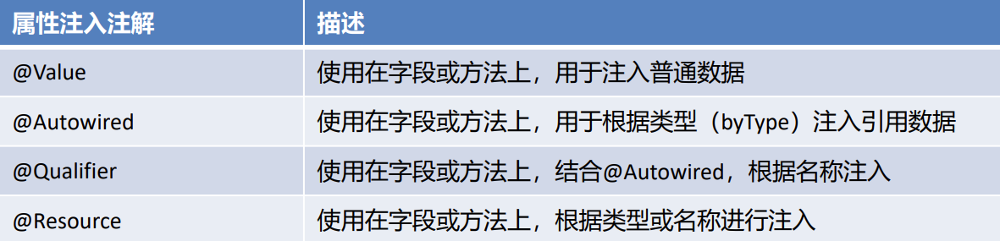


### 详细对比：`@Autowired` vs `@Resource`

`@Autowired` 和 `@Resource` 最大的区别在于它们**默认的注入策略不同**：

- **`@Autowired`**：默认**按类型（byType）**注入。
- **`@Resource`**：默认**按名称（byName）**注入。

<br>

| **特性**                 | **@Autowired**                                               | **@Resource**                                                |
| ------------------------ | ------------------------------------------------------------ | ------------------------------------------------------------ |
| **来源**                 | Spring 框架 (`org.springframework.beans.factory.annotation.Autowired`) | Java JSR-250 规范 (`javax.annotation.Resource` 或 `jakarta.annotation.Resource`) |
| **默认策略**             | **按类型 (byType)**                                          | **按名称 (byName)**                                          |
| **策略说明**             | Spring 会在容器中寻找与注入字段**类型**相匹配的 Bean。       | Spring 会在容器中寻找与注入字段**名称**相匹配的 Bean ID。    |
| **`required` 属性**      | 有。`@Autowired(required = false)`，找不到 Bean 时不会报错。 | **没有** `required` 属性。                                   |
| **`name` / `type` 属性** | **没有**。它依赖 `@Qualifier` 注解来指定名称。               | **有**。`@Resource(name="beanId")` 或 `@Resource(type=MyClass.class)` |

------


### 注入流程的详细差异


#### 1. `@Autowired` 的注入流程


`@Autowired` **“先看类型，再看名称”**。

1. **按类型 (byType) 查找**：
   - Spring 会在容器中寻找类型为 `MyService` 的 Bean。
2. **处理结果**：
   - **找到 1 个**：直接注入，成功。
   - **找到 0 个**：如果 `required=true`（默认），则抛出 `NoSuchBeanDefinitionException` 异常。
   - **找到多个**（例如 `MyService` 有两个实现类 `MyServiceImpl1` 和 `MyServiceImpl2`）：
     - Spring 会进入**第二阶段：按名称 (byName) 查找**。
     - 它会把你**字段的变量名**（例如 `myService`）作为 Bean ID 去容器里再次查找。
     - 如果找到一个 `id="myService"` 且类型也匹配的 Bean，则注入成功。
     - 如果还是找不到，或仍然有歧义，Spring 就会报错。

> **如何解决 `@Autowired` 的“多个”问题？**
>
> 1. **使用 `@Qualifier("beanId")`**：
>
>    Java
>
>    ```
>    @Autowired
>    @Qualifier("myServiceImpl2") // 明确告诉 Spring 我要哪个 Bean
>    private MyService myService;
>    ```
>
> 2. 使用 @Primary：
>
>    在 MyServiceImpl1 或 MyServiceImpl2 的 @Service 定义上加上 @Primary，表示它是首选的。
>
> 3. 修改变量名：
>
>    将变量名改为和某个 Bean ID 一致（但不推荐这种方式，因为它不直观）。
>
>    Java
>
>    ```
>    @Autowired
>    private MyService myServiceImpl2; // 变量名和 Bean ID 匹配
>    ```


#### 2. `@Resource` 的注入流程


`@Resource` **“先看名称，再看类型”**。

1. **按名称 (byName) 查找**：
   - `@Resource` 会首先检查**它自己有没有带 `name` 属性**（例如 `@Resource(name="myCoolService")`）。
   - **如果带了 `name` 属性**：Spring **只会**按这个 `name` 查找，找不到就直接报错。
   - **如果没带 `name` 属性**：Spring 会**使用字段的变量名**（例如 `myService`）作为 Bean ID 去容器里查找。
2. **处理结果（在没带 `name` 属性时）**：
   - **按名称（`myService`）找到了 1 个**：直接注入，成功。
   - **按名称（`myService`）找不到**：
     - Spring 会进入**第二阶段：按类型 (byType) 查找**。
     - 此时它的行为就和 `@Autowired` 一样了，会去寻找类型为 `MyService` 的 Bean。
     - 如果按类型找到 1 个，注入成功。
     - 如果按类型找到多个或 0 个，都会报错。

------


### 总结和推荐


- **`@Autowired`** 是 Spring 亲儿子，它与 `@Qualifier`、`@Primary`、`@Lazy` 等注解配合得天衣无缝，是**首选推荐**。它更符合“面向接口编程”的思路（我只关心类型，不关心叫什么名字）。
- **`@Resource`** 是 Java 标准，在需要**按名称**进行精确注入的场景下（比如你有两个同类型的 Bean，且不想用 `@Qualifier`），它非常方便。

在 Spring Boot 开发中，我们绝大多数时间都应该使用 `@Autowired`，并在遇到多个实现类时，配合 `@Qualifier` 或 `@Primary` 来解决歧义。


## 3. 非自定义Bean注解开发

非自定义Bean不能像自定义Bean一样使用@Component进行管理，非自定义Bean要通过工厂的方式进行实例化， 使用@Bean标注方法即可，@Bean的属性为beanName，如不指定为当前工厂方法名称。

```java
//将方法返回值Bean实例以@Bean注解指定的名称存储到Spring容器中
@Bean("dataSource")
public DataSource dataSource(){
    DruidDataSource dataSource = new DruidDataSource();
    dataSource.setDriverClassName("com.mysql.jdbc.Driver");
    dataSource.setUrl("jdbc:mysql://localhost:3306/mybatis");
    dataSource.setUsername("root");
    dataSource.setPassword("root");
    return dataSource;
}
```

PS：工厂方法所在类必须要被Spring管理

<br>

如果@Bean工厂方法需要参数的话，则有如下几种注入方式：

- 使用@Autowired 根据类型自动进行Bean的匹配，@Autowired可以省略 ；
-  使用@Qualifier 根据名称进行Bean的匹配；
- 使用@Value 根据名称进行普通数据类型匹配。

```java
@Bean
@Autowired //根据类型匹配参数
public Object objectDemo01(UserDao userDao){
    System.out.println(userDao);
    return new Object();
}

@Bean
public Object objectDemo02(@Qualifier("userDao") UserDao userDao,
						   @Value("${jdbc.username}") String username){
    System.out.println(userDao);
    System.out.println(username);
    return new Object();
}
```


## 4. Bean配置类的注解开发

@Component等注解替代了 `<bean>` 标签，但是像`<import>` 、 `<context:componentScan>`、 等非 `<bean>` 标签怎样去使用注解替代呢？

```xml
<!-- 加载properties文件 -->
<context:property-placeholder location="classpath:jdbc.properties"/>
<!-- 组件扫描 -->
<context:component-scan base-package="com.itheima"/>
<!-- 引入其他xml文件 -->
<import resource="classpath:beans.xml"/>
```

定义一个配置类替代原有的xml配置文件，标签以外的标签，一般都是在配置类上使用注解完成的

<br>

### 4.1 常用注解

- @Configuration 注解标识的类为配置类，替代原有xml配置文件，该注解第一个作用是标识该类是一个配置类，第 二个作用是具备@Component作用。
- @ComponentScan 组件扫描配置，替代原有xml文件中的 `<context:component-scan base-package=""/>`
  - base-package的配置方式：
    -  指定一个或多个包名：扫描指定包及其子包下使用注解的类 
    - 不配置包名：扫描当前@ComponentScan注解配置类所在包及其子包下的类

- @PropertySource 注解用于加载外部properties资源配置，替代原有xml中  `<context:propertyplaceholder location=“”/>` 配置
- @Import 用于加载其他配置类，替代原有xml中的 `<import resource="classpath:beans.xml/>` 配置 

<br>

### 4.2 代码演示

```java
@Configuration
@ComponentScan(basePackages = "com.wood")
@Import(OtherConfig.class)
public class SpringConfig {

}
```

<br>

```java
@Configuration
@PropertySource("classpath:jdbc.properties")
public class OtherConfig {
    @Bean
    public DataSource dataSource(@Value("${jdbc.url}") String url,
                                 @Value("${jdbc.username}") String username,
                                 @Value("${jdbc.password}") String password,
                                 @Value("${jdbc.driverClassName}") String driverClassName){
        DruidDataSource dataSource = new DruidDataSource();
        dataSource.setUrl(url);
        dataSource.setUsername(username);
        dataSource.setPassword(password);
        dataSource.setDriverClassName(driverClassName);
        return dataSource;
    }
}
```

<br>

```java
public class ApplicationContextTest {
    public static void main(String[] args) {
        ApplicationContext applicationContext = new AnnotationConfigApplicationContext(SpringConfig.class);
        Object dataSource = applicationContext.getBean("dataSource");
        System.out.println(dataSource);
    }
}
```

<br>

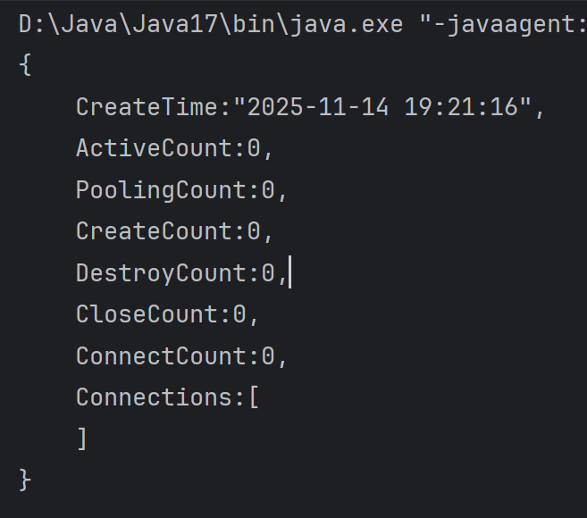


## 5. Spring 配置其他注解

### @Primary 

@Primary 注解用于标注相同类型的Bean优先被使用权，@Primary 是Spring3.0引入的，与@Component 和 @Bean一起使用，标注该Bean的优先级更高，则在通过类型获取Bean或通过@Autowired根据类型进行注入时， 会选用优先级更高的。

```java
@Repository("userDao")
public class UserDaoImpl implements UserDao{}

@Repository("userDao2")
@Primary
public class UserDaoImpl2 implements UserDao{}
```

<br>

```java
@Bean
public UserDao userDao01(){return new UserDaoImpl();}

@Bean
@Primary
public UserDao userDao02(){return new UserDaoImpl2();}
```


### @Profile

@Profile 注解的作用同于xml配置时学习profile属性，是进行环境切换使用的。

注解 @Profile 标注在类或方法上，标注当前产生的Bean从属于哪个环境，只有激活了当前环境，被标注的Bean才 能被注册到Spring容器里，不指定环境的Bean，任何环境下都能注册到Spring容器里。

```java
@Repository("userDao")
@Profile("test")
public class UserDaoImpl implements UserDao{}

@Repository("userDao2")
public class UserDaoImpl2 implements UserDao{}
```

<br>

可以使用以下两种方式指定被激活的环境：

- 使用命令行动态参数，虚拟机参数位置加载 -Dspring.profiles.active=test
- 使用代码的方式设置环境变量 System.setProperty("spring.profiles.active","test");


## 6.  Spring注解方式整合第三方框架

第三方框架整合，依然使用MyBatis作为整合对象，之前我们已经使用xml方式整合了MyBatis，现在使用注解方式 无非就是将xml标签替换为注解，将xml配置文件替换为配置类而已，原有xml方式整合配置如下：

```xml
<!--配置数据源-->
<bean id="dataSource" class="com.alibaba.druid.pool.DruidDataSource">
    <property name="url" value="jdbc:mysql://localhost:3306/mybatis"></property>
    <property name="username" value="root"></property>
    <property name="password" value="root"></property>
</bean>
<!--配置SqlSessionFactoryBean-->
<bean class="org.mybatis.spring.SqlSessionFactoryBean">
    <property name="dataSource" ref="dataSource"></property>
</bean>
<!--配置Mapper包扫描-->
<bean class="org.mybatis.spring.mapper.MapperScannerConfigurer">
    <property name="basePackage" value="com.itheima.dao"></property>
</bean>
```


### 6.1 Spring整合MyBatis

```java
@Data
@NoArgsConstructor
@AllArgsConstructor
public class User {
    private Integer id;
    private String username;
    private String password;
}
```

<br>

```java
public interface UserMapper {
    List<User> findAll();
}
```

<br>

mybatis-config.xml

```java
<?xml version="1.0" encoding="UTF-8" ?>
<!DOCTYPE configuration
        PUBLIC "-//mybatis.org//DTD Config 3.0//EN"
        "https://mybatis.org/dtd/mybatis-3-config.dtd">
<configuration>
    <environments default="development">
        <environment id="development">
            <transactionManager type="JDBC"/>
            <dataSource type="POOLED">
                <property name="driver" value="com.mysql.jdbc.Driver"/>
                <property name="url" value="jdbc:mysql://localhost:3306/test"/>
                <property name="username" value="root"/>
                <property name="password" value="1234"/>
            </dataSource>
        </environment>
    </environments>

    <mappers>
        <mapper resource="com/wood/mapper/UserMapper.xml"/>
    </mappers>
</configuration>
```

<br>

UserMapper.xml

```xml
<?xml version="1.0" encoding="UTF-8" ?>
<!DOCTYPE mapper PUBLIC "-//mybatis.org//DTD Mapper 3.0//EN" "http://mybatis.org/dtd/mybatis-3-mapper.dtd">
<mapper namespace="com.wood.mapper.UserMapper">
    <select id="findAll" resultType="com.wood.pojo.User">
        select * from user
    </select>
</mapper>
```

<br>

```java
@Configuration
@ComponentScan(basePackages = "com.wood")
@PropertySource("classpath:jdbc.properties")
@MapperScan(basePackages = "com.wood.mapper")
public class SpringConfig {
    @Bean
    public DataSource dataSource(@Value("${jdbc.url}") String url,
                                 @Value("${jdbc.username}") String username,
                                 @Value("${jdbc.password}") String password,
                                 @Value("${jdbc.driverClassName}") String driverClassName){
        DruidDataSource dataSource = new DruidDataSource();
        dataSource.setUrl(url);
        dataSource.setUsername(username);
        dataSource.setPassword(password);
        dataSource.setDriverClassName(driverClassName);
        return dataSource;
    }

    @Bean
    public SqlSessionFactoryBean sqlSessionFactoryBean(DataSource dataSource){
        SqlSessionFactoryBean sqlSessionFactoryBean = new SqlSessionFactoryBean();
        sqlSessionFactoryBean.setDataSource(dataSource);
        return sqlSessionFactoryBean;
    }
}
```

<br>

```java
@Component("userService")
public class UserServiceImpl implements UserService {

    @Autowired
    private UserMapper userMapper;

    @Override
    public void show() {
        List<User> all = userMapper.findAll();
        for (User user : all) {
            System.out.println(user);
        }
    }
}
```

<br>

```java
public class ApplicationContextTest {
    public static void main(String[] args) {
        ApplicationContext applicationContext = new AnnotationConfigApplicationContext(SpringConfig.class);
        UserService userService = applicationContext.getBean(UserService.class);
        userService.show();
    }
}
```

<br>

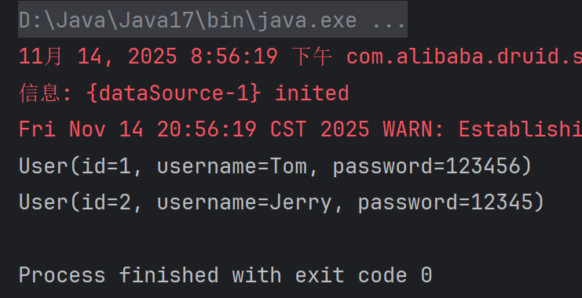


### 6.2 @Import整合第三方框架

Spring与MyBatis注解方式整合有个重要的技术点就是@Import，第三方框架与Spring整合xml方式很多是凭借自 定义标签完成的，而第三方框架与Spring整合注解方式很多是靠@Import注解完成的。 

@Import可以导入如下三种类：

- 普通的配置类 
- 实现ImportSelector接口的类 
- 实现ImportBeanDefinitionRegistrar接口的类


#### 实现ImportSelector接口的类 

```java
public class OtherBean {
}
```

<br>

```java
public class MyImportSelectors implements ImportSelector {
    @Override
    public String[] selectImports(AnnotationMetadata annotationMetadata) {
        return new String[]{OtherBean.class.getName()};
    }
}
```

<br>

```java
@Configuration
@ComponentScan(basePackages = "com.wood")
@PropertySource("classpath:jdbc.properties")
@MapperScan(basePackages = "com.wood.mapper")
@Import(MyImportSelectors.class)
public class SpringConfig {
    @Bean
    public DataSource dataSource(@Value("${jdbc.url}") String url,
                                 @Value("${jdbc.username}") String username,
                                 @Value("${jdbc.password}") String password,
                                 @Value("${jdbc.driverClassName}") String driverClassName){
        DruidDataSource dataSource = new DruidDataSource();
        dataSource.setUrl(url);
        dataSource.setUsername(username);
        dataSource.setPassword(password);
        dataSource.setDriverClassName(driverClassName);
        return dataSource;
    }

    @Bean
    public SqlSessionFactoryBean sqlSessionFactoryBean(DataSource dataSource){
        SqlSessionFactoryBean sqlSessionFactoryBean = new SqlSessionFactoryBean();
        sqlSessionFactoryBean.setDataSource(dataSource);
        return sqlSessionFactoryBean;
    }
}
```

<br>

```java
public class ApplicationContextTest {
    public static void main(String[] args) {
        ApplicationContext applicationContext = new AnnotationConfigApplicationContext(SpringConfig.class);
        OtherBean bean = applicationContext.getBean(OtherBean.class);
        System.out.println(bean);
    }
}
```

<br>

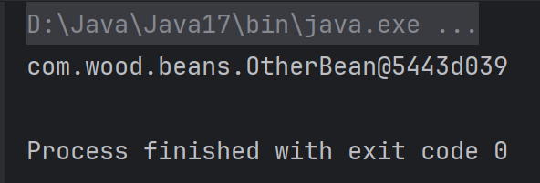


##### 扩展

ImportSelector接口selectImports方法的参数AnnotationMetadata代表注解的媒体数据，可以获得当前注解修饰 的类的元信息，例如：获得组件扫描的包名。

```java
public class MyImportSelector implements ImportSelector {
    @Override
    public String[] selectImports(AnnotationMetadata annotationMetadata) {
        //获得指定类型注解的全部信息
        Map<String, Object> annotationAttributes =
        annotationMetadata.getAnnotationAttributes(ComponentScan.class.getName());
        //获得全部信息中basePackages信息
        String[] basePackages = (String[]) annotationAttributes.get("basePackages");
        //打印结果是com.itheima
        System.out.println(basePackages[0]);
        return new String[]{User2.class.getName()
    }
}
```


#### 实现ImportBeanDefinitionRegistrar接口的类

```java
public class MyImportBeanDefinitionRegistrar implements ImportBeanDefinitionRegistrar {
    @Override
    public void registerBeanDefinitions(AnnotationMetadata importingClassMetadata, BeanDefinitionRegistry registry, BeanNameGenerator importBeanNameGenerator) {
        BeanDefinition beanDefinition = new RootBeanDefinition();
        beanDefinition.setBeanClassName(OtherBean.class.getName());
        registry.registerBeanDefinition("otherBean", beanDefinition);
    }
}
```

<br>

```java
@Configuration
@ComponentScan(basePackages = "com.wood")
@PropertySource("classpath:jdbc.properties")
@MapperScan(basePackages = "com.wood.mapper")
@Import(MyImportBeanDefinitionRegistrar.class)
public class SpringConfig {
    @Bean
    public DataSource dataSource(@Value("${jdbc.url}") String url,
                                 @Value("${jdbc.username}") String username,
                                 @Value("${jdbc.password}") String password,
                                 @Value("${jdbc.driverClassName}") String driverClassName){
        DruidDataSource dataSource = new DruidDataSource();
        dataSource.setUrl(url);
        dataSource.setUsername(username);
        dataSource.setPassword(password);
        dataSource.setDriverClassName(driverClassName);
        return dataSource;
    }

    @Bean
    public SqlSessionFactoryBean sqlSessionFactoryBean(DataSource dataSource){
        SqlSessionFactoryBean sqlSessionFactoryBean = new SqlSessionFactoryBean();
        sqlSessionFactoryBean.setDataSource(dataSource);
        return sqlSessionFactoryBean;
    }
}
```

<br>

```java
public class ApplicationContextTest {
    public static void main(String[] args) {
        ApplicationContext applicationContext = new AnnotationConfigApplicationContext(SpringConfig.class);
        OtherBean bean = applicationContext.getBean(OtherBean.class);
        System.out.println(bean);
    }
}
```

<br>

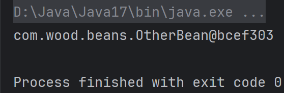


# 四、Spring AOP 简介


## 1. AOP的概念

AOP，Aspect Oriented Programming，面向切面编程，是对面向对象编程OOP的升华。

OOP是纵向对一个 事物的抽象，一个对象包括静态的属性信息，包括动态的方法信息等。而AOP是横向的对不同事物的抽象，属性与属性、方法与方法、对象与对象都可以组成一个切面，而用这种思维去设计编程的方式叫做面向切面编程。


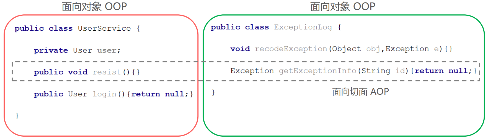


## 2. AOP思想的实现方案

动态代理技术

在运行期间，对目标对象的方法进行增强，代理对象同名方法内可以执行原有逻辑的同时嵌入执行其他增强逻辑或其他对象的方法。

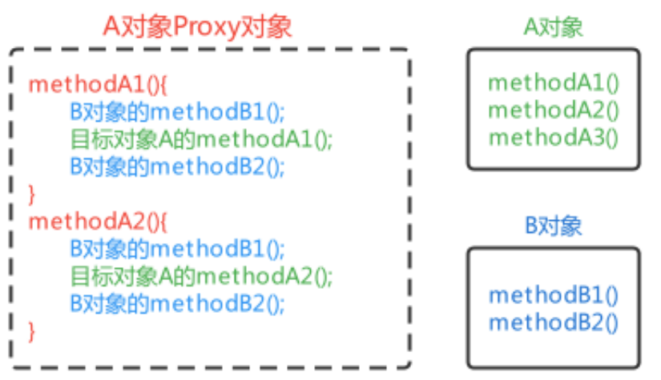


## 3. 模拟AOP的基础代码

其实在之前学习BeanPostProcessor时，在BeanPostProcessor的after方法中使用动态代理对Bean进行了增强，实际存储到单例池singleObjects中的不是当前目标对象本身，而是当前目标对象的代理对象Proxy，这 在调用目标对象方法时，实际调用的是代理对象Proxy的同名方法，起到了目标方法前后都进行增强的功能。

 对该方式进行一下优化，将增强的方法提取出去到一个增强类中，且只对com.itheima.service.impl包下的任何类的任何方法进行增强。

<br>

```java
public interface UserService {
    void show1();
    void show2();
}

public class UserServiceImpl implements UserService {
    @Override
    public void show1() {
        System.out.println("show1. . . .");
    }

    @Override
    public void show2() {
        System.out.println("show2. . . .");
    }
}
```

<br>

```java
//自定义增强类
public class MyAdvice {
    public void beforeAdvice(){
        System.out.println("beforeAdvice ...");
    }
    public void afterAdvice(){
        System.out.println("afterAdvice ...");
    }
}
```

<br>

```java
public class MockAopBeanPostProcessor implements BeanPostProcessor, ApplicationContextAware {
    private ApplicationContext applicationContext;//注入Spring容器对象

    public Object postProcessAfterInitialization(Object bean, String beanName) {
        MyAdvice myAdvice = applicationContext.getBean(MyAdvice.class);//获得Advice对象
        String packageName = bean.getClass().getPackage().getName();
        if ("com.wood.service.impl".equals(packageName)) {
            //对Bean进行动态代理，返回的是Proxy代理对象
            Object proxyBean = Proxy.newProxyInstance(
                    bean.getClass().getClassLoader(),
                    bean.getClass().getInterfaces(),
                    (Object proxy, Method method, Object[] args) -> {
                        myAdvice.beforeAdvice();//执行Advice的before方法
                        Object result = method.invoke(bean, args);//执行目标
                        myAdvice.afterAdvice();//执行Advice的after方法
                        return result;
                    });
            //返回代理对象
            return proxyBean;
        }
        return bean;
    }

    public void setApplicationContext(ApplicationContext applicationContext) {
        this.applicationContext = applicationContext;
    }
}
```

<br>

applicationContext.xml

```xml
<?xml version="1.0" encoding="UTF-8"?>
<beans xmlns="http://www.springframework.org/schema/beans"
       xmlns:xsi="http://www.w3.org/2001/XMLSchema-instance"
       xsi:schemaLocation="http://www.springframework.org/schema/beans
       http://www.springframework.org/schema/beans/spring-beans.xsd">

    <bean id="userService" class="com.wood.service.impl.UserServiceImpl"/>

    <bean id="myAdvice" class="com.wood.advice.MyAdvice"/>

    <bean class="com.wood.processor.MockAopBeanPostProcessor"/>
</beans>
```

<br>

```java
public class ApplicationContextTest {
    public static void main(String[] args) {
        ApplicationContext applicationContext = new ClassPathXmlApplicationContext("applicationContext.xml");
        UserService userService = applicationContext.getBean(UserService.class);
        userService.show1();
    }
}
```

<br>

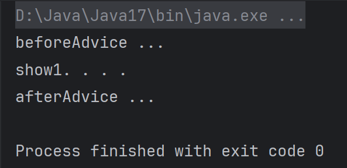


## 4. AOP相关概念

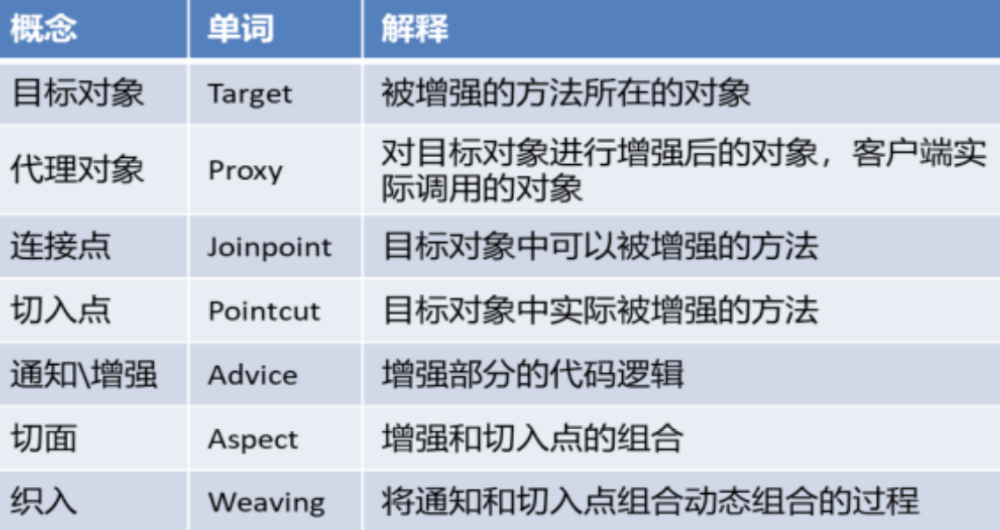

<br>

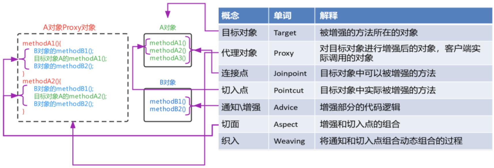


# 五、基于xml配置的AOP


## 1. xml方式AOP快速入门

前面我们自己编写的AOP基础代码还是存在一些问题的，主要如下： 

- 被增强的包名在代码写死了
- 通知对象的方法在代码中写死了

<br>

通过配置文件的方式去解决上述问题

- 配置哪些包、哪些类、哪些方法需要被增强
- 配置目标方法要被哪些通知方法所增强，在目标方法执行之前还是之后执行增强 配置方式的设计

配置文件（注解）的解析工作，Spring已经帮我们封装好了。

<br>

xml方式配置AOP的步骤： 

1、导入AOP相关坐标； 

2、准备目标类、准备通知类，并配置给Spring管理； 

3、配置切点表达式（哪些方法被增强）；

4、配置织入（切点被哪些通知方法增强，是前置增强还是后置增强）。

<br>

pom.xml

```xml
<dependency>
    <groupId>org.aspectj</groupId>
    <artifactId>aspectjweaver</artifactId>
    <version>1.9.6</version>
</dependency>
```

<br>

```java
public class UserServiceImpl implements UserService {
    @Override
    public void show1() {
        System.out.println("show1. . . .");
    }

    @Override
    public void show2() {
        System.out.println("show2. . . .");
    }
}
```

<br>

```xml
<?xml version="1.0" encoding="UTF-8"?>
<beans xmlns="http://www.springframework.org/schema/beans"
       xmlns:xsi="http://www.w3.org/2001/XMLSchema-instance"
       xmlns:aop="http://www.springframework.org/schema/aop"
       xsi:schemaLocation="
       http://www.springframework.org/schema/beans
       http://www.springframework.org/schema/beans/spring-beans.xsd
       http://www.springframework.org/schema/aop
       http://www.springframework.org/schema/aop/spring-aop.xsd">

    <bean id="userService" class="com.wood.service.impl.UserServiceImpl"/>

    <bean id="myAdvice" class="com.wood.advice.MyAdvice"/>

    <aop:config>
        <aop:pointcut id="myPointCut" expression="execution(void com.wood.service.impl.UserServiceImpl.show1())"/>
        <aop:aspect id="myAdvice" ref="myAdvice">
            <aop:before method="beforeAdvice" pointcut-ref="myPointCut"/>
        </aop:aspect>
    </aop:config>
    
</beans>
```

<br>

```java
public class ApplicationContextTest {
    public static void main(String[] args) {
        ApplicationContext applicationContext = new ClassPathXmlApplicationContext("applicationContext.xml");
        UserService userService = applicationContext.getBean(UserService.class);
        userService.show1();
    }
}
```

<br>

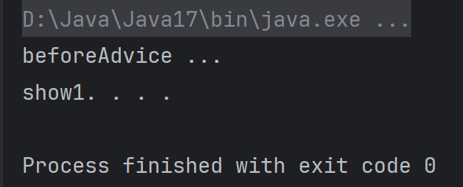


## 2. xml方式AOP配置详解


### 2.1 切点表达式的配置方式

在 `<beans>` 标签内，首先需要引入 `aop` 命名空间。然后，AOP的配置都写在 `<aop:config>` 标签内。有两种主要的方式来定义切点：


#### 方式一：定义可复用的“命名切点”

这种方式使用 `<aop:pointcut>` 标签来定义一个切点，并给它一个 `id`。这样，多个“通知”（Advice）和“切面”（Advisor）都可以复用这个切点。

- **优点**：高复用性，易于维护。
- **配置**：
  - `<aop:pointcut>`：在 `<aop:config>` 级别定义，必须有 `id` 和 `expression`。
  - `<aop:advisor>`：通过 `pointcut-ref` 属性来“引用”上面定义的切点。

**XML 示例：**

```xml
<beans xmlns:aop="http://www.springframework.org/schema/aop" ...>

    <bean id="myLogger" class="com.example.LoggingAspect" />

    <aop:config>
        <aop:pointcut id="serviceMethods" 
            expression="execution(* com.example.service.*.*(..))" />

        <aop:advisor advice-ref="myLogger" pointcut-ref="serviceMethods" />
    </aop:config>

</beans>
```


#### 方式二：定义“内联切点”


这种方式不单独定义 `<aop:pointcut>`，而是直接将 `expression` 表达式写在“通知”标签（如 `<aop:before>`, `<aop:after>`）或 `<aop:advisor>` 标签的 `pointcut` 属性中。

- **优点**：对于只用一次的切点，配置更紧凑。
- **缺点**：无法复用。

**XML 示例：**

```xml
<beans xmlns:aop="http://www.springframework.org/schema/aop" ...>

    <bean id="myLogger" class="com.example.LoggingAspect" />

    <aop:config>
        <aop:aspect id="loggingAspect" ref="myLogger">
            
            <aop:before
                method="logBefore" 
                pointcut="execution(* com.example.service.*.*(..))" />
            
            <aop:after-returning
                method="logAfterSuccess"
                pointcut="execution(* com.example.service.*.*(..))" />
                
        </aop:aspect>
    </aop:config>

</beans>
```


### 2.2  切点表达式配置语法（AspectJ 语法）


Spring AOP **借用**了 AspectJ 的切点表达式语法。这是AOP的**灵魂**，用于精确地“定位”你想要拦截的方法。

最常用、最强大的表达式是 **`execution`**。


#### `execution` 表达式的完整语法

它的结构如下（方括号 `[]` 中的是可选项）：

```xml
execution([修饰符] 返回值类型 [包名.类名] 方法名(参数列表) [异常])
```


我们来详细分解这个语法：

| **语法**         | **含义**                                                     | **示例**                                               |
| ---------------- | ------------------------------------------------------------ | ------------------------------------------------------ |
| `[修饰符]`       | `public`, `private`, `protected`, `*` (任意)                 | `public` (只匹配public方法)                            |
| **`返回值类型`** | `*` (任意), `void`, `String`, `com.example.User`             | `*` (最常用)                                           |
| `[包名.类名]`    | `*` (任意类), `com.example.*` (包下所有类), `..` (当前包及子包) | `com.example.service..*` (service包及其子包下的所有类) |
| **`方法名`**     | `*` (任意方法), `get*` (get开头), `findUser` (具体方法)      | `*` (最常用)                                           |
| **`(参数列表)`** | `()` (无参), `(Long)` (一个Long), `(*)` (一个任意类型), **`(..)` (任意数量,任意类型)** | `(..)` (最常用)                                        |
| `[异常]`         | 抛出的异常类型（不常用）                                     |                                                        |


#### 常用通配符


- `*` (星号)：匹配任意一个。
  - 匹配任意返回值：`*`
  - 匹配任意方法名：`*`
  - 匹配任意一个参数：`(*)`
  - 匹配 `service` 包下的任意一个类：`com.example.service.*`
- `..` (两个点)：匹配任意多个。
  - 匹配任意参数：`(..)`
  - 匹配 `service` 包及**所有子包**下的类：`com.example.service..*`


#### 实践中的常用示例


1. **最常用：匹配 `service` 包下所有类的所有方法**

   > `execution(* com.example.service.*.*(..))`

   - `*`：任意返回值
   - `com.example.service.*`：`service` 包下的任意类
   - `*`：任意方法名
   - `(..)`：任意参数

2. **匹配 `service` 包及所有子包下，所有类的所有方法**

   > `execution(* com.example.service..*.*(..))`

   - `..` 在包名中的使用

3. **匹配所有 `get` 开头的方法**

   > `execution(* *..*.get*(..))`

   - `*..*`：任意包任意类
   - `get*`：`get` 开头的方法

4. **匹配 `UserService` 类中的所有 `public` 方法**

   > `execution(public * com.example.service.UserService.*(..))`

------


#### `execution` 之外的其他表达式


虽然 `execution` 占了 90% 的使用场景，但还有其他几个有用的表达式：

- **`within`**：匹配指定**类或包**中的所有方法（比 `execution` 更粗粒度）。
  - `within(com.example.service.*)`：匹配 `service` 包下所有类（不含子包）的所有方法。
  - `within(com.example.service..*)`：匹配 `service` 包及子包下所有类的所有方法。
- **`@annotation`**：匹配**持有**指定注解的方法。
  - `@annotation(com.example.MyLogAnnotation)`
- **`bean`**：匹配 Spring 容器中特定 **`id` 或 `name`** 的 Bean。
  - `bean(myUserService)`：只匹配 `id` 为 `myUserService` 的那个 Bean。
- **逻辑组合**：
  - `&&` (与)：`execution(...) && @annotation(...)`
  - `||` (或)：`execution(...) || within(...)`
  - `!` (非)：`!@annotation(...)`


### 2.3 五种通知类型

AspectJ的通知由以下五种类型:

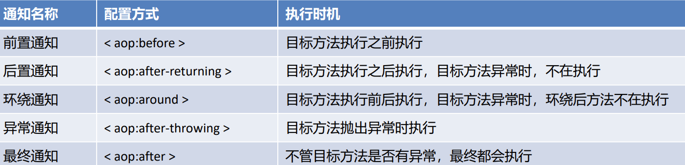

<br>


#### 准备工作：切面 Bean 和目标 Bean

在看配置之前，我们先假设有两个类：

1. **目标 Bean** (`UserService`)：我们希望被增强的类。

   ```java
   public class UserServiceImpl implements UserService {
       public String addUser(String username) {
           System.out.println("核心业务：添加用户 " + username);
           if ("error".equals(username)) {
               throw new RuntimeException("模拟一个异常");
           }
           return "添加成功：" + username;
       }
   }
   ```

2. **切面 Bean** (`LoggingAspect`)：包含通知逻辑的类（“管家”）。

   ```java
   import org.aspectj.lang.ProceedingJoinPoint;
   
   public class LoggingAspect {
   
       public void beforeLog() {
           System.out.println("【前置通知】: 方法开始执行...");
       }
   
       public void afterReturning(Object result) {
           System.out.println("【后置通知】: 方法正常返回... 返回值: " + result);
       }
   
       public void afterThrowing(Exception ex) {
           System.out.println("【异常通知】: 方法抛出异常... 异常: " + ex.getMessage());
       }
   
       public void afterFinally() {
           System.out.println("【最终通知】: 方法执行完毕 (无论成功还是失败)...");
       }
   
       public Object around(ProceedingJoinPoint pjp) throws Throwable {
           System.out.println("【环绕-前】: 方法执行前...");
           Object result = null;
           try {
               // 手动调用目标方法
               result = pjp.proceed(); 
               System.out.println("【环绕-后】: 方法正常返回...");
           } catch (Throwable t) {
               System.out.println("【环绕-异常】: 方法抛出异常...");
               throw t; // 必须重新抛出
           } finally {
               System.out.println("【环绕-最终】: 方法执行完毕...");
           }
           return result;
       }
   }
   ```


#### XML 基础配置

首先，我们需要在 XML 中定义这两个 Bean，并引入 `aop` 命名空间：

```xml
<?xml version="1.0" encoding="UTF-8"?>
<beans xmlns="http://www.springframework.org/schema/beans"
       xmlns:xsi="http://www.w3.org/2001/XMLSchema-instance"
       xmlns:aop="http://www.springframework.org/schema/aop"
       xsi:schemaLocation="
           http://www.springframework.org/schema/beans 
           http://www.springframework.org/schema/beans/spring-beans.xsd
           http://www.springframework.org/schema/aop 
           http://www.springframework.org/schema/aop/spring-aop.xsd">

    <bean id="userService" class="com.example.UserServiceImpl" />

    <bean id="loggingAspect" class="com.example.LoggingAspect" />

    <aop:config>
        <aop:pointcut id="servicePointcut" 
            expression="execution(* com.example.service..*.*(..))" />

        <aop:aspect ref="loggingAspect">
            
            </aop:aspect>
    </aop:config>

</beans>
```


#### 五种通知类型及其XML配置


现在，我们在 `<aop:aspect>` 标签内，配置这五种通知：


##### 1. 前置通知 (Before Advice)


- **执行时机**：在目标方法**执行之前**运行。
- **特 点**：它无法阻止目标方法的执行（除非它自己抛出异常）。
- **XML 配置**：使用 `<aop:before>` 标签。

```xml
<aop:before
    method="beforeLog" 
    pointcut-ref="servicePointcut" />
```

- `method="beforeLog"`：指定 `LoggingAspect` 类中哪个方法是前置通知。
- `pointcut-ref="servicePointcut"`：引用我们之前定义的切点。


##### 2. 后置通知 (After-Returning Advice)


- **执行时机**：在目标方法**正常执行完毕**并**返回结果**时运行。
- **特 点**：
  - 如果方法抛出异常，它**不会**执行。
  - 它可以访问到目标方法的**返回值**。
- **XML 配置**：使用 `<aop:after-returning>` 标签。

```xml
<aop:after-returning
    method="afterReturning"
    pointcut-ref="servicePointcut"
    returning="result" />
```

- `returning="result"`：将目标方法的返回值，注入到 `afterReturning` 方法的同名参数 `result` 中。


##### 3. 异常通知 (After-Throwing Advice)


- **执行时机**：在目标方法**抛出异常**时运行。
- **特 点**：
  - 如果方法正常返回，它**不会**执行。
  - 它可以访问到抛出的**异常对象**。
- **XML 配置**：使用 `<aop:after-throwing>` 标签。

```xml
<aop:after-throwing
    method="afterThrowing"
    pointcut-ref="servicePointcut"
    throwing="ex" />
```

- `throwing="ex"`：将抛出的异常，注入到 `afterThrowing` 方法的同名参数 `ex` 中。


##### 4. 最终通知 (After Advice)

- **执行时机**：**无论**目标方法是正常返回还是抛出异常，它**都会**运行。
- **特 点**：它类似于 `try...catch...finally` 块中的 `finally` 块。
- **XML 配置**：使用 `<aop:after>` 标签。

```xml
<aop:after
    method="afterFinally"
    pointcut-ref="servicePointcut" />
```


##### 5. 环绕通知 (Around Advice)

- **执行时机**：**包围**在目标方法执行的**前后**。
- **特 点**：
  - 这是**最强大**的通知类型。
  - 它**必须**接收一个 `ProceedingJoinPoint` (PJP) 类型的参数。
  - 它**必须**在内部**手动调用 `pjp.proceed()`** 来执行目标方法。
  - 它可以**完全控制**目标方法的执行：可以修改参数、阻止执行、修改返回值，或者处理异常。
- **XML 配置**：使用 `<aop:around>` 标签。

```xml
<aop:around
    method="around"
    pointcut-ref="servicePointcut" />
```

- **注意**：`around` 方法（在 `LoggingAspect` 中定义）的签名必须是 `Object around(ProceedingJoinPoint pjp)`。


##### 完整的 XML 配置示例


将上面所有内容组合在一起，完整的 `aop:config` 如下：

```xml
<bean id="userService" class="com.example.UserServiceImpl" />
<bean id="loggingAspect" class="com.example.LoggingAspect" />

<aop:config>
    <aop:pointcut id="servicePointcut" 
        expression="execution(* com.example.service..*.*(..))" />

    <aop:aspect ref="loggingAspect">
        
        <aop:before
            method="beforeLog" 
            pointcut-ref="servicePointcut" />
        
        <aop:after-returning
            method="afterReturning"
            pointcut-ref="servicePointcut"
            returning="result" />
            
        <aop:after-throwing
            method="afterThrowing"
            pointcut-ref="servicePointcut"
            throwing="ex" />
            
        <aop:after
            method="afterFinally"
            pointcut-ref="servicePointcut" />
            
        <aop:around
            method="around"
            pointcut-ref="servicePointcut" />

    </aop:aspect>
</aop:config>
```

<br>

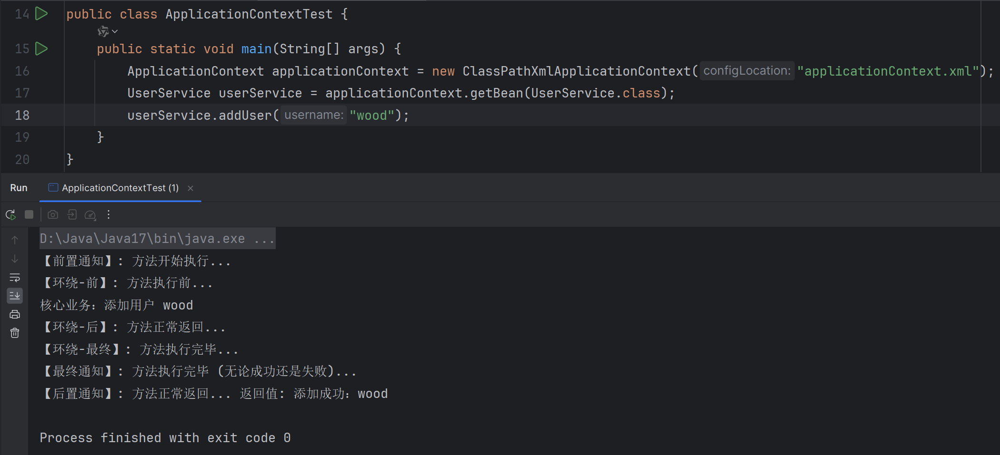


### 2.4 两种切面配置方式 - aspect 和 advisor

在Spring AOP的XML配置中（即使用`<aop:config>`标签），主要有两种方式来“组织”你的切面：

1. **`<aop:advisor>` (切面顾问)**：一种**简单**的方式，它**“一对一”**地绑定一个**“通知Bean (Advice)”**和一个**“切点 (Pointcut)”**。
2. **`<aop:aspect>` (切面)**：一种**更强大、更灵活**的方式，它从一个**“切面Bean (Aspect)”**中提取**多个**通知（如前置、后置等），并将它们应用到一个或多个切点上。

这是两种方式最核心的区别。`<aop:advisor>` 更像是“一个切面只有一个通知”，而 `<aop:aspect>` 则是“一个切面可以有多个通知”。

------

下面我们来详细对比这两种方式。


#### 方式一：`<aop:advisor>` (切面顾问)


`Advisor` (顾问) 是 Spring AOP 中一个更底层的概念。一个 `Advisor` 简单地包含了**一个通知（Advice）和一个切点（Pointcut）**。

这种方式的特点是，你的“通知”本身必须是一个**实现了 Spring特定接口**（如 `MethodBeforeAdvice`）的 Bean。


#### 1. 所需组件


- **目标 Bean**：(同之前例子，`UserServiceImpl`)
- **通知 Bean**：这个 Bean **必须实现** Spring 的 `org.springframework.aop.Advice` 接口（或其子接口，如 `MethodBeforeAdvice`）。
- **XML 配置**：使用 `<aop:advisor>` 标签。


#### 2. 示例代码


**通知 Bean (必须实现接口):**

```java
import org.springframework.aop.MethodBeforeAdvice;
import java.lang.reflect.Method;

// 注意：这个类必须实现 Spring AOP 的接口
public class MySimpleBeforeAdvice implements MethodBeforeAdvice {

    @Override
    public void before(Method method, Object[] args, Object target) throws Throwable {
        System.out.println("【Advisor 方式】: 方法 " + method.getName() + " 即将执行...");
    }
}
```

**XML 配置:**

```xml
<beans xmlns:aop="http://www.springframework.org/schema/aop" ...>

    <bean id="userService" class="com.example.UserServiceImpl" />
    
    <bean id="myAdvice" class="com.example.MySimpleBeforeAdvice" />

    <aop:config>
        <aop:pointcut id="servicePointcut" 
            expression="execution(* com.example.service..*.*(..))" />
            
        <aop:advisor 
            advice-ref="myAdvice" 
            pointcut-ref="servicePointcut" />
            
    </aop:config>

</beans>
```

------


#### 方式二：`<aop:aspect>` (切面)


这是**更常用、更强大**的方式，它**完全基于 AspectJ 的风格**。

这种方式的特点是，你的“切面Bean”只是一个**POJO（普通的Java对象）**。你不需要实现任何 Spring 接口。你通过 `<aop:before>`, `<aop:after>` 等标签来“指定”POJO 中的**哪个方法**对应哪种通知。


#### 1. 所需组件


- **目标 Bean**：(`UserServiceImpl`)
- **切面 Bean**：一个**POJO**（就是我们上一个问题中的 `LoggingAspect`）。
- **XML 配置**：使用 `<aop:aspect>` 标签，并在内部嵌套 `<aop:before>`, `<aop:after>` 等。


#### 2. 示例代码


**切面 Bean (POJO):**

```java
// 这是一个 POJO，不需要实现任何接口
public class LoggingAspect {
    public void beforeLog() {
        System.out.println("【Aspect 方式】: 方法开始执行...");
    }
    
    public void afterReturning() {
        System.out.println("【Aspect 方式】: 方法正常返回...");
    }
}
```

**XML 配置:**

```xml
<beans xmlns:aop="http://www.springframework.org/schema/aop" ...>

    <bean id="userService" class="com.example.UserServiceImpl" />
    
    <bean id="loggingAspect" class="com.example.LoggingAspect" />

    <aop:config>
        <aop:aspect ref="loggingAspect">
            
            <aop:before
                method="beforeLog"
                pointcut="execution(* com.example.service..*.*(..))" />
                
            <aop:after-returning
                method="afterReturning"
                pointcut="execution(* com.example.service..*.*(..))" />

        </aop:aspect>
    </aop:config>
</beans>
```


#### 总结对比


| **特性**     | **<aop:advisor> (切面顾问)**           | **<aop:aspect> (切面)**                                |
| ------------ | -------------------------------------- | ------------------------------------------------------ |
| **配置标签** | `<aop:advisor>`                        | `<aop:aspect>`                                         |
| **切面Bean** | 必须实现 Spring `Advice` 接口          | 只是一个 **POJO**（普通Java对象）                      |
| **通知类型** | 只能支持一种通知（如 `BeforeAdvice`）  | **支持所有五种通知**（`before`, `after`, `around`...） |
| **灵活度**   | 低。一个`Advisor`绑定一个通知。        | **高**。一个`Aspect`可以包含多个通知。                 |
| **风格**     | 老式的、Spring 底层的风格              | 现代的、**AspectJ 风格**                               |
| **使用场景** | 主要用于 Spring 框架内部（如事务管理） | **推荐的 XML AOP 配置方式**                            |

**一句话总结：**

- `aop:advisor` = **低级**，配置“一个实现了Spring接口的通知Bean”。
- `aop:aspect` = **高级**，配置“一个POJO切面Bean”，并指定它的**哪个方法**是哪种通知。

在实际开发中，如果你需要用 XML 配置 AOP，**`aop:aspect` 是更灵活、更推荐的方式**。


# 六、基于注解配置的AOP


## 1.  注解方式AOP基本使用

```java
@Component("userService")
public class UserServiceImpl implements UserService {
    @Override
    public void show1() {
        System.out.println("show1. . . .");
    }

    @Override
    public void show2() {
        System.out.println("show2. . . .");
    }

    @Override
    public String addUser(String username) {
        System.out.println("核心业务：添加用户 " + username);
        if ("error".equals(username)) {
            throw new RuntimeException("模拟一个异常");
        }
        return "添加成功：" + username;
    }
}
```

<br>

```java
@Component
@Aspect
public class MyAdvice {

    @Before("execution(* com.wood.service.impl.*.*(..))")
    public void beforeAdvice(){
        System.out.println("beforeAdvice ...");
    }
    public void afterAdvice(){
        System.out.println("afterAdvice ...");
    }
}
```

<br>

applicationContext2.xml

```xml
<?xml version="1.0" encoding="UTF-8"?>
<beans xmlns="http://www.springframework.org/schema/beans"
       xmlns:xsi="http://www.w3.org/2001/XMLSchema-instance"
       xmlns:aop="http://www.springframework.org/schema/aop"
       xmlns:context="http://www.springframework.org/schema/context"
       xsi:schemaLocation="
       http://www.springframework.org/schema/beans
       http://www.springframework.org/schema/beans/spring-beans.xsd
       http://www.springframework.org/schema/aop
       http://www.springframework.org/schema/aop/spring-aop.xsd
       http://www.springframework.org/schema/context
       http://www.springframework.org/schema/context/spring-context.xsd">

    <context:component-scan base-package="com.wood"/>

    <aop:aspectj-autoproxy />

</beans>
```

<br>

```java
public class ApplicationContextTest {
    public static void main(String[] args) {
        ApplicationContext applicationContext = new ClassPathXmlApplicationContext("applicationContext2.xml");
        UserService userService = (UserService) applicationContext.getBean("userService");
        userService.show1();
    }
}
```

<br>

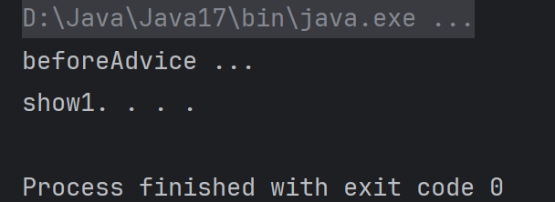


## 2.  注解方式AOP配置详解

在“经典”的 Spring 框架（非 Spring Boot）中，使用注解配置 AOP 主要分为**三步**：

1. **启用 AOP**：在你的 Spring 配置文件中（XML 或 Java Config），“打开”一个开关，告诉 Spring 去自动扫描和处理 `@Aspect` 注解。
2. **定义切面 Bean**：创建一个 Java 类，用 `@Aspect` 标记它，并用 `@Component` 让它成为一个 Bean。
3. **定义通知和切点**：在切面 Bean 内部，使用 `@Before`、`@After`、`@Pointcut` 等注解来定义“何时”以及“何地”执行你的切面逻辑。


### 2.1  启用 AspectJ 自动代理


Spring 必须知道它需要去寻找 `@Aspect` 注解并创建代理。你有两种方式来启用这个功能，**任选其一**：


#### 方式一：在 XML 配置文件中启用


这是从 XML 迁移过来的最常见方式。你只需要在你的 Spring XML 配置文件中添加一行：

XML

```xml
<?xml version="1.0" encoding="UTF-8"?>
<beans xmlns="http://www.springframework.org/schema/beans"
       xmlns:xsi="http://www.w3.org/2001/XMLSchema-instance"
       xmlns:aop="http://www.springframework.org/schema/aop"
       xmlns:context="http://www.springframework.org/schema/context"
       xsi:schemaLocation="
           http://www.springframework.org/schema/beans 
           http://www.springframework.org/schema/beans/spring-beans.xsd
           http://www.springframework.org/schema/aop 
           http://www.springframework.org/schema/aop/spring-aop.xsd
           http://www.springframework.org/schema/context 
           http://www.springframework.org/schema/context/spring-context.xsd">

    <context:component-scan base-package="com.example" />

    <aop:aspectj-autoproxy />

</beans>
```


#### 方式二：在 Java Config 配置类中启用


如果你使用纯 Java 配置（`@Configuration`），你需要在配置类上添加 `@EnableAspectJAutoProxy` 注解。

```java
import org.springframework.context.annotation.Configuration;
import org.springframework.context.annotation.ComponentScan;
import org.springframework.context.annotation.EnableAspectJAutoProxy;
    
@Configuration
@ComponentScan(basePackages = "com.example")
// 🌟 启用 AspectJ 自动代理 🌟
@EnableAspectJAutoProxy 
public class AppConfig {
    // ... 其他 @Bean 定义
}
```


### 2.2 定义切面 Bean (`@Aspect` + `@Component`)


现在，你可以创建一个 POJO（普通 Java 对象），用来承载你的通知逻辑。

- `@Aspect`：告诉 Spring：“这是一个切面类，请解析里面的通知”。
- `@Component`：告诉 Spring：“请把这个类实例化，并作为一个 Bean 放入容器中”，这样 `<aop:aspectj-autoproxy />` 才能找到它。

```java
import org.aspectj.lang.annotation.Aspect;
import org.springframework.stereotype.Component;

@Component // 1. 必须是一个 Spring Bean
@Aspect    // 2. 必须声明它是一个切面
public class LoggingAspect {
    
    // 3. 在这里定义通知和切点
    
}
```


### 2.3 定义通知和切点（注解详解）


这是最核心的部分。我们将在 `LoggingAspect` 类内部定义五种通知和切点。


#### A. 定义可复用的切点 (`@Pointcut`)


在 XML 中，我们用 `<aop:pointcut id="...">`。在注解中，我们定义一个**空方法**，并用 `@Pointcut` 注解它。

这个**方法名 (`serviceMethods()`)** 就相当于 XML 中的**切点 `id`**。

Java

```java
import org.aspectj.lang.annotation.Pointcut;

@Aspect
@Component
public class LoggingAspect {

    /**
     * 定义一个可复用的切点
     * 匹配 com.example.service 包及其子包下的所有类的所有方法
     */
    @Pointcut("execution(* com.example.service..*.*(..))")
    public void serviceMethods() {} // 空方法，只用于承载注解和作为引用

}
```


#### B. 定义五种通知


现在，我们可以使用这个切点来定义五种通知。

```java
import org.aspectj.lang.JoinPoint;
import org.aspectj.lang.ProceedingJoinPoint;
import org.aspectj.lang.annotation.*;
import org.springframework.stereotype.Component;

@Aspect
@Component
public class LoggingAspect {

    // 1. 定义可复用切点
    @Pointcut("execution(* com.example.service..*.*(..))")
    public void serviceMethods() {}

    // 2. 前置通知 (Before)
    // 在 "serviceMethods()" 切点引用的方法执行前运行
    @Before("serviceMethods()")
    public void beforeLog(JoinPoint jp) {
        // JoinPoint 可以获取到方法签名、参数等信息
        String methodName = jp.getSignature().getName();
        System.out.println("【前置通知】: 方法 " + methodName + " 开始执行...");
    }

    // 3. 后置通知 (After-Returning)
    // 在方法正常返回后运行
    @AfterReturning(pointcut = "serviceMethods()", returning = "result")
    public void afterReturning(JoinPoint jp, Object result) {
        // "returning = "result"" 将返回值注入到同名参数 "result" 中
        String methodName = jp.getSignature().getName();
        System.out.println("【后置通知】: 方法 " + methodName + " 正常返回... 返回值: " + result);
    }

    // 4. 异常通知 (After-Throwing)
    // 在方法抛出异常后运行
    @AfterThrowing(pointcut = "serviceMethods()", throwing = "ex")
    public void afterThrowing(JoinPoint jp, Exception ex) {
        // "throwing = "ex"" 将异常注入到同名参数 "ex" 中
        String methodName = jp.getSignature().getName();
        System.out.println("【异常通知】: 方法 " + methodName + " 抛出异常... 异常: " + ex.getMessage());
    }

    // 5. 最终通知 (After)
    // 类似于 finally，无论成功还是异常都会执行
    @After("serviceMethods()")
    public void afterFinally(JoinPoint jp) {
        String methodName = jp.getSignature().getName();
        System.out.println("【最终通知】: 方法 " + methodName + " 执行完毕。");
    }

    // 6. 环绕通知 (Around) - 🌟 最强大的通知
    // 它可以控制目标方法是否执行、修改参数、修改返回值
    @Around("serviceMethods()")
    public Object around(ProceedingJoinPoint pjp) throws Throwable {
        System.out.println("【环绕-前】: 方法执行前...");
        
        Object result = null;
        try {
            // 必须手动调用 pjp.proceed() 来执行目标方法
            result = pjp.proceed(); 
            System.out.println("【环绕-后】: 方法正常返回...");
        } catch (Throwable t) {
            System.out.println("【环绕-异常】: 方法抛出异常...");
            throw t; // 必须重新抛出异常
        } finally {
            System.out.println("【环绕-最终】: 方法执行完毕...");
        }
        
        return result;
    }
}
```


### 总结：注解 vs XML


| **概念**     | **XML 配置方式**                                  | **注解配置方式**                    |
| ------------ | ------------------------------------------------- | ----------------------------------- |
| **启用AOP**  | `<aop:aspectj-autoproxy />`                       | `@EnableAspectJAutoProxy`           |
| **切面Bean** | `<bean id="myAspect" ... />`                      | `@Component`                        |
| **声明切面** | `<aop:aspect ref="myAspect">`                     | `@Aspect` (在`@Component`类上)      |
| **切点**     | `<aop:pointcut id="myPc" ... />`                  | `@Pointcut` (在一个空方法上)        |
| **前置通知** | `<aop:before method="log" pointcut-ref="myPc" />` | `@Before("myPc()")` (在`log`方法上) |
| **环绕通知** | `<aop:around method="aro" pointcut-ref="myPc" />` | `@Around("myPc()")` (在`aro`方法上) |

注解方式的最大好处是**“代码内聚”**——切点和通知逻辑**直接写在**切面类的 Java 代码中，而不是分散在一个单独的 XML 文件里，这使得代码的阅读和维护更加容易。


# 七、基于AOP的声明式事务控制


## 1. Spring事务编程概述

事务是开发中必不可少的东西，使用JDBC开发时，我们使用connnection对事务进行控制，使用MyBatis时，我们使用SqlSession对事务进行控制，缺点显而易见，当我们切换数据库访问技术时，事务控制的方式总会变化， Spring 就将这些技术基础上，提供了统一的控制事务的接口。

Spring的事务分为：编程式事务控制 和 声明式事务控制

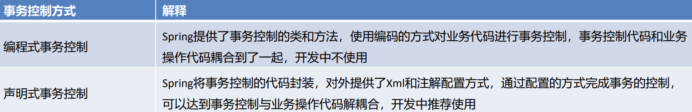

<br>

Spring事务编程相关的类主要有如下三个

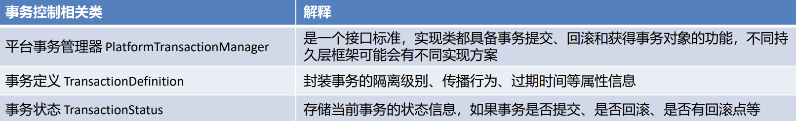

虽然编程式事务控制我们不学习，但是编程式事务控制对应的这些类我们需要了解一下，因为我们在通过配置的方 式进行声明式事务控制时也会看到这些类的影子。


## 2. 搭建环境

搭建一个转账的环境，dao层一个转出钱的方法，一个转入钱的方法，service层一个转账业务方法，内部分别调 用dao层转出钱和转入钱的方法，准备工作如下：

- 数据库准备一个账户表tb_account; 
- dao层准备一个AccountMapper，包括incrMoney和decrMoney两个方法；
- service层准备一个transferMoney方法，分别调用incrMoney和decrMoney方法；
-  在applicationContext文件中进行Bean的管理配置；
- 测试正常转账与异常转账。

<br>

tb_account

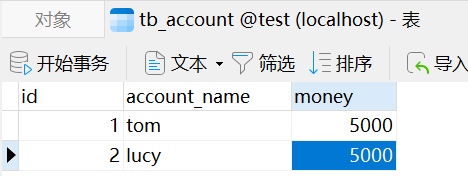

<br>

pom.xml

```xml
<?xml version="1.0" encoding="UTF-8"?>
<project xmlns="http://maven.apache.org/POM/4.0.0"
         xmlns:xsi="http://www.w3.org/2001/XMLSchema-instance"
         xsi:schemaLocation="http://maven.apache.org/POM/4.0.0 http://maven.apache.org/xsd/maven-4.0.0.xsd">
    <modelVersion>4.0.0</modelVersion>

    <groupId>com.wood</groupId>
    <artifactId>spring_transfer_test</artifactId>
    <version>1.0-SNAPSHOT</version>

    <properties>
        <maven.compiler.source>17</maven.compiler.source>
        <maven.compiler.target>17</maven.compiler.target>
        <project.build.sourceEncoding>UTF-8</project.build.sourceEncoding>
    </properties>

    <dependencies>
        <dependency>
            <groupId>org.springframework</groupId>
            <artifactId>spring-context</artifactId>
            <version>5.3.7</version>
        </dependency>

        <dependency>
            <groupId>org.springframework</groupId>
            <artifactId>spring-web</artifactId>
            <version>5.3.7</version>
        </dependency>

        <dependency>
            <groupId>org.springframework</groupId>
            <artifactId>spring-webmvc</artifactId>
            <version>5.3.7</version>
        </dependency>

        <!-- mysql驱动 -->
        <dependency>
            <groupId>mysql</groupId>
            <artifactId>mysql-connector-java</artifactId>
            <version>5.1.49</version>
        </dependency>

        <!-- druid数据源 -->
        <dependency>
            <groupId>com.alibaba</groupId>
            <artifactId>druid</artifactId>
            <version>1.1.23</version>
        </dependency>

        <!--mybatis框架-->
        <dependency>
            <groupId>org.mybatis</groupId>
            <artifactId>mybatis</artifactId>
            <version>3.5.5</version>
        </dependency>

        <!-- mysql驱动 -->
        <dependency>
            <groupId>mysql</groupId>
            <artifactId>mysql-connector-java</artifactId>
            <version>5.1.49</version>
        </dependency>

        <dependency>
            <groupId>org.mybatis</groupId>
            <artifactId>mybatis-spring</artifactId>
            <version>2.0.4</version>
        </dependency>

        <dependency>
            <groupId>org.springframework</groupId>
            <artifactId>spring-jdbc</artifactId>
            <version>5.2.15.RELEASE</version>
        </dependency>

        <dependency>
            <groupId>org.projectlombok</groupId>
            <artifactId>lombok</artifactId>
            <version>1.18.18</version>
        </dependency>

        <dependency>
            <groupId>org.aspectj</groupId>
            <artifactId>aspectjweaver</artifactId>
            <version>1.9.6</version>
        </dependency>
    </dependencies>
</project>
```


<br>

applicationContext.xml

```xml
<?xml version="1.0" encoding="UTF-8"?>
<beans xmlns="http://www.springframework.org/schema/beans"
       xmlns:xsi="http://www.w3.org/2001/XMLSchema-instance"
       xmlns:aop="http://www.springframework.org/schema/aop"
       xmlns:context="http://www.springframework.org/schema/context"
       xsi:schemaLocation="
       http://www.springframework.org/schema/beans
       http://www.springframework.org/schema/beans/spring-beans.xsd
       http://www.springframework.org/schema/aop
       http://www.springframework.org/schema/aop/spring-aop.xsd
       http://www.springframework.org/schema/context
       http://www.springframework.org/schema/context/spring-context.xsd">

    <context:component-scan base-package="com.wood"/>

    <bean id="dataSource" class="com.alibaba.druid.pool.DruidDataSource">
        <property name="url" value="jdbc:mysql://localhost:3306/test"/>
        <property name="username" value="root"/>
        <property name="password" value="1234"/>
        <property name="driverClassName" value="com.mysql.jdbc.Driver"/>
    </bean>

    <!-- 配置SqlSessionFactoryBean,作用将SqlSessionFactory存储到spring容器 -->
    <bean id="sqlSessionFactory" class="org.mybatis.spring.SqlSessionFactoryBean">
        <property name="dataSource" ref="dataSource"/>
    </bean>

    <!-- MapperScannerConfigurer,作用扫描指定的包，产生Mapper.对象存储到Spring容器 -->
    <bean class="org.mybatis.spring.mapper.MapperScannerConfigurer">
        <property name="basePackage" value="com.wood.mapper"/>
        <property name="sqlSessionFactoryBeanName" value="sqlSessionFactory"/>
    </bean>

</beans>
```

<br>

```java
public interface AccountMapper {

    @Update("update tb_account set money = money + #{money} where account_name = #{accountName}")
    public void incrMoney(@Param("accountName") String accountName, @Param("money") Integer  money);

    @Update("update tb_account set money = money - #{money} where account_name = #{accountName}")
    public void decrMoney(@Param("accountName") String accountName, @Param("money") Integer  money);
}
```

<br>

```java
public interface UserService {
    public void transfer(String from, String to, Integer money);
}

@Service("userService")
public class UserServiceImpl implements UserService {
    @Autowired
    private AccountMapper accountMapper;

    @Override
    public void transfer(String from, String to, Integer money) {
        accountMapper.decrMoney(from, money);
        // int i = 1 / 0; 
        accountMapper.incrMoney(to, money);
    }
}
```

<br>

```java
public class AccountTest {
    public static void main(String[] args) {
        ClassPathXmlApplicationContext applicationContext = new ClassPathXmlApplicationContext("applicationContext.xml");
        UserService userService = applicationContext.getBean(UserService.class);
        userService.transfer("tom", "lucy", 500);
    }
}
```


## 3. 基于xml声明式事务控制


### 3.1 入门操作

结合上面我们学习的AOP的技术，很容易就可以想到，可以使用AOP对Service的方法进行事务的增强。 

- 目标类：自定义的AccountServiceImpl，内部的方法是切点
-  通知类：Spring提供的，通知方法已经定义好，只需要配置即可 

我们分析：

- 通知类是Spring提供的，需要导入Spring事务的相关的坐标；
- 配置目标类AccountServiceImpl； 
- 使用advisor标签配置切面。


applicationContext.xml

```xml
<?xml version="1.0" encoding="UTF-8"?>
<beans xmlns="http://www.springframework.org/schema/beans"
       xmlns:xsi="http://www.w3.org/2001/XMLSchema-instance"
       xmlns:aop="http://www.springframework.org/schema/aop"
       xmlns:context="http://www.springframework.org/schema/context"
       xmlns:tx="http://www.springframework.org/schema/tx"
       xsi:schemaLocation="http://www.springframework.org/schema/beans
       http://www.springframework.org/schema/beans/spring-beans.xsd
       http://www.springframework.org/schema/aop
       http://www.springframework.org/schema/aop/spring-aop.xsd
       http://www.springframework.org/schema/context
       http://www.springframework.org/schema/context/spring-context.xsd
       http://www.springframework.org/schema/tx  http://www.springframework.org/schema/tx/spring-tx.xsd
">

    <context:component-scan base-package="com.wood"/>

    <bean id="dataSource" class="com.alibaba.druid.pool.DruidDataSource">
        <property name="url" value="jdbc:mysql://localhost:3306/test"/>
        <property name="username" value="root"/>
        <property name="password" value="1234"/>
        <property name="driverClassName" value="com.mysql.jdbc.Driver"/>
    </bean>

    <!-- 配置SqlSessionFactoryBean,作用将SqlSessionFactory存储到spring容器 -->
    <bean id="sqlSessionFactory" class="org.mybatis.spring.SqlSessionFactoryBean">
        <property name="dataSource" ref="dataSource"/>
    </bean>

    <!-- MapperScannerConfigurer,作用扫描指定的包，产生Mapper.对象存储到Spring容器 -->
    <bean class="org.mybatis.spring.mapper.MapperScannerConfigurer">
        <property name="basePackage" value="com.wood.mapper"/>
        <property name="sqlSessionFactoryBeanName" value="sqlSessionFactory"/>
    </bean>


    <bean id="transactionManager" class="org.springframework.jdbc.datasource.DataSourceTransactionManager">
        <property name="dataSource" ref="dataSource"/>
    </bean>

    <tx:advice id="txAdvice" transaction-manager="transactionManager">
        <tx:attributes>
            <tx:method name="*"/>
        </tx:attributes>
    </tx:advice>

    <aop:config>
        <aop:pointcut id="txPointcut" expression="execution(* com.wood.service.impl.*.*(..))"/>

        <aop:advisor advice-ref="txAdvice" pointcut-ref="txPointcut"/>
    </aop:config>
</beans>
```


### 3.2 配置详解

首先，平台事务管理器PlatformTransactionManager是Spring提供的封装事务具体操作的规范接口，封装了事务的提交和回滚方法。

```java
public interface PlatformTransactionManager extends TransactionManager {
    TransactionStatus getTransaction(@Nullable TransactionDefinition var1) throws TransactionException;
    void commit(TransactionStatus var1) throws TransactionException;
    void rollback(TransactionStatus var1) throws TransactionException;
}

```

不同的持久层框架事务操作的方式有可能不同，所以不同的持久层框架有可能会有不同的平台事务管理器实现， 例如，MyBatis作为持久层框架时，使用的平台事务管理器实现是DataSourceTransactionManager。 Hibernate作为持久层框架时，使用的平台事务管理器是HibernateTransactionManager。

<br>

其次，事务定义信息配置，每个事务有很多特性，例如：隔离级别、只读状态、超时时间等，这些信息在开发时 可以通过connection进行指定，而此处要通过配置文件进行配置。

```xml
<tx:attributes>
	<tx:method name="方法名称" 
               isolation="隔离级别" 
               propagation="传播行为" 
               read-only="只读状态" 
               timeout="超时时间"/>
</tx:attributes>
```

<br>

其中，name属性名称指定哪个方法要进行哪些事务的属性配置，此处需要区分的是切点表达式指定的方法与此处 指定的方法的区别？

切点表达式，是过滤哪些方法可以进行事务增强；事务属性信息的name，是指定哪个方法要 进行哪些事务属性的配置。

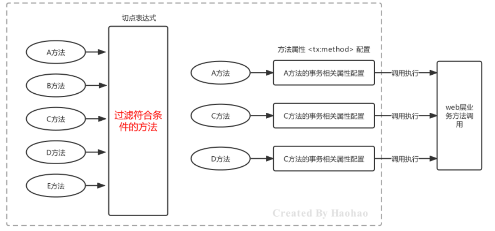

<br>

方法名在配置时，也可以使用 * 进行模糊匹配，例如：

```xml
<tx:advice id="myAdvice" transaction-manager="transactionManager">
    <tx:attributes>
        <!--精确匹配transferMoney方法-->
        <tx:method name="transferMoney"/>
        <!--模糊匹配以Service结尾的方法-->
        <tx:method name="*Service"/>
        <!--模糊匹配以insert开头的方法-->
        <tx:method name="insert*"/>
        <!--模糊匹配以update开头的方法-->
        <tx:method name="update*"/>
        <!--模糊匹配任意方法，一般放到最后作为保底匹配-->
        <tx:method name="*"/>
    </tx:attributes>
</tx:advice>
```

<br>

**isolation**属性：指定事务的隔离级别，事务并发存在三大问题：脏读、不可重复读、幻读/虚读。

可以通过设置事务的隔离级别来保证并发问题的出现，常用的是READ_COMMITTED 和 REPEATABLE_READ。

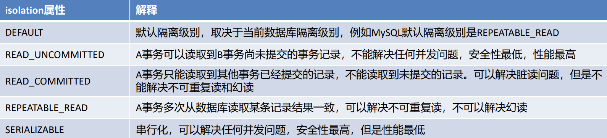

<br>

**read-only**属性：设置当前的只读状态，如果是查询则设置为true，可以提高查询性能，如果是更新（增删改）操 作则设置为false

```xml
<!-- 一般查询相关的业务操作都会设置为只读模式 -->
<tx:method name="select*" read-only="true"/>
<tx:method name="find*" read-only="true"/>
```

<br>

timeout属性：设置事务执行的超时时间，单位是秒，如果超过该时间限制但事务还没有完成，则自动回滚事务 ，不在继续执行。默认值是-1，即没有超时时间限制。

```xml
<!-- 设置查询操作的超时时间是3秒 -->
<tx:method name="select*" read-only="true" timeout="3"/>
```

<br>

propagation属性：设置事务的传播行为，主要解决是A方法调用B方法时，事务的传播方式问题的。

例如：使用 单方的事务，还是A和B都使用自己的事务等。事务的传播行为有如下七种属性值可配置

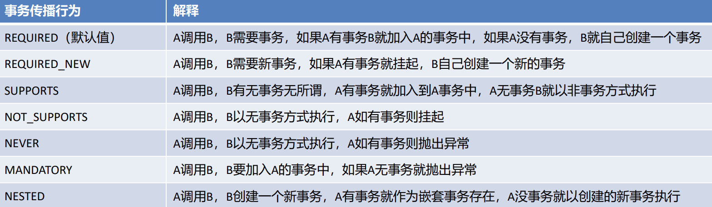

<br>


## 4. 基于注解声明式事务控制


### 4.1 如何启用：@EnableTransactionManagement

与 XML 中的 `<tx:annotation-driven />` 对应，如果你使用的是纯 Java Config（`@Configuration`），你**必须**在一个配置类上添加 `@EnableTransactionManagement` 来“打开”事务注解的开关。

```java
import org.springframework.context.annotation.Bean;
import org.springframework.context.annotation.Configuration;
import org.springframework.transaction.PlatformTransactionManager;
import org.springframework.transaction.annotation.EnableTransactionManagement;
import org.springframework.jdbc.datasource.DataSourceTransactionManager;
import javax.sql.DataSource;

@Configuration
@EnableTransactionManagement // 🌟 1. 开启注解事务支持
public class TransactionConfig {

    // 2. 事务管理器 (TransactionManager) 依然是必须的
    // @EnableTransactionManagement 会自动寻找这个 Bean
    @Bean
    public PlatformTransactionManager transactionManager(DataSource dataSource) {
        return new DataSourceTransactionManager(dataSource);
    }
    
    // 3. DataSource (数据源) 也依然是必须的
    @Bean
    public DataSource dataSource() {
        // ... (此处配置 Druid, HikariCP 等)
        // ...
        return new ...;
    }
}
```

> **注意**：如果你在使用 **Spring Boot**，`spring-boot-starter-data-jdbc` 或 `spring-boot-starter-data-jpa` 会**自动**为你配置好 `DataSource`、`TransactionManager` 并**自动开启** `@EnableTransactionManagement`。你**不需要**写上面的配置类，可以直接跳到第二步。

------


### 4.2 如何使用：@Transactional


启用后，你就可以在你的 Service 类或方法上使用 `@Transactional` 注解了。


#### A. 放在类（Class）上

- **作用**：为该类中**所有**的 `public` 方法设置**默认**的事务规则。
- **最佳实践**：通常在 Service 类上设置一个“只读”的默认事务。


```java
import org.springframework.transaction.annotation.Transactional;
import org.springframework.stereotype.Service;

@Service
// 1. 在类上设置：所有 public 方法默认都是只读事务 (SUPPORTS)
@Transactional(readOnly = true, propagation = Propagation.SUPPORTS)
public class UserServiceImpl implements UserService {

    @Autowired
    private UserDao userDao;

    // 2. 这个方法继承了类上的 @Transactional(readOnly = true)
    public User findUserById(int id) {
        return userDao.selectById(id);
    }

    // 3. 在方法上设置：覆盖类上的默认配置
    @Transactional(readOnly = false, propagation = Propagation.REQUIRED)
    public void addUser(User user) {
        userDao.insert(user);
    }
}
```


#### B. 放在方法（Method）上

- **作用**：为**特定**的 `public` 方法设置事务规则。
- **优先级**：**方法上的注解 优于 类上的注解**。
- **最佳实践**：为“增、删、改”方法（写操作）单独添加 `@Transactional`，并覆盖类上的 `readOnly=true`。

------


### 4.3 @Transactional 的核心属性


这些属性与 XML 中 `<tx:method>` 的属性是**一一对应**的。


#### `propagation` (事务传播行为)


- **作用**：同 XML，定义事务如何传播。
- **写法**：使用 `Propagation` 枚举。
- **`Propagation.REQUIRED`**：(默认值) 必须有事务。增删改操作的首选。
- **`Propagation.SUPPORTS`**：支持事务。查询操作的首选。
- **`Propagation.REQUIRES_NEW`**：总是创建新事务。
- ... (其他同 XML)


#### `isolation` (隔离级别)


- **作用**：同 XML，定义数据库隔离级别。
- **写法**：使用 `Isolation` 枚举。
- **`Isolation.DEFAULT`**：(默认值) 使用数据库的默认设置。
- **`Isolation.READ_COMMITTED`**：读已提交。
- ... (其他同 XML)


#### `readOnly` (只读)


- **作用**：告诉数据库这是只读事务，以进行优化。
- **写法**：`true` 或 `false` (默认 `false`)。
- **强烈建议**：所有查询方法（`find`, `get`, `query`）都设为 `true`。


#### `rollbackFor` 和 `noRollbackFor`


- **作用**：指定哪些异常需要回滚或不需要回滚。
- **写法**：`rollbackFor = Exception.class` 或 `rollbackFor = {MyException1.class, MyException2.class}`

> **⚠️ 再次强调这个巨坑！**
>
> 默认情况下，`@Transactional` **只对 `RuntimeException` (运行时异常) 和 `Error` 自动回滚**。
>
> 如果你的方法抛出了一个 **Checked Exception** (受检异常，如 `IOException` 或 `MyBusinessException extends Exception`)，**Spring 默认是不会回滚的！**
>
> 最佳实践：
>
> 养成好习惯，为所有“写”操作的方法指定 rollbackFor = Exception.class，确保所有异常都能触发回滚。


```java
@Transactional(
    propagation = Propagation.REQUIRED, 
    isolation = Isolation.DEFAULT,
    readOnly = false,
    rollbackFor = Exception.class  // 🌟 确保所有异常都回滚
)
public void updateUserData(User user) throws Exception {
    // ...
    if (user.getName() == null) {
        // 这是一个受检异常
        throw new Exception("用户名不能为空"); 
    }
    // ...
}
```


#### `timeout` (超时)


- **作用**：设置事务的超时时间（秒）。如果事务执行时间超过这个值，将自动回滚。
- **写法**：`timeout = 30` (表示 30 秒)

------


### 4.4 两个最关键的“失效”场景（面试必问）


为什么我的 `@Transactional` 不起作用？


#### A. 只能用于 `public` 方法


`@Transactional` 注解如果用在 `protected`、`private` 或包可见性的方法上，Spring AOP **会（悄悄地）忽略它**，不会报错，但事务也不会生效。


#### B. “自调用”（Self-Invocation）失效


这是**最常见、最隐蔽**的错误。

**事务是基于 AOP（代理）实现的**。只有当调用是**通过代理对象**发起时，事务切面才能被织入。

**错误示例：**

Java

```java
@Service
public class UserServiceImpl implements UserService {

    // A. 这个方法被 @Transactional 标记
    @Transactional(rollbackFor = Exception.class)
    public void methodA(User user) {
        userDao.insert(user);
    }

    // B. 这个方法没有 @Transactional
    public void methodB(User user) {
        // ... 一些其他逻辑 ...
        
        // ⚠️ 错误！
        // 这是 "this" 引用，是对象内部的 "自调用"
        // 它调用的是 "原始对象" 的 methodA()
        // 而不是 "代理对象" 的 methodA()
        // AOP 代理被完全绕过了，事务不会生效！
        this.methodA(user); 
    }
}
```

**如何解决“自调用”问题？**

方法一：从外部调用（推荐）

把 methodA 和 methodB 拆到两个不同的 Service 中（如 UserService 和 OrderService）。OrderService @Autowired 注入 UserService，然后调用 userService.methodA()。

方法二：注入自己（不推荐，但可行）

Spring 允许你注入自己的代理对象。

```java
@Service
public class UserServiceImpl implements UserService {
    
    // 注入自己 (Spring 注入的是代理对象)
    @Autowired
    private UserService selfProxy; 
    
    // ... methodA ...

    public void methodB(User user) {
        // ...
        
        // ✅ 正确
        // 通过 "代理对象" 来调用，AOP 生效
        selfProxy.methodA(user);
}
```


### 总结：XML vs 注解


| **方面**     | **XML 方式 (<tx:advice>)**         | **注解方式 (@Transactional)**  |
| ------------ | ---------------------------------- | ------------------------------ |
| **配置位置** | XML 文件中，与代码分离             | Java 类/方法上，与代码内聚     |
| **可读性**   | 差。需要 XML 和 Java 来回看        | **高**。配置就在业务逻辑旁边   |
| **侵入性**   | **低**。POJO 还是 POJO             | 高。业务代码依赖了 Spring 注解 |
| **切点粒度** | 灵活。`execution` 表达式可批量匹配 | 只能在类或方法上，一个一个加   |
| **主流趋势** | 已过时（经典 Spring）              | **绝对主流**（Spring Boot）    |


# 八、Spring整合web环境


## 1. Javaweb三大组件及环境特点

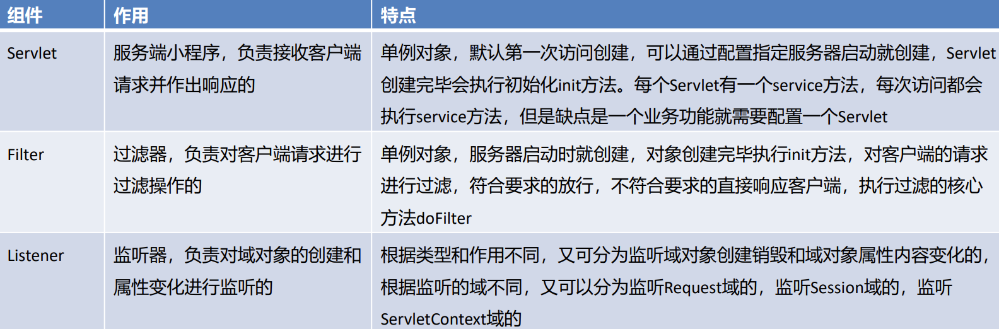


## 2.  Spring整合web环境的思路及实现


### 2.1 整合思路分析

applicationContext.xml

```xml
<?xml version="1.0" encoding="UTF-8"?>
<beans xmlns="http://www.springframework.org/schema/beans"
       xmlns:xsi="http://www.w3.org/2001/XMLSchema-instance"
       xmlns:aop="http://www.springframework.org/schema/aop"
       xmlns:context="http://www.springframework.org/schema/context"
       xmlns:tx="http://www.springframework.org/schema/tx"
       xsi:schemaLocation="http://www.springframework.org/schema/beans
       http://www.springframework.org/schema/beans/spring-beans.xsd
       http://www.springframework.org/schema/aop
       http://www.springframework.org/schema/aop/spring-aop.xsd
       http://www.springframework.org/schema/context
       http://www.springframework.org/schema/context/spring-context.xsd
       http://www.springframework.org/schema/tx  http://www.springframework.org/schema/tx/spring-tx.xsd
">

    <context:component-scan base-package="com.wood"/>

    <bean id="dataSource" class="com.alibaba.druid.pool.DruidDataSource">
        <property name="url" value="jdbc:mysql://localhost:3306/test"/>
        <property name="username" value="root"/>
        <property name="password" value="1234"/>
        <property name="driverClassName" value="com.mysql.jdbc.Driver"/>
    </bean>

    <!-- 配置SqlSessionFactoryBean,作用将SqlSessionFactory存储到spring容器 -->
    <bean id="sqlSessionFactory" class="org.mybatis.spring.SqlSessionFactoryBean">
        <property name="dataSource" ref="dataSource"/>
    </bean>

    <!-- MapperScannerConfigurer,作用扫描指定的包，产生Mapper.对象存储到Spring容器 -->
    <bean class="org.mybatis.spring.mapper.MapperScannerConfigurer">
        <property name="basePackage" value="com.wood.mapper"/>
        <property name="sqlSessionFactoryBeanName" value="sqlSessionFactory"/>
    </bean>

</beans>
```

<br>

```java
@WebServlet("/accountServlet")
public class AccountServlet extends HttpServlet {

    @Override
    protected void doGet(HttpServletRequest req, HttpServletResponse resp) {
        ClassPathXmlApplicationContext app = new ClassPathXmlApplicationContext("applicationContext.xml");
        UserService userService = app.getBean(UserService.class);
        userService.transfer("lucy", "tom", 500);
    }
}
```

有问题可以看这篇博客：https://blog.csdn.net/ahy231/article/details/111151035

<br>

web层代码如果都去编写创建ClassPathXmlApplicationContext的代码，那么配置类重复被加载了， Spring容器也重复被创建了，不能每次想从容器中获得一个Bean都得先创建一次容器，这样肯定是不允许。

 所以，我们现在的诉求很简单，如下： 

- ApplicationContext创建一次，配置类加载一次; 
- 最好web服务器启动时，就执行第1步操作，后续直接从容器中获取Bean使用即可; 
- ApplicationContext的引用需要在web层任何位置都可以获取到。

<br>

针对以上诉求我们给出解决思路，如下：

- 在ServletContextListener的contextInitialized方法中执行ApplicationContext的创建。或在Servlet的init 方法中执行ApplicationContext的创建，并给Servlet的load-on-startup属性一个数字值，确保服务器启动 Servlet就创建;  
- 将创建好的ApplicationContext存储到ServletContext域中，这样整个web层任何位置就都可以获取到了。


### 2.2 模拟ContextLoaderListener

web.xml

```xml
<?xml version="1.0" encoding="UTF-8"?>
<web-app xmlns="http://xmlns.jcp.org/xml/ns/javaee"
         xmlns:xsi="http://www.w3.org/2001/XMLSchema-instance"
         xsi:schemaLocation="http://xmlns.jcp.org/xml/ns/javaee http://xmlns.jcp.org/xml/ns/javaee/web-app_4_0.xsd"
         version="4.0">

    <!-- 定义全局参数 -->
    <context-param>
        <param-name>contextConfigLocation</param-name>
        <param-value>classpath:applicationContext.xml</param-value>
    </context-param>

    <!-- 配置Listener   -->
    <listener>
        <listener-class>com.wood.listener.ContextLoaderListener</listener-class>
    </listener>
</web-app>
```

<br>

```java
import org.springframework.context.support.ClassPathXmlApplicationContext;

import javax.servlet.ServletContext;
import javax.servlet.ServletContextEvent;
import javax.servlet.ServletContextListener;

public class ContextLoaderListener implements ServletContextListener {
    private  String CONTEXT_CONFIG_LOCATION = "contextConfigLocation";
    @Override
    public void contextInitialized(ServletContextEvent sce) {
        System.out.println("ContextLoaderListener init...");

        ServletContext servletContext = sce.getServletContext();

        String contextConfigLocation = servletContext.getInitParameter(CONTEXT_CONFIG_LOCATION);

        contextConfigLocation = contextConfigLocation.substring("classpath:".length());

        ClassPathXmlApplicationContext app = new ClassPathXmlApplicationContext(contextConfigLocation);

        servletContext.setAttribute("applicationContext", app);
    }
}
```

<br>

```java
import org.springframework.context.ApplicationContext;

import javax.servlet.ServletContext;

public class WebApplicationContextUtils {
    public static ApplicationContext getWebApplicationContext(ServletContext servletContext) {
        return (ApplicationContext) servletContext.getAttribute("applicationContext");
    }
}
```

<br>

```java
@WebServlet("/accountServlet")
public class AccountServlet extends HttpServlet {
    @Override
    protected void doGet(HttpServletRequest req, HttpServletResponse resp) {
        ServletContext servletContext = req.getServletContext();
        ApplicationContext app = WebApplicationContextUtils.getWebApplicationContext(servletContext);
        UserService userService = app.getBean(UserService.class);
        userService.transfer("lucy", "tom", 500);
    }
}
```

<br>

## 3. Spring的web开发组件spring-web


### 3.1 配置spring-web包的ContextLoaderListener

pom.xml

```xml
<dependency>
    <groupId>org.springframework</groupId>
    <artifactId>spring-web</artifactId>
    <version>5.3.7</version>
</dependency>
```

<br>

web.xml

```xml
<?xml version="1.0" encoding="UTF-8"?>
<web-app xmlns="http://xmlns.jcp.org/xml/ns/javaee"
         xmlns:xsi="http://www.w3.org/2001/XMLSchema-instance"
         xsi:schemaLocation="http://xmlns.jcp.org/xml/ns/javaee http://xmlns.jcp.org/xml/ns/javaee/web-app_4_0.xsd"
         version="4.0">

    <!-- 定义全局参数 -->
    <context-param>
        <param-name>contextConfigLocation</param-name>
        <param-value>classpath:applicationContext.xml</param-value>
    </context-param>

    <!-- 配置Listener   -->
    <listener>
        <listener-class>org.springframework.web.context.ContextLoaderListener</listener-class>
    </listener>
</web-app>
```

<br>

```java
import com.wood.service.UserService;
import org.springframework.context.ApplicationContext;
import org.springframework.web.context.support.WebApplicationContextUtils;

import javax.servlet.ServletContext;
import javax.servlet.annotation.WebServlet;
import javax.servlet.http.HttpServlet;
import javax.servlet.http.HttpServletRequest;
import javax.servlet.http.HttpServletResponse;

@WebServlet("/accountServlet")
public class AccountServlet extends HttpServlet {

    @Override
    protected void doGet(HttpServletRequest req, HttpServletResponse resp) {
        ServletContext servletContext = req.getServletContext();
        ApplicationContext app = WebApplicationContextUtils.getWebApplicationContext(servletContext);
        UserService userService = app.getBean(UserService.class);
        userService.transfer("lucy", "tom", 500);
    }
}
```

注意：这里WebApplicationContextUtils引用的是spring-web的。


### 3.2 核心配置类如何配置

```java
import com.alibaba.druid.pool.DruidDataSource;
import org.mybatis.spring.SqlSessionFactoryBean;
import org.mybatis.spring.annotation.MapperScan;
import org.springframework.beans.factory.annotation.Value;
import org.springframework.context.annotation.*;

import javax.sql.DataSource;

/**
 * @Title: SpringConfig
 * @Author Wood
 * @Package com.wood.config
 * @Date 2025/11/14 19:13
 * @description:
 */
@Configuration
@ComponentScan(basePackages = "com.wood")
@PropertySource("classpath:jdbc.properties")
@MapperScan(basePackages = "com.wood.mapper")
public class SpringConfig {
    @Bean
    public DataSource dataSource(@Value("${jdbc.url}") String url,
                                 @Value("${jdbc.username}") String username,
                                 @Value("${jdbc.password}") String password,
                                 @Value("${jdbc.driverClassName}") String driverClassName){
        DruidDataSource dataSource = new DruidDataSource();
        dataSource.setUrl(url);
        dataSource.setUsername(username);
        dataSource.setPassword(password);
        dataSource.setDriverClassName(driverClassName);
        return dataSource;
    }

    @Bean
    public SqlSessionFactoryBean sqlSessionFactoryBean(DataSource dataSource){
        SqlSessionFactoryBean sqlSessionFactoryBean = new SqlSessionFactoryBean();
        sqlSessionFactoryBean.setDataSource(dataSource);
        return sqlSessionFactoryBean;
    }
}
```

<br>

```java
import org.springframework.web.context.support.AnnotationConfigWebApplicationContext;

public class MyAnnotationConfigWebApplicationContext extends AnnotationConfigWebApplicationContext {
    public MyAnnotationConfigWebApplicationContext() {
        //注册核心配置类
        super.register(SpringConfig.class);
    }
}
```

<br>

```xml
<?xml version="1.0" encoding="UTF-8"?>
<web-app xmlns="http://xmlns.jcp.org/xml/ns/javaee"
         xmlns:xsi="http://www.w3.org/2001/XMLSchema-instance"
         xsi:schemaLocation="http://xmlns.jcp.org/xml/ns/javaee http://xmlns.jcp.org/xml/ns/javaee/web-app_4_0.xsd"
         version="4.0">

    <!-- 定义全局参数 -->
    <context-param>
        <param-name>contextClass</param-name>
        <param-value>com.wood.config.MyAnnotationConfigWebApplicationContext</param-value>
    </context-param>

    <!-- 配置Listener   -->
    <listener>
        <listener-class>org.springframework.web.context.ContextLoaderListener</listener-class>
    </listener>
</web-app>
```


## 4. web层MVC框架思想与设计思路

Java程序员在开发一般都是MVC+三层架构，MVC是web开发模式，传统的Javaweb技术栈实现的MVC如下:

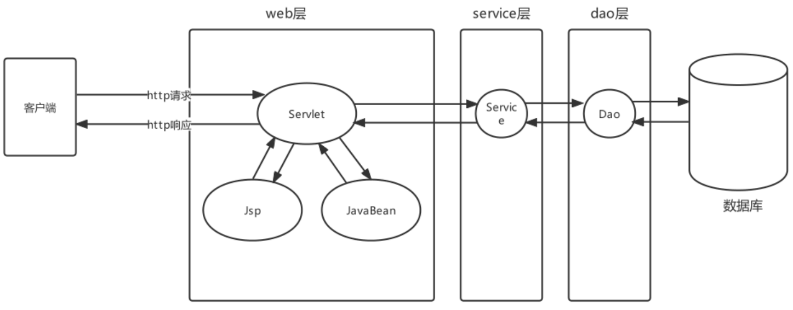

<br>

原始Javaweb开发中，Servlet充当Controller的角色，Jsp充当View角色，JavaBean充当模型角色，后期Ajax异 步流行后，在加上现在前后端分离开发模式成熟后，View就被原始Html+Vue替代。

原始Javaweb开发中， Servlet充当Controller有很多弊端，显而易见的有如下几个：

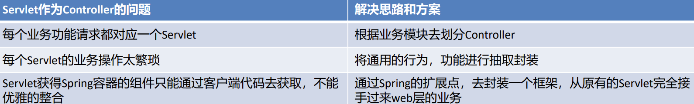

<br>

负责共有行为的Servlet称之为前端控制器，负责业务行为的JavaBean称之为控制器Controller.

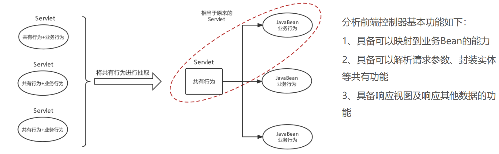


# 九、SpringMVC简介


## 1. SpringMVC概述

SpringMVC是一个基于Spring开发的MVC轻量级框架，Spring3.0后发布的组件，SpringMVC 和 Spring 可以无缝整合，使用DispatcherServlet作为前端控制器，且内部提供了处理器映射器、处理器适配器、视图解析器等组件，可以简化JavaBean封装，Json转化、文件上传等操作。

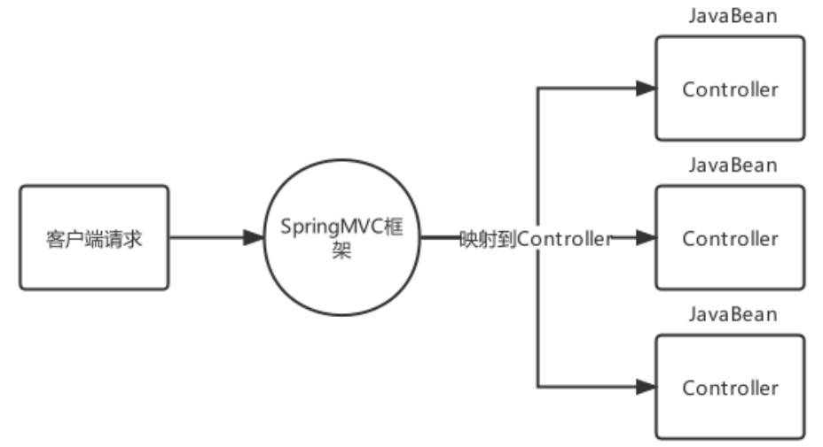


## 2. SpringMVC快速入门

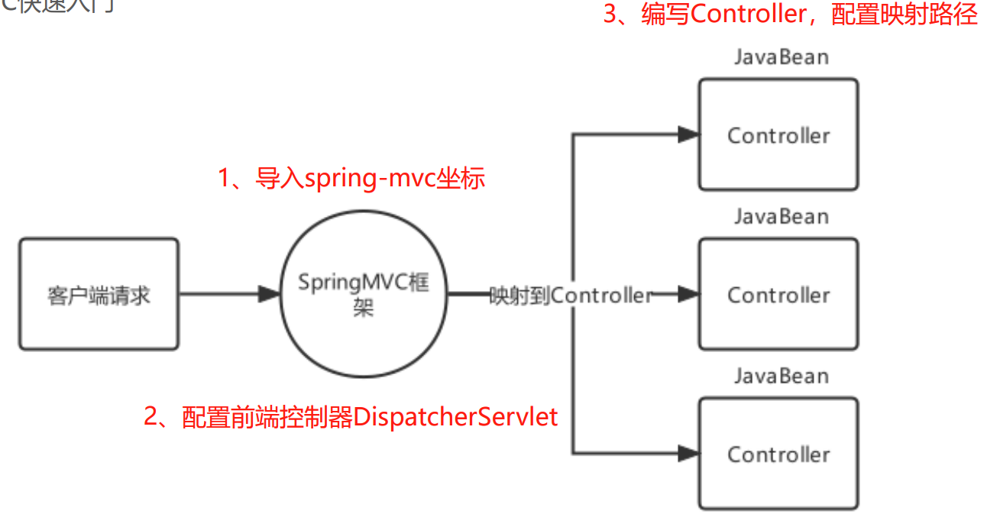

<br>

pom.xml

```xml
<?xml version="1.0" encoding="UTF-8"?>
<project xmlns="http://maven.apache.org/POM/4.0.0"
         xmlns:xsi="http://www.w3.org/2001/XMLSchema-instance"
         xsi:schemaLocation="http://maven.apache.org/POM/4.0.0 http://maven.apache.org/xsd/maven-4.0.0.xsd">
    <modelVersion>4.0.0</modelVersion>

    <groupId>com.wood</groupId>
    <artifactId>spring_webmvc_test01</artifactId>
    <version>1.0-SNAPSHOT</version>
    <packaging>war</packaging>

    <properties>
        <maven.compiler.source>17</maven.compiler.source>
        <maven.compiler.target>17</maven.compiler.target>
        <project.build.sourceEncoding>UTF-8</project.build.sourceEncoding>
    </properties>

    <dependencies>
        <dependency>
            <groupId>org.springframework</groupId>
            <artifactId>spring-webmvc</artifactId>
            <version>5.3.7</version>
        </dependency>

        <dependency>
            <groupId>javax.servlet</groupId>
            <artifactId>javax.servlet-api</artifactId>
            <version>4.0.1</version>
        </dependency>
    </dependencies>
</project>
```

<br>

web.xml

```xml
<?xml version="1.0" encoding="UTF-8" ?>
<web-app xmlns="http://xmlns.jcp.org/xml/ns/javaee"
         xmlns:xsi="http://www.w3.org/2001/XMLSchema-instance"
         xsi:schemaLocation="http://xmlns.jcp.org/xml/ns/javaee http://xmlns.jcp.org/xml/ns/javaee/web-app_3_1.xsd"
         version="3.1">
    <servlet>
        <servlet-name>DispatcherServlet</servlet-name>
        <servlet-class>org.springframework.web.servlet.DispatcherServlet</servlet-class>
        <init-param>
            <param-name>contextConfigLocation</param-name>
            <param-value>classpath:spring-mvc.xml</param-value>
        </init-param>
        <load-on-startup>2</load-on-startup>
    </servlet>
    <servlet-mapping>
        <servlet-name>DispatcherServlet</servlet-name>
        <url-pattern>/</url-pattern>
    </servlet-mapping>
</web-app>
```

当你启动 Web 服务器时，服务器会读取这个 `web.xml` 文件，然后：

1. 创建 `DispatcherServlet` 实例。
2. `DispatcherServlet` 读取 `spring-mvc.xml` 文件，初始化 Spring MVC 容器（加载所有的 `@Controller` 等）。
3. 当一个用户请求（比如 `/show`）进来时，服务器会把它交给 `DispatcherServlet`。
4. `DispatcherServlet` 会根据 `spring-mvc.xml` 的配置，将这个请求转发给正确的 Controller 方法去处理。


<br>

spring-mvc.xml

```xml
<?xml version="1.0" encoding="UTF-8"?>
<beans xmlns="http://www.springframework.org/schema/beans"
       xmlns:xsi="http://www.w3.org/2001/XMLSchema-instance"
       xmlns:context="http://www.springframework.org/schema/context"
       xsi:schemaLocation="http://www.springframework.org/schema/beans
       http://www.springframework.org/schema/beans/spring-beans.xsd
       http://www.springframework.org/schema/context
       https://www.springframework.org/schema/context/spring-context.xsd">

    <context:component-scan base-package="com.wood.controller"/>
</beans>
```

<br>

```java
import org.springframework.stereotype.Controller;
import org.springframework.web.bind.annotation.RequestMapping;

@Controller
public class QuickController {
    @RequestMapping("/show")
    public void show() {
        System.out.println("show running...");
    }
}
```

<br>

### 运行结果

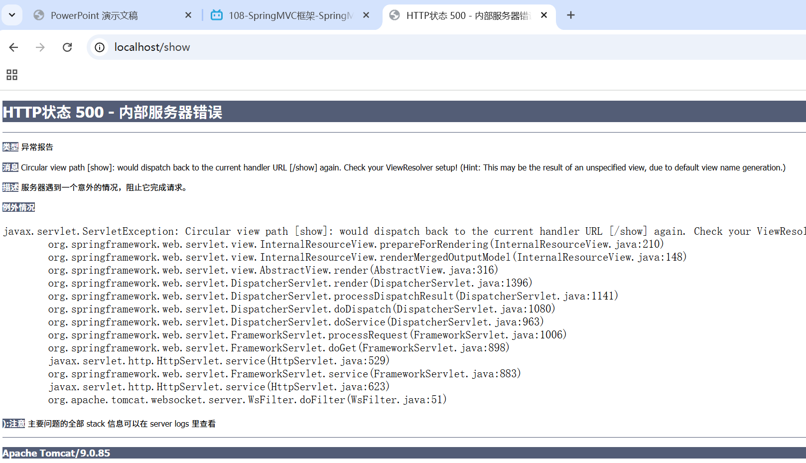

<br>

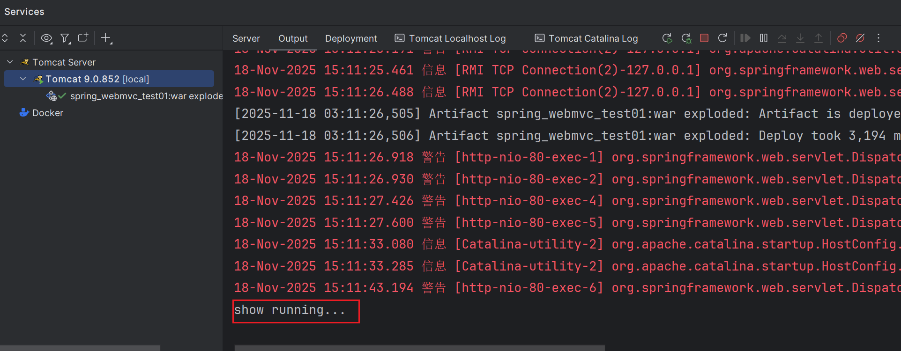

可以看到页面虽然报500，但是show方法的打印语句成功打印到了控制台上。说明show方法成功执行了。


### 页面报500的原因


默认情况下，Controller下的方法返回的是个视图名字。

<br>

在webapp下新建index.jsp文件

```jsp
<%@ page contentType="text/html;charset=UTF-8" language="java" %>
<html>
<head>
    <title>Title</title>
</head>
<body>
    <h1>Hello SpringMVC!</h1>
</body>
</html>
```

<br>

```java
@Controller
public class QuickController {
    @RequestMapping("/show")
    public String show() {
        System.out.println("show running...");
        return "index.jsp";
    }
}
```

<br>

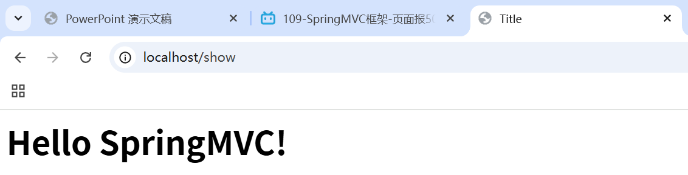


## 3. Controller中访问容器中的Bean

DispatcherServlet在进行初始化时，加载的spring-mvc.xml配置文件创建的SpringMVC容器，那么web层 Controller被扫描进入到了容器中。

现在我们想要controller里面使用service，那必须将service注入controller中。

<br>

### web.xml

```xml
<?xml version="1.0" encoding="UTF-8" ?>
<web-app xmlns="http://xmlns.jcp.org/xml/ns/javaee"
         xmlns:xsi="http://www.w3.org/2001/XMLSchema-instance"
         xsi:schemaLocation="http://xmlns.jcp.org/xml/ns/javaee http://xmlns.jcp.org/xml/ns/javaee/web-app_3_1.xsd"
         version="3.1">

    <context-param>
        <param-name>contextConfigLocation</param-name>
        <param-value>classpath:applicationContext.xml</param-value>
    </context-param>
    <listener>
        <listener-class>org.springframework.web.context.ContextLoaderListener</listener-class>
    </listener>
    
    <servlet>
        <servlet-name>DispatcherServlet</servlet-name>
        <servlet-class>org.springframework.web.servlet.DispatcherServlet</servlet-class>
        <init-param>
            <param-name>contextConfigLocation</param-name>
            <param-value>classpath:spring-mvc.xml</param-value>
        </init-param>
        <load-on-startup>2</load-on-startup>
    </servlet>
    <servlet-mapping>
        <servlet-name>DispatcherServlet</servlet-name>
        <url-pattern>/</url-pattern>
    </servlet-mapping>
</web-app>
```

这个配置文件比上一个要复杂，它配置了一个“经典”的、**包含父子容器（Parent-Child Container）**的 Spring + Spring MVC 应用。

这是“SSM”（Spring + Spring MVC + MyBatis）时代最标准、最核心的配置。

它的作用是**启动两个独立的 Spring 容器（ApplicationContext）**，并让它们协同工作：

1. 一个是由**“监听器 (Listener)”**启动的**“根容器 (Root Context)”**。
2. 一个是由**“Servlet”**启动的**“Web 容器 (Web Context)”**。

------


#### 1. 启动“Spring 根容器”（父容器）


这部分是由 `<listener>` 和全局的 `<context-param>` 完成的。

- **`<listener-class>org.springframework.web.context.ContextLoaderListener</listener-class>`**
  - `ContextLoaderListener` 是一个 Servlet **监听器**。它的职责是在 **Web 服务器（如 Tomcat）启动时**，自动加载 Spring 的“根容器”。
- **`<context-param>...classpath:applicationContext.xml</context-param>`**
  - 这个全局参数告诉 `ContextLoaderListener`：“你的配置文件是 `applicationContext.xml`。”

 根容器的目的：

这个容器是全局共享的，它用来管理“后端”的、与 Web 无关的 Bean。

- **Service Bean** (`@Service`)
- **DAO / Repository Bean** (`@Repository`)
- **数据源** (`DataSource`)
- **事务管理器** (`PlatformTransactionManager`)


#### 2. 启动“Spring MVC 容器”（子容器）


这部分是由 `<servlet>`（你之前见过的）完成的。

- **`<servlet-class>org.springframework.web.servlet.DispatcherServlet</servlet-class>`**
  - `DispatcherServlet` 是 Spring MVC 的核心**前端控制器**。
- **`<init-param>...classpath:spring-mvc.xml</init-param>`**
  - 这个**局部的**参数告诉 `DispatcherServlet`：“你的**私有**配置文件是 `spring-mvc.xml`。”

Web 容器的目的：

这个容器是 DispatcherServlet 私有的，它只用来管理与 Web 相关的 Bean。

- **Controller Bean** (`@Controller`)
- **视图解析器** (`ViewResolver`)
- **拦截器** (`HandlerInterceptor`)
- **文件上传** (`MultipartResolver`)

------


#### 3. 它们的关系：父子容器


这是整个配置的**灵魂**：

- **根容器 (Root Context)**：由 `ContextLoaderListener` 加载，它在 `DispatcherServlet` 之前创建，是**父容器**。
- **Web 容器 (Web Context)**：由 `DispatcherServlet` 加载，它在之后创建，是**子容器**。

**核心规则：**

1. **子容器可以访问父容器**：Web 容器（`spring-mvc.xml`）中的 Bean（如 Controller）**可以**注入和使用根容器（`applicationContext.xml`）中的 Bean（如 Service）。
2. **父容器不能访问子容器**：根容器（`applicationContext.xml`）中的 Bean（如 Service）**不能**反过来注入 Web 容器中的 Bean（如 Controller）。

为什么这么设计？

这种**“职责分离”**是经典的最佳实践：

- **后端（Service, DAO）**是稳定的、共享的，放在父容器。
- **前端（Controller）**是多变的，放在子容器。
- 这保证了你的 Service 层和 DAO 层是“纯净”的，它们不依赖于任何 Web 层的代码，可以被轻松地用于其他地方（比如单元测试、定时任务）。

------


#### 总结：启动流程

1. Tomcat 启动。
2. Tomcat 读取 `web.xml`。
3. `ContextLoaderListener` **首先**被触发，它创建“父容器”，并加载 `applicationContext.xml`（Service, DAO 等）。
4. `DispatcherServlet` **随后**被创建（`load-on-startup`），它创建“子容器”，并加载 `spring-mvc.xml`（Controller 等）。
5. `servlet-mapping` (`/`) 激活 `DispatcherServlet`，开始接收所有请求。
6. 当请求进来，Controller (子) 会调用 Service (父) 来完成工作。

<br>

### applicationContext.xml

```xml
<?xml version="1.0" encoding="UTF-8"?>
<beans xmlns="http://www.springframework.org/schema/beans"
       xmlns:xsi="http://www.w3.org/2001/XMLSchema-instance"
       xmlns:context="http://www.springframework.org/schema/context"
       xsi:schemaLocation="http://www.springframework.org/schema/beans
       http://www.springframework.org/schema/beans/spring-beans.xsd
       http://www.springframework.org/schema/context
       https://www.springframework.org/schema/context/spring-context.xsd">

    <context:component-scan base-package="com.wood.service"/>
</beans>
```

<br>

### QuickService

```java
public interface QuickService {
}

@Service
public class QuickServiceImpl implements QuickService {
}
```

<br>

### QuickController

```java
@Controller
public class QuickController {
    @Autowired
    private QuickService quickService;

    @RequestMapping("/show")
    public String show() {
        System.out.println("show running..." + quickService);
        return "index.jsp";
    }
}
```

<br>

### 运行结果


## 4.  SpringMVC关键组件浅析

上面已经完成的快速入门的操作，也在不知不觉中完成的Spring和SpringMVC的整合，我们只需要按照规则去定 义Controller和业务方法就可以。但是在这个过程中，肯定是很多核心功能类参与到其中，这些核心功能类，一 般称为组件。

当请求到达服务器时，是哪个组件接收的请求，是哪个组件帮我们找到的Controller，是哪个组件 帮我们调用的方法，又是哪个组件最终解析的视图？

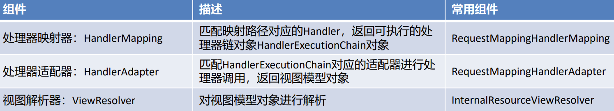

<br>

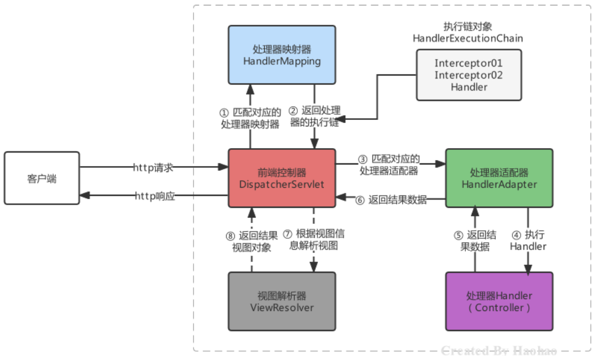

<br>

SpringMVC 在前端控制器 DispatcherServlet加载时，就会进行初始化操作，在进行初始化时，就会加载SpringMVC默认指定的一些组件，这些默认组件配置在 DispatcherServlet.properties 文件中。

该文件存在与spring-webmvc-5.3.7.jar包下的 org\springframework\web\servlet\DispatcherServlet.properties。

```properties
org.springframework.web.servlet.HandlerMapping=org.springframework.web.servlet.handler.BeanNameUrl
HandlerMapping,\
org.springframework.web.servlet.mvc.method.annotation.RequestMappingHandlerMapping,\
org.springframework.web.servlet.function.support.RouterFunctionMapping

org.springframework.web.servlet.HandlerAdapter=org.springframework.web.servlet.mvc.HttpRequestHand
lerAdapter,\
org.springframework.web.servlet.mvc.SimpleControllerHandlerAdapter,\
org.springframework.web.servlet.mvc.method.annotation.RequestMappingHandlerAdapter,\
org.springframework.web.servlet.function.support.HandlerFunctionAdapter

org.springframework.web.servlet.ViewResolver=org.springframework.web.servlet.view.InternalResource
ViewResolver
#省略其他代码
```

<br>

这些默认的组件是在DispatcherServlet中进行初始化加载的，在DispatcherServlet中存在集合存储着这些组件， SpringMVC的默认组件会在 DispatcherServlet 中进行维护，但是并没有存储在与SpringMVC的容器中

```java
public class DispatcherServlet extends FrameworkServlet {
    //存储处理器映射器
    private List<HandlerMapping> handlerMappings;
    //存储处理器适配器
    private List<HandlerAdapter> handlerAdapters;
    //存储视图解析器
    private List<ViewResolver> viewResolvers;
    // ... 省略其他代码 ...
}
```

<br>

配置组件代替默认组件，如果不想使用默认组件，可以将替代方案使用Spring Bean的方式进行配置。

例如，在 spring-mvc.xml中配置RequestMappingHandlerMapping

```xml
<bean
class="org.springframework.web.servlet.mvc.method.annotation.RequestMappingHandlerMapping"/>
```

当我们在Spring容器中配置了HandlerMapping，则就不会在加载默认的HandlerMapping策略了，原理比较简单， DispatcherServlet 在进行HandlerMapping初始化时，先从SpringMVC容器中找是否存在HandlerMapping，如果 存在直接取出容器中的HandlerMapping，在存储到 DispatcherServlet 中的handlerMappings集合中去。


# 十、SpringMVC的请求处理


## 1. 请求映射路径的配置

配置映射路径，映射器处理器才能找到Controller的方法资源，目前主流映射路径配置方式就是@RequestMapping。

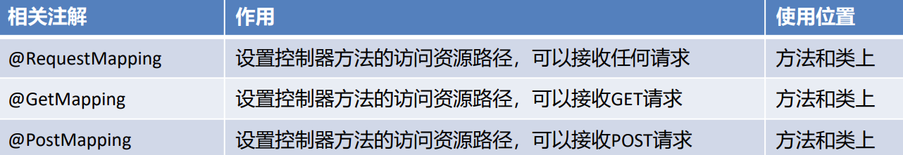

<br>

@RequestMapping注解，主要使用在控制器的方法上，用于标识客户端访问资源路径，常用的属性有value、path 、method、headers、params等。

当@RequestMapping只有一个访问路径需要指定时，使用value属性、path属 性或省略value和path，当有多个属性时，value和path不能省略。

```java
@RequestMapping(value = "/show")//使用value属性指定一个访问路径
public String show(){}
@RequestMapping(value = {"/show","/haohao","/abc"})//使用value属性指定多个访问路径
public String show(){}
@RequestMapping(path = "/show")//使用path属性指定一个访问路径
public String show(){}
@RequestMapping(path = {"/show","/haohao","/abc"})//使用path属性指定多个访问路径
public String show(){}
@RequestMapping("/show")//如果只设置访问路径时，value和path可以省略
public String show(){}
@RequestMapping({"/show","/haohao","/abc"})
public String show(){}
```

<br>

当@RequestMapping 需要限定访问方式时，可以通过method属性设置。

```java
//请求地址是/show,且请求方式必须是POST才能匹配成功
@RequestMapping(value = "/show",method = RequestMethod.POST)
public String show(){}
```

<br>

method的属性值是一个枚举类型，源码如下：

```java
public enum RequestMethod {
    GET,
    HEAD,
    POST,
    PUT,
    PATCH,
    DELETE,
    OPTIONS,
    TRACE;
    private RequestMethod() {
    }
}
```

<br>

@GetMapping，当请求方式是GET时，我们可以使用@GetMapping替代@RequestMapping。

@PostMapping，当请求方式是POST时，我们可以使用@PostMapping替代@RequestMapping。

<br>

@RequestMapping 、@GetMapping、@PostMapping还可以使用在 Controller类上，使用在类上后，该类所有方法都公用该@RequestMapping设置的属性，访问路径则为类上的映射 地址+方法上的映射地址，例如：

```java
@Controller
@RequestMapping("/xxx")
public class UserController implements ApplicationContextAware, ServletContextAware {
    @GetMapping("/aaa")
    public ModelAndView aaa(HttpServletResponse response) throws IOException, ModelAndViewDefiningException 	{
    	return null;
    }
}
```

此时的访问路径为：/xxx/aaa


## 2.  请求数据的接收


### 2.1 键值对形式参数

接收普通请求数据，当客户端提交的数据是普通键值对形式时，直接使用同名形参接收即可。

```http
username=haohao&age=35
```

```java
@GetMapping("/show")
public String show(String username, int age){
    System.out.println(username+"=="+age);
    return "/index.jsp";
}
```

<br>

接收普通请求数据，当请求参数的名称与方法参数名不一致时，可以使用@RequestParam注解进行标注。

```http
username=haohao&age=35
```

```java
@GetMapping("/show")
public String show(@RequestParam(name = "username",required = true) String name, int age){
    System.out.println(username+"=="+age);
    return "/index.jsp";
}
```

<br>

接收数组或集合数据，客户端传递多个同名参数时，可以使用数组接收。

```http
hobbies=eat&hobbies=sleep
```

```java
@GetMapping("/show")
public String show(String[] hobbies){
    for (String hobby : hobbies) {
    	System.out.println(hobby);
    }
    return "/index.jsp";
}
```

<br>

客户端传递多个同名参数时，也可以使用单列集合接收，但是需要使用@RequestParam告知框架传递的参数是要同名设置的，不是对象属性设置的。

```java
@GetMapping("/show")
public String show(@RequestParam List<String> hobbies){
    for (String hobby : hobbies) {
    	System.out.println(hobby);
    }
    return "/index.jsp";
}
```

<br>

接收数组或集合数据，客户端传递多个不同命参数时，也可以使用Map 进行接收，同样需要用 @RequestParam 进行修饰。

```http
username=haohao&age=18
```

```java
@PostMapping("/show")
public String show(@RequestParam Map<String,Object> params){
    params.forEach((key,value)->{
    	System.out.println(key+"=="+value);
    });
    return "/index.jsp";
}
```

<br>

### 2.2 接收实体JavaBean属性数据

单个JavaBean数据：提交的参数名称只要与Java的属性名一致，就可以进行自动封装

```http
username=haohao&age=35&hobbies=eat&hobbies=sleep
```

```java
public class User {
    private String username;
    private Integer age;
    private String[] hobbies;
    private Date birthday;
    private Address address;
    //... 省略get和set方法 ...
}
```

```java
@GetMapping("/show")
public String show(User user){
    System.out.println(user);
    return "/index.jsp";
}
```

<br>

嵌套JavaBean数据：提交的参数名称用 . 去描述嵌套对象的属性关系即可

```http
username=haohao&address.city=tianjin&address.area=jinghai
```


### 2.3 接收Json数据格式数据

Json数据都是以请求体的方式提交的，且不是原始的键值对格式的，所以我们要使用 @RequestBody注解整体接收该数据。

```json
{
    "username":"haohao",
    "age":18,
    "hobbies":["eat","sleep"],
    "birthday":"1986-01-01",
    "address":{
        "city":"tj",
        "area":"binhai"
    }
}
```

```java
@PostMapping("/show6")
public String show6(@RequestBody String body){
    System.out.println(body);
    return "/index.jsp";
}
```

<br>

使用Json工具（ jackson ）将Json格式的字符串转化为JavaBean进行操作。

```xml
<dependency>
    <groupId>com.fasterxml.jackson.core</groupId>
    <artifactId>jackson-databind</artifactId>
    <version>2.9.0</version>
</dependency>
```

```java
@PostMapping("/show")
public String show(@RequestBody String body) throws IOException {
    System.out.println(body);
    //获得ObjectMapper
    ObjectMapper objectMapper = new ObjectMapper();
    //将json格式字符串转化成指定的User
    User user = objectMapper.readValue(body, User.class);
    System.out.println(user);
    return "/index.jsp";
}
```

<br>

配置RequestMappingHandlerAdapter，指定消息转换器，就不用手动转换json格式字符串了。

```java
<bean
    class="org.springframework.web.servlet.mvc.method.annotation.RequestMappingHandlerAdapter">
    <property name="messageConverters">
        <list>
            <bean
            class="org.springframework.http.converter.json.MappingJackson2HttpMessageConverter"/>
        </list>
    </property>
</bean>
```

```java
@PostMapping("/show")
public String show(@RequestBody User user){
	System.out.println(user);
	return "/index.jsp";
}
```


### 2.4 接收Restful风格数据

Rest（Representational State Transfer）表象化状态转变（表述性状态转变），在2000年被提出，基于HTTP、URI 、xml、JSON等标准和协议，支持轻量级、跨平台、跨语言的架构设计。是Web服务的一种新网络应用程序的设计风格和开发方式。

<br>

Restful风格的请求，常见的规则有如下三点：

- 用URI表示某个模块资源，资源名称为名词；

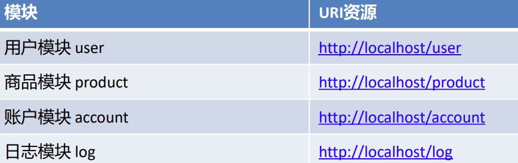

<br>

- 用请求方式表示模块具体业务动作，例如：GET表示查询、POST表示插入、PUT表示更新、DELETE表示删除

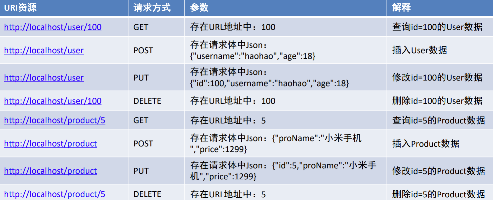

<br>

- 用HTTP响应状态码表示结果，国内常用的响应包括三部分：状态码、状态信息、响应数据

```json
{
    "code":200,
    "message":"成功",
    "data":{
        "username":"haohao",
        "age":18
    }
}
{
    "code":300,
    "message":"执行错误",
    "data":""
}
```

<br>

接收Restful风格数据，Restful请求数据一般会在URL地址上携带，可以使用注解 @PathVariable(占位符参数名称)

```http
http://localhost/user/100 
```

```java
@PostMapping("/user/{id}") 
public String findUserById(@PathVariable("id") Integer id){ 
    System.out.println(id); return "/index.jsp"; 
}
```

<br>

请求URL资源地址包含多个参数情况

```http
http://localhost/user/haohao/18 
```

```java
@PostMapping("/user/{username}/{age}") 
public String findUserByUsernameAndAge(@PathVariable("username") String username,
                                            @PathVariable("age") Integer age{
    System.out.println(username+"=="+age); 
    return "/index.jsp"; 
}
```


### 2.5 接收文件上传的数据

文件上传的表单需要一定的要求，如下：

- 表单的提交方式必须是POST
- 表单的enctype属性必须是multipart/form-data
- 文件上传项需要有name属性

```html
<form action="" enctype="multipart/form-data" method="post" >
    <input type="file" name="myFile">
</form>
```

<br>

服务器端，由于映射器适配器需要文件上传解析器，而该解析器默认未被注册，所以手动注册。

```xml
<!--配置文件上传解析器，注意：id的名字是固定写法-->
<bean id="multipartResolver"
class="org.springframework.web.multipart.commons.CommonsMultipartResolver">
    <property name="defaultEncoding" value="UTF-8"/><!--文件的编码格式 默认是ISO8859-1-->
    <property name="maxUploadSizePerFile" value="1048576"/><!--上传的每个文件限制的大小 单位字节-->
    <property name="maxUploadSize" value="3145728"/><!--上传文件的总大小-->
    <property name="maxInMemorySize" value="1048576"/><!--上传文件的缓存大小-->
</bean>
```

而CommonsMultipartResolver底层使用的Apache的是Common-fileuplad等工具API进行的文件上传

```xml
<dependency>
    <groupId>commons-fileupload</groupId>
    <artifactId>commons-fileupload</artifactId>
    <version>1.4</version>
</dependency>
```

<br>

使用MultipartFile类型接收上传文件

```java
@PostMapping("/fileUpload")
public String fileUpload(@RequestBody MultipartFile myFile) throws IOException {
    System.out.println(myFile);
    //获得上传的文件的流对象
    InputStream inputStream = myFile.getInputStream();
    //使用commons-io存储到C:\haohao\abc.txt位置
    FileOutputStream outputStream = new
    FileOutputStream("C:\\Users\\haohao\\"+myFile.getOriginalFilename());
    IOUtils.copy(inputStream,outputStream);
    //关闭资源
    inputStream.close();
    outputStream.close();
    return "/index.jsp";
}
```


### 2.6 接收Http请求头数据

接收指定名称的请求头

```java
@GetMapping("/headers")
public String headers(@RequestHeader("Accept-Encoding") String acceptEncoding){
    System.out.println("Accept-Encoding:"+acceptEncoding);
    return "/index.jsp";
}
```

<br>

接收所有的请求头信息

```java
@GetMapping("/headersMap")
public String headersMap(@RequestHeader Map<String,String> map){
    map.forEach((k,v)->{
    	System.out.println(k+":"+v);
    });
    return "/index.jsp";
}
```

<br>

获得客户端携带的Cookie数据

```java
@GetMapping("/cookies")
public String cookies(@CookieValue(value = "JSESSIONID",defaultValue = "") String jsessionid){
    System.out.println(jsessionid);
    return "/index.jsp";
}
```


### 2.7 获得转发Request域中数据

在进行资源之间转发时，有时需要将一些参数存储到request域中携带给下一个资源。

```java
@GetMapping("/request1")
public String request1(HttpServletRequest request){
    //存储数据
    request.setAttribute("username","haohao");
    return "/request2";
}
@GetMapping("/request2")
public String request2(@RequestAttribute("username") String username){
    System.out.println(username);
    return "/index.jsp";
}
```


## 3. Javaweb常用对象获取

有时在我们的Controller方法中需要用到Javaweb的原生对象，例如：Request、 Response等，我们只需要将需要的对象以形参的形式写在方法上，SpringMVC框架在调用Controller方法时，会自动传递实参。

```java
@GetMapping("/javawebObject")
public String javawebObject(HttpServletRequest request, HttpServletResponse response,
							HttpSession session){
    System.out.println(request);
    System.out.println(response);
    System.out.println(session);
    return "/index.jsp";
}
```


## 4. 请求静态资源

静态资源请求失效的原因：当DispatcherServlet的映射路径配置为 / 的时候，那么就覆盖的Tomcat容器默认的缺省 Servlet，在Tomcat的config目录下有一个web.xml 是对所有的web项目的全局配置，其中有如下配置：

```xml
<servlet>
    <servlet-name>default</servlet-name>
    <servlet-class>org.apache.catalina.servlets.DefaultServlet</servlet-class>
    <load-on-startup>1</load-on-startup>
</servlet>
<servlet-mapping>
    <servlet-name>default</servlet-name>
    <url-pattern>/</url-pattern>
</servlet-mapping>
```

url-pattern配置为 / 的Servlet我们称其为缺省的Servlet，作用是当其他Servlet都匹配不成功时，就找缺省的Servlet ，静态资源由于没有匹配成功的Servlet，所以会找缺省的DefaultServlet，该DefaultServlet具备二次去匹配静态资 源的功能。

但是我们配置DispatcherServlet后就将其覆盖掉了，而DispatcherServlet会将请求的静态资源的名称当成Controller的映射路径去匹配，即静态资源访问不成功了！

<br>

静态资源请求的三种解决方案： 

第一种方案，可以再次激活Tomcat的DefaultServlet，Servlet的url-pattern的匹配优先级是：精确匹配>目录匹配> 扩展名匹配>缺省匹配，所以可以指定某个目录下或某个扩展名的资源使用DefaultServlet进行解析

```xml
<servlet-mapping>
    <servlet-name>default</servlet-name>
    <url-pattern>/img/*</url-pattern>
</servlet-mapping>
<servlet-mapping>
    <servlet-name>default</servlet-name>
    <url-pattern>*.html</url-pattern>
</servlet-mapping>
```

<br>

第二种方式，在spring-mvc.xml中去配置静态资源映射，匹配映射路径的请求到指定的位置去匹配资源。

```xml
<!-- mapping是映射资源路径，location是对应资源所在的位置 -->
<mvc:resources mapping="/img/*" location="/img/"/>
<mvc:resources mapping="/css/*" location="/css/"/>
<mvc:resources mapping="/css/*" location="/js/"/>
<mvc:resources mapping="/html/*" location="/html/"/>
```

<br>

第三种方式，在spring-mvc.xml中去配置< mvc:default-servlet-handler >，该方式是注册了一个 DefaultServletHttpRequestHandler 处理器，静态资源的访问都由该处理器去处理，这也是开发中使用最多的。

```xml
<mvc:default-servlet-handler/>
```


## 5. 注解驱动`<mvc:annotation-driven>`标签

静态资源配置的第二第三种方式我们可以正常访问静态资源了，但是Controller又无法访问了，报错404，即找不到对应的资源。

<br>

第二种方式是通过SpringMVC去解析mvc命名空间下的resources标签完成的静态资源解析，第三种方式式通过 SpringMVC去解析mvc命名空间下的default-servlet-handler标签完成的静态资源解析，根据前面所学习的自定义命 名空间的解析的知识，可以发现不管是以上哪种方式，最终都会注册SimpleUrlHandlerMapping。

```java
public BeanDefinition parse(Element element, ParserContext context) {
    //创建SimpleUrlHandlerMapping类型的BeanDefinition
    RootBeanDefinition handlerMappingDef =
    new RootBeanDefinition(SimpleUrlHandlerMapping.class);
    //注册SimpleUrlHandlerMapping的BeanDefinition
    context.getRegistry().registerBeanDefinition(beanName, handlerMappingDef);
}
```

又结合组件浅析知识点，一旦SpringMVC容器中存在 HandlerMapping 类型的组件时，前端控制器 DispatcherServlet在进行初始化时，就会从容器中获得HandlerMapping ，不在加载 dispatcherServlet.properties 中默认处理器映射器策略，那也就意味着RequestMappingHandlerMapping不会被加载到了。

<br>

手动将RequestMappingHandlerMapping也注册到SpringMVC容器中就可以了，这样DispatcherServlet在进行初 始化时，就会从容器中同时获得RequestMappingHandlerMapping存储到DispatcherServlet中名为 handlerMappings的List集合中，对@RequestMapping 注解进行解析。

```xml
<bean class="org.springframework.web.servlet.mvc.method.annotation.RequestMappingHandlerMapping"/>
```

<br>

根据上面的讲解，可以总结一下，要想使用@RequestMapping正常映射到资源方法，同时静态资源还能正常访问， 还可以将请求json格式字符串和JavaBean之间自由转换，我们就需要在spring-mvc.xml中尽心如下配置：

```xml
<!-- 显示配置RequestMappingHandlerMapping -->
<bean class="org.springframework.web.servlet.mvc.method.annotation.RequestMappingHandlerMapping"/>
<!-- 显示配置RequestMappingHandlerAdapter -->
<bean class="org.springframework.web.servlet.mvc.method.annotation.RequestMappingHandlerAdapter">
    <property name="messageConverters">
    <list>
    	<bean class="org.springframework.http.converter.json.MappingJackson2HttpMessageConverter"/>
    </list>
</property>
</bean>
<!--配置DefaultServletHttpRequestHandler-->
<mvc:default-servlet-handler/>
```

<br>

这么复杂繁琐的配置，是不是看上去有点头大？Spring是个"暖男"，将上述配置浓缩成了一个简单的配置标签，那就 是mvc的注解驱动，该标签内部会帮我们注册RequestMappingHandlerMapping、注册 RequestMappingHandlerAdapter并注入Json消息转换器等，上述配置就可以简化成如下：

```xml
<!--mvc注解驱动-->
<mvc:annotation-driven/>
<!--配置DefaultServletHttpRequestHandler-->
<mvc:default-servlet-handler/>
```

PS： 标签在不同的版本中，帮我们注册的组件不同，Spring 3.0.X 版本注册是 DefaultAnnotationHandlerMapping 和 AnnotationMethodHandlerAdapter，由于框架的发展，从Spring 3.1.X 开始注册组件变为 RequestMappingHandlerMapping和RequestMappingHandlerAdapter


# 十一、SpringMVC的响应处理

Spring的接收请求的部分我们讲完了，下面在看一下Spring怎么给客户端响应数据，响应数据主要分为两大部分： 

- 传统同步方式：准备好模型数据，在跳转到执行页面进行展示，此方式使用越来越少了，基于历史原因，一些旧 项目还在使用； 
- 前后端分离异步方式：前端使用Ajax技术+Restful风格与服务端进行Json格式为主的数据交互，目前市场上几乎 都是此种方式了。


## 1. 传统同步业务数据响应

传统同步业务在数据响应时，SpringMVC又涉及如下四种形式：  

- 请求资源转发；
- 请求资源重定向；  
- 响应模型数据； 
- 直接回写数据给客户端

<br>

### 1.1 转发和重定向

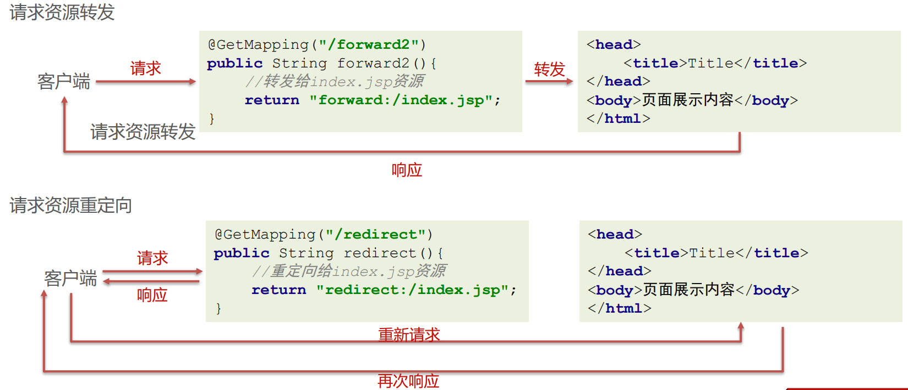

<br>

### 1.2 响应模型数据

响应模型数据本质也是转发，在转发时可以准备模型数据

```java
@GetMapping("/forward5")
public ModelAndView forward5(ModelAndView modelAndView){
    //准备JavaBean模型数据
    User user = new User();
    user.setUsername("haohao");
    //设置模型
    modelAndView.addObject("user",user);
    //设置视图
    modelAndView.setViewName("/index.jsp");
    return modelAndView;
}
```

<br>

### 1.3 直接回写数据

直接通过方法的返回值返回给客户端的字符串，但是SpringMVC默认的方法返回值是视图，可以通过 @ResponseBody 注解显示的告知此处的返回值不要进行视图处理，是要以响应体的方式处理的。

```java
@GetMapping("/response2")
@ResponseBody
public String response2() throws IOException {
	return "Hello haohao!";
}
```


## 2. 前后端分离异步业务数据响应

其实此处的回写数据，跟上面回写数据给客户端的语法方式一样，只不过有如下一些区别：

- 同步方式回写数据，是将数据响应给浏览器进行页面展示的，而异步方式回写数据一般是回写给Ajax引擎的，即 谁访问服务器端，服务器端就将数据响应给谁 。
- 同步方式回写的数据，一般就是一些无特定格式的字符串，而异步方式回写的数据大多是Json格式字符串。

<br>

回写普通数据使用@ResponseBody标注方法，直接返回字符串即可，此处不在说明； 

回写Json格式的字符串，即将直接拼接Json格式的字符串或使用工具将JavaBean转换成Json格式的字符串回写

```java
@GetMapping("/response3")
@ResponseBody
public String response3(HttpServletResponse response) {
	return "{\"username\":\"haohao\",\"age\":18}";
}
@GetMapping("/response4")
@ResponseBody
public String response4() throws JsonProcessingException {
    //创建JavaBean
    User user = new User();
    user.setUsername("haohao");
    user.setAge(18);
    //使用Jackson转换成json格式的字符串
    String json = new ObjectMapper().writeValueAsString(user);
    return json;
}
```

<br>

在讲解SringMVC接收请求数据时，客户端提交的Json格式的字符串，也是使用Jackson进行的手动转换成JavaBean ，可以当我们使用了@RequestBody时，直接用JavaBean就接收了Json格式的数据，原理其实就是SpringMVC底层帮我们做了转换，此处@ResponseBody也可以将JavaBean自动给我们转换成Json格式字符串回响应。

```java
@GetMapping("/response5")
@ResponseBody
public User response5() throws JsonProcessingException {
    //创建JavaBean
    User user = new User();
    user.setUsername("haohao");
    user.setAge(18);
    //直接返回User对象
    return user;
}
```

<br>

@ResponseBody注解使用优化，在进行前后端分离开发时，Controller的每个方法都是直接回写数据的，所以每个 方法上都得写@ResponseBody，可以将@ResponseBody写到Controller上，那么该Controller中的所有方法都具备 了返回响应体数据的功能了。

```java
@Controller
@ResponseBody
public class UserController{
    @GetMapping("/response7")
    public ResultInfo response7() {
        //省略其他代码
        return info;
    }
    @GetMapping("/response5")
    public User response5() throws JsonProcessingException {
        //省略其他代码
        return user;
    }
	// ... 省略其他方法 ...
}
```

<br>

进一步优化，可以使用@RestController替代@Controller和@ResponseBody，@RestController内部具备的这两个 注解的功能。

```java
@RestController
public class UserController{
    @GetMapping("/response7")
    public ResultInfo response7() {
        //省略其他代码
        return info;
    }
    @GetMapping("/response5")
    public User response5() throws JsonProcessingException {
        //省略其他代码
        return user;
    }
	// ... 省略其他方法 ...
}
```


# 十二、SpringMVC的拦截器


## 1. 拦截器 Interceptor 简介

SpringMVC的拦截器Interceptor规范，主要是对Controller资源访问时进行拦截操作的技术，当然拦截后可以进行权 限控制，功能增强等都是可以的。

拦截器有点类似 Javaweb 开发中的Filter，拦截器与Filter的区别如下图：

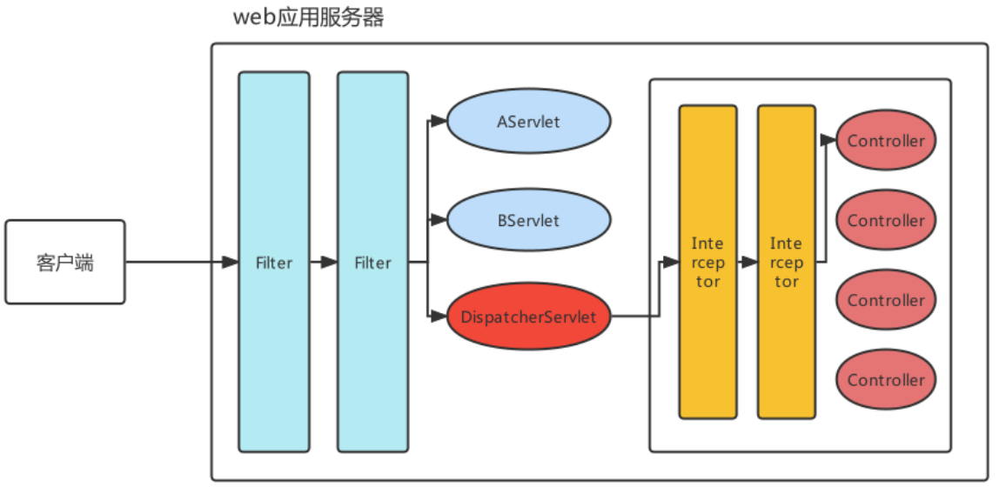

<br>

由上图，对Filter 和 Interceptor 做个对比：

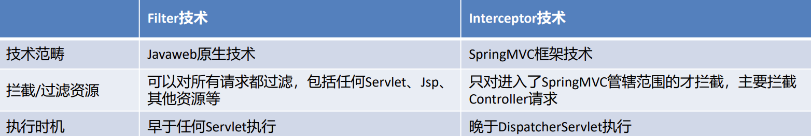

<br>

实现了HandlerInterceptor接口，且被Spring管理的Bean都是拦截器，接口定义如下：

```java
public interface HandlerInterceptor {
    default boolean preHandle(HttpServletRequest request, HttpServletResponse response, 
                              Object handler) throws Exception {
        return true;
    }
    default void postHandle(HttpServletRequest request, HttpServletResponse response, 
                            Object handler, @Nullable ModelAndView modelAndView) throws Exception {
    }
    default void afterCompletion(HttpServletRequest request, HttpServletResponse response,
    							 Object handler, @Nullable Exception ex) throws Exception {
    }
}
```

<br>

HandlerInterceptor接口方法的作用及其参数、返回值详解如下：

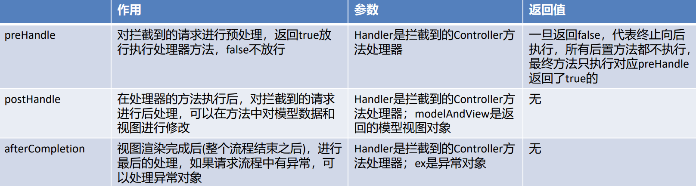


## 2. 拦截器快速入门

编写MyInterceptor01实现HandlerInterceptor接口：

```java
public class MyInterceptor01 implements HandlerInterceptor {
    @Override
    public boolean preHandle(HttpServletRequest request, HttpServletResponse response, 
                             Object handler) throws Exception {
        System.out.println("Controller方法执行之前...");
        return true;//放行
    }
    @Override
    public void postHandle(HttpServletRequest request, HttpServletResponse response, Object handler,
    						ModelAndView modelAndView) throws Exception {
    	System.out.println("Controller方法执行之后...");
    }
    @Override
    public void afterCompletion(HttpServletRequest request, HttpServletResponse response, 
                                Object handler, Exception ex) throws Exception {
    	System.out.println("渲染视图结束，整个流程完毕...");
    }
}
```

<br>

配置Interceptor

```xml
<!--配置拦截器-->
<mvc:interceptors>
    <mvc:interceptor>
        <!--配置对哪些资源进行拦截操作-->
        <mvc:mapping path=“/**"/>
        <bean class="com.itheima.interceptor.MyInterceptor01"></bean>
    </mvc:interceptor>
</mvc:interceptors>
```

<br>

## 3. 拦截器执行顺序

拦截器三个方法的执行顺序 当每个拦截器都是放行状态时，三个方法的执行顺序如下：

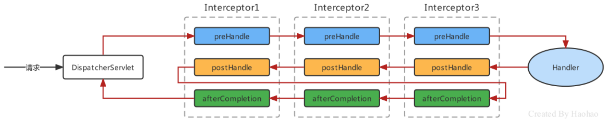

<br>

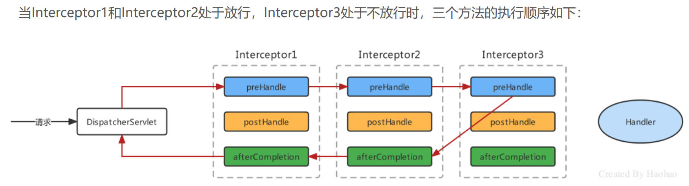

拦截器执行顺序取决于 interceptor 的配置顺序。


## 4. 拦截器执行原理

请求到来时先会使用组件HandlerMapping去匹配Controller的方法（Handler）和符合拦截路径的Interceptor， Handler和多个Interceptor被封装成一个HandlerExecutionChain的对象。

HandlerExecutionChain 定义如下：

```java
public class HandlerExecutionChain {
    //映射的Controller的方法
    private final Object handler;
    //当前Handler匹配的拦截器集合
    private final List<HandlerInterceptor> interceptorList;
    // ... 省略其他代码 ...
}
```

<br>

在DispatcherServlet的doDispatch方法中执行拦截器

```java
protected void doDispatch(HttpServletRequest request, HttpServletResponse response){
    //根据请求信息获得HandlerExecutionChain
    HandlerExecutionChain mappedHandler = this.getHandler(request);
    //获得处理器适配器
    HandlerAdapter ha = this.getHandlerAdapter(mappedHandler.getHandler());
    //执行Interceptor的前置方法，前置方法如果返回false，则该流程结束
    if (!mappedHandler.applyPreHandle(request, response)) {
    	return;
    }
    //执行handler，一般是HandlerMethod
    ModelAndView mv = ha.handle(processedRequest, response, mappedHandler.getHandler());
    //执行后置方法
    mappedHandler.applyPostHandle(processedRequest, response, mv);
    //执行最终方法
    this.triggerAfterCompletion(processedRequest, response, mappedHandler, e);
}
```

<br>

跟踪 HandlerExecutionChain的applyPreHandle方法源码：

```java
boolean applyPreHandle(HttpServletRequest request, HttpServletResponse response) throws Exception {
    //对interceptorList进行遍历,正向遍历,与此同时使用interceptorIndex进行计数
    for(int i = 0; i < this.interceptorList.size(); this.interceptorIndex = i++) {
        //取出每一个Interceptor对象
        HandlerInterceptor interceptor = (HandlerInterceptor)this.interceptorList.get(i);
        //调用Interceptor的preHandle方法，如果返回false，则直接执行Interceptor的最终方法
        if (!interceptor.preHandle(request, response, this.handler)) {
            //执行Interceptor的最终方法
            this.triggerAfterCompletion(request, response, (Exception)null);
            return false;
        }
    }
    return true;
}
```

<br>

跟踪 HandlerExecutionChain的applyPostHandle方法源码：

```java
void applyPostHandle(HttpServletRequest request, HttpServletResponse response, 
                     @Nullable ModelAndView mv) throws Exception {
    //对interceptorList进行遍历，逆向遍历
    for(int i = this.interceptorList.size() - 1; i >= 0; --i) {
        //取出每一个Interceptor
        HandlerInterceptor interceptor = (HandlerInterceptor)this.interceptorList.get(i);
        //执行Interceptor的postHandle方法
        interceptor.postHandle(request, response, this.handler, mv);
    }
}
```

<br>

跟踪HandlerExecutionChain的triggerAfterCompletion方法源码：

```java
void triggerAfterCompletion(HttpServletRequest request, HttpServletResponse response, 
                            @Nullable Exception ex) {
    //逆向遍历interceptorList，遍历的个数为执行的applyPreHandle次数-1
    for(int i = this.interceptorIndex; i >= 0; --i) {
        //取出每一个Interceptor
        HandlerInterceptor interceptor = (HandlerInterceptor)this.interceptorList.get(i);
        try {
            //执行Interceptor的afterCompletion方法
            interceptor.afterCompletion(request, response, this.handler, ex);
        } catch (Throwable var7) {
        	logger.error("HandlerInterceptor.afterCompletion threw exception", var7);
        }
    }
}
```

<br>

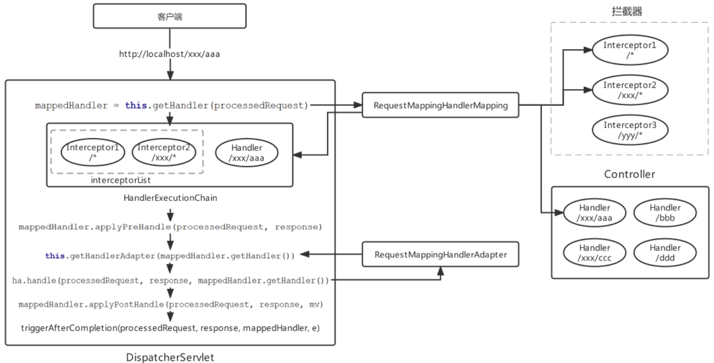


# 十三、SpringMVC的全注解开发


## 1.  spring-mvc.xml 中组件转化为注解形式

跟之前全注解开发思路一致， xml配置文件使用核心配置类替代，xml中的标签使用对应的注解替代。

**spring-mvc.xml**

```xml
<!-- 组件扫描web层 -->
<context:component-scan base-package="com.itheima.controller"/>
<!--注解驱动-->
<mvc:annotation-driven/>
<!--配置文件上传解析器-->
<bean id="multipartResolver"
class="org.springframework.web.multipart.commons.CommonsMultipartResolver"/>
<!--配置拦截器-->
<mvc:interceptors>
    <mvc:interceptor>
        <mvc:mapping path="/*"/>
    	<bean class="com.itheima.interceptor.MyInterceptor01"></bean>
    </mvc:interceptor>
</mvc:interceptors>
<!--配置DefaultServletHttpRequestHandler-->
<mvc:default-servlet-handler/>
```

<br>

- 组件扫描，可以通过@ComponentScan注解完成；
- 文件上传解析器multipartResolver可以通过非自定义Bean的注解配置方式，即@Bean注解完成

```java
@Configuration
@ComponentScan("com.itheima.controller")
public class SpringMVCConfig {
    @Bean
    public CommonsMultipartResolver multipartResolver(){
        CommonsMultipartResolver multipartResolver = new CommonsMultipartResolver();
        multipartResolver.setDefaultEncoding("UTF-8");
        multipartResolver.setMaxUploadSize(3145728);
        multipartResolver.setMaxUploadSizePerFile(1048576);
        multipartResolver.setMaxInMemorySize(1048576);
        return multipartResolver;
    }
}
```

<br>

`<mvc:annotation-driven>` 、`<mvc:default-servlet-handler />` 和 `<mvc:interceptor >` 怎么办呢？

SpringMVC 提 供了一个注解@EnableWebMvc，我们看一下源码，内部通过@Import 导入了DelegatingWebMvcConfiguration类。

```java
@Retention(RetentionPolicy.RUNTIME)
@Target({ElementType.TYPE})
@Documented
@Import({DelegatingWebMvcConfiguration.class})
public @interface EnableWebMvc {}
```

```java
@Configuration(proxyBeanMethods = false)
public class DelegatingWebMvcConfiguration extends WebMvcConfigurationSupport {
    private final WebMvcConfigurerComposite configurers = new WebMvcConfigurerComposite();
    //从容器中注入WebMvcConfigurer类型的Bean
    @Autowired(required = false)
    public void setConfigurers(List<WebMvcConfigurer> configurers) {
        if (!CollectionUtils.isEmpty(configurers)) {
            this.configurers.addWebMvcConfigurers(configurers);
        }
  	}
  //省略其他代码
}
```

<br>

WebMvcConfigurer类型的Bean会被注入进来，然后被自动调用，所以可以实现WebMvcConfigurer接口，完成一些 解析器、默认Servlet等的指定。

WebMvcConfigurer接口定义如下：

```java
public interface WebMvcConfigurer {
    //配置默认Servet处理器
    default void configureDefaultServletHandling(DefaultServletHandlerConfigurer configurer) { }
    //添加拦截器
    default void addInterceptors(InterceptorRegistry registry) { }
    //添加资源处理器
    default void addResourceHandlers(ResourceHandlerRegistry registry) { }
    //添加视图控制器
    default void addViewControllers(ViewControllerRegistry registry) { }
    //配置视图解析器
    default void configureViewResolvers(ViewResolverRegistry registry) { }
    //添加参数解析器
    default void addArgumentResolvers(List<HandlerMethodArgumentResolver> resolvers) { }
    //... 省略其他代码 ...
}
```

<br>

创建MyWebMvcConfigurer实现WebMvcConfigurer接口，实现addInterceptors 和 configureDefaultServletHandling方法。

```java
@Component
public class MyWebMvcConfigurer implements WebMvcConfigurer {
    @Override
    public void configureDefaultServletHandling(DefaultServletHandlerConfigurer configurer) {
        //开启DefaultServlet，可以处理静态资源了
        configurer.enable();
    }
    @Override
    public void addInterceptors(InterceptorRegistry registry) {
        //创建拦截器对象，进行注册
        //Interceptor的执行顺序也取决于添加顺序
        registry.addInterceptor(new MyInterceptor01()).addPathPatterns("/*");
    }
}
```

<br>

最后，在SpringMVC核心配置类上添加@EnableWebMvc注解。

```java
@Configuration
@ComponentScan("com.itheima.controller")
@EnableWebMvc
public class SpringMVCConfig {
    @Bean
    public CommonsMultipartResolver multipartResolver(){
        CommonsMultipartResolver multipartResolver = new CommonsMultipartResolver();
        multipartResolver.setDefaultEncoding("UTF-8");
        multipartResolver.setMaxUploadSize(3145728);
        multipartResolver.setMaxUploadSizePerFile(1048576);
        multipartResolver.setMaxInMemorySize(1048576);
        return multipartResolver;
    }
}
```


## 2. DispatcherServlet加载核心配置类

DispatcherServlet在进行SpringMVC配置文件加载时，使用的是以下方式：

```xml
<!--配置springMVC前端控制器-->
<servlet>
    <servlet-name>DispatcherServlet</servlet-name>
    <servlet-class>org.springframework.web.servlet.DispatcherServlet</servlet-class>
	<!--指定springMVC配置文件位置-->
    <init-param>
        <param-name>contextConfigLocation</param-name>
        <param-value>classpath:spring-mvc.xml</param-value>
    </init-param>
<!--服务器启动就创建-->
	<load-on-startup>2</load-on-startup>
</servlet>
<servlet-mapping>
    <servlet-name>DispatcherServlet</servlet-name>
    <url-pattern>/</url-pattern>
</servlet-mapping>
```

<br>

现在是使用SpringMVCConfig核心配置类提替代的spring-mvc.xml，怎么加载呢？

参照Spring的 ContextLoaderListener加载核心配置类的做法，定义了一个AnnotationConfigWebApplicationContext，通过 代码注册核心配置类。

```java
public class MyAnnotationConfigWebApplicationContext extends AnnotationConfigWebApplicationContext {
    public MyAnnotationConfigWebApplicationContext(){
        //注册核心配置类
        super.register(SpringMVCConfig.class);
    }
}
```

```xml
<!--指定springMVC的applicationContext全限定名 -->
<init-param>
    <param-name>contextClass</param-name>
    <param-value>com.itheima.config.MyAnnotationConfigWebApplicationContext</param-value>
</init-param>
```


## 3. 消除web.xml

目前，几乎消除了配置文件，但是web工程的入口还是使用的web.xml进行配置的，如下

```xml
<!--配置springMVC前端控制器-->
<servlet>
    <servlet-name>DispatcherServlet</servlet-name>
    <servlet-class>org.springframework.web.servlet.DispatcherServlet</servlet-class>
    <!--指定springMVC的applicationContext全限定名 -->
    <init-param>
        <param-name>contextClass</param-name>
        <param-value>com.itheima.config.MyAnnotationConfigWebApplicationContext</param-value>
    </init-param>
    <!--服务器启动就创建-->
    <load-on-startup>2</load-on-startup>
</servlet>
<servlet-mapping>
    <servlet-name>DispatcherServlet</servlet-name>
    <url-pattern>/</url-pattern>
</servlet-mapping>
```

<br>

- Servlet3.0环境中，web容器提供了`javax.servlet.ServletContainerInitializer`接口，实现了该接口后，在 应的类加载路径的META-INF/services 目录创建一个名为`javax.servlet.ServletContainerInitializer`的文件， 文件内容指定具体的`ServletContainerInitializer`实现类，那么，当web容器启动时就会运行这个初始化器做 一些组件内的初始化工作；  
- 基于这个特性，Spring就定义了一个`SpringServletContainerInitializer`实现了`ServletContainerInitializer`接口; 
- 而 `SpringServletContainerInitializer` 会查找实现了 `WebApplicationInitializer` 的类，Spring又提供了一个 `WebApplicationInitializer`的基础实现类 `AbstractAnnotationConfigDispatcherServletInitializer` ，当我们 编写类继承`AbstractAnnotationConfigDispatcherServletInitializer`时，容器就会自动发现我们自己的类， 在该类中我们就可以配置Spring和SpringMVC的入口了。

<br>

按照下面的配置就可以完全省略web.xml

```java
public class MyAnnotationConfigDispatcherServletInitializer extends 	AbstractAnnotationConfigDispatcherServletInitializer {
    //返回的带有@Configuration注解的类用来配置ContextLoaderListener
    protected Class<?>[] getRootConfigClasses() {
        System.out.println("加载核心配置类创建ContextLoaderListener");
        return new Class[]{ApplicationContextConfig.class};
    }
    //返回的带有@Configuration注解的类用来配置DispatcherServlet
    protected Class<?>[] getServletConfigClasses() {
        System.out.println("加载核心配置类创建DispatcherServlet");
        return new Class[]{SpringMVCConfig.class};
    }
    //将一个或多个路径映射到DispatcherServlet上
    protected String[] getServletMappings() {
    	return new String[]{"/"};
    }
}
```


# 十四、SpringMVC的组件原理剖析


## 1. 前端控制器初始化

前端控制器DispatcherServlet是SpringMVC的入口，也是SpringMVC的大脑，主流程的工作都是在此完成的，梳理一下DispatcherServlet 代码。DispatcherServlet 本质是个Servlet，当配置了 load-on-startup 时，会在服务 器启动时就执行创建和执行初始化init方法，每次请求都会执行service方法 

DispatcherServlet 的初始化主要做了两件事： 

- 获得了一个 SpringMVC 的 ApplicationContext容器； 
- 注册了 SpringMVC的 九大组件。

<br>

**DispatcherServlet 的简单继承图**

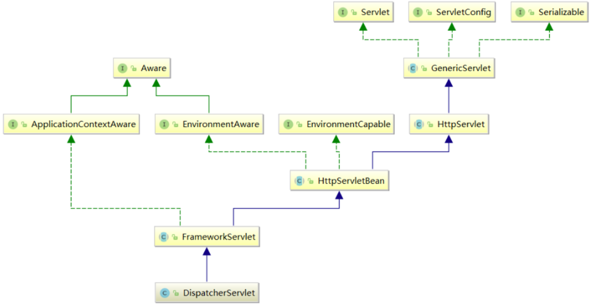

<br>

**SpringMVC 的ApplicationContext容器创建时机**

Servlet 规范的 `init(ServletConfig config)` 方法经过子类重写 ，最终会调用 `FrameworkServlet` 抽象类的`initWebApplicationContext()` 方法，该方法中最终获得 一个根 Spring容器（Spring产生的），一个子Spring容器（SpringMVC产生的）。

HttpServletBean 的初始化方法

```java
public final void init() throws ServletException {
    this.initServletBean();
}
```

FrameworkServlet的initServletBean方法

```java
protected final void initServletBean() throws ServletException {
    this.webApplicationContext = this.initWebApplicationContext();//初始化ApplicationContext
    this.initFrameworkServlet();//模板设计模式，供子类覆盖实现，但是子类DispatcherServlet没做使用
}
```


<br>

在initWebApplicationContext方法中体现的父子容器的逻辑关系

```java
//初始化ApplicationContext是一个及其关键的代码
protected WebApplicationContext initWebApplicationContext() {
    //获得根容器，其实就是通过ContextLoaderListener创建的ApplicationContext
    //如果配置了ContextLoaderListener则获得根容器，没配置获得的是null
    WebApplicationContext rootContext =
    WebApplicationContextUtils.getWebApplicationContext(this.getServletContext());
    
    //定义SpringMVC产生的ApplicationContext子容器
    WebApplicationContext wac = null;
    if (wac == null) {
        //==>创建SpringMVC的子容器，创建同时将Spring的创建的rootContext传递了过去
        wac = this.createWebApplicationContext(rootContext);
    }
    
    //将SpringMVC产生的ApplicationContext子容器存储到ServletContext域中
    //key名是：org.springframework.web.servlet.FrameworkServlet.CONTEXT.DispatcherServlet
    if (this.publishContext) {
        String attrName = this.getServletContextAttributeName();
        this.getServletContext().setAttribute(attrName, wac);
    }
}
```

<br>

跟进创建子容器的源码

```java
protected WebApplicationContext createWebApplicationContext(@Nullable ApplicationContext parent) {
    //实例化子容器ApplicationContext
    ConfigurableWebApplicationContext wac =
    (ConfigurableWebApplicationContext)BeanUtils.instantiateClass(contextClass);
    
    //设置传递过来的ContextLoaderListener的rootContext为父容器
    wac.setParent(parent);
    
    //获得web.xml配置的classpath:spring-mvc.xml
    String configLocation = this.getContextConfigLocation();
    
    if (configLocation != null) {
        //为子容器设置配置加载路径
        wac.setConfigLocation(configLocation);
    }
    
    //初始化子容器(就是加载spring-mvc.xml配置的Bean)
    this.configureAndRefreshWebApplicationContext(wac);
    return wac;
}
```


